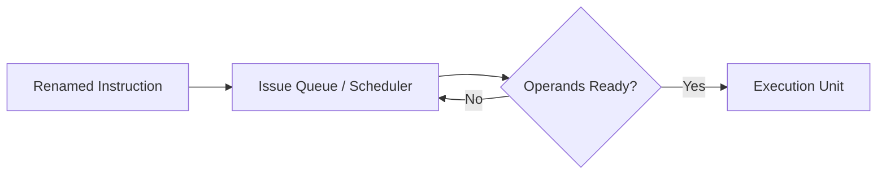
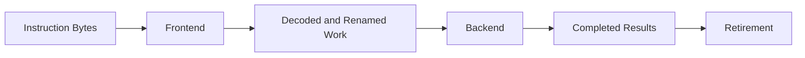

import AdBanner from '@site/src/components/AdBanner';
import Tabs from '@theme/Tabs';
import TabItem from '@theme/TabItem';


What every compiler programmer should know.

📩 Interested in deep dives like pipelines, cache, and compiler optimizations?

<div
  style={{
    width: '100%',
    maxWidth: '900px',
    margin: '1rem auto',
  }}
>
  <iframe
    src="https://docs.google.com/forms/d/e/1FAIpQLSebP1JfLFDp0ckTxOhODKPNVeI1e21rUqMJ0fbBwJoaa-i4Yw/viewform?embedded=true"
    style={{
      width: '100%',
      minHeight: '620px',
      border: '0',
      borderRadius: '12px',
      background: '#fff',
    }}
    loading="lazy"
  >
    Loading...
  </iframe>
</div>

# How an Instruction Actually Flows Through a Modern CPU

Most beginner explanations of CPU execution stop too early.

:::caution They tell a true but incomplete story:

- the CPU fetches an instruction
- figures out what it means
- performs the work
- moves to the next instruction
:::

>> ***That model is good enough to explain correctness. It is not good enough to explain modern performance.***

On a real high-performance CPU, one instruction does not travel through a tiny straight line. It enters a wider machine that is trying to do several things at once:

- keep the frontend supplied
- decode enough work every cycle
- remove false dependencies
- find instructions that are ready now
- send them to the right execution units
- commit results in a way that still looks correct to software

That is the real reason terms like **rename**, **issue queue**, **out-of-order execution**, **writeback**, and **retirement** exist. They are not random hardware jargon. They are different parts of the path an instruction takes while the processor tries to stay busy without breaking program correctness.

So this article is not asking only:

> How does the CPU run an instruction?

It is asking:

> What journey does one instruction take inside a modern CPU before it becomes architecturally visible?

That is the missing bridge between the basic fetch-decode-execute story and the harder topics that come later, such as stalls, branch misprediction, instruction-level parallelism, register pressure, and backend scheduling.

:::tip Read These First
- [Computer Architecture vs Computer Organization](/docs/coa/intro_to_coa)
- [Basic Terminology in Computer Organization and Architecture](/docs/coa/basic_terminology_in_coa)
- [How CPUs Execute Binary: Fetch–Decode–Execute + Pipeline Explained](/docs/coa/cpu_execution)
- [How Modern Processors Execute Code: From Sequential to Speculative Execution](/docs/coa/types_of_execution)
:::

:::important What You Should Leave With
- A modern CPU instruction usually flows through `fetch -> decode -> rename -> dispatch -> execute -> writeback -> retire`
- The frontend and backend solve different problems
- Out-of-order execution changes *when* instructions execute, but retirement preserves architectural correctness
- Branches, cache misses, dependencies, and resource pressure can all break the smooth flow
- Compiler decisions influence how easy that flow is for the hardware
:::

:::caution Practice MCQs

Once you finish this article, test it here:

- [Instruction Flow in a Modern CPU MCQs](/docs/mcq/questions/domain/coa/instruction-flow-modern-cpu)
- [Instruction Flow in a Modern CPU MCQs Quiz](/docs/mcq/questions/domain/coa/instruction-flow-modern-cpu/quiz)
:::

<Tabs>
  <TabItem value="social" label="📣 Social Media" default>

  - [🐦 Twitter - CompilerSutra](https://twitter.com/CompilerSutra)
  - [💼 LinkedIn - Abhinav](https://www.linkedin.com/in/abhinavcompilerllvm/)
  - [📺 YouTube - CompilerSutra](https://www.youtube.com/@compilersutra)
  - [💬 Join the CompilerSutra Discord for discussions](https://discord.gg/d7jpHrhTap)

  </TabItem>
</Tabs>

<div>
  <AdBanner />
</div>

## Table of Contents

1. [Why This Topic Matters](#why-this-topic-matters)
2. [The Big Picture](#the-big-picture)
3. [The Full Flow of One Instruction](#the-full-flow-of-one-instruction)
4. [Stage 1: Fetch](#stage-1-fetch)
5. [Stage 2: Decode](#stage-2-decode)
6. [Stage 3: Rename](#stage-3-rename)
7. [Stage 4: Dispatch and Schedule](#stage-4-dispatch-and-schedule)
8. [Stage 5: Execute](#stage-5-execute)
9. [Stage 6: Writeback](#stage-6-writeback)
10. [Stage 7: Retire](#stage-7-retire)
11. [One Example Instruction Through the Machine](#one-example-instruction-through-the-machine)
12. [What Usually Breaks the Flow](#what-usually-breaks-the-flow)
13. [Why Compiler Engineers Should Care](#why-compiler-engineers-should-care)
14. [Common Misconceptions](#common-misconceptions)
15. [FAQ](#faq)

## Why This Topic Matters

If you only keep the beginner version of CPU execution in your head, later architecture topics feel disconnected.

You hear about:

- branch prediction
- register renaming
- reorder buffers
- issue queues
- execution ports
- retirement

and it starts sounding like a pile of hardware vocabulary instead of one coherent path.

The missing link is this:

> An instruction is not just “executed.”
> It is *admitted, interpreted, renamed, scheduled, run, completed, and finally committed*.

Once you see that path, several things become easier to reason about:

- why independent instructions can run out of order
- why dependent instructions still stall
- why a cache miss can freeze progress even on a powerful CPU
- why a branch misprediction wastes work already in flight
- why compilers care about instruction shape, dependency chains, and code layout

:::caution For Performance Work
Correct code generation targets the ISA. Fast code generation respects the microarchitectural path the instruction must travel.
:::

## The Big Picture

At a high level, a modern out-of-order CPU often behaves like this:

```text
Fetch -> Decode -> Rename -> Dispatch -> Schedule -> Execute -> Writeback -> Retire
```

That flow is not a law of nature. Different CPUs split, merge, or rename stages. But as a learning model, it is extremely useful because it captures the major responsibilities of modern instruction handling.


<Tabs>
  <TabItem value="beginner" label="Beginner View" default>
    <p>The beginner mental model is:</p>
    <p><code>fetch -&gt; decode -&gt; execute</code></p>
    <p>That is fine for a first pass. It explains that instructions are read, interpreted, and run.</p>
  </TabItem>
  <TabItem value="modern" label="Modern CPU View">
    <p>The modern CPU view is wider:</p>
    <p><code>fetch -&gt; decode -&gt; rename -&gt; dispatch/schedule -&gt; execute -&gt; writeback -&gt; retire</code></p>
    <p>The extra stages exist because high-performance CPUs try to keep many instructions in flight at once while still preserving correct program behavior.</p>
  </TabItem>
  <TabItem value="compiler" label="Compiler View">
    <p>From the compiler side, this means your emitted machine code is not entering a simple arithmetic box.</p>
    <p>It is entering a resource-constrained machine with frontend bandwidth limits, dependency tracking, register pressure, execution unit contention, and memory stalls.</p>
  </TabItem>
</Tabs>

:::tip Short Version
The CPU is trying to keep useful work flowing through the machine while still making the final visible result match architectural program order.
:::

<div>
  <AdBanner />
</div>

## The Full Flow of One Instruction

Let us say the binary contains a simple instruction like:

```asm
add r8, r9, r10
```

or on another ISA, something morally similar:

```asm
r8 = r9 + r10
```

That one instruction may pass through the machine like this:

1. The frontend **fetches** its bytes using the current program counter.
2. The decode hardware figures out that it is an integer add and identifies its operands.
3. Rename logic maps architectural registers to internal physical registers.
4. Dispatch logic places the instruction into structures that wait for operands and execution resources.
5. When inputs are ready and the right unit is available, the instruction **executes**.
6. The result is **written back** so dependent instructions can use it.
7. Later, when it is safe, the instruction **retires** in program order.

That last point matters a lot.

The instruction may **execute** out of order, but it usually **retires** in order.

That is one of the central tricks of modern CPUs:

- be aggressive internally
- remain correct architecturally

## Stage 1: Fetch

Fetch starts at the instruction pointer, often called the `PC` or `IP`.

The frontend asks:

> What instruction bytes should I bring in next?

That sounds simple, but even this stage can be complicated.

The fetch stage may involve:

- instruction cache access
- branch prediction
- instruction alignment
- variable-length instruction boundary detection on ISAs like x86
- filling frontend queues with enough bytes for later stages


<Tabs>
  <TabItem value="fetch-good" label="When Fetch Goes Well" default>
    <p>The next instructions are predictable, already in the instruction cache, and the frontend keeps the decode stage busy.</p>
  </TabItem>
  <TabItem value="fetch-bad" label="When Fetch Breaks">
    <p>Fetch suffers when there is an instruction cache miss, poor code locality, or a branch misprediction that sends the frontend down the wrong path.</p>
  </TabItem>
  <TabItem value="fetch-compiler" label="Compiler Angle">
    <p>Code layout, branch structure, function size, and hot-path organization can influence frontend behavior more than many developers expect.</p>
  </TabItem>
</Tabs>

### Why Fetch Matters More Than It Looks

If the frontend cannot supply instructions fast enough, the rest of the machine goes hungry.

Even if you have excellent ALUs, deep schedulers, and advanced out-of-order logic, none of that helps if the CPU cannot keep the instruction stream flowing.

This is why modern performance is not only about “fast execution.” It is also about **frontend supply**.

## Stage 2: Decode

Decode turns raw instruction bytes into an internal form the CPU can work with.

The processor needs to answer questions like:

- What operation is this?
- Which architectural registers does it read?
- Which register or memory location does it write?
- Is this an arithmetic instruction, a load, a store, or a branch?
- Which execution resources might it need later?

For a simple add instruction, decode may conclude:

```text
op      = integer add
src1    = r9
src2    = r10
dest    = r8
class   = ALU
```

On some CPUs, this stage may also translate instructions into simpler internal operations.

:::note
The instruction the ISA exposes to software is not always the same form the backend hardware uses internally.
:::

### Why Decode Can Be a Bottleneck

Decode is a bandwidth stage.

If the processor can only decode a limited number of instructions per cycle, that directly limits how much work can enter the backend. Wide machines often need wide decode, and wide decode is expensive.

So even before execution starts, the CPU may already be constrained by:

- decode width
- instruction complexity
- frontend bandwidth

## Stage 3: Rename

This is one of the most important stages in a modern out-of-order CPU.

Rename breaks the false illusion that architectural registers are the only registers that matter.

Suppose the ISA-visible code says:

```asm
add r1, r2, r3
sub r1, r4, r5
mul r6, r1, r7
```

At the architectural level, `r1` is reused. But internally, the CPU may map those writes to different physical registers so that unrelated instructions do not create fake dependencies.

```text
architectural r1 -> physical p17
architectural r1 -> physical p24
```

This solves **name dependencies** that are not true data dependencies.

<Tabs>
  <TabItem value="rename-why" label="Why Rename Exists" default>
    <p>Without renaming, the CPU would often be forced to serialize instructions just because they mention the same architectural register name.</p>
  </TabItem>
  <TabItem value="rename-fix" label="What It Fixes">
    <p>Renaming removes false dependencies such as write-after-read and write-after-write hazards, allowing more instructions to proceed independently.</p>
  </TabItem>
  <TabItem value="rename-limit" label="What It Cannot Fix">
    <p>Rename cannot remove true data dependencies. If one instruction really needs the result of another, the hardware still has to wait.</p>
  </TabItem>
</Tabs>

:::tip Mental Model
Architectural registers are the public contract. Physical registers are part of the private machinery that helps the CPU exploit more parallelism.
:::

## Stage 4: Dispatch and Schedule

Once renamed, instructions enter backend structures that prepare them for execution.

Different CPUs use different terms, but the key ideas are:

- place instructions into queues
- track operand readiness
- wait for an execution unit to become available
- choose ready instructions to issue

This is the stage where the processor starts asking:

> Which instructions are ready right now?

and

> Which hardware resource can run them this cycle?

That is why two instructions that appear next to each other in assembly may not execute next to each other in time.

An instruction may be delayed because:

- one source operand is not ready
- the load it depends on missed in cache
- the relevant execution port is busy
- a scheduler queue is under pressure



### Why This Stage Is Central

This is where out-of-order behavior becomes real.

The processor is no longer just following source order mechanically. It is dynamically searching for useful work that can run now.

## Stage 5: Execute

Execution is the part most people imagine first, but by now the instruction has already passed through several important stages.

What “execute” means depends on the instruction type.

<Tabs>
  <TabItem value="alu" label="ALU Instruction" default>
    <p>An integer arithmetic instruction uses an ALU to compute a result such as add, subtract, shift, or compare.</p>
  </TabItem>
  <TabItem value="load" label="Load Instruction">
    <p>A load instruction computes an address, accesses the memory hierarchy, and eventually brings data back into a register destination.</p>
  </TabItem>
  <TabItem value="store" label="Store Instruction">
    <p>A store instruction computes an address and prepares a value for memory, but architectural visibility is often delayed until retirement rules allow it.</p>
  </TabItem>
  <TabItem value="branch" label="Branch Instruction">
    <p>A branch instruction evaluates control flow. If prediction was wrong, a large amount of speculative work may need to be discarded.</p>
  </TabItem>
</Tabs>

### The Important Point

Execution latency is not uniform.

Some operations are cheap:

- integer add
- simple bit operations
- compares

Some are more expensive:

- integer divide
- cache-missing loads
- floating-point operations with higher latency
- mispredicted branches

So a modern CPU is not just “executing instructions.”
It is juggling instructions with different latencies, different resource needs, and different readiness conditions.

<div>
  <AdBanner />
</div>

## Stage 6: Writeback

Once execution completes, results are written back into the machine structures that hold produced values.

This stage matters because it often wakes up dependent instructions.

If instruction `I3` was waiting for the result of instruction `I1`, writeback is the moment that can change `I3` from:

```text
not ready
```

to:

```text
ready to issue
```

In that sense, writeback is not only about storing a result. It is also about **unlocking future work**.

## Stage 7: Retire

Retirement is the stage many beginner explanations skip, but modern CPUs depend on it.

Retirement means the processor makes the instruction’s result architecturally official.

This usually happens in program order, even if execution happened out of order.

Why?

Because the CPU wants two things at once:

- high internal parallelism
- precise, correct architectural state

So the machine may let later instructions execute early, but it does not let them become permanently visible before earlier instructions are known to be safe.

<Tabs>
  <TabItem value="retire-why" label="Why Retire Exists" default>
    <p>Retirement preserves precise architectural behavior even when execution was aggressive and speculative.</p>
  </TabItem>
  <TabItem value="retire-branch" label="After a Bad Branch Prediction">
    <p>If the CPU went down the wrong path, speculative instructions may have executed, but they will not retire. The machine throws that work away and restarts from the correct path.</p>
  </TabItem>
  <TabItem value="retire-exception" label="After Exceptions">
    <p>In-order retirement also helps the CPU present clean, precise exception behavior to software.</p>
  </TabItem>
</Tabs>

:::important Core Distinction
`execute` means the work happened internally.

`retire` means the work became architecturally committed.
:::

## One Example Instruction Through the Machine

Take this tiny sequence:

```asm
load r1, [r2]
add  r3, r1, r4
mul  r5, r6, r7
```

Now watch what a modern CPU may do.

<Tabs>
  <TabItem value="program-order" label="Program Order" default>
    <p>The architectural order is:</p>
    <ol>
      <li><code>load r1, [r2]</code></li>
      <li><code>add r3, r1, r4</code></li>
      <li><code>mul r5, r6, r7</code></li>
    </ol>
  </TabItem>
  <TabItem value="dependency-view" label="Dependency View">
    <p>The <code>add</code> depends on the <code>load</code>.</p>
    <p>The <code>mul</code> is independent of both.</p>
  </TabItem>
  <TabItem value="hardware-view" label="Hardware View">
    <p>If the load is slow, the CPU may let the multiply move ahead and execute first, because it does not need the load result. The add still waits.</p>
  </TabItem>
</Tabs>

So the timeline may feel like this:

```text
load  -> waiting on memory
add   -> waiting on load result
mul   -> executes early
load  -> finishes
add   -> now executes
retire -> still in program order
```

That is the essence of out-of-order execution in one small example.

The machine is not violating the program. It is exploiting independence where it can.

## What Usually Breaks the Flow

The smooth story is useful, but real hardware is messy.

Here are the most common reasons instruction flow gets disrupted:

### 1. Branch Misprediction

The frontend fetches the wrong path, decode and rename spend effort on the wrong instructions, and later the CPU has to flush and restart.

### 2. Cache Misses

A load instruction may take far longer than the surrounding ALU instructions, creating long dependency stalls.

### 3. True Data Dependencies

If instruction `B` genuinely needs the result of instruction `A`, no amount of clever scheduling can erase that dependency.

### 4. Resource Contention

Several ready instructions may compete for:

- the same execution port
- the same load/store path
- scheduler entries
- physical registers

### 5. Frontend Starvation

If fetch and decode cannot keep up, the backend sits underfed.

## Why Compiler Engineers Should Care

Compilers do not directly control the microarchitecture, but they absolutely shape the kind of instruction stream the CPU receives.

That matters because hardware is sensitive to:

- dependency chain length
- branch structure
- memory access regularity
- instruction mix
- code size and code layout
- register pressure

Examples:

- A compiler can shorten or lengthen dependency chains.
- It can help or hurt instruction-level parallelism.
- It can make vectorization possible or impossible.
- It can generate branch-heavy code or more predictable control flow.
- It can create memory access patterns that cooperate with the cache hierarchy or fight it.

:::tip Compiler View in One Sentence
The compiler is shaping whether the CPU sees a smooth stream of ready work or a machine full of stalls, bubbles, flushes, and waits.
:::

## Frontend vs Backend: Where the Instruction Actually Lives

One reason CPU execution feels confusing is that people mix together two different parts of the machine:

- the **frontend**
- the **backend**

That split is one of the cleanest ways to reason about instruction flow.



### What the Frontend Does

The frontend is responsible for bringing in and preparing work.

That usually includes:

- instruction fetch
- branch prediction
- instruction cache access
- alignment and byte handling
- decode
- sometimes early buffering and macro-op handling

The frontend answers:

> What instructions should we be working on next?

and

> Can we keep feeding the rest of the machine?

### What the Backend Does

The backend is responsible for doing the actual work and tracking readiness.

That usually includes:

- rename
- scheduling
- issue
- execution
- writeback
- retirement bookkeeping

The backend answers:

> Which instructions are ready now?

and

> Which execution resource can accept them?

### Why This Split Matters

Some programs are **frontend-limited**.

That means:

- code is too large
- branches are hard to predict
- fetch is unstable
- decode cannot keep up

Some programs are **backend-limited**.

That means:

- there are long dependency chains
- loads miss in cache
- execution resources are oversubscribed
- register pressure becomes costly

<Tabs>
  <TabItem value="fe" label="Frontend-Limited" default>
    <p>A program with messy control flow, frequent branch changes, poor code locality, or decode-heavy instructions may starve the backend even before arithmetic becomes the issue.</p>
  </TabItem>
  <TabItem value="be" label="Backend-Limited">
    <p>A program with long dependency chains, expensive loads, or too much pressure on a few execution units may have plenty of instructions available but still struggle to finish work quickly.</p>
  </TabItem>
  <TabItem value="why-compiler" label="Why Compilers Care">
    <p>Compilers influence both sides. Code layout and branch structure affect the frontend. Dependency chains, instruction mix, and memory behavior affect the backend.</p>
  </TabItem>
</Tabs>

:::note
If you cannot tell whether a workload is frontend-bound or backend-bound, you will often optimize the wrong thing.
:::

## In-Order vs Out-of-Order: Same Program, Different Internal Behavior

A useful way to deepen this topic is to compare two CPU styles:

- **in-order execution**
- **out-of-order execution**

Both can run the same ISA.
Both can produce the same correct architectural result.
But they do not move instructions through the machine the same way.

### In-Order Execution

In an in-order design, the processor follows program order much more strictly.

If an early instruction stalls, later instructions often stall behind it even when some of them are independent.

Simple example:

```asm
load r1, [r2]
add  r3, r1, r4
mul  r5, r6, r7
```

If the `load` is slow:

- the `add` cannot proceed because it depends on the load
- the `mul` may also be delayed even though it is independent

That is the central weakness of in-order execution: the machine sees less opportunity to move around blocked work.

### Out-of-Order Execution

In an out-of-order design, the processor tries to separate:

- program order
- execution order

The ISA still gives a sequential contract.
But internally, the CPU is allowed to run ready instructions earlier if correctness can still be preserved.

So for the same sequence:

- the `add` still waits on the load
- the independent `mul` may move ahead

That is why out-of-order execution exists at all:

> it lets the CPU exploit independence that is already present in the instruction stream

### Side-by-Side View

| Situation | In-Order CPU | Out-of-Order CPU |
| --- | --- | --- |
| Early load misses cache | later work often waits | independent work may continue |
| False register name conflicts | may limit progress more | renaming helps remove them |
| Resource search | simpler | more dynamic and aggressive |
| Hardware complexity | lower | much higher |
| Ability to hide latency | weaker | stronger |

### The Important Caution

Out-of-order execution is not magic.

It does **not** create independence that does not exist.
It can only exploit:

- already-available independent instructions
- already-available ready operands
- already-available execution resources

If your code is one long serial dependency chain, even a powerful out-of-order machine will have limited room to help.

## A Cycle-by-Cycle Mental Walkthrough

Let us build a more concrete feeling for instruction flow.

Suppose the processor sees this sequence:

```asm
I1: load r1, [r2]
I2: add  r3, r1, r4
I3: mul  r5, r6, r7
I4: add  r8, r9, r10
```

Now imagine a simplified timeline.

### Cycle 1

- fetch starts bringing in bytes for `I1`, `I2`, `I3`, `I4`
- branch predictor says the current path is likely correct
- frontend queues begin filling

### Cycle 2

- decode identifies instruction types
- `I1` is a load
- `I2` is an add dependent on `I1`
- `I3` is an independent multiply
- `I4` is an independent add

### Cycle 3

- rename maps architectural destinations to physical registers
- false dependencies are removed where possible
- the instructions move into scheduling structures

### Cycle 4

- scheduler checks readiness
- `I1` is ready to compute its address and begin the load path
- `I3` is ready
- `I4` is ready
- `I2` is not ready because it needs the result from `I1`

### Cycle 5

- `I3` may begin executing on a multiply unit
- `I4` may begin executing on an integer ALU
- `I1` may still be waiting on memory hierarchy behavior
- `I2` still waits

### Cycle 6

- `I4` may already complete and write back
- `I3` may still be in progress depending on latency
- `I1` may still be waiting if the load is slow
- `I2` remains blocked

### Cycle 7+

- when `I1` finally writes back, `I2` becomes ready
- `I2` can issue later
- retirement still occurs in safe architectural order

The point of this walkthrough is not to imitate a real commercial core exactly.

It is to show the kind of separation modern CPUs create between:

- fetching
- readiness
- actual execution
- final commitment

That separation is the whole reason the machine can continue doing useful work during some stalls.

## One Branch Instruction Through the Machine

Arithmetic instructions are the easy case.
Branches are where instruction flow becomes much more dramatic.

Take:

```asm
cmp r1, 0
je  target
add r2, r3, r4
sub r5, r6, r7
```

The processor cannot always afford to stop and wait until the branch is fully resolved before fetching the next instructions.

If it did, the frontend would keep losing cycles.

So modern CPUs usually predict:

- whether the branch is taken
- where the target is

### If the Prediction Is Correct

The machine looks smart:

- fetch follows the right path
- decode stays productive
- later stages stay occupied

### If the Prediction Is Wrong

The machine has to clean up:

- wrong-path instructions are discarded
- frontend restarts from the correct target
- speculative work that should not become visible never retires

This is one of the most important mental shifts in modern architecture:

> a lot of internal work may happen that never becomes architecturally visible

That is not a bug.
It is a deliberate performance strategy.

<Tabs>
  <TabItem value="branch-good" label="Correct Prediction" default>
    <p>The instruction stream stays smooth. The frontend keeps moving, later stages remain busy, and retirement continues without major disruption.</p>
  </TabItem>
  <TabItem value="branch-bad" label="Wrong Prediction">
    <p>The CPU wastes fetch, decode, rename, and sometimes execution effort on the wrong path. Then it flushes that speculative work and restarts from the right path.</p>
  </TabItem>
  <TabItem value="branch-compiler" label="Compiler View">
    <p>Branch-heavy code with unstable control flow can make the machine pay repeated flush penalties. Code shape matters here more than many source-level explanations admit.</p>
  </TabItem>
</Tabs>

## One Load Instruction Through the Machine

Loads are often where performance gets real.

An integer add is usually easy for the CPU.
A load can become expensive because it reaches into the memory system.

Take:

```asm
load r1, [r2 + 64]
```

The instruction’s journey may include:

1. fetch and decode
2. rename of the destination register
3. address generation
4. access to load/store structures
5. lookup through caches and maybe beyond
6. data return
7. writeback
8. retirement later in order

### Best Case

If the data is already in a nearby cache:

- address generation is fast
- cache lookup succeeds quickly
- dependent instructions wake up soon

### Bad Case

If the load misses in multiple cache levels:

- the instruction may wait a long time
- dependent instructions remain blocked
- some independent instructions may continue
- eventually the backend may run out of useful ready work

That is why memory-bound code feels so different from ALU-bound code.

The arithmetic unit is not the limiting factor.
The real problem is:

> the instruction flow now depends on data arrival from the memory hierarchy

### Why Loads Are Central to CPU Reality

A lot of modern CPU performance is really the story of:

- how well the processor can predict and prepare for memory needs
- how much useful independent work exists while memory is slow
- how often the compiler produces locality-friendly code

## One Store Instruction Through the Machine

Stores are often misunderstood because people think of them as “just writing to memory.”

But a modern CPU treats stores carefully.

Take:

```asm
store [r2 + 32], r7
```

The machine usually has to manage:

- the store address
- the value to be written
- ordering rules
- safe architectural commitment

Unlike a simple ALU result, a store interacts with memory visibility and consistency rules.

So the CPU often separates:

- preparing the store internally
- making the store architecturally committed

That means a store may compute its address and value before retirement, but the system still treats final visibility carefully.

### Why Stores Matter for Compilers

Poor code generation around stores can amplify:

- memory traffic
- ordering pressure
- alias-related uncertainty
- reduced scheduling freedom

Loads expose latency.
Stores can expose ordering and memory-system pressure.

Both matter.

## True Dependencies vs False Dependencies

This distinction is worth making explicit because it sits at the center of rename logic.

### True Dependency

A true dependency means one instruction genuinely needs a value produced by another.

Example:

```asm
add r1, r2, r3
sub r4, r1, r5
```

The `sub` really needs the new value of `r1`.
No hardware trick can erase that fact.

### False Dependency

A false dependency happens when instructions appear related only because of reused names or storage locations, not because the later instruction truly needs the earlier result.

Example:

```asm
add r1, r2, r3
mul r1, r6, r7
```

These two instructions both write `r1`, but the second one does not need the first one’s value.

Architecturally the name is the same.
Internally, rename logic may map them to different physical destinations to avoid unnecessary serialization.

### Why This Distinction Matters

If you miss this distinction, out-of-order behavior can seem mysterious.

But once you separate:

- true data dependence
- false naming dependence

the need for renaming becomes obvious.

## Where the Reorder Buffer Fits In

Many explanations mention the reorder buffer and then move on too quickly.

At a high level, the reorder buffer helps the CPU track in-flight work so that:

- instructions can execute aggressively
- retirement still happens in correct architectural order
- exceptions and mispredictions can be handled cleanly

You do not need every implementation detail yet.

The important mental model is:

> the CPU needs a bookkeeping structure that remembers what is still speculative and what is safe to commit

Without that, out-of-order execution would be much harder to reconcile with precise architectural state.

## What “Ready” Really Means

Scheduler logic revolves around the idea of an instruction being **ready**.

That word sounds simple, but in practice it usually means several things are true at once:

- source operands are available
- needed execution resources are available
- the instruction has entered the right queue or structure
- there are no blocking conditions preventing issue

So “ready” does not only mean:

> the instruction exists

It means:

> the machine can meaningfully let it move now

### Why Ready Instructions Still Sometimes Wait

Even ready instructions may wait because:

- only a limited number can issue this cycle
- a specific execution port is busy
- a preferred unit is occupied
- internal queues are under pressure

That is why throughput depends not only on dependency freedom, but also on **resource balance**.

## Throughput vs Latency in Instruction Flow

This article becomes much clearer if you keep these two ideas separate:

- **latency**
- **throughput**

### Latency

Latency asks:

> How long does one instruction take from start to useful result?

### Throughput

Throughput asks:

> How much work can the machine complete over time?

A CPU may have:

- low latency for one kind of instruction
- high throughput for a stream of many instructions

or:

- moderate latency
- but limited throughput because some resource is narrow

### Why the Distinction Matters

A workload can be slow because:

- one critical dependency chain has high latency

or because:

- the machine cannot sustain enough throughput due to frontend or backend width limits

Those are different problems.
They often require different fixes.

## A Compiler Engineer’s Reading Method

When you look at emitted assembly or machine behavior, do not ask only:

> What instructions are present?

Also ask:

> What kind of flow will these instructions create inside the CPU?

A good reading checklist is:

1. Are there long dependency chains?
2. Are there many unpredictable branches?
3. Are loads likely to hit or miss?
4. Is there enough independent work to fill issue width?
5. Is the instruction mix balanced across resources?
6. Is code layout likely to help or hurt the frontend?
7. Is register pressure creating spill risk?

This turns architecture from a vocabulary lesson into a reasoning tool.

## A Small Example from a Loop

Consider a loop like this:

```cpp
for (int i = 0; i < n; ++i) {
    sum += a[i] * b[i];
}
```

At source level it looks simple.
At machine level the CPU may see repeated patterns like:

- load from `a[i]`
- load from `b[i]`
- multiply
- add to accumulator
- update loop counter
- compare
- branch

Now instruction flow depends on several things at once:

- can loads hit in cache?
- is the branch predictable?
- can multiply and add overlap usefully?
- does the accumulator create a dependency chain?
- can vectorization change the shape of the work?

That is exactly why modern execution models matter.

The CPU is not looking at “a loop.”
It is seeing:

- memory requests
- arithmetic dependencies
- control flow
- repeated frontend activity

The compiler’s job is not only to translate the loop.
It is to shape a loop that flows well through the machine.

## Why Some Instructions “Look Cheap” But Cause Expensive Problems

Another useful lesson is that the visible instruction is not always the whole cost story.

A branch instruction may look tiny in assembly.
But if it is unpredictable, it may create:

- frontend disruption
- speculative waste
- pipeline flushes

A load instruction may look ordinary.
But if it misses in cache, it may become the dominant cost in the region.

A simple register-to-register arithmetic instruction may look cheap and usually is.
But if it extends a long dependency chain, it can still matter a lot for critical-path latency.

So when reading code, avoid judging instruction cost only by how “small” the instruction text looks.

## What the CPU Is Really Trying to Optimize

From a high level, a modern CPU is trying to maximize useful forward progress while respecting correctness.

That means:

- keep the frontend supplied
- keep ready work available
- keep execution units occupied
- keep dependencies from stalling everything
- keep speculation accurate enough to pay off
- keep retirement precise

This is why modern CPUs feel like logistics systems as much as arithmetic systems.

They are coordinating:

- movement of instruction bytes
- movement of decoded work
- movement of operands
- movement of results
- movement of architectural commitment

That is the deeper meaning of instruction flow.

## Practical Bottleneck Checklist

When a piece of code underperforms, instruction flow often breaks in one of these ways:

### Frontend Checklist

- Is code layout poor?
- Are there too many hard-to-predict branches?
- Is instruction fetch unstable?
- Is decode width becoming a limit?

### Backend Checklist

- Is there a serial dependency chain?
- Are loads missing in cache?
- Are a few execution resources overloaded?
- Is the scheduler finding enough ready work?

### Memory Checklist

- Are loads and stores dominating time?
- Is locality weak?
- Are working sets too large for nearby cache levels?

### Compiler Checklist

- Did code generation create unnecessary branches?
- Did register pressure increase spills?
- Is vectorization absent where it should exist?
- Did instruction selection create awkward dependency structure?

This kind of checklist is much more useful than asking only:

> Is my CPU fast?

The hardware may be very fast.
The instruction flow may simply be poor.

## How This Connects to Later COA Topics

This article should not stand alone in your head.
It is a bridge topic.

After this, several other architecture ideas become easier:

- **pipeline hazards** become places where flow is interrupted
- **branch prediction** becomes a way of protecting frontend flow
- **register renaming** becomes a way of protecting backend freedom
- **cache hierarchy** becomes a major factor in load/store flow
- **out-of-order execution** becomes the search for ready work
- **retirement** becomes the final correctness checkpoint

That is also why this article belongs between your basic execution article and deeper performance topics.

It connects:

- the simple model of CPU execution
- the richer model of modern microarchitectural behavior

## If You Remember Only Five Things

1. A modern instruction usually does much more than `fetch -> decode -> execute`.
2. Frontend and backend are different bottleneck domains.
3. Out-of-order execution changes internal timing, not final architectural correctness.
4. Loads, branches, and dependency chains often dominate real performance.
5. Compiler output shapes how smooth or painful instruction flow becomes.

## Common Misconceptions

### “Execute” and “finish” mean the same thing

Not on a modern CPU. An instruction may execute internally before it retires.

### Instructions always execute in source order

Not necessarily. They usually retire in order, but execution may happen out of order.

### Register names in assembly are the whole register story

They are only the architectural view. Rename logic often maps them to physical registers internally.

### A wide CPU automatically makes all code fast

No. Width only helps if the instruction stream exposes enough independent work and the frontend/backend can sustain it.

### CPU performance is only about ALU speed

Not even close. Frontend bandwidth, cache behavior, branch prediction, dependencies, and execution resource pressure all matter.

<div>
  <AdBanner />
</div>

:::note
***Your instruction doesn’t run in a straight line it enters a complex machine that fetches, renames, reorders, and executes work aggressively before committing results in order.***
:::

## FAQ

### What is the typical instruction flow in a modern CPU?

A useful learning model is:

`fetch -> decode -> rename -> dispatch -> schedule -> execute -> writeback -> retire`

Different processors implement these responsibilities differently, but this is the common high-level picture.

### What is the difference between execute and retire?

`Execute` is when the instruction’s work is performed internally. `Retire` is when the CPU commits the result architecturally in program order.

### Why do modern CPUs use register renaming?

Register renaming removes false dependencies caused by reusing the same architectural register names, allowing more independent instructions to proceed.

### Why can instructions execute out of order but still look correct?

Because retirement preserves the final architectural order seen by software.

### What part of the CPU handles instruction fetch and decode?

Those responsibilities are usually described as part of the **frontend**.

### What part handles scheduling and execution?

Those responsibilities are usually described as part of the **backend**.

### What slows instruction flow the most?

Common causes include branch mispredictions, cache misses, long dependency chains, resource contention, and frontend bandwidth limits.

### Which article should I read next?

If this article made sense, the next good reads are:

- [How Modern Processors Execute Code: From Sequential to Speculative Execution](/docs/coa/types_of_execution)
- [Memory Hierarchy Explained: Cache, RAM, and Storage](/docs/coa/memory-hierarchy)
- [Measuring Throughput, Cache Misses, and CPU Behavior in C++](/docs/coa/measuring_throughput_cache_misses_cpu_behavior_cpp)
- [Instruction Flow in a Modern CPU MCQs](/docs/mcq/questions/domain/coa/instruction-flow-modern-cpu)
