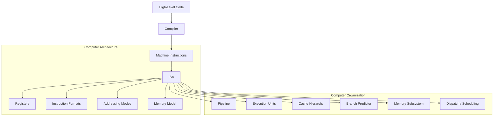

import AdBanner from '@site/src/components/AdBanner';
import Tabs from '@theme/Tabs';
import TabItem from '@theme/TabItem';
import { ComicQA } from '../mcq/interview_question/Question_comics';

# Computer Architecture vs Computer Organization

What every compiler programmer should know.

📩 Interested in deep dives like pipelines, cache, and compiler optimizations?

<div
  style={{
    width: '100%',
    maxWidth: '900px',
    margin: '1rem auto',
  }}
>
  <iframe
    src="https://docs.google.com/forms/d/e/1FAIpQLSebP1JfLFDp0ckTxOhODKPNVeI1e21rUqMJ0fbBwJoaa-i4Yw/viewform?embedded=true"
    style={{
      width: '100%',
      minHeight: '620px',
      border: '0',
      borderRadius: '12px',
      background: '#fff',
    }}
    loading="lazy"
  >
    Loading...
  </iframe>
</div>

Modern computing systems work because software targets a stable machine interface while hardware teams keep improving the way that interface is implemented. Those two layers are closely related, but they are not the same thing.

The names for those layers are:

- **Computer Architecture**
- **Computer Organization**

People often mix them together. That is understandable, because real systems combine both. But for compiler engineers, systems programmers, and performance-focused C++ developers, the distinction is important.

:::tip Why This Matters
Architecture tells you what the machine exposes to software. Organization tells you how the machine executes that contract efficiently.
:::

If you understand only architecture, you can generate correct machine code. If you understand architecture and organization together, you can start reasoning about performance, scheduling, cache behavior, and why the same binary behaves differently across processors.

<Tabs>
  <TabItem value="social" label="📣 Social Media">

  - [🐦 Twitter - CompilerSutra](https://twitter.com/CompilerSutra)
  - [💼 LinkedIn - Abhinav](https://www.linkedin.com/in/abhinavcompilerllvm/)
  - [📺 YouTube - CompilerSutra](https://www.youtube.com/@compilersutra)
  - [💬 Join the CompilerSutra Discord for discussions](https://discord.gg/d7jpHrhTap)

  </TabItem>
</Tabs>

<div>
  <AdBanner />
</div>

## Table of Contents

1. [Why This Topic Is Important](#why-this-topic-is-important)
2. [Architecture and Organization in One Diagram](#architecture-and-organization-in-one-diagram)
3. [What Is Computer Architecture?](#what-is-computer-architecture)
4. [What Is Computer Organization?](#what-is-computer-organization)
5. [Key Differences](#key-differences)
6. [Real Examples from Modern CPUs and GPUs](#real-examples-from-modern-cpus-and-gpus)
7. [Why Compiler Engineers Care](#why-compiler-engineers-care)
8. [Why Organization Still Matters for Performance](#why-organization-still-matters-for-performance)
9. [A Simple Analogy](#a-simple-analogy)
10. [Key Takeaways](#key-takeaways)
11. [FAQ](#faq)

## Why This Topic Is Important

When most developers write code, they think in terms of variables, loops, functions, classes, and algorithms. The CPU does not see any of that directly. It sees encoded instructions, registers, addresses, data movement, and timing.

That is why this topic matters in:

- compiler development
- operating systems
- GPU programming
- performance engineering
- HPC
- low-level C and C++

Take a tiny statement:

```cpp
int c = a + b;
```

The compiler may lower it into something like:

```asm
ADD R3, R1, R2
```

or on a two-operand machine:

```asm
MOV R3, R1
ADD R3, R2
```

Both sequences compute the same result, but the available instruction forms come from the **architecture**.

Now ask a different question: how does the processor actually run that `ADD`?

Maybe it goes through:

- fetch
- decode
- rename
- dispatch
- execute
- writeback

Maybe it uses:

- multiple ALUs
- a deep pipeline
- branch prediction
- out-of-order execution
- L1, L2, and L3 caches

Those decisions belong to **organization**.

:::caution For Compiler Engineers
Compilers primarily target the ISA, but good code generation also depends on understanding latency, throughput, execution resources, and memory behavior on real machines.
:::

<div>
  <AdBanner />
</div>

## Architecture and Organization in One Diagram



<details>
<summary>Diagram explanation</summary>

At the software layer, developers write high-level programs. A compiler turns that source code into machine instructions.

The architectural layer defines the programmer-visible machine contract: instruction set, registers, data sizes, addressing rules, and memory behavior.

The organizational layer defines how hardware executes those instructions efficiently: pipelines, issue width, execution units, cache hierarchy, branch prediction, and data movement.

That separation is why two processors can run the same program but deliver very different performance.

</details>

:::note
Software interacts with architecture directly, but performance emerges from organization.
:::

## What Is Computer Architecture?

Computer architecture is the part of the machine that software can rely on. It defines the visible behavior of the processor.

In practice, architecture usually means the **Instruction Set Architecture**, or **ISA**.

The ISA defines things such as:

- what instructions exist
- what registers exist
- what operand formats are allowed
- how memory is addressed
- what data types are supported
- what the memory model guarantees

That last point, the **memory model**, is easy to skip too quickly, but it matters a lot for real software.

For single-threaded code, developers often think memory is simple: do one store, then another load, and everything happens in that visible order.

For multithreaded code, that assumption becomes dangerous.

The architectural memory model defines what software is allowed to assume about:

- the visibility of writes across threads
- the ordering of loads and stores
- atomic operations
- fences and barriers
- when one core is guaranteed to observe another core's update

This is why the memory model belongs in **architecture**, not organization.
Software must know what guarantees the machine exposes.

For example, with C++ atomics:

```cpp
std::atomic<int> ready{0};
int data = 0;

// Thread 1
data = 42;
ready.store(1, std::memory_order_release);

// Thread 2
if (ready.load(std::memory_order_acquire)) {
    std::cout << data << "\n";
}
```

The important point is not just that `ready` is atomic.
It is that `release` and `acquire` create an ordering guarantee that the compiler and the hardware must both respect.

Without the right memory-ordering rules, one thread might observe `ready == 1` and still not have a correct guarantee about seeing the updated `data`.

So when we say architecture includes the memory model, we mean the machine is promising software things like:

- what reordering is allowed
- what atomics guarantee
- what fences mean
- what "correct synchronization" looks like

Compiler barriers alone are not enough.
They may stop the compiler from reordering operations in its generated code, but they do not by themselves create all the cross-core visibility guarantees the hardware memory model must provide.

That is why backend engineers, systems programmers, and concurrency-heavy C++ developers cannot treat the memory model as a side detail.
It is part of the machine contract.

For example, if an ISA defines:

```asm
ADD R1, R2, R3
```

software can rely on that operation meaning:

```text
R1 = R2 + R3
```

The hardware may implement that instruction in many different ways internally, but the externally visible meaning must remain the same.

### Architecture as a Contract

The easiest way to think about architecture is as a contract between software and hardware.

- the compiler depends on it for code generation
- the operating system depends on it for process and memory behavior
- the hardware must implement it correctly

That is why architecture stays stable for long periods. Software compatibility depends on it.

### Common Architecture Examples

| Architecture | Common usage |
| --- | --- |
| `x86-64` | desktops, laptops, servers |
| `ARM` | phones, embedded systems, Apple silicon, servers |
| `RISC-V` | research, education, embedded, growing production use |

### From the Compiler's Perspective

A compiler backend must know:

- available instructions
- legal operand combinations
- calling conventions
- register sets
- stack rules
- atomic and memory-ordering behavior

Without that information, it cannot emit valid machine code.

:::tip Key Question
Computer architecture answers: **What can the machine do, and how does software ask for it?**
:::

<div>
  <AdBanner />
</div>

## What Is Computer Organization?

Computer organization describes how the hardware is arranged internally to implement the architecture.

If architecture is the visible contract, organization is the internal execution machinery.

It includes things such as:

- pipeline stages
- ALUs, FPUs, vector units, and load/store units
- instruction fetch and decode structures
- cache hierarchy
- branch predictors
- reorder buffers and issue queues
- memory controllers and interconnects

Two processors can implement the same ISA but use very different organizations.

For example:

- Intel and AMD both run `x86-64`
- different ARM cores implement the same ARM ISA with very different internal designs

### Example: One Instruction, Different Implementations

Suppose both processors support:

```asm
ADD R1, R2, R3
```

One processor might:

- issue one instruction per cycle
- have a short in-order pipeline
- use a small cache hierarchy

Another might:

- decode multiple instructions per cycle
- rename registers
- execute out of order
- use aggressive branch prediction
- have a large shared last-level cache

The architectural behavior is the same, but the organization is different, so the performance characteristics are different too.

### Microarchitecture

The detailed internal implementation of a processor is usually called its **microarchitecture**.

Examples include:

- Intel Skylake
- AMD Zen family
- ARM Cortex family cores

These are organizational designs built on top of an ISA.

To make that more concrete, here is the kind of difference people mean when they say "same ISA, different organization."

### Same Kind of Instruction, Different Microarchitectures

The exact numbers depend on the specific chip, stepping, and measurement method, but the point looks like this:

| Microarchitecture | Example ISA family | Integer `ADD` latency | Why it still may feel different |
| --- | --- | --- | --- |
| Intel Skylake | `x86-64` | about 1 cycle | frontend width, execution ports, cache behavior, branch predictor quality |
| AMD Zen 2 | `x86-64` | about 1 cycle | different scheduler, cache hierarchy, load/store behavior, branch machinery |
| ARM Cortex-X1 | `ARMv8-A` | about 1 cycle for simple integer add | different frontend/backend balance, power/performance design, mobile-oriented tradeoffs |

The visible instruction meaning is still "add these values."
But the surrounding machine can differ in ways that change:

- how many instructions can be decoded per cycle
- how much independent work can stay in flight
- how quickly loads feed dependent instructions
- how much branch-heavy code gets disrupted
- what IPC the same program can sustain

So the important lesson is not "this ADD takes 1 cycle on all of them."
It is:

> even when a simple instruction has similar nominal latency, the organization around it can change total program performance a lot

:::tip Key Question
Computer organization answers: **How does the machine actually implement those operations efficiently?**
:::

## Key Differences

| Aspect | Computer Architecture | Computer Organization |
| --- | --- | --- |
| Core question | What can the computer do? | How does it do it internally? |
| Visibility | Visible to software | Mostly hidden from software |
| Main focus | ISA, registers, instruction formats, addressing, memory model | Pipelines, execution units, caches, branch prediction, datapaths |
| Stability | Usually stable for compatibility | Changes frequently across CPU generations |
| Compiler relevance | Needed for correctness | Needed for performance-aware optimization |
| Example | `x86-64`, `ARM`, `RISC-V` | Zen, Skylake, Cortex microarchitectures |

:::important
Architecture defines correctness boundaries. Organization defines many performance boundaries.
:::

<div>
  <AdBanner />
</div>

## Real Examples from Modern CPUs and GPUs

### CPU Example

Consider `x86-64`.

Its architecture defines instructions, registers, operand rules, addressing modes, and the programmer-visible memory model. A compiler targeting `x86-64` must know all of that.

But the internal organization may vary a lot:

- frontend width
- number of integer and floating-point execution ports
- branch predictor quality
- cache sizes
- load-to-use latency
- reorder buffer size

That is why the same compiled program can behave differently on different CPU generations.

And this is exactly the kind of difference you eventually see in measurement tools such as:

```bash
perf stat ./your_program
```

Two CPUs may run the same binary correctly because they share the same architecture.
But `perf stat` may still show very different:

- IPC
- branch-miss behavior
- cache-miss rates
- frontend stalls
- backend stalls

That is organization showing up in measurement.

### GPU Example

GPUs also have an architectural layer and an organizational layer.

Architectural concepts often include:

- thread and block model
- synchronization primitives
- shared memory model
- vector or SIMT style execution

Organizational details often include:

- streaming multiprocessors or compute units
- warp or wavefront schedulers
- register file design
- memory coalescing hardware
- cache and local memory organization

For compiler and runtime teams, the same rule holds: architecture defines the contract, organization determines how much real throughput you can extract.

## Why Compiler Engineers Care

Compilers care about architecture first because architecture determines legal code generation.

### Instruction Selection

If the IR says:

```llvm
%x = add i32 %a, %b
```

the backend must choose instructions that actually exist on the target ISA.

<Tabs>
  <TabItem value="risc" label="RISC Style">

```asm
ADD R3, R1, R2
```

Three-operand forms are common in many RISC designs.

  </TabItem>
  <TabItem value="x86" label="x86 Style">

```asm
MOV RAX, RBX
ADD RAX, RCX
```

Two-operand forms force different lowering choices.

  </TabItem>
</Tabs>

### Register Allocation

Architectures expose different register sets. That changes how aggressively a compiler can keep values in registers instead of spilling them to memory.

### Memory Model

For multithreaded programs, the compiler must obey architectural rules about:

- atomics
- fences
- ordering
- alignment

That is not optional. Getting it wrong breaks correctness.

For example, a compiler cannot freely move memory operations across a `std::atomic` acquire or release boundary if doing so would violate the architectural memory-ordering contract.
That is where architecture, language memory rules, and backend code generation meet directly.

## Why Organization Still Matters for Performance

Even though compilers target the ISA, they do not live in ignorance of real hardware behavior.

Good code generation is organization-aware.

### Pipeline Behavior

If an instruction has high latency, a compiler may try to schedule independent work around it.

### Cache Behavior

If the access pattern destroys locality, the machine may spend far more time waiting on memory than doing arithmetic.

### Branch Prediction

Control-flow-heavy code may suffer if the hardware cannot predict branches well.

### Execution Resources

Multiple instructions may compete for the same functional units. On some CPUs, two semantically valid instruction sequences are not equally fast because they stress different ports or units.

### Measuring the Difference

If you want to see organization in the real world, look at counters, not just wall-clock time.

On Linux, a first step is often:

```bash
perf stat ./your_program
```

If one CPU shows lower IPC than another for the same binary, that does not automatically mean the ISA changed.
It often means the organization changed:

- weaker or stronger branch prediction
- different cache behavior
- narrower or wider frontend
- different execution-resource pressure
- stronger or weaker ability to hide latency

That bridge from "architecture vs organization" to "why `perf stat` looks different" is one of the most practical reasons this topic matters.

:::caution
Architecture tells the compiler what is legal. Organization influences what is fast.
:::

<div>
  <AdBanner />
</div>

## A Simple Analogy

Think of a building.

- **Architecture** is the blueprint
- **Organization** is the actual construction and internal engineering

The blueprint says how many rooms exist, where the doors go, and how spaces connect.

The construction side decides:

- what materials are used
- how wiring is arranged
- how plumbing is implemented
- how load-bearing structures are built

Two buildings may follow the same blueprint and still differ in durability, cost, cooling, and efficiency because the internal implementation differs.

That is exactly how processors work.

## Key Takeaways

1. Computer architecture defines the programmer-visible machine interface.
2. Computer organization defines the internal hardware implementation of that interface.
3. Compilers depend on architecture for correctness.
4. Performance depends heavily on organization.
5. Understanding both is essential for backend compiler work, systems programming, and performance engineering.

## FAQ

<ComicQA
question="Why do compiler engineers care more about computer architecture than computer organization?"
answer="Because compilers must first emit machine code that is legal for the target ISA. Architecture defines that legality. Organization becomes critical when the goal shifts from merely correct code to high-performance code."
code={`ADD R1, R2, R3`}
example="Instruction selection and register allocation are architecture-driven first, then refined with performance knowledge."
whenToUse="When explaining compiler backend responsibilities"
/>

<ComicQA
question="Can two processors use the same architecture and still perform very differently?"
answer="Yes. They can implement the same ISA but have different pipelines, cache hierarchies, execution resources, and branch predictors."
code={`MOV RAX, RBX`}
example="Two x86-64 processors may run the same binary but achieve different IPC and latency behavior."
whenToUse="When comparing CPU generations or vendors"
/>

<ComicQA
question="Is microarchitecture the same as computer organization?"
answer="Microarchitecture is the detailed internal design used to implement an ISA. In practice, it sits inside the broader idea of organization and is often the most important part when discussing CPU performance."
code={`for (int i = 0; i < n; ++i) sum += a[i];`}
example="The loop is architecturally valid on many processors, but cache design and execution width heavily influence runtime."
whenToUse="When discussing performance differences on real hardware"
/>

## What To Read Next

- [Computer Architecture Roadmap](/docs/coa)
- [Basic Terminology in Computer Organization and Architecture](/docs/coa/basic_terminology_in_coa)
- [How CPUs Execute Binary: Fetch–Decode–Execute Explained](/docs/coa/cpu_execution)

## Final Thought11

For compiler engineers and low-level programmers, architecture and organization should never be treated as competing ideas. They are two views of the same machine.

Architecture tells you what the processor promises. Organization tells you how that promise is delivered.


<Tabs>
  <TabItem value="docs" label="📚 Documentation">
             - [CompilerSutra Home](https://compilersutra.com)
                - [CompilerSutra Homepage (Alt)](https://compilersutra.com/)
                - [Getting Started Guide](https://compilersutra.com/get-started)
                - [Newsletter Signup](https://compilersutra.com/newsletter)
                - [Skip to Content (Accessibility)](https://compilersutra.com#__docusaurus_skipToContent_fallback)


  </TabItem>

  <TabItem value="tutorials" label="📖 Tutorials & Guides">

        - [AI Documentation](https://compilersutra.com/docs/Ai)
        - [DSA Overview](https://compilersutra.com/docs/DSA/)
        - [DSA Detailed Guide](https://compilersutra.com/docs/DSA/DSA)
        - [MLIR Introduction](https://compilersutra.com/docs/MLIR/intro)
        - [TVM for Beginners](https://compilersutra.com/docs/tvm-for-beginners)
        - [Python Tutorial](https://compilersutra.com/docs/python/python_tutorial)
        - [C++ Tutorial](https://compilersutra.com/docs/c++/CppTutorial)
        - [C++ Main File Explained](https://compilersutra.com/docs/c++/c++_main_file)
        - [Compiler Design Basics](https://compilersutra.com/docs/compilers/compiler)
        - [OpenCL for GPU Programming](https://compilersutra.com/docs/gpu/opencl)
        - [LLVM Introduction](https://compilersutra.com/docs/llvm/intro-to-llvm)
        - [Introduction to Linux](https://compilersutra.com/docs/linux/intro_to_linux)

  </TabItem>

  <TabItem value="assessments" label="📝 Assessments">

        - [C++ MCQs](https://compilersutra.com/docs/mcq/cpp_mcqs)
        - [C++ Interview MCQs](https://compilersutra.com/docs/mcq/interview_question/cpp_interview_mcqs)

  </TabItem>

  <TabItem value="projects" label="🛠️ Projects">

            - [Project Documentation](https://compilersutra.com/docs/Project)
            - [Project Index](https://compilersutra.com/docs/project/)
            - [Graphics Pipeline Overview](https://compilersutra.com/docs/The_Graphic_Rendering_Pipeline)
            - [Graphic Rendering Pipeline (Alt)](https://compilersutra.com/docs/the_graphic_rendering_pipeline/)

  </TabItem>

  <TabItem value="resources" label="🌍 External Resources">

            - [LLVM Official Docs](https://llvm.org/docs/)
            - [Ask Any Question On Quora](https://compilersutra.quora.com)
            - [GitHub: FixIt Project](https://github.com/aabhinavg1/FixIt)
            - [GitHub Sponsors Page](https://github.com/sponsors/aabhinavg1)

  </TabItem>

  <TabItem value="social" label="📣 Social Media">

            - [🐦 Twitter - CompilerSutra](https://twitter.com/CompilerSutra)
            - [💼 LinkedIn - Abhinav](https://www.linkedin.com/in/abhinavcompilerllvm/)
            - [📺 YouTube - CompilerSutra](https://www.youtube.com/@compilersutra)

  </TabItem>
</Tabs>
