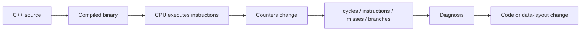
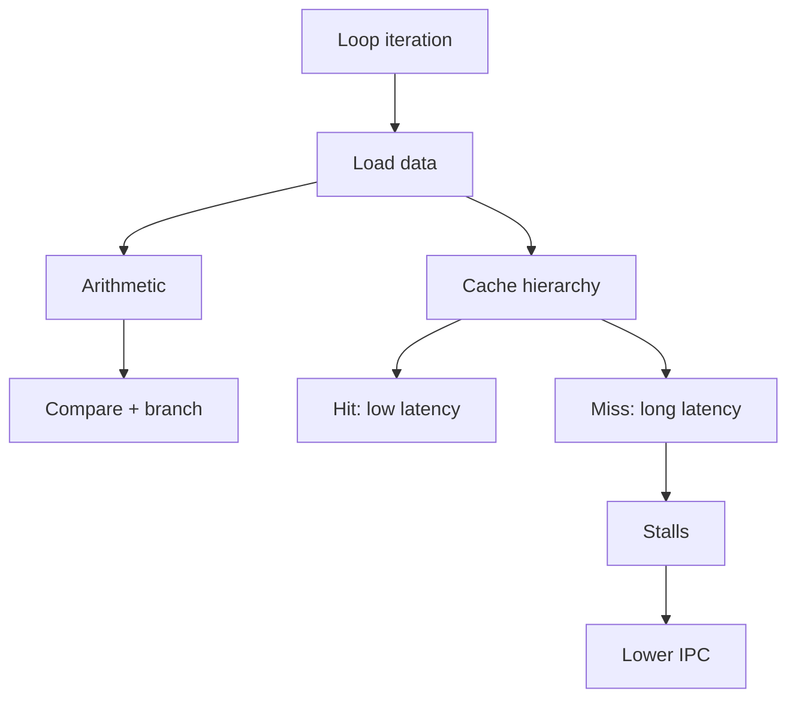
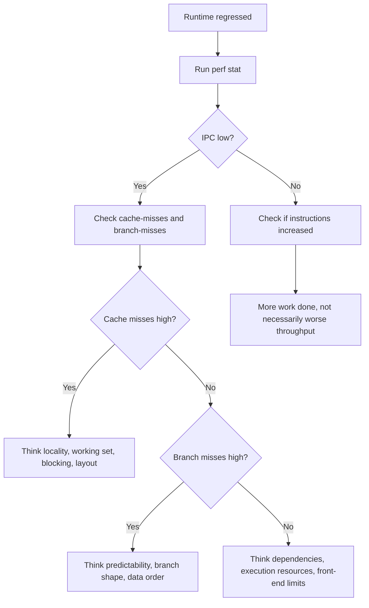

import AdBanner from '@site/src/components/AdBanner';
import Tabs from '@theme/Tabs';
import TabItem from '@theme/TabItem';

# From Concepts to Reality: Measuring Throughput, Cache Misses, and CPU Behavior in C++

Two C++ loops.

Same logic.
Same compiler flags.

One runs in `0.25s`.
The other takes `1.25s`.

Nothing obvious changed in the source.

So what changed?

The CPU did.

This article shows how to **prove that**, using real hardware counters, and how to think like a performance engineer instead of guessing.

This article is a continuation of these COA foundations:

- [Computer Architecture vs Computer Organization](/docs/coa/intro_to_coa)
- [Basic Terminology in Computer Organization and Architecture](/docs/coa/basic_terminology_in_coa)
- [How CPUs Execute Binary: Fetch–Decode–Execute Explained](/docs/coa/cpu_execution)

:::tip Those articles built the vocabulary:

- cache
- CPI
- IPC
- pipeline
- stalls
- memory hierarchy
:::

This article moves from vocabulary to observation.

The goal is not just to show `perf` commands. The goal is to help you build a mental model so that when a metric changes, you have a good guess about what changed in the hardware.

📩 Interested in deep dives like pipelines, cache, and compiler optimizations?

<div
  style={{
    width: '100%',
    maxWidth: '900px',
    margin: '1rem auto',
  }}
>
  <iframe
    src="https://docs.google.com/forms/d/e/1FAIpQLSebP1JfLFDp0ckTxOhODKPNVeI1e21rUqMJ0fbBwJoaa-i4Yw/viewform?embedded=true"
    style={{
      width: '100%',
      minHeight: '620px',
      border: '0',
      borderRadius: '12px',
      background: '#fff',
    }}
    loading="lazy"
  >
    Loading...
  </iframe>
</div>

<div>
  <AdBanner />
</div>

## Table of Contents

1. [What We Are Really Measuring](#what-we-are-really-measuring)
2. [A Small C++ Loop, Seen Like Hardware](#a-small-c-loop-seen-like-hardware)
3. [Why `perf` Is the Right Starting Tool](#why-perf-is-the-right-starting-tool)
4. [Minimal Example Program](#minimal-example-program)
5. [Check the CPU Before You Choose the Tool](#check-the-cpu-before-you-choose-the-tool)
6. [AMD Path: Install and Use AMD uProf](#amd-path-install-and-use-amd-uprof)
7. [The First Commands You Should Run](#the-first-commands-you-should-run)
8. [Real Snapshots from This AMD Machine](#real-snapshots-from-this-amd-machine)
9. [How to Read Cycles, Instructions, IPC, and CPI](#how-to-read-cycles-instructions-ipc-and-cpi)
10. [Cache References and Cache Misses](#cache-references-and-cache-misses)
11. [Branch Misses and Control-Flow Cost](#branch-misses-and-control-flow-cost)
12. [Sequential Access vs Random Access](#sequential-access-vs-random-access)
13. [Where Compiler Decisions Show Up in perf](#where-compiler-decisions-show-up-in-perf)
14. [How to Think Like a Performance Engineer](#how-to-think-like-a-performance-engineer)
15. [Quick Debug Flow](#quick-debug-flow)
16. [Diagnosis Patterns You Should Memorize](#diagnosis-patterns-you-should-memorize)
17. [Experiments You Should Try](#experiments-you-should-try)
18. [1-Minute Debug Checklist](#1-minute-debug-checklist)
19. [FAQ](#faq)
20. [Final Insight](#final-insight)

## What We Are Really Measuring

When you run a C++ program, wall-clock time alone does not tell you enough.

Two implementations can take the same time for different reasons:

- one may retire many instructions efficiently
- another may retire fewer instructions but avoid cache misses
- a third may be front-end or branch limited

So we need counters that reveal how the CPU behaved while your code ran.

That is what `perf` gives you on Linux: access to hardware performance counters and derived summaries built around them.

At a high level, we care about three kinds of observations:

- **work done**: how many instructions actually retired
- **time spent by the machine**: how many cycles elapsed
- **why throughput was limited**: memory misses, bad branches, stalls, and low useful work per cycle

:::tip Core Mental Model
Throughput is useful work completed per cycle. Low IPC is usually a symptom, not the disease. The disease is often cache misses, dependencies, branch mispredictions, or limited execution resources.
:::



## A Small C++ Loop, Seen Like Hardware

Start with a loop that looks completely ordinary:

```cpp
#include <cstdint>
#include <iostream>
#include <vector>

int main() {
    constexpr std::size_t N = 100'000'000;
    std::vector<std::uint64_t> data(N, 1);

    std::uint64_t sum = 0;
    for (std::size_t i = 0; i < data.size(); ++i) {
        sum += data[i];
    }

    std::cout << sum << '\n';
}
```

At source level, this looks like "just add numbers."

At machine level, the CPU sees something closer to:

- load data from memory or cache
- add into an accumulator
- increment the loop index
- compare against the bound
- branch back to the loop top

From a performance point of view, this loop is not one thing. It is a combination of:

- instruction fetch and decode
- load operations
- arithmetic operations
- branch prediction
- data movement through the cache hierarchy

So if this loop runs slowly, the right question is not "is C++ slow?" The right question is "what part of hardware execution limited throughput?"

That is a much better question.



<div>
  <AdBanner />
</div>

## Why `perf` Is the Right Starting Tool

If you are on Linux, `perf` is usually the most practical place to start because it gives you measurement close to real hardware behavior without forcing you to begin with a full profiling GUI or vendor-specific workflow.

Use it first for three reasons:

1. It tells you whether you are compute-bound, memory-bound, or control-flow-limited.
2. It gives you a reproducible baseline before deeper investigation.
3. It forces you to reason from counters instead of guessing from source code.

That last point matters. Engineers often read a loop and assume they know why it is slow. Usually they know less than they think.

### Before You Measure

Compile with optimization enabled, otherwise you are mostly measuring an artificial debug build:

```bash
g++ -O3 -march=native -std=c++20 loop.cpp -o loop
```

Also keep in mind:

- run enough work to drown out startup noise
- avoid measuring I/O-heavy code if your goal is CPU behavior
- repeat runs and compare trends, not just one number
- keep inputs identical when comparing versions

## Minimal Example Program

Here is a compact example that lets you compare sequential access and randomized access with the same high-level operation:

```cpp
#include <algorithm>
#include <cstdint>
#include <iostream>
#include <numeric>
#include <random>
#include <string_view>
#include <vector>

int main(int argc, char** argv) {
    constexpr std::size_t N = 32 * 1024 * 1024;
    std::vector<std::uint64_t> data(N, 1);
    std::vector<std::uint32_t> index(N);
    std::iota(index.begin(), index.end(), 0);

    if (argc > 1 && std::string_view(argv[1]) == "random") {
        std::mt19937 rng(123);
        std::shuffle(index.begin(), index.end(), rng);
    }

    std::uint64_t sum = 0;
    for (std::size_t i = 0; i < index.size(); ++i) {
        sum += data[index[i]];
    }

    std::cout << sum << '\n';
}
```

Why this is a good teaching example:

- the loop body stays simple
- the amount of arithmetic barely changes
- the access pattern changes dramatically

:::tip
This is a good teaching example because the arithmetic stays simple while the memory access pattern changes a lot.
:::

## Check the CPU Before You Choose the Tool

Do not jump straight to a profiler.

First check what CPU you are on, because that determines:

- which vendor-specific tools are available
- which counters or analysis modes make sense
- which official documentation you should trust for advanced metrics

On Linux, start here:

```bash
lscpu
```

If you want the short version:

```bash
lscpu | egrep 'Vendor ID|Model name|Architecture|CPU\\(s\\)|Thread\\(s\\) per core|Core\\(s\\) per socket|L1d cache|L2 cache|L3 cache'
```

On this machine, the result is:

```text
Architecture:                            x86_64
CPU(s):                                  16
Vendor ID:                               AuthenticAMD
Model name:                              AMD Ryzen 7 9700X 8-Core Processor
Thread(s) per core:                      2
Core(s) per socket:                      8
L1d cache:                               384 KiB (8 instances)
L2 cache:                                8 MiB (8 instances)
L3 cache:                                32 MiB (1 instance)
```

That matters because this is an **AMD Zen-based CPU**, so two measurement paths make sense:

- `perf` for generic Linux counter-based measurement
- **AMD uProf** for AMD-specific metrics, pipeline views, system-level PMC analysis, and deeper vendor-guided workflows

If you are on Intel, you would take a different vendor-documentation path. If you are on AMD, use AMD's own documentation instead of guessing event meanings.

## AMD Path: Install and Use AMD uProf

For this machine, the vendor-specific tool to know is **AMD uProf**.

Official AMD sources:

- [AMD uProf download page](https://www.amd.com/en/developer/uprof.html)
- [AMD uProf User Guide](https://docs.amd.com/r/en-US/57368-uProf-user-guide)
- [AMD uProf Getting Started Guide for Linux](https://docs.amd.com/r/en-US/68658-uProf-getting-started-guide)

According to AMD's current documentation, the Linux downloads include:

- `AMDuProf_Linux_x64_5.2.606.tar.bz2`
- `amduprof_5.2-606_amd64.deb`
- `amduprof-5.2-606.x86_64.rpm`

### Install on Ubuntu or Debian

AMD documents Debian-package installation with:

```bash
sudo dpkg --install amduprof_x.y-z_amd64.deb
```

On Ubuntu, that means the practical flow is:

```bash
# Download the current .deb from AMD uProf's official download page
sudo dpkg --install amduprof_5.2-606_amd64.deb
```

AMD states that after Debian or RPM installation, the executables and supporting files are installed under `/opt/AMDuProf_X.Y-ZZZ/`.

### Notes that Actually Matter

AMD's documentation also notes:

- Debian and RPM installs build and install the Power Profiling driver automatically
- if you install from the `tar.bz2` archive, the power profiling driver must be installed manually
- on Debian and Ubuntu, `build-essential` is a prerequisite for the power profiling driver

So if you hit driver build issues:

```bash
sudo apt install build-essential
```

### Use AMD uProf from the CLI

For overall CPU behavior, AMD's docs recommend starting with **AMDuProfPcm** to get system-level performance characterization.

Examples from AMD documentation include:

```bash
AMDuProfPcm -m ipc -C -O /tmp -- ./loop
AMDuProfPcm -m memory -a -A system,package -O /tmp
AMDuProfPcm -m pipeline_util -C -A system -O /tmp -- ./loop
```

What those commands are good for:

- `-m ipc`: good first check for throughput behavior
- `-m memory`: useful when you suspect memory bandwidth or memory-system pressure
- `-m pipeline_util`: useful when you want AMD's higher-level view of front-end vs back-end pressure

AMD also documents that on Linux, the script `AMDPcmsetCapability.sh` can be used to run `msr` mode without root privilege for supported Zen systems, and it notes that newer processors may require a recent kernel for perf-mode support.

### Where `perf` Still Fits

Even on AMD, `perf` is still the right first tool for this article's style of analysis because:

- it is generic
- it is lightweight
- it maps cleanly to the mental model of cycles, instructions, misses, and throughput

The right mindset is:

- start with `perf`
- use AMD uProf when you need AMD-specific metrics, PCM views, top-down style interpretation, or system-wide PMC analysis

<Tabs>
  <TabItem value="perf-first" label="Start with perf">

<ul>
  <li>fastest way to answer "what changed?"</li>
  <li>good for cycles, instructions, IPC, cache misses, branch misses</li>
  <li>ideal when comparing two binaries or two loop shapes</li>
</ul>

  </TabItem>
  <TabItem value="uprof-next" label="Move to uProf">

<ul>
  <li>good when you need AMD-specific pipeline and PMC views</li>
  <li>useful for system-wide profiling and deeper Zen-oriented analysis</li>
  <li>good next step after `perf` says "memory" or "pipeline pressure"</li>
</ul>

  </TabItem>
</Tabs>

<div>
  <AdBanner />
</div>

## The First Commands You Should Run

<Tabs>
  <TabItem value="baseline" label="Baseline">

```bash
perf stat ./loop
```

Use this first when you want the default summary:

<ul>
  <li>`task-clock`</li>
  <li>`cycles`</li>
  <li>`instructions`</li>
  <li>`branches`</li>
  <li>`branch-misses`</li>
</ul>

This is usually enough to decide whether the next step should be memory-focused or control-flow-focused.

  </TabItem>
  <TabItem value="detail" label="More detail">

```bash
perf stat -d ./loop
```

Use this when runtime changed but the default summary is not enough. `-d` commonly adds cache-oriented information and helps separate front-end, branch, and memory suspicions.

  </TabItem>
  <TabItem value="explicit" label="Explicit events">

```bash
perf stat -e cycles,instructions,cache-references,cache-misses,branches,branch-misses ./loop
```

This is the practical starter pack for reasoning:

<ul>
  <li>`cycles`</li>
  <li>`instructions`</li>
  <li>`cache-references`</li>
  <li>`cache-misses`</li>
  <li>`branches`</li>
  <li>`branch-misses`</li>
</ul>

  </TabItem>
  <TabItem value="compare" label="Compare two runs">

```bash
perf stat -e cycles,instructions,cache-references,cache-misses,branches,branch-misses ./loop
perf stat -e cycles,instructions,cache-references,cache-misses,branches,branch-misses ./loop random
```

This is where diagnosis starts. Now you can ask:

<ul>
  <li>Did cycles rise faster than instructions?</li>
  <li>Did cache misses explode?</li>
  <li>Did IPC collapse?</li>
  <li>Did branch misses stay flat?</li>
</ul>

  </TabItem>
</Tabs>

<div>
  <AdBanner />
</div>

## Real Snapshots from This AMD Machine

The following snapshots were captured on the machine used for this article:

- CPU: AMD Ryzen 7 9700X 8-Core Processor
- Vendor: `AuthenticAMD`
- OS tool: Linux `perf`

These are not invented numbers. They come from running the benchmark shown earlier on this machine.

### Real `perf stat` Snapshot

Command:

```bash
perf stat /tmp/perf_loop
```

Output:

```text
268435456

 Performance counter stats for '/tmp/perf_loop':

         181738065      task-clock                       #    0.998 CPUs utilized
                 2      context-switches                 #   11.005 /sec
                 1      cpu-migrations                   #    5.502 /sec
             98434      page-faults                      #  541.626 K/sec
        1401623419      instructions                     #    1.80  insn per cycle
                                                  #    0.05  stalled cycles per insn
         777450127      cycles                           #    4.278 GHz
          66851687      stalled-cycles-frontend          #    8.60% frontend cycles idle
         142927004      branches                         #  786.445 M/sec
            296221      branch-misses                    #    0.21% of all branches

       0.182026769 seconds time elapsed
```

:::tip
The important part is not only the `0.18s` runtime. The more useful signal is about **1.80 IPC**, plus a very low branch-miss rate.
:::

### Real `perf stat -d` Snapshot

Command:

```bash
perf stat -d /tmp/perf_loop
```

Output:

```text
268435456

 Performance counter stats for '/tmp/perf_loop':

         181616595      task-clock                       #    0.998 CPUs utilized
                 3      context-switches                 #   16.518 /sec
                 1      cpu-migrations                   #    5.506 /sec
             98437      page-faults                      #  542.004 K/sec
        1394651855      instructions                     #    1.77  insn per cycle
                                                  #    0.05  stalled cycles per insn
         786681256      cycles                           #    4.332 GHz
          64775321      stalled-cycles-frontend          #    8.23% frontend cycles idle
         141452908      branches                         #  778.855 M/sec
            302714      branch-misses                    #    0.21% of all branches
         823507410      L1-dcache-loads                  #    4.534 G/sec
          67147359      L1-dcache-load-misses            #    8.15% of all L1-dcache accesses

       0.181986009 seconds time elapsed
```

:::tip
This is what `-d` gives you: more cache detail, so you can move from "it ran fast" to "it ran fast and the memory side still looked healthy."
:::

### Real Sequential vs Random Snapshot

Sequential command:

```bash
perf stat -e cycles,instructions,cache-references,cache-misses,branches,branch-misses /tmp/perf_loop
```

Sequential output:

```text
268435456

 Performance counter stats for '/tmp/perf_loop':

        1079370168      cycles
        1395806271      instructions                     #    1.29  insn per cycle
         131799416      cache-references
           4482485      cache-misses                     #    3.40% of all cache refs
         141901941      branches
            289342      branch-misses                    #    0.20% of all branches

       0.254959272 seconds time elapsed
```

Random command:

```bash
perf stat -e cycles,instructions,cache-references,cache-misses,branches,branch-misses /tmp/perf_loop random
```

Random output:

```text
268435456

 Performance counter stats for '/tmp/perf_loop random':

        5348378902      cycles
        2920354565      instructions                     #    0.55  insn per cycle
         661628872      cache-references
         376980818      cache-misses                     #   56.98% of all cache refs
         315955946      branches
            526121      branch-misses                    #    0.17% of all branches

       1.258081064 seconds time elapsed
```

This comparison is the whole article in one experiment:

- time elapsed grows from about `0.255s` to about `1.258s`
- cycles jump from about `1.08B` to about `5.35B`
- IPC collapses from about `1.29` to about `0.55`
- cache miss rate explodes from `3.40%` to `56.98%`
- branch miss rate stays low in both runs

That means the slowdown is not primarily a branch-prediction story. It is a memory-locality story.

This is the right way to read it:

1. The arithmetic intent is similar.
2. The branch behavior is still fine.
3. The memory behavior got dramatically worse.
4. The machine spent many more cycles waiting on data.
5. Useful work per cycle dropped hard.

<Tabs>
  <TabItem value="seq" label="Sequential Read">

<ul>
  <li>`0.255s` elapsed</li>
  <li>`1.29 IPC`</li>
  <li>`3.40%` cache-miss rate</li>
  <li>low branch miss rate</li>
</ul>

This is what healthy locality looks like for this benchmark.

  </TabItem>
  <TabItem value="rand" label="Random Read">

<ul>
  <li>`1.258s` elapsed</li>
  <li>`0.55 IPC`</li>
  <li>`56.98%` cache-miss rate</li>
  <li>branch miss rate still low</li>
</ul>

This is not a branch problem. This is memory latency dominating throughput.

  </TabItem>
  <TabItem value="lesson" label="What Changed">

The loop still adds numbers. The hardware story changed:

<ul>
  <li>data arrives later</li>
  <li>the core waits more</li>
  <li>cycles grow faster than useful work</li>
  <li>IPC collapses</li>
</ul>

That is the bridge from cache theory to measured behavior.

  </TabItem>
</Tabs>

### A Practical Permission Note

On many Linux systems, `perf` does not work out of the box for hardware counters. On this machine, the initial failure looked like this:

```text
Error:
Access to performance monitoring and observability operations is limited.
...
perf_event_paranoid setting is 4
```

The fix for temporary local experimentation is usually:

```bash
sudo sysctl kernel.perf_event_paranoid=-1
```

To check the current setting:

```bash
cat /proc/sys/kernel/perf_event_paranoid
```

:::caution
This is not a small setup detail. If you ignore it, you can waste a lot of time thinking the tool is broken when the real issue is Linux permissions.
:::

## How to Read Cycles, Instructions, IPC, and CPI

These are the first numbers you should learn to interpret properly.

### Cycles

**Cycles** tell you how many CPU clock steps passed while your program was running.

So if cycles increase, one of several things may be true:

- the program did more work
- the program waited more often
- the CPU retired instructions less efficiently
- memory latency or branch recovery kept the machine from making progress

:::important
Cycles do not mean "useful work done." They mean "time the CPU spent getting this work finished."
:::

:::caution
Do not say "more cycles means worse code" unless you also check instructions, IPC, and misses.
:::

:::tip
A better reading is: "the CPU needed more time to finish this job, now I need to know whether that happened because of more work or because throughput got worse."
:::

### Instructions

**Instructions** count the instructions that really finished.

This is completed work, not instructions that were only fetched, guessed, or speculated.

If two versions produce the same result but one retires many more instructions, it may indicate:

- extra address calculations
- extra bounds or branch work
- spills and reloads
- less efficient lowering or more bookkeeping

:::caution
Fewer instructions do not automatically mean faster code. A program can retire fewer instructions and still be slower if cache misses make each instruction expensive.
:::

### IPC

**IPC** means instructions per cycle:

```text
IPC = instructions / cycles
```

IPC is useful work per cycle.

Do not treat it as a score.
Treat it as a signal.

:::caution
Do not treat IPC like a universal score. A "good" IPC depends on the CPU and on the type of workload.
:::

If IPC drops, something is preventing the CPU from doing useful work:

- cache misses
- branch recovery
- dependencies

Your job is to find which one.

Low IPC is not the problem.
It is the symptom.

A few rough rules are still useful:

- very low IPC often means the machine is waiting a lot
- moderate IPC can still be healthy for branchy or memory-heavy code
- high IPC is common only when the machine consistently finds independent work and avoids expensive misses

### CPI

**CPI** means cycles per instruction:

```text
CPI = cycles / instructions
```

This is the reverse view of IPC.

- low CPI is generally good
- high CPI means each retired instruction cost many cycles on average

This is where the earlier theory becomes real:

- cache miss = memory latency
- memory latency = waiting
- waiting = more cycles per retired instruction
- more cycles per instruction = worse CPI and lower IPC

:::tip
When CPI rises, read it as: "each finished instruction became more expensive."
:::

:::important
IPC and CPI are summary ratios. They do not explain the cause. They tell you whether the machine converted cycles into retired instructions efficiently.
:::

<Tabs>
  <TabItem value="good" label="Usually Good">

<ul>
  <li>cycles roughly track real work growth</li>
  <li>instructions do not balloon unexpectedly</li>
  <li>IPC stays stable or improves</li>
  <li>CPI stays low and stable</li>
</ul>

  </TabItem>
  <TabItem value="bad" label="Usually Bad">

<ul>
  <li>cycles jump while instructions barely move</li>
  <li>IPC falls sharply</li>
  <li>CPI rises sharply</li>
  <li>misses or branch recovery explain the gap</li>
</ul>

  </TabItem>
</Tabs>

## Cache References and Cache Misses

These numbers are useful, but they are easy to read the wrong way.

### Cache References

`cache-references` is a broad counter. It does not mean "every cache access everywhere" in a perfect way on every CPU.

:::caution
Treat `cache-references` as a clue, not as perfect truth.
:::

It can still help answer questions like:

- did this version drive more cache traffic?
- did access behavior change significantly?

### Cache Misses

`cache-misses` are often more useful because they directly hint that memory access is slowing the program down.

Why they matter:

- an ALU add is cheap
- a register move is cheap
- a cache miss that falls through to deeper cache or DRAM is not cheap

When data is late, the CPU can end up waiting instead of doing useful work.

:::important
Cache miss means extra memory delay. Extra memory delay means more waiting. More waiting means lower throughput.
:::

:::tip
If cache misses go up sharply and IPC goes down, memory is often the first thing to suspect.
:::

### What Bad vs Good Looks Like

There is no single miss-rate number that is always bad for every CPU and every workload. But these patterns are usually reliable:

- if runtime goes up and cache misses jump sharply, memory behavior is a strong suspect
- if instructions stay close but cycles increase a lot, cache misses often explain the gap
- if miss count grows with more random access, you are seeing the cost of weaker locality

Good signs:

- stable or reduced miss counts for the same workload
- improved runtime with similar instruction count
- improved IPC together with fewer misses

Bad signs:

- a large runtime increase with similar arithmetic work
- much higher cycles without proportional instruction growth
- lower IPC paired with more misses

### What Code Changes Affect Cache Behavior

These changes often affect cache behavior:

- sequential access instead of random access
- tighter data layout
- smaller working set
- blocking or tiling
- fewer pointer-chasing indirections
- structure-of-arrays instead of array-of-structures in some data-parallel cases
- removing unnecessary passes over memory

:::tip
Performance engineers think in terms of **working set** and **locality**, not just "how many operations" a loop performs.
:::

<div>
  <AdBanner />
</div>

## Branch Misses and Control-Flow Cost

Branches matter because the CPU pipeline wants to keep moving without stopping.

If the branch predictor guesses right, the CPU keeps moving forward smoothly.

If it guesses wrong:

- speculative work is discarded
- the pipeline must recover
- useful throughput drops

That usually shows up as:

- more cycles
- often lower IPC
- possibly similar instruction count but worse overall runtime

:::important
Branch misses are not about correctness. The program still gives the same answer. The cost is lost time while the pipeline recovers.
:::

### What Bad vs Good Looks Like

Good:

- low branch-miss rate on regular loops and predictable conditions

Bad:

- a branch-heavy hot loop with many unpredictable outcomes
- runtime rising because branch misses trigger frequent recovery

### What Code Changes Affect Branch Misses

- more predictable control flow helps
- branchless transformations can help in some hot paths
- data ordering can help if it makes outcomes more regular
- replacing unpredictable if/else chains with lookup or arithmetic forms can help sometimes

:::caution
Do not optimize only for branch misses. If you reduce branch misses but increase memory traffic badly, the program can still get slower.
:::

## Sequential Access vs Random Access

This is a comparison every engineer should run at least once.

With the earlier example:

- `./loop` walks memory in a regular order
- `./loop random` destroys locality

The arithmetic work stays almost unchanged. The machine behavior does not.

### What Usually Changes

For sequential access, you often see:

- lower runtime
- better IPC
- fewer expensive cache misses
- stronger help from hardware prefetching

For random access, you often see:

- higher runtime
- higher cycles
- lower IPC
- more cache misses
- more visible memory latency

### Why This Happens

Sequential access is friendly to the memory hierarchy:

- adjacent elements live near each other
- cache lines get reused
- hardware prefetchers can often predict upcoming accesses

Random access breaks that model:

- the next needed element may be far away
- cache lines are reused less effectively
- prefetching becomes harder
- the core waits more often on data

This is where the theory becomes visible:

- same loop shape
- similar high-level operation
- very different cache behavior
- very different throughput

### A Reasoning Pattern You Should Use

Suppose you see this:

- instructions: roughly similar
- cycles: much higher
- cache misses: much higher
- IPC: much lower

That pattern strongly suggests this story:

1. The program did almost the same amount of architectural work.
2. The memory system delivered data less efficiently.
3. The core spent more cycles waiting.
4. Useful work per cycle collapsed.

That is how you should read counters.

## Where Compiler Decisions Show Up in perf

Everything you measured so far is not just about hardware.

It is also about what the compiler decided to generate.

Here are a few concrete connections:

- **Vectorization**
  -> fewer instructions, higher IPC
  -> visible as improved throughput

- **Loop unrolling**
  -> more instructions, but better pipeline utilization
  -> IPC may increase even if instruction count grows

- **Register allocation quality**
  -> spills introduce extra memory traffic
  -> shows up as more cache pressure and cycles

- **Branch lowering (if-conversion)**
  -> fewer unpredictable branches
  -> lower branch-miss rate

This is the key connection:

The compiler shapes the instruction stream.
The hardware decides how efficiently that stream executes.

`perf` is where both worlds meet.

<div>
  <AdBanner />
</div>

## How to Think Like a Performance Engineer

Do not start with "which optimization trick should I try?"

Start with:

1. What is the workload?
2. What changed in the machine-visible behavior?
3. Which metric changed first?
4. Which hardware bottleneck fits that pattern?

### A Practical Diagnostic Order

For many CPU-bound C++ investigations, this order works well:

1. Measure runtime.
2. Measure cycles and instructions.
3. Compute or inspect IPC/CPI.
4. Check cache misses.
5. Check branch misses.
6. Compare against a simpler or more locality-friendly variant.

### Patterns Worth Memorizing

**Pattern: cycles up, instructions similar, IPC down**

Likely interpretation:

- less efficient execution
- often stalls, memory latency, or branch recovery

**Pattern: instructions up a lot, IPC similar**

Likely interpretation:

- you are doing more work, even if the machine is executing it at a similar rate

**Pattern: cache misses up, cycles up, IPC down**

Likely interpretation:

- memory behavior is probably the dominant problem

**Pattern: branch misses up, cycles up, instructions similar**

Likely interpretation:

- control-flow predictability degraded and pipeline recovery cost increased

:::important
Think in cause and effect, not in isolated metrics.
:::

## Quick Debug Flow

When a C++ loop gets slower, this is the shortest useful workflow:



Use it in this order:

1. Measure runtime.
2. Run `perf stat`.
3. Check `instructions` and `cycles`.
4. Check IPC or CPI.
5. If IPC is low, check cache misses and branch misses.
6. If neither explains the drop, suspect dependency chains, front-end supply, or execution-unit contention.

:::tip
This flow is not perfect, but it is far better than changing code randomly and hoping.
:::

## Diagnosis Patterns You Should Memorize

This is the part most people skip. They collect counters, but they do not translate them into a hardware story. These patterns are worth memorizing.

## Quick Pattern Table

| Observation | Likely Cause | Next Step |
| --- | --- | --- |
| cycles up, instructions similar, IPC down | stalls or memory latency | check cache-misses |
| instructions up a lot | more work done | inspect codegen |
| cache-misses up sharply | poor locality | fix data layout |
| branch-misses up | bad predictability | simplify control flow |
| IPC low, misses low | dependency or front-end issue | inspect assembly |

| Pattern | Likely story | What to inspect next |
| --- | --- | --- |
| cycles up, instructions similar, IPC down | same work, worse throughput | cache misses, branch misses, dependencies |
| instructions up, IPC similar | more work is being done | codegen changes, extra bookkeeping, spills |
| cache misses up sharply | memory latency dominates | data layout, working set, access order |
| branch misses up sharply | control flow recovery cost increased | unpredictable conditions, branchy hot paths |
| branch misses low, cache misses high, IPC low | memory problem, not branch problem | locality, tiling, pointer chasing |
| instructions low but runtime high | fewer instructions does not help if each is expensive | memory latency, long stalls |

### One diagnosis you should avoid

Never say:

- "IPC is low, so the compiler generated bad code"

That is too shallow. Low IPC only tells you that useful work per cycle is poor. The next question is always:

- poor because of what?

That is the actual diagnosis step.

## Experiments You Should Try

If you want the theory to stick, do these yourself.

**Experiment 1: Change the Working Set**

Run the same loop with:

- data that fits in cache
- data that spills well beyond cache

Watch what happens to:

- runtime
- cycles
- IPC
- cache misses

**Experiment 2: Sequential vs Random**

Keep the same sum loop and change only the access order.

This is one of the cleanest demonstrations of how locality shapes performance.

**Experiment 3: Add a Branch**

Insert an unpredictable conditional in the hot loop, then measure:

- branch-misses
- cycles
- IPC

**Experiment 4: Do More Arithmetic Per Load**

Reuse each loaded value more before moving on.

This helps build intuition for the difference between:

- memory-bound code
- compute-heavier code

**Experiment 5: Compare Two Data Layouts**

Try:

- array of structures
- structure of arrays

Then inspect whether the cache and instruction throughput behavior changes.

## 1-Minute Debug Checklist

When a loop gets slower, do this:

1. Run: `perf stat ./program`
2. Look at:
   - cycles
   - instructions
   - IPC
3. If IPC dropped:
   - check cache-misses
   - check branch-misses
4. If cache-misses are high:
   -> think data layout, locality, working set
5. If branch-misses are high:
   -> think predictability, branch structure
6. If both look fine:
   -> suspect dependencies, front-end limits, or execution ports

:::caution
Do not change code before you do this.
:::

## FAQ

Here's the condensed Q&A:

**1. Why more instructions in slower run?**  
Slower doesn't mean fewer instructions. Random access can trigger more address work, spills, or different code shape. Cycles matter more.

**2. Is higher IPC always better?**  
No. Compare only similar workloads. A memory-bound loop and a compute kernel have different ceilings.

**3. Low branch-misses but still slow?**  
Yes. Random access example: low branch misses, but cache misses explode → IPC collapses.

**4. `perf` or AMD uProf first on AMD?**  
`perf` first for quick checks. uProf for AMD-specific pipeline analysis.

**5. `perf` installed but fails?**  
Check `perf_event_paranoid`. Install ≠ permission. Try: `sudo sysctl kernel.perf_event_paranoid=-1`

**6. Fewer cache misses but slower?**  
Yes. Could be branch mispredicts, front-end stalls, or dependency chains. Misses aren't the only bottleneck.

**7. Why 0.00 IPC?**  
Program is sleeping/waiting, measuring too small a region, or on a VM with broken counters.

**8. What's a "good" miss rate?**  
No universal number. Compare same workload across versions. Watch for cycles↑ + IPC↓.

**9. Instruction count varies between runs?**  
Small variation normal (ASLR, alignment). Wild variation? Non-deterministic code or race conditions.

**10. Optimize IPC or total cycles?**  
**Total cycles (wall time).** IPC is diagnostic, not the goal. Higher IPC can still mean slower if cycles increase.


## Final Insight

Performance engineering begins when you stop trusting intuition and start trusting measurement.

Two programs can look identical and behave completely differently on real hardware.

The difference is not in the syntax.
It is in how the machine experiences your code.

If you can read that behavior,
you can control it.

And that is where real performance work starts.

:::important
If you are not measuring, you are guessing.
And guessing is usually wrong.
:::

Next step:

Now that you can read `perf` counters,
we connect them to assembly.

- Which instructions did the compiler generate?
- Why did IPC improve or collapse?
- How does vectorization actually show up in `perf`?

That is where compiler engineering meets hardware reality.

## What To Read Next

- [Computer Architecture Roadmap](/docs/coa)
- [Computer Architecture vs Computer Organization](/docs/coa/intro_to_coa)
- [Basic Terminology in Computer Organization and Architecture](/docs/coa/basic_terminology_in_coa)
- [How CPUs Execute Binary: Fetch–Decode–Execute Explained](/docs/coa/cpu_execution)


<Tabs>
  <TabItem value="docs" label="📚 Documentation">
             - [CompilerSutra Home](https://compilersutra.com)
                - [CompilerSutra Homepage (Alt)](https://compilersutra.com/)
                - [Getting Started Guide](https://compilersutra.com/get-started)
                - [Newsletter Signup](https://compilersutra.com/newsletter)
                - [Skip to Content (Accessibility)](https://compilersutra.com#__docusaurus_skipToContent_fallback)


  </TabItem>

  <TabItem value="tutorials" label="📖 Tutorials & Guides">

        - [AI Documentation](https://compilersutra.com/docs/Ai)
        - [DSA Overview](https://compilersutra.com/docs/DSA/)
        - [DSA Detailed Guide](https://compilersutra.com/docs/DSA/DSA)
        - [MLIR Introduction](https://compilersutra.com/docs/MLIR/intro)
        - [TVM for Beginners](https://compilersutra.com/docs/tvm-for-beginners)
        - [Python Tutorial](https://compilersutra.com/docs/python/python_tutorial)
        - [C++ Tutorial](https://compilersutra.com/docs/c++/CppTutorial)
        - [C++ Main File Explained](https://compilersutra.com/docs/c++/c++_main_file)
        - [Compiler Design Basics](https://compilersutra.com/docs/compilers/compiler)
        - [OpenCL for GPU Programming](https://compilersutra.com/docs/gpu/opencl)
        - [LLVM Introduction](https://compilersutra.com/docs/llvm/intro-to-llvm)
        - [Introduction to Linux](https://compilersutra.com/docs/linux/intro_to_linux)

  </TabItem>

  <TabItem value="assessments" label="📝 Assessments">

        - [C++ MCQs](https://compilersutra.com/docs/mcq/cpp_mcqs)
        - [C++ Interview MCQs](https://compilersutra.com/docs/mcq/interview_question/cpp_interview_mcqs)

  </TabItem>

  <TabItem value="projects" label="🛠️ Projects">

            - [Project Documentation](https://compilersutra.com/docs/Project)
            - [Project Index](https://compilersutra.com/docs/project/)
            - [Graphics Pipeline Overview](https://compilersutra.com/docs/The_Graphic_Rendering_Pipeline)
            - [Graphic Rendering Pipeline (Alt)](https://compilersutra.com/docs/the_graphic_rendering_pipeline/)

  </TabItem>

  <TabItem value="resources" label="🌍 External Resources">

            - [LLVM Official Docs](https://llvm.org/docs/)
            - [Ask Any Question On Quora](https://compilersutra.quora.com)
            - [GitHub: FixIt Project](https://github.com/aabhinavg1/FixIt)
            - [GitHub Sponsors Page](https://github.com/sponsors/aabhinavg1)

  </TabItem>

  <TabItem value="social" label="📣 Social Media">

            - [🐦 Twitter - CompilerSutra](https://twitter.com/CompilerSutra)
            - [💼 LinkedIn - Abhinav](https://www.linkedin.com/in/abhinavcompilerllvm/)
            - [📺 YouTube - CompilerSutra](https://www.youtube.com/@compilersutra)

  </TabItem>
</Tabs>
