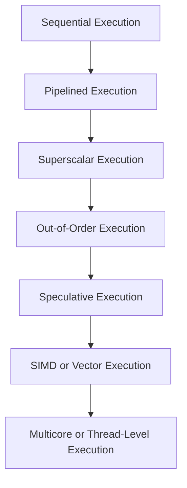
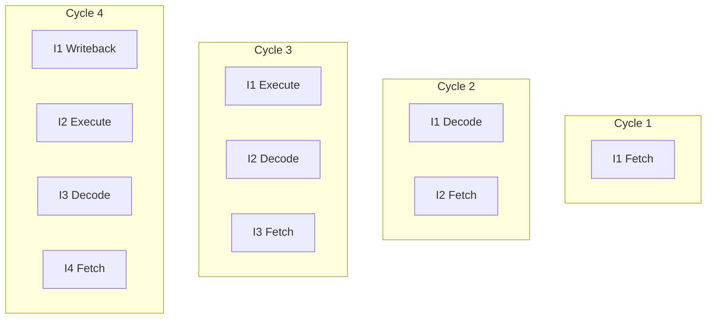
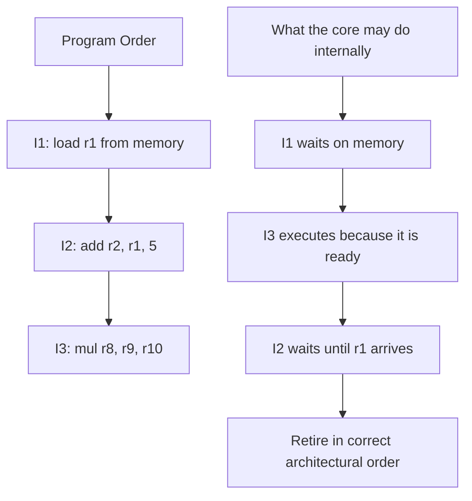
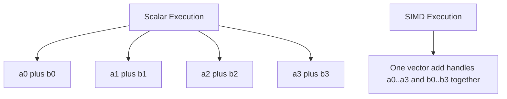
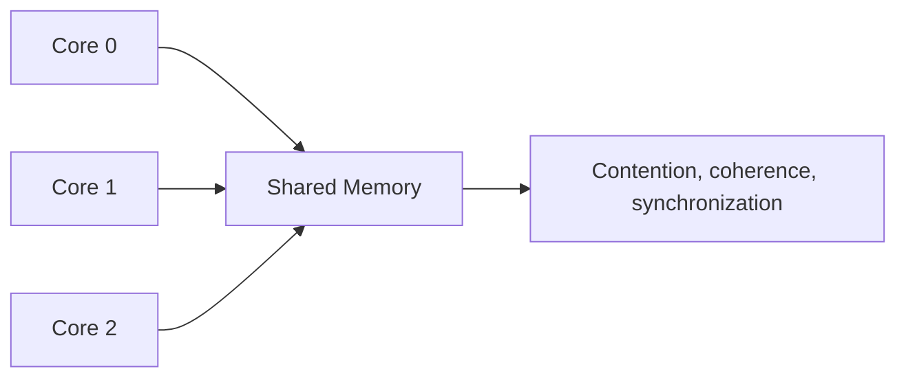
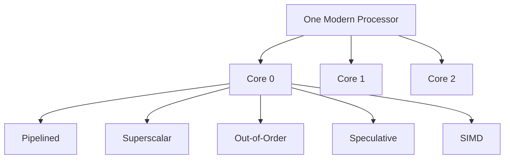

import AdBanner from '@site/src/components/AdBanner';
import Tabs from '@theme/Tabs';
import TabItem from '@theme/TabItem';

# How Modern Processors Execute Code: From Sequential to Speculative Execution

When people first learn computer architecture, execution often sounds simple:

- fetch an instruction
- decode it
- run it
- move to the next one

If that basic execution flow is not familiar yet, start with [How CPUs Execute Binary: Fetch–Decode–Execute Explained](/docs/coa/cpu_execution) first.


That is a useful starting point, but it is not how modern high-performance processors really behave.

Modern CPUs do not just execute one instruction at a time in a perfectly neat line. They overlap work, issue multiple instructions in the same cycle, guess future control flow, and sometimes even execute instructions before it is certain they are needed.

That picture is not wrong. It is just incomplete.

And that is where **execution models** become useful.

The question is not just:

> How does a CPU execute an instruction?

It is also:

> What style of execution is this machine using to keep hardware busy?

This article gives that bigger picture. It sits between the first "a CPU runs instructions" explanation and the more interesting questions that usually come next: why branches hurt, why vectorization matters, why some loops fly, and why others stall on very capable hardware.

:::tip Read these first if you are new to COA
- [Computer Organization vs Computer Architecture](/docs/coa/intro_to_coa)
- [Basic Terminology in Computer Organization and Architecture](/docs/coa/basic_terminology_in_coa)
:::

:::important What you should leave with
- Sequential execution is the baseline starting point, not the modern performance model
- Pipelining improves throughput by overlapping stages
- Superscalar and out-of-order execution try to exploit instruction-level parallelism
- Speculative execution keeps the machine busy when control flow is uncertain
- SIMD and multicore execution add data-level and thread-level parallelism
- Compiler decisions matter because hardware can only exploit parallelism that the code shape makes available
:::

:::caution Who this is not for
If you are brand new to CPUs, registers, pipeline stages, or compilers, this article will feel fast. Start with the earlier COA basics and `cpu_execution` first.
:::

<div>
  <AdBanner />
</div>

## Table of Contents

1. [Why This Topic Matters](#why-this-topic-matters)
2. [The Big Picture: Execution Is About Keeping Hardware Busy](#the-big-picture-execution-is-about-keeping-hardware-busy)
3. [1. Sequential Execution](#1-sequential-execution)
4. [2. Pipelined Execution](#2-pipelined-execution)
5. [3. Superscalar Execution](#3-superscalar-execution)
6. [4. Out-of-Order Execution](#4-out-of-order-execution)
7. [5. Speculative Execution](#5-speculative-execution)
8. [6. SIMD and Vector Execution](#6-simd-and-vector-execution)
9. [7. Multicore and Thread-Level Execution](#7-multicore-and-thread-level-execution)
10. [How These Models Fit Together](#how-these-models-fit-together)
11. [Why Compiler Engineers Should Care](#why-compiler-engineers-should-care)
12. [Common Misconceptions](#common-misconceptions)
13. [FAQ](#faq)

## Why This Topic Matters

Many architecture topics feel scattered when you meet them one by one.

You read about pipelines in one place, branch prediction somewhere else, SIMD in another chapter, and multicore scaling in a separate discussion. The result is that the subject can start to feel like a pile of mechanisms instead of one connected story.

The missing question is:

> What is the processor actually trying to achieve while it executes code?

The answer is almost always some version of this:

> keep useful work moving, keep expensive hardware busy, and lose as few cycles as possible to waiting.

Once you see execution that way, a lot of later topics stop feeling random.

For example:

<Tabs>
  <TabItem value="exec-control" label="Control Flow" default>
    <p><strong>Pipeline hazards</strong> matter because pipelined hardware is trying to overlap stages, and hazards are exactly the places where that overlap breaks.</p>
    <p>A simple way to see this is to imagine one instruction saying, "I need that result first." The pipeline wants to keep moving, but that one dependency forces a pause. That is also the spirit of <a href="https://www.researchgate.net/profile/Muhammad-Hataba/publication/373629826_Pipelining_in_Modern_Processors/links/64f4db90aef680084cbdd7e2/Pipelining-in-Modern-Processors.pdf" target="_blank" rel="noopener noreferrer"><em>Pipelining in Modern Processors</em></a>: pipelining works best when the stages keep flowing instead of stopping and starting.</p>

    <p><strong>Branch prediction</strong> matters because speculative execution only helps when the processor can guess the future well enough to avoid constant flushes.</p>
    <p>Think about an <code>if-else</code> inside a loop. If the answer keeps changing in a messy way, the processor keeps taking the wrong path, then backing up and trying again. That is also the point made in <a href="https://www.researchgate.net/profile/Mohammed-Sambo-9/publication/370679883_A_Comparative_Study_of_Pipelining_Branch_Prediction_and_Superscalar_Architectures_for_Enhanced_Computer_Performance/links/645d1a2a4af788735263f05e/A-Comparative-Study-of-Pipelining-Branch-Prediction-and-Superscalar-Architectures-for-Enhanced-Computer-Performance.pdf" target="_blank" rel="noopener noreferrer"><em>A Comparative Study of Pipelining, Branch Prediction, and Superscalar Architectures for Enhanced Computer Performance</em></a>: better prediction means less wasted work.</p>
  </TabItem>

  <TabItem value="exec-parallel" label="Parallel Work">
    <p><strong>Instruction scheduling</strong> matters because superscalar and out-of-order cores need a steady supply of independent work, not just correct work.</p>
    <p>A beginner version of this is simple: if two calculations do not depend on each other, the processor would like to work on both without waiting. If your code turns everything into one long chain, that freedom disappears. The same broad idea appears in <a href="https://www.researchgate.net/profile/Mohammed-Sambo-9/publication/370679883_A_Comparative_Study_of_Pipelining_Branch_Prediction_and_Superscalar_Architectures_for_Enhanced_Computer_Performance/links/645d1a2a4af788735263f05e/A-Comparative-Study-of-Pipelining-Branch-Prediction-and-Superscalar-Architectures-for-Enhanced-Computer-Performance.pdf" target="_blank" rel="noopener noreferrer"><em>A Comparative Study of Pipelining, Branch Prediction, and Superscalar Architectures for Enhanced Computer Performance</em></a>, where performance improves when the machine keeps getting useful work to do.</p>

    <p><strong>Register pressure</strong> matters because exposing more parallel work is useful only if the machine can still keep the needed values live efficiently.</p>
    <p>In plain terms, if too many temporary values show up at once, the machine runs out of easy places to keep them. Then some of that data spills into memory, and what looked like a clever optimization starts getting expensive. The short version is: more work at once is not automatically better.</p>

    <p><strong>Vectorization</strong> matters because SIMD execution changes the unit of useful work from one scalar operation to many data elements at once.</p>
    <p>A good beginner example is adding two arrays. Instead of adding one pair of numbers at a time, the processor may add several pairs together in one vector instruction. That is also the idea behind <a href="https://users.cs.northwestern.edu/~hardav/paragon/papers/2023-CGO-Parsimony-Kandiah.pdf" target="_blank" rel="noopener noreferrer"><em>Parsimony</em></a>: SIMD becomes useful when the compiler can turn a regular loop into something the vector hardware can actually use well.</p>
  </TabItem>

  <TabItem value="exec-memory" label="Memory and Scaling">
    <p><strong>Memory latency hiding</strong> matters because out-of-order execution is often limited less by arithmetic and more by whether the core can keep doing other work while loads are pending.</p>
    <p>If a program is waiting on data from memory, a good processor tries to find something else useful to do instead of just sitting there. This is one of the biggest themes of the whole article: modern execution is really about avoiding empty time.</p>

    <p><strong>Multicore scaling</strong> matters because once execution spreads across cores, performance depends on communication, coherence, synchronization, and shared-memory traffic, not just per-core speed.</p>
    <p>A beginner example is two threads updating nearby values in shared memory. Even if the program says those updates are separate, the hardware may still make the cores step on each other because it has to keep memory consistent. That is also the shift emphasized in <a href="https://www.nature.com/articles/s41598-023-34297-3.pdf" target="_blank" rel="noopener noreferrer"><em>Performance Aware Shared Memory Hierarchy Model for Multicore Processors</em></a>: multicore performance is not just "more cores = more speed."</p>
  </TabItem>

  <TabItem value="exec-compiler" label="Compiler View">
    <p><strong>Compiler optimizations</strong> matter because they shape exactly the things the hardware is sensitive to: dependency chains, branch structure, memory access patterns, and regularity.</p>
    <p>A simple example is loop unrolling, vectorization, or just reordering instructions so the hardware sees smoother work and fewer stalls. In beginner terms, the compiler is not only translating your code. It is quietly deciding whether the processor sees a messy stream of work or a cleaner one.</p>
  </TabItem>
</Tabs>

:::tip Note
This is the article that gives the rest of the COA section a backbone. After this, later topics read less like separate definitions and more like different answers to the same problem: how modern processors avoid wasting cycles.
:::


## The Big Picture: Execution Is About Keeping Hardware Busy

The basic machine model starts with one instruction after another:

```text
I1 -> I2 -> I3 -> I4 -> I5
```

But real processors are built around a harder question:

> How do we avoid leaving expensive hardware idle?

If the processor waited for one instruction to fully finish before starting the next, most hardware resources would sit unused much of the time.

Modern execution techniques try to expose and exploit different forms of parallelism:

- **stage overlap** through pipelining
- **multiple instruction issue** through superscalar execution
- **dynamic independence discovery** through out-of-order execution
- **future-guessing** through speculation
- **data parallelism** through SIMD/vector execution
- **thread parallelism** through multicore execution

That gives us a ladder:

```text
Sequential
  -> Pipelined
  -> Superscalar
  -> Out-of-Order
  -> Speculative
  -> SIMD / Vector
  -> Multicore / Thread-Level
```

These are not separate worlds. One modern core often uses several of these ideas at the same time.



<div>
  <AdBanner />
</div>

## 1. Sequential Execution

Sequential execution is the simplest model:

- fetch one instruction
- decode it
- execute it
- complete it
- then move to the next instruction

In this model, the machine behaves as if one instruction fully finishes before the next one really begins.

```text
Cycle timeline:
I1: [fetch][decode][execute][writeback]
I2:                         [fetch][decode][execute][writeback]
I3:                                                 [fetch][decode][execute][writeback]
```

This model is easy to reason about, which is why most explanations start here.

<Tabs>
  <TabItem value="seq-why" label="Why It Matters" default>
    <ul>
      <li>It gives the baseline model of correctness.</li>
      <li>It explains program order naturally.</li>
      <li>It helps you see why later execution models were invented.</li>
    </ul>
  </TabItem>

  <TabItem value="seq-limit" label="Where It Falls Short">
    <p>The problem is that sequential execution leaves throughput on the table.</p>
    <p>While one instruction is doing arithmetic, fetch hardware is underused. While one instruction is reading memory, arithmetic units may be idle. The machine is correct, but not efficient.</p>
  </TabItem>

  <TabItem value="seq-picture" label="Simple Picture">
    <p>Think of one worker finishing an entire job before even glancing at the next one.</p>
  </TabItem>
</Tabs>

## 2. Pipelined Execution

Pipelining means breaking instruction execution into stages and letting different instructions occupy different stages at the same time.

In other words, the processor stops treating one instruction as a job that must be completed entirely before the next one can really begin.

Instead of waiting for instruction `I1` to fully finish before starting `I2`, the processor lets:

- `I1` execute
- while `I2` decodes
- while `I3` fetches

That basic idea is enough for this article. The deeper details like hazards, bubbles, flushes, forwarding, and stall handling deserve their own full article later.

| Cycle | Instruction 1 | Instruction 2 | Instruction 3 | Instruction 4 |
| --- | --- | --- | --- | --- |
| 1 | Fetch |  |  |  |
| 2 | Decode | Fetch |  |  |
| 3 | Execute | Decode | Fetch |  |
| 4 | Writeback | Execute | Decode | Fetch |
| 5 |  | Writeback | Execute | Decode |
| 6 |  |  | Writeback | Execute |
| 7 |  |  |  | Writeback |



<Tabs>
  <TabItem value="pipe-takeaway" label="Main Takeaway" default>
    <p>The key thing to hold onto is this: pipelining improves <strong>throughput</strong>, not necessarily single-instruction <strong>latency</strong>.</p>
    <p>One instruction may still take multiple stages to complete, but the processor can finish instructions more frequently once the pipeline is full.</p>
  </TabItem>

  <TabItem value="pipe-why" label="Why It Matters">
    <p>This is why pipelining sits underneath so many later topics:</p>
    <ul>
      <li>modern CPU throughput</li>
      <li>hazard discussion</li>
      <li>dependency analysis</li>
      <li>pipeline stalls</li>
      <li>branch flushes</li>
    </ul>
  </TabItem>

  <TabItem value="pipe-compiler" label="Compiler Angle">
    <p>Compilers do not directly build the hardware pipeline, but they strongly affect how well code flows through it.</p>
    <p>Examples: dependent instructions can reduce overlap, poorly placed branches can flush work, and instruction ordering affects pipeline utilization.</p>
  </TabItem>

  <TabItem value="pipe-picture" label="Simple Picture">
    <p>The easiest way to picture it is an assembly line: several items are moving at once, but each one is at a different stage.</p>
  </TabItem>
</Tabs>

## 3. Superscalar Execution

Superscalar execution means the processor can start work on more than one instruction in the same cycle when the instructions are independent enough and the hardware has enough resources available.

Pipelining keeps stages busy. Superscalar execution goes one step further and tries to feed multiple instructions into the machine in the same cycle, sometimes two, four, or more depending on the microarchitecture.

<Tabs>
  <TabItem value="super-intuition" label="Concrete Intuition" default>
    <p>If one instruction is an integer add and another is a load or a floating-point operation, the processor may be able to send both into different execution resources at once.</p>

```text
Same cycle:
- integer add -> ALU 0
- load        -> load/store unit
- branch      -> branch unit
```
  </TabItem>

  <TabItem value="super-works" label="When It Works Well">
    <p>Superscalar execution only works well when:</p>
    <ul>
      <li>instructions are independent enough</li>
      <li>the frontend can supply enough decoded instructions</li>
      <li>the core has enough functional units</li>
      <li>register and scheduling resources are available</li>
    </ul>
  </TabItem>

  <TabItem value="super-compiler" label="Compiler Angle">
    <p>This is where <strong>instruction-level parallelism</strong> stops being just an abstract term and starts becoming a real performance issue.</p>
    <p>If the compiler emits code where every instruction depends on the previous one, the core cannot issue many instructions together. If the code exposes independent work, the core has a better chance to fill multiple execution units.</p>
  </TabItem>
</Tabs>

<Tabs>
  <TabItem value="dependent-chain" label="Long Chain" default>
    <pre>
      <code className="language-cpp">{`for (int i = 1; i < n; ++i) {
  a[i] = a[i - 1] + 3;
}`}</code>
    </pre>

    <p>This is really one long dependency chain. To compute <code>a[i]</code>, the machine needs <code>a[i - 1]</code>, and <code>a[i - 1]</code> was just produced by the previous iteration.</p>
    <p><strong>Why this hurts:</strong> superscalar hardware cannot issue many iterations freely because each one is waiting on the previous result. Out-of-order execution also runs out of room quickly, because there are not many independent instructions to pull forward. The code is correct, but it behaves more like a chain than a wide stream of work.</p>

  </TabItem>
  <TabItem value="independent-work" label="Independent Work">
    <pre>
      <code className="language-cpp">{`for (int i = 0; i < n; ++i) {
  out1[i] = in1[i] + 3;
  out2[i] = in2[i] * 7;
}`}</code>
    </pre>

    <p>This loop gives the processor a much friendlier shape. <code>out1[i] = in1[i] + 3</code> does not depend on <code>out2[i] = in2[i] * 7</code>, so the processor sees multiple pieces of work that can often be prepared close together.</p>
    <p><strong>Why this helps:</strong> superscalar hardware has a better chance to send work to different execution units in the same cycle. Out-of-order execution has more freedom to rearrange ready instructions when one part of the loop stalls. The loop gives the machine choices, and modern processors perform best when they have choices.</p>

  </TabItem>
</Tabs>

### Why wide issue often disappoints in real code

Wide issue looks impressive on paper, but real code often fails to use it fully because:

- one value depends on the previous value
- a load has not returned yet
- the frontend cannot decode or deliver enough useful instructions
- branches keep breaking the steady stream

That is why "4-wide" or "6-wide" sounds much bigger than it usually feels in real programs.

### Picture it this way

Think of multiple workers in the same stage of a factory, each handling a different task at the same time.

<div>
  <AdBanner />
</div>

## 4. Out-of-Order Execution

Out-of-order execution is one of the most important ideas in modern CPUs.

Out-of-order execution means the processor does not always have to wait for each older instruction to fully finish before letting some younger ready instruction make progress internally.

The core still preserves correct program behavior, but internally it may execute ready instructions before older stalled instructions if that helps keep hardware busy.

:::caution Why processors do this in the first place

Suppose the program order is:

```text
I1: load r1, [mem]
I2: add  r2, r1, 5
I3: mul  r8, r9, r10
```

If `I1` misses in cache, then `I2` must wait because it depends on `r1`.
But `I3` is independent.

An out-of-order core tries to do useful work like `I3` while `I1` is still waiting on memory.
:::



<Tabs>
  <TabItem value="ooo-internal" label="What Changes" default>
    <ul>
      <li>Fetch and decode often remain in program order.</li>
      <li>Retirement or commit preserves architectural correctness.</li>
      <li>Ready instructions may execute in a different internal order if that keeps the core busy.</li>
    </ul>
  </TabItem>

  <TabItem value="ooo-benefit" label="What It Buys You">
    <p>Out-of-order execution helps hide:</p>
    <ul>
      <li>memory latency</li>
      <li>functional-unit imbalance</li>
      <li>short dependency stalls</li>
    </ul>
  </TabItem>
</Tabs>

### What the compiler can influence here

Out-of-order hardware is powerful, but it is not magic.
The compiler still matters because:

- if code has no independent work, the core cannot invent it
- long dependency chains limit instruction-level parallelism
- aliasing and unpredictable memory behavior make scheduling harder
- register pressure can reduce the benefit of exposed parallelism

There is also a memory version of this problem.

Loads and stores are harder to move around than plain arithmetic because the processor has to be careful not to let a load read past an older store that should have produced the value first. Modern out-of-order cores often make educated guesses here too. They may predict whether a load really depends on an earlier unresolved store and move forward when they think it is safe.

This is one reason aliasing matters so much. If the hardware has to keep assuming that two memory operations might touch the same location, it loses freedom. That is also why compiler information such as `restrict`, stronger alias analysis, and simpler memory-access structure can have a very real effect on performance.

This is also why papers and books on dynamic scheduling are still useful long after you learn the term "out-of-order": the real question is always how much useful work the machine can still find when something stalls.

<Tabs>
  <TabItem value="maybe-alias" label="Maybe Same Memory" default>

```cpp
void saxpy(float* x, float* y, int n, float a) {
  for (int i = 0; i < n; ++i) {
    x[i] = x[i] + a;
    y[i] = x[i] * 2.0f;
  }
}
```

If the compiler cannot rule out awkward aliasing cases, the generated code and the hardware both have to stay more cautious about how aggressively loads and stores can move.
Why: if memory relationships are unclear, the machine has to be more conservative about reordering memory operations, and that reduces the freedom out-of-order execution normally depends on.

  </TabItem>
  <TabItem value="restrict-case" label="Clearer Alias Info">

```cpp
void saxpy(float* __restrict x, float* __restrict y, int n, float a) {
  for (int i = 0; i < n; ++i) {
    x[i] = x[i] + a;
    y[i] = x[i] * 2.0f;
  }
}
```

`restrict` does not magically make code fast, but it can give both the compiler and the hardware a cleaner story about which memory operations really need to stay tied together.
Why: clearer alias information can let the compiler generate code with fewer unnecessary memory-ordering worries, which gives the hardware a better chance to keep loads and stores moving.

  </TabItem>
</Tabs>

<Tabs>
  <TabItem value="ooo-limit" label="Practical Limit" default>
    <p>Out-of-order execution does not turn bad code into good code. It mostly makes decent code more resilient.</p>
    <p>If the machine finds a little independent work, it can often keep moving. If every useful instruction is chained to the one that just stalled, even a strong out-of-order core runs out of tricks.</p>
  </TabItem>

  <TabItem value="ooo-picture" label="Simple Picture">
    <p>You can picture it as a smart manager moving ready tasks forward while blocked tasks wait for input, while still making sure the final visible result comes out in the right order.</p>
  </TabItem>
</Tabs>

## 5. Speculative Execution

Speculative execution happens when the processor executes work before it is fully certain that the work will be needed.

This is common around branches.

Suppose the code says:

```cpp
if (x > 0) {
    y = a + b;
} else {
    y = c + d;
}
```

The processor does not want to stop and wait until the branch is fully resolved if doing so would leave the pipeline empty.
So it predicts which path is likely and starts executing that path early.

<Tabs>
  <TabItem value="spec-branch" label="Why Branch Prediction Matters" default>
    <p>If the branch predictor guesses correctly:</p>
    <ul>
      <li>the pipeline keeps moving</li>
      <li>the core avoids a control-flow stall</li>
    </ul>

    <p>If the predictor guesses incorrectly:</p>
    <ul>
      <li>speculative work is discarded</li>
      <li>the pipeline is redirected</li>
      <li>cycles are lost</li>
    </ul>
  </TabItem>

  <TabItem value="spec-why" label="Why Speculation Matters">
    <p>Speculation is how modern cores keep deep pipelines and wide frontends productive in the presence of control flow. Without it, the machine would keep stalling around branches and lose a noticeable amount of time just trying to discover the correct next instruction stream.</p>
  </TabItem>

  <TabItem value="spec-compiler" label="Compiler Angle">
    <p>Compiler engineers care because code shape changes prediction quality:</p>
    <ul>
      <li>branch layout affects hot-path flow</li>
      <li>if-conversion can remove branches</li>
      <li>loop structure affects predictor behavior</li>
      <li>profile-guided optimization can help arrange likely paths</li>
    </ul>

    <p>There is also a small frontend detail worth knowing: some processors can fuse certain instruction pairs into a smaller internal form. A common example is a compare followed immediately by a conditional branch. When the pattern stays simple enough, the frontend may handle it more efficiently, which helps branch-heavy code.</p>

    <p>You do not need to memorize every fusion rule as a beginner. The useful takeaway is simpler: instruction shape matters even before the execution units get involved. The way a compiler lays out comparisons and branches can affect frontend bandwidth, branch handling, and how much work the machine can prepare each cycle.</p>
  </TabItem>
</Tabs>

<Tabs>
  <TabItem value="predictable-branch" label="Predictable Branch" default>

```cpp
for (int i = 0; i < n; ++i) {
  if (i < n - 8) {
    sum += hot[i];
  }
}
```

This branch settles into a regular pattern. The machine has a decent chance of predicting it well.
Why: the outcome follows a simple pattern instead of bouncing around unpredictably, so speculative execution is more likely to stay on the correct path.

  </TabItem>
  <TabItem value="unpredictable-branch" label="Hard Branch">

```cpp
for (int i = 0; i < n; ++i) {
  if (random_bits[i] & 1) {
    sum += hot[i];
  }
}
```

Here the branch outcome can jump around from iteration to iteration. That makes speculation much more fragile.
Why: the processor gets a much noisier history of taken vs not-taken outcomes, so more wrong guesses mean more flushed work and less smooth frontend flow.

  </TabItem>
  <TabItem value="branch-shape" label="Compare + Branch Shape">

```asm
cmp   eax, ebx
jl    .Lhot
```

This kind of tight compare-followed-by-branch pattern is a useful example when people talk about frontend fusion. The exact rules depend on the CPU, but the bigger lesson is stable: branch shape matters.
Why: some CPUs handle simple compare-plus-branch patterns more efficiently in the frontend, so small code-shape differences can affect how much branch-heavy work the machine can prepare each cycle.

  </TabItem>
</Tabs>

### The tradeoff

Speculation is one of the clearest examples of a processor trading certainty for speed.

If the guess is right, everything feels smooth.
If the guess is wrong, the machine has to throw away work and restart on the correct path.

That is why branchy code can feel strangely unstable: a small change in branch behavior can suddenly turn a smooth pipeline into a repeatedly flushed one.

:::tip One important caution

Speculative execution is not the same as visible incorrect execution. The core may speculate internally, but architectural state must still appear correct when instructions retire.
:::

## 6. SIMD and Vector Execution

Up to this point, the story has mostly been about handling more **instructions** efficiently.

SIMD focuses on something else:

> one instruction operating on multiple data elements at once

This is called **data-level parallelism**.

The idea is simple: instead of looking for many different instructions to run at the same time, the processor takes one repeated operation and applies it to many pieces of data together.

So the parallelism is in the **data**, not in a long list of different instructions.

Examples: add 4 integers in one vector instruction, multiply 8 floats in one vector instruction, or compare 16 bytes in parallel.

### What SIMD changes

This is **data-level parallelism**: instead of finding independent scalar instructions, the machine performs the same operation across multiple lanes.

```text
Scalar:
a0+b0
a1+b1
a2+b2
a3+b3

SIMD:
add [a0 a1 a2 a3], [b0 b1 b2 b3]
```



### What the compiler can influence here

The compiler may transform loops so the hardware can use:

- SSE
- AVX
- NEON
- SVE
- other vector ISAs

If the data layout, dependency structure, and aliasing rules are favorable, SIMD can provide a large throughput gain.

<Tabs>
  <TabItem value="vector-friendly" label="Vector-Friendly Loop" default>

```cpp
for (int i = 0; i < n; ++i) {
  c[i] = a[i] + b[i];
}
```

This is the kind of loop compilers like: regular access, same operation every time, and no awkward control flow in the body.
Why: each iteration looks structurally similar to the next, the loads are regular, the arithmetic is uniform, and the compiler can often map several elements into one vector operation.

  </TabItem>
  <TabItem value="vector-hostile" label="Vector-Hostile Loop">

```cpp
for (int i = 0; i < n; ++i) {
  if (mask[i]) {
    c[i] = table[index[i]] + bias;
  }
}
```

This loop mixes a branch, an indirect access, and an irregular index pattern. That does not make vectorization impossible on every machine, but it makes the compiler's job much harder.
Why: the branch means not every iteration does the same work, `table[index[i]]` is an indirect access, and the overall memory pattern is irregular, so it is much harder to pack many iterations into one neat vector operation.

  </TabItem>
</Tabs>

### Why SIMD wins in some loops and not in others

SIMD works best when:

- the same operation repeats across many elements
- data is laid out regularly
- branches are minimal or can be if-converted
- memory accesses are predictable enough to feed the vector unit

It starts breaking down when:

- every iteration takes a different path
- memory access is indirect or scattered
- the loop body carries dependencies
- the data set is too awkwardly shaped for the vector width

That is why many loops look vectorizable to a human but are still left scalar by the compiler. The hardware wants a neat row of similar work, but real programs often hand it something uneven.

### Why this matters so much for compiler work

Small source-level choices can decide whether the compiler sees:

- a clean vector loop
- a partially vectorized loop with scalar cleanup
- or no safe vectorization opportunity at all

If you work on a compiler, this is not a side topic. It is one of the main places where code generation turns architectural theory into visible speedup.

### Picture it this way

Think of one instruction controlling many workers doing the same kind of task on different pieces of data.

<div>
  <AdBanner />
</div>

## 7. Multicore and Thread-Level Execution

Everything above can happen inside one core.
But modern processors also scale by using multiple cores.

That introduces another execution model:

- separate instruction streams running on separate cores

This is thread-level parallelism.

<Tabs>
  <TabItem value="multi-changes" label="What Changes" default>
    <p>Now performance depends on more than one core&apos;s internal pipeline. It also depends on:</p>
    <ul>
      <li>synchronization</li>
      <li>cache coherence</li>
      <li>work distribution</li>
      <li>false sharing</li>
      <li>memory bandwidth</li>
    </ul>
  </TabItem>

  <TabItem value="multi-hard" label="Why Scaling Gets Harder">
    <p>A program may be fast on one core and still scale badly across many cores if:</p>
    <ul>
      <li>threads contend on shared data</li>
      <li>locks serialize execution</li>
      <li>coherence traffic becomes expensive</li>
      <li>memory bandwidth becomes the bottleneck</li>
    </ul>
  </TabItem>

  <TabItem value="multi-compiler" label="Compiler and Runtime Angle">
    <p>Compilers and runtimes matter here too:</p>
    <ul>
      <li>loop parallelization depends on dependency analysis</li>
      <li>data placement affects memory behavior</li>
      <li>generated code can amplify or reduce synchronization cost</li>
    </ul>
  </TabItem>
</Tabs>

<Tabs>
  <TabItem value="good-scaling" label="Cleaner Split" default>

```cpp
for (int t = 0; t < T; ++t) {
  workers[t] = std::thread([&, t] {
    int begin = t * chunk;
    int end = (t + 1) * chunk;
    for (int i = begin; i < end; ++i) {
      out[i] = in[i] * 2;
    }
  });
}
```

Each thread works on its own slice. There is still overhead, but the ownership story is fairly clean.
Why: each thread mostly touches a different region of memory, which reduces coordination and gives multicore execution a better chance to scale.

  </TabItem>
  <TabItem value="bad-scaling" label="Shared Hot Counter">

```cpp
for (int t = 0; t < T; ++t) {
  workers[t] = std::thread([&] {
    for (int i = 0; i < N; ++i) {
      ++global_counter;
    }
  });
}
```

This is the classic disappointment. You added more threads, but they all fight over the same shared state.
Why: every thread keeps touching the same hot variable, so the hardware spends time on synchronization, ownership transfer, and contention instead of useful parallel progress.

  </TabItem>
</Tabs>

### Why multicore is a different problem, not just a bigger one

This is where the mental model has to change again.

A wide superscalar core and a vector unit still belong to one thread of execution. Multicore does not. Now you are coordinating separate workers with separate private state, shared memory, and all the mess that comes with communication.

That brings in different failure modes:

- threads wait on locks
- two cores bounce the same cache line back and forth
- useful work is imbalanced across threads
- memory traffic rises faster than actual progress



So multicore execution is not just "single-core execution, but more." It is an entirely different layer of performance engineering.

### The curious question to keep in mind

When a multicore program scales badly, the first question should not be:

> Why are the cores slow?

It should be:

> What are the cores waiting on each other for?

## How These Models Fit Together

A modern high-performance CPU core usually combines several of these ideas at the same time.

For example, one core may be:

- **pipelined**
- **superscalar**
- **out-of-order**
- **speculative**
- **SIMD-capable**

And the full processor may also be:

- **multicore**

So the right mental model is not:

> Which one execution model does this CPU use?

It is:

> Which layers of execution parallelism does this CPU use together?

You can picture it like this:

```text
One modern CPU core:
- pipeline overlap
- multi-issue
- dynamic scheduling
- speculation
- vector lanes

One full processor:
- many such cores working together
```



<Tabs>
  <TabItem value="summary-table" label="Execution Models Summary">

| Execution style | Main goal | Parallelism source | Main risk or limit |
| --- | --- | --- | --- |
| Sequential | correctness and simplicity | none | poor throughput |
| Pipelined | overlap stages | stage-level overlap | hazards and stalls |
| Superscalar | issue several instructions | independent instructions in same cycle | dependency limits |
| Out-of-order | keep units busy | dynamic scheduling of ready ops | window and resource limits |
| Speculative | avoid waiting on branches | predicted future path | misprediction penalty |
| SIMD / Vector | process many data items at once | data-level parallelism | irregular data or dependencies |
| Multicore | run more threads at once | thread-level parallelism | synchronization and memory contention |

  </TabItem>
</Tabs>

## Why Compiler Engineers Should Care

If you are working on compilers, execution models are not background trivia. They are the reason one perfectly valid program shape turns into fast machine code and another turns into a wall of stalls, flushes, and underused hardware.

<Tabs>
  <TabItem value="compiler-controls" label="What The Compiler Controls" default>
    <ul>
      <li>instruction ordering</li>
      <li>branch structure</li>
      <li>code layout</li>
      <li>register pressure</li>
      <li>vectorization opportunities</li>
      <li>memory access patterns</li>
      <li>loop structure</li>
    </ul>
    <p>These do not look like hardware topics when you first learn compiler passes, but they are exactly the things real processors react to.</p>
  </TabItem>

  <TabItem value="hardware-impact" label="What Hardware Feels">
    <p>Hardware responds differently depending on the execution model in play.</p>
    <ul>
      <li>A dependent instruction chain hurts superscalar issue and out-of-order freedom.</li>
      <li>A hard-to-predict branch hurts speculation.</li>
      <li>A non-vectorizable loop misses SIMD throughput.</li>
      <li>Poor data layout hurts memory behavior even if the arithmetic itself is simple.</li>
    </ul>
  </TabItem>

  <TabItem value="real-impact" label="Real Impact of Compiler Decisions">
    <p>A compiler decision is rarely "just a codegen detail."</p>
    <p>If the compiler keeps a dependency chain long, the processor has fewer choices. If it lays out a hot branch poorly, the frontend wastes work. If it misses a clean vectorization opportunity, the machine falls back to scalar execution. If it generates memory access patterns with poor locality, the hardware spends more time waiting on data than doing useful work.</p>
    <p>This is why compiler optimization and computer architecture are tightly connected: the compiler decides the shape of the work, and the processor decides how well that shape can run.</p>
  </TabItem>
</Tabs>

## Common Misconceptions

**Misconception 1: Modern CPUs just execute one instruction after another very fast**

Not really.
Modern CPUs keep many instructions in flight at once and use several layers of parallelism internally.

**Misconception 2: Pipelining and parallelism are the same thing**

Pipelining is one form of overlap.
SIMD, superscalar issue, out-of-order scheduling, and multicore execution are different forms of parallelism.

**Misconception 3: Out-of-order execution means the CPU breaks program order**

Internally it may execute ready work in a different order, but architectural correctness is preserved when results commit.

**Misconception 4: Speculative execution means the program is allowed to be wrong temporarily**

The processor may guess internally, but wrong-path work must not become part of the final visible architectural result.

**Misconception 5: The compiler can always rely on hardware to find all available parallelism**

No.
Hardware is limited by dependency chains, memory behavior, register pressure, and window size.
The code shape still matters a lot.

<div>
  <AdBanner />
</div>

## FAQ

**If modern CPUs are so dynamic internally, why does program order still matter so much?**

Because correctness is still defined in terms of the architectural view of the program. The hardware can reshuffle work internally only as long as the final visible result matches what the program order requires.

**Why do some simple loops run surprisingly fast even without obvious optimization tricks?**

Because they line up with what the hardware wants: predictable control flow, regular memory access, and enough independent work for the core to overlap. A "simple" loop is often exactly what a modern processor can execute best.

**Why do some loops still run badly on a powerful CPU?**

Because power does not remove structural problems. One hard cache miss, one ugly dependency chain, or one hard-to-predict branch inside a hot loop can dominate everything else.

**When should I think "pipeline problem" versus "memory problem"?**

If the code is mostly arithmetic and branchy, pipeline behavior, dependency chains, and prediction often dominate. If the code spends its time waiting on loads from large or irregular data structures, memory and translation usually dominate. Real programs often mix both.

**What is the easiest mistake to make when learning these execution models?**

Treating them as separate chapters instead of one stacked system. In a real processor, pipelining, multi-issue, out-of-order scheduling, speculation, and memory behavior all interact at once.

**What should I pay attention to first as a compiler engineer?**

Start with three questions:

- Does this code expose independent work?
- Does it keep control flow predictable?
- Does it access memory in a regular way?

Those three questions usually tell you whether the hardware has any chance to look good.

**Which topic should I read next?**

If this article helped, the best next steps are:

- [How CPUs Execute Binary: Fetch–Decode–Execute Explained](/docs/coa/cpu_execution)
- [Memory Hierarchy for Compiler Engineers: Why Your Code Misses Cache](/docs/coa/memory-hierarchy)
- [From Concepts to Reality: Measuring Throughput, Cache Misses, and CPU Behavior in C++](/docs/coa/measuring_throughput_cache_misses_cpu_behavior_cpp)

## Research Papers and Further Reading

If you want research papers that map directly to this article, the best shelf is:

- [COA library shelf](/library/topic?topic=coa)

<Tabs>
  <TabItem value="map" label="Reference Map" default>
    <ul>
      <li><a href="https://www.researchgate.net/profile/Muhammad-Hataba/publication/373629826_Pipelining_in_Modern_Processors/links/64f4db90aef680084cbdd7e2/Pipelining-in-Modern-Processors.pdf" target="_blank" rel="noopener noreferrer">Pipelining in Modern Processors</a>: use this for the sequential-to-pipeline transition, stage overlap, and hazard discussion.</li>
      <li><a href="https://www.researchgate.net/profile/Mohammed-Sambo-9/publication/370679883_A_Comparative_Study_of_Pipelining_Branch_Prediction_and_Superscalar_Architectures_for_Enhanced_Computer_Performance/links/645d1a2a4af788735263f05e/A-Comparative-Study-of-Pipelining-Branch-Prediction-and-Superscalar-Architectures-for-Enhanced-Computer-Performance.pdf" target="_blank" rel="noopener noreferrer">A Comparative Study of Pipelining, Branch Prediction, and Superscalar Architectures for Enhanced Computer Performance</a>: use this when you want one paper that stays close to this article’s scope instead of isolating one mechanism.</li>
      <li><a href="https://users.cs.northwestern.edu/~hardav/paragon/papers/2023-CGO-Parsimony-Kandiah.pdf" target="_blank" rel="noopener noreferrer">Parsimony: Enabling SIMD/Vector Programming in Standard Compiler Flows</a>: use this for the SIMD/vector section with a compiler-oriented view.</li>
      <li><a href="https://www.nature.com/articles/s41598-023-34297-3.pdf" target="_blank" rel="noopener noreferrer">Performance Aware Shared Memory Hierarchy Model for Multicore Processors</a>: use this for the multicore section, especially shared-memory behavior and contention.</li>
    </ul>
  </TabItem>

  <TabItem value="by-section" label="Used For">
    <ul>
      <li><strong>Sequential and pipelined execution:</strong> <em>Pipelining in Modern Processors</em>.</li>
      <li><strong>Pipelining, branch prediction, superscalar, and speculative flow together:</strong> <em>A Comparative Study of Pipelining, Branch Prediction, and Superscalar Architectures for Enhanced Computer Performance</em>.</li>
      <li><strong>SIMD and vector execution with compiler context:</strong> <em>Parsimony</em>.</li>
      <li><strong>Multicore shared-memory behavior:</strong> <em>Performance Aware Shared Memory Hierarchy Model for Multicore Processors</em>.</li>
    </ul>
  </TabItem>

  <TabItem value="next" label="What To Read Next">
    <ul>
      <li><a href="/docs/coa/cpu_execution">How CPUs Execute Binary: Fetch–Decode–Execute Explained</a></li>
      <li><a href="/docs/coa/memory-hierarchy">Memory Hierarchy for Compiler Engineers: Why Your Code Misses Cache</a></li>
      <li><a href="/docs/coa/measuring_throughput_cache_misses_cpu_behavior_cpp">From Concepts to Reality: Measuring Throughput, Cache Misses, and CPU Behavior in C++</a></li>
      <li><a href="/library/topic?topic=coa">COA library shelf</a></li>
    </ul>
  </TabItem>
</Tabs>

## Final Takeaway

The history of modern processor design is largely the history of finding smarter ways to avoid idle hardware.

That is why execution evolved from one instruction at a time, to overlapped stages, to multiple instructions per cycle, to dynamic scheduling, to speculation, to vector lanes, and finally to many cores.

But for a compiler engineer, that progression is not just a nice historical summary.
It is a responsibility.

The processor can only exploit the opportunities your code shape leaves open.

- If the compiler emits long dependency chains, the hardware has fewer choices.
- If it lays out branches poorly, speculation gets weaker.
- If it misses vectorization opportunities, wide hardware falls back to scalar work.
- If it creates awkward memory access patterns, the machine spends more time waiting than computing.

So the real lesson is not only that modern processors are clever.
It is that compiler decisions decide how much of that cleverness the hardware is actually allowed to use.

That is the connection this article is trying to establish:

> computer architecture explains what the hardware wants, and compiler engineering decides whether the hardware ever gets it.


<Tabs>
  <TabItem value="docs" label="📚 Documentation">
             - [CompilerSutra Home](https://compilersutra.com)
                - [CompilerSutra Homepage (Alt)](https://compilersutra.com/)
                - [Getting Started Guide](https://compilersutra.com/get-started)
                - [Newsletter Signup](https://compilersutra.com/newsletter)
                - [Skip to Content (Accessibility)](https://compilersutra.com#__docusaurus_skipToContent_fallback)


  </TabItem>

  <TabItem value="tutorials" label="📖 Tutorials & Guides">

        - [AI Documentation](https://compilersutra.com/docs/Ai)
        - [DSA Overview](https://compilersutra.com/docs/DSA/)
        - [DSA Detailed Guide](https://compilersutra.com/docs/DSA/DSA)
        - [MLIR Introduction](https://compilersutra.com/docs/MLIR/intro)
        - [TVM for Beginners](https://compilersutra.com/docs/tvm-for-beginners)
        - [Python Tutorial](https://compilersutra.com/docs/python/python_tutorial)
        - [C++ Tutorial](https://compilersutra.com/docs/c++/CppTutorial)
        - [C++ Main File Explained](https://compilersutra.com/docs/c++/c++_main_file)
        - [Compiler Design Basics](https://compilersutra.com/docs/compilers/compiler)
        - [OpenCL for GPU Programming](https://compilersutra.com/docs/gpu/opencl)
        - [LLVM Introduction](https://compilersutra.com/docs/llvm/intro-to-llvm)
        - [Introduction to Linux](https://compilersutra.com/docs/linux/intro_to_linux)

  </TabItem>

  <TabItem value="assessments" label="📝 Assessments">

        - [C++ MCQs](https://compilersutra.com/docs/mcq/cpp_mcqs)
        - [C++ Interview MCQs](https://compilersutra.com/docs/mcq/interview_question/cpp_interview_mcqs)

  </TabItem>

  <TabItem value="projects" label="🛠️ Projects">

            - [Project Documentation](https://compilersutra.com/docs/Project)
            - [Project Index](https://compilersutra.com/docs/project/)
            - [Graphics Pipeline Overview](https://compilersutra.com/docs/The_Graphic_Rendering_Pipeline)
            - [Graphic Rendering Pipeline (Alt)](https://compilersutra.com/docs/the_graphic_rendering_pipeline/)

  </TabItem>

  <TabItem value="resources" label="🌍 External Resources">

            - [LLVM Official Docs](https://llvm.org/docs/)
            - [Ask Any Question On Quora](https://compilersutra.quora.com)
            - [GitHub: FixIt Project](https://github.com/aabhinavg1/FixIt)
            - [GitHub Sponsors Page](https://github.com/sponsors/aabhinavg1)

  </TabItem>

  <TabItem value="social" label="📣 Social Media">

            - [🐦 Twitter - CompilerSutra](https://twitter.com/CompilerSutra)
            - [💼 LinkedIn - Abhinav](https://www.linkedin.com/in/abhinavcompilerllvm/)
            - [📺 YouTube - CompilerSutra](https://www.youtube.com/@compilersutra)

  </TabItem>
</Tabs>
