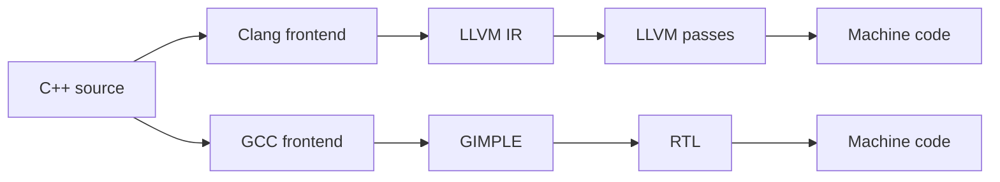

import AdBanner from '@site/src/components/AdBanner';

Clang vs GCC vs LLVM is one of the most searched compiler comparisons, but the wording itself hides an important detail: **Clang and GCC are compilers, while LLVM is the compiler infrastructure behind Clang**. If you are choosing a toolchain for C or C++, the practical decision is usually `clang++` vs `g++`. If you are building tooling, a language frontend, or an optimizer pipeline, then LLVM itself becomes part of the decision.

This page combines the broad comparison intent behind `gcc vs llvm`, `llvm vs gcc`, and `clang vs gcc` into one canonical guide. The goal is not to declare a universal winner. The goal is to help you choose the right compiler stack based on runtime performance, diagnostics, tooling, portability, and engineering workflow.

<AdBanner />

## Clang vs GCC vs LLVM: Quick Answer

If you compile C or C++ programs, compare **Clang vs GCC**.

- Choose **Clang** when you want better diagnostics, strong tooling, clean AST access, sanitizers, and easier integration with LLVM-based workflows.
- Choose **GCC** when you want a mature GNU toolchain, excellent long-tail target support, or strong results on established Linux and embedded ecosystems.
- Choose **LLVM** as infrastructure when you need reusable IR, optimization libraries, JIT support, or you are building a compiler-related product instead of only compiling an application.

## What Is the Difference Between Clang, GCC, and LLVM?

### Clang vs GCC as compilers

Clang is the C/C++/Objective-C frontend in the LLVM ecosystem. GCC is a full compiler suite with its own frontends, middle-end, and backend pipeline. Both take source code and generate machine code, but they differ in architecture, diagnostics, internal IR design, and ecosystem tooling.

### LLVM as infrastructure

LLVM is not a drop-in replacement for GCC. It is a modular compiler framework with:

- **LLVM IR** for optimization and analysis
- reusable code generation backends
- libraries for passes, JITs, static analysis, and tooling
- the Clang frontend layered on top

That distinction matters for SEO and for engineering decisions. A search for `llvm vs gcc` often really means `clang vs gcc for my C++ code`.

## Clang vs GCC vs LLVM Comparison Table

| Dimension | Clang | GCC | LLVM |
| --- | --- | --- | --- |
| What it is | C/C++ frontend and toolchain | Compiler suite | Compiler infrastructure |
| Main IR | LLVM IR | GIMPLE + RTL | LLVM IR |
| Diagnostics | Excellent | Good but often denser | Depends on frontend |
| Tooling | `clang-tidy`, `clang-format`, AST tooling, sanitizers | Mature GNU workflow, `gdb`, strong traditional stack | Libraries for optimizers, JIT, analysis |
| JIT use | Indirect via LLVM | Not native | Native ecosystem support |
| Best fit | Developer tooling, modern compiler workflows | GNU ecosystems, embedded, Fortran, mature targets | Building compilers and compiler-adjacent systems |

## Clang vs GCC Performance on Real Code

`clang vs gcc` performance depends on workload shape, target architecture, optimization flags, and whether the hot path is bound by branches, memory, or vectorization. There is no universal winner.

A practical way to reason about performance is:

1. Compare the same source with `-O2` or `-O3`.
2. Measure runtime, compile time, and binary size separately.
3. Inspect assembly or IR when performance diverges.

On CompilerSutra's own benchmark articles, GCC and Clang trade wins rather than dominating every case. That is what experienced systems engineers should expect.

## Real-World Example: Why the Winner Changes

Imagine two workloads:

- a branch-heavy parser or interpreter loop
- a stencil or memory-structured numeric kernel

Clang may win the first because its codegen shapes branches differently or inlines helper logic more aggressively. GCC may win the second if its loop transformation and scheduling choices fit the machine better.

That is why one-number benchmark claims are weak. The real question is: **which compiler wins on code that looks like your code?**

## From Source Code to IR and Machine Code



The diagram shows the core architectural split:

- Clang lowers into **LLVM IR**
- GCC lowers into **GIMPLE**, then **RTL**

This affects tooling, pass pipelines, and how easy it is to inspect or reuse the internals.

## Code Example: Inspecting Clang vs GCC

Use one tiny loop and inspect both compilers before making a claim.

```cpp
#include <cstddef>

float sum_positive(const float* data, std::size_t n) {
  float total = 0.0f;
  for (std::size_t i = 0; i < n; ++i) {
    if (data[i] > 0.0f) {
      total += data[i];
    }
  }
  return total;
}
```

Commands to inspect the result:

```bash
clang++ -O3 -S -emit-llvm sum.cpp -o sum.ll
clang++ -O3 -S sum.cpp -o sum-clang.s
g++ -O3 -S sum.cpp -o sum-gcc.s
```

With this workflow you can compare:

- LLVM IR emitted by Clang
- final assembly emitted by Clang
- final assembly emitted by GCC

That is a much better engineering practice than arguing from brand names.

## When to Choose Clang

Choose Clang when you care about:

- readable diagnostics and warning messages
- AST-driven tooling or static analysis
- sanitizers and developer productivity
- reuse of LLVM tooling, passes, or codegen infrastructure

## When to Choose GCC

Choose GCC when you care about:

- mature GNU-centric deployment environments
- strong support for legacy or long-tail workflows
- Fortran-heavy stacks and existing GCC-based build systems
- a target where your own measurements show GCC emits better code

## When LLVM Matters More Than Clang vs GCC

LLVM matters most when the product is not just a compiled binary, but a compiler-adjacent system:

- language implementation
- JIT or ahead-of-time pipeline
- static analyzer
- custom optimizer or pass framework
- research compiler or accelerator backend

In those cases, `llvm vs gcc` is not only about emitted code. It is about which ecosystem is easier to build on top of.

## Use-Case Breakdown

| Use case | Better first choice |
| --- | --- |
| General C++ application development | Benchmark both, start with Clang or GCC based on team workflow |
| Compiler tooling and AST analysis | Clang + LLVM |
| Fortran-heavy scientific stack | GCC |
| Building a new language frontend | LLVM |
| Traditional GNU/Linux embedded workflow | GCC |
| Sanitizer-heavy debugging workflow | Clang |

## Related Reading on CompilerSutra

- [GCC vs Clang benchmark report](/docs/articles/gcc_vs_clang_real_benchmarks_2026_reporter)
- [GCC vs Clang assembly analysis](/docs/articles/gcc_vs_clang_assembly_part2a)
- [Inside a compiler: source code to assembly](/docs/compilers/intro)
- [Intermediate representation in compilers](/docs/compilers/ir_in_compiler)
- [LLVM roadmap](/docs/llvm/intro-to-llvm)
- [Role of parser in compiler design](/docs/compilers/front_end/role_of_parser)

## FAQ

- **What is the difference between Clang and LLVM?**
  Clang is the frontend compiler. LLVM is the underlying compiler infrastructure, optimizer framework, and backend ecosystem.
- **What is the difference between GCC and LLVM?**
  GCC is a compiler suite. LLVM is infrastructure. In practice, most C/C++ comparisons are GCC vs Clang.
- **Why does Clang sometimes beat GCC and sometimes lose?**
  Different workloads stress different optimizer and codegen decisions. Branch shape, vectorization, aliasing, and memory behavior all matter.
- **Can GCC compile LLVM IR directly?**
  No. GCC has its own internal representations and does not use LLVM IR as its normal input pipeline.

<script
  type="application/ld+json"
  dangerouslySetInnerHTML={{
    __html: JSON.stringify({
      '@context': 'https://schema.org',
      '@type': 'FAQPage',
      mainEntity: [
        {
          '@type': 'Question',
          name: 'What is the difference between Clang and LLVM?',
          acceptedAnswer: {
            '@type': 'Answer',
            text: 'Clang is a frontend compiler for C, C++, and Objective-C, while LLVM is the reusable compiler infrastructure, optimizer, and backend ecosystem underneath it.',
          },
        },
        {
          '@type': 'Question',
          name: 'What is the difference between GCC and LLVM?',
          acceptedAnswer: {
            '@type': 'Answer',
            text: 'GCC is a compiler suite. LLVM is compiler infrastructure. For most C and C++ users, the practical comparison is GCC versus Clang rather than GCC versus LLVM in the abstract.',
          },
        },
        {
          '@type': 'Question',
          name: 'Why do Clang and GCC trade benchmark wins?',
          acceptedAnswer: {
            '@type': 'Answer',
            text: 'They make different optimization and code generation choices. The winner depends on workload shape, architecture, flags, vectorization opportunities, and branch and memory behavior.',
          },
        },
        {
          '@type': 'Question',
          name: 'Can GCC compile LLVM IR?',
          acceptedAnswer: {
            '@type': 'Answer',
            text: 'No. GCC uses its own internal representations, mainly GIMPLE and RTL, rather than LLVM IR as its normal compilation input.',
          },
        },
      ],
    }),
  }}
/>
