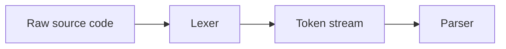
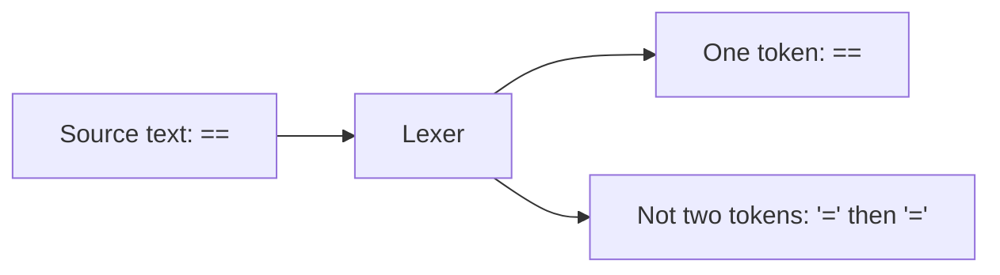
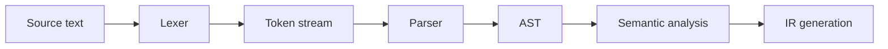

import Tabs from '@theme/Tabs';
import TabItem from '@theme/TabItem';

# Role of the Lexer in Compiler Design

The lexer is the first stage of the compiler frontend.
It reads raw source text and turns it into a stream of tokens that the parser can understand.

There is no single inventor of lexical analysis as a concept.
What we call a lexer became part of compiler design because compilers needed a clean way to separate raw text from syntax [Dragon Book][2].
The practical scanner tradition is strongly associated with [Lex][1], [Yacc](https://en.wikipedia.org/wiki/Yacc), [flex](https://westes.github.io/flex/manual/), [re2c][3], and later with handwritten frontends like [Clang][4].
If you want the automata side of lexing, read [DFA and NFA in Modern Compiler Design](/docs/llvm/llvm_Curriculum/level0/DFA_and_NFA_in_Modern_Compiler_Design).

If the source file is the input story, the lexer is the first pass that separates keywords, identifiers, literals, operators, and punctuation into meaningful pieces.

## Creator Snapshot

| Tool | Creator or Origin |
| --- | --- |
| Lexer concept | No single inventor; it emerged with compiler design |
| Lex | M. E. Lesk and E. Schmidt [1] |
| Yacc | Stephen C. Johnson |
| flex | Vern Paxson |
| re2c | Peter Bumbulis, later maintained by the re2c community [3] |
| Clang lexer | The LLVM/Clang project [4] |

:::tip Role Summary
The role of the lexer is to convert raw source code into a token stream that the parser can consume. It handles token boundaries, skips whitespace and comments, applies the longest-match rule, and preserves source locations for diagnostics. A good lexer makes the rest of the frontend simpler because the parser no longer has to reason about individual characters.


:::

## Try the MCQ Quiz

If you want to test your understanding right away, try the lexer quiz:

* [Lexer MCQs Quiz](/docs/mcq/questions/domain/compilers/compiler/lexer)

:::tip New Section Home
If you want the broader compiler frontend map first, go to [Compiler Frontend](/docs/compilers/IntroductionToCompilers/).
:::

## Table of Contents

* [What the Lexer Does](#what-the-lexer-does)
* [What the Lexer Does Not Do](#what-the-lexer-does-not-do)
* [A Short History of Lexers](#a-short-history-of-lexers)
* [Lexer Theory](#lexer-theory)
* [Token Stream Example](#token-stream-example)
* [Lexing Diagram](#lexing-diagram)
* [Lexer Responsibilities vs Parser Responsibilities](#lexer-responsibilities-vs-parser-responsibilities)
* [Lexical Rules](#lexical-rules)
* [Error Handling](#error-handling)
* [FAQ](#faq)
* [References](#references)
* [Next Step](#next-step)

## What the Lexer Does

The lexer is responsible for turning source text into a stream of tokens.
Here, a token means a meaningful unit such as a keyword, identifier, literal, operator, or delimiter.
In practice, that means it should:

* read characters from the input buffer
* group characters into lexemes
* classify lexemes as tokens
* skip whitespace and comments
* recognize keywords, identifiers, literals, operators, and delimiters
* track source locations for diagnostics
* report invalid character sequences early

If the lexer works correctly, the parser gets a clean token stream instead of raw text.

## Longest Match Rule

One of the most important lexer rules is **longest match**, also called **maximal munch**.

If two token patterns could both apply at the same position, the lexer should choose the longest valid token.

For example:

```text
==
```

should become:

```text
==
```

not:

```text
=
=
```



The diagram shows the point of maximal munch: the lexer should prefer the longest valid token, not the first shorter split it can recognize.

This rule is what keeps scanners deterministic and predictable [Dragon Book][2].

## What the Lexer Does Not Do

The lexer should not try to do the parser’s job.
It does **not**:

* build expressions, statements, or AST nodes
* decide whether token order matches grammar rules
* resolve operator precedence
* perform type checking
* perform semantic analysis
* decide whether a program is valid beyond tokenization

That separation keeps the frontend simpler and makes compiler bugs easier to locate.

## A Short History of Lexers

<Tabs groupId="lexer-history" className="rounded-tabs">

<TabItem value="early" label="Early Compiler Era" default>

Early compilers often used handwritten scanners that were tightly coupled to the rest of the frontend.
This was simple, but every language implementation had to solve tokenization on its own.

The important idea from this era was:

* read characters from left to right
* group them into meaningful units
* hand those units to the parser

That split is still the foundation of every lexer today.

</TabItem>

<TabItem value="lex" label="Lex">

The classic practical lexer tool is [Lex][1], the lexical analyzer generator by **M. E. Lesk and E. Schmidt**.
Lex turned scanner rules into generated code and made tokenization declarative instead of purely ad hoc.

That mattered because it showed that lexing could be written as rules, not just as loops.
It also made lexer generation a normal part of compiler construction on Unix systems.

</TabItem>

<TabItem value="yacc" label="Lex + Yacc">

Lex alone solves only half the frontend.
In the Unix toolchain, the scanner story became more useful when paired with **Yacc**, the parser-generator counterpart created by Stephen C. Johnson.

That pairing taught an important compiler lesson:

* the lexer tokenizes
* the parser recognizes grammar
* the two stages are separate, but designed to work together

You do not need to use Yacc to understand this history.
You just need to know that lexer generators became part of a larger frontend pipeline rather than a standalone trick.

</TabItem>

<TabItem value="flex" label="flex">

**flex**, created by Vern Paxson, became the widely used open-source successor in the Unix and Linux toolchain world.
It kept the same basic model as Lex, but focused on portability, maintainability, and faster scanner generation.

This era made generator-based scanners common in teaching compilers, Unix toolchains, parser-generator workflows, and C-based frontend projects.

</TabItem>

<TabItem value="re2c" label="re2c">

[re2c][3], originally written by Peter Bumbulis and later maintained by the re2c community, pushed lexer generation toward speed and direct-coded scanners.
Its official documentation emphasizes generating fast code by compiling regular expressions into deterministic automata and emitting code that is close to hand-written C or C++ [re2c documentation][3].

This style matters when you want:

* high-performance scanning
* fewer runtime indirections
* easier debugging than table-driven scanners
* control over the generated code shape

</TabItem>

<TabItem value="clang" label="Clang">

Modern frontends often choose handwritten lexers when they need more control.
Clang is a good example: its lexer is documented as a component that turns a text buffer into a stream of tokens [Clang Lexer Documentation][4].

That approach is attractive when the frontend needs strong diagnostics, precise source locations, preprocessor integration, Unicode-aware handling, and custom language rules.

</TabItem>

</Tabs>

## Lexer Theory

The first confusing pair in lexing is usually **lexeme** versus **token**.

| Term | Meaning | Example |
| --- | --- | --- |
| Lexeme | The exact character sequence matched from source text | `total`, `10`, `==` |
| Token | The classified meaning of that lexeme | `IDENT(total)`, `INT(10)`, `EQEQ` |
| Token kind | The category name used by the parser and frontend | identifier, integer literal, operator |

<Tabs groupId="lexer-basics" className="rounded-tabs">

<TabItem value="concept" label="Concept" default>

The lexer is a **tokenizer**.
Its job is to convert a character stream into a token stream.

That means it must:

* scan characters from left to right
* group characters into lexemes
* classify each lexeme as a token
* skip whitespace and comments
* report invalid character sequences early

The lexer does **not** build statements, expressions, or AST nodes.
It only prepares the input for the parser.

Think of it this way:

* source text is raw material
* tokens are the cleaned-up pieces
* the parser turns those pieces into structure

</TabItem>

<TabItem value="tokens" label="Token Types">

Most compilers need a small set of token categories:

* keywords reserve language meaning
* identifiers name user-defined values
* literals represent fixed values
* operators express computation or comparison
* delimiters carry structure
* special tokens handle language-specific markers such as `@entry`

The useful part is not the list itself.
It is the classification step: the lexer decides what each piece of text is so the parser does not have to guess.

</TabItem>

<TabItem value="example" label="Example Walkthrough">

```text
let total = a + 10;
```

```text
LET IDENT(total) ASSIGN IDENT(a) PLUS INT(10) SEMI
```

For a simpler input:

```text
let total = 0;
```

```text
LET IDENT(total) ASSIGN INT(0) SEMI
```

This is the lexer’s actual job.
It does not understand the statement yet.
It just returns the token stream the parser will consume.

</TabItem>

<TabItem value="build" label="How It Is Built">

A teaching lexer is often built around a small set of helper functions and a small read buffer:

```cpp
Token nextToken() {
  skipWhitespace();

  if (isAlpha(peek()) || peek() == '_') {
    return lexIdentifierOrKeyword();
  }

  if (isDigit(peek())) {
    return lexNumber();
  }

  // peekNext() matters for two-character operators like ==, !=, &&, and <=.
  // Without a small lookahead window, the lexer may split a valid operator too early.
  if (peek() == '/' && peekNext() == '/') {
    skipLineComment();
    return nextToken();
  }

  return lexOperatorOrPunctuation();
}
```

This shape is common because it keeps the scanner predictable, but real lexers usually need a small buffer or lookahead window:

* read the next character
* decide which token family it belongs to
* advance the cursor
* return one token at a time
* preserve enough lookahead for maximal munch
* keep offsets stable for diagnostics

That is why `peekNext()` matters.
It is the simplest example of why a lexer is more than a character splitter.

</TabItem>

</Tabs>

## Token Stream Example

A lexer is easier to understand when you see the raw text and the token stream side by side.

```text
source: let total = a + 10;
tokens: LET IDENT(total) ASSIGN IDENT(a) PLUS INT(10) SEMI
```

That is the lexer’s real output.
It does not decide grammar.
It does not build the AST.
It turns characters into a sequence the parser can trust.

## Lexing Diagram

The lexer is one of the first decisions that shapes the rest of the frontend.



The pipeline is simple, but it explains the division of labor:

* if token boundaries are wrong, the parser gets bad input
* if source locations are wrong, diagnostics become hard to trust
* if keywords are not handled consistently, the language becomes ambiguous

That lexer-to-parser split is a standard compiler front-end boundary [Engineering a Compiler][5].

## Lexer Responsibilities vs Parser Responsibilities

The lexer should not try to understand grammar.
That is the parser’s job.

The lexer:

* recognizes tokens
* tracks locations
* handles comments and whitespace
* reports invalid characters

The parser:

* validates token order against grammar rules
* builds AST structure
* understands statements, expressions, and precedence

This separation keeps the frontend simpler and easier to debug.

## Lexical Rules

If you are designing a lexer for your own language, these are the rules you must decide early:

* reserved keywords
* valid identifier characters
* numeric literal syntax
* string literal syntax, if any
* comment syntax
* whitespace handling
* operator tokenization
* whether multi-character operators exist

For modern compiler work, the lexer is also where you usually define:

* whether `_name` is valid
* whether keywords are reserved
* how numbers are written
* how line comments are handled
* how Unicode or byte-level input is treated

## Error Handling

A lexer should fail early when it sees something invalid.

Common lexer errors include:

* unknown characters
* unterminated strings
* invalid numeric formats
* malformed operators
* unsupported escape sequences

Good lexer diagnostics should point to the exact source location so the user can fix the problem quickly.

A practical default format is:

```text
file.vx:3:5: error: unknown character '@'
```

```text
file.vx:3:5: error: unterminated string literal
```

That format is easy to read, easy to print, and easy to extend with notes or carets later.

## FAQ

### What is the role of the lexer in a compiler?

The lexer converts raw source code into tokens. It is the first frontend stage that prepares input for the parser.

### Why is the lexer important?

A good lexer makes tokenization deterministic, preserves source locations, and keeps parser logic simpler.

### Is the lexer the same as the parser?

No. The lexer turns characters into tokens, while the parser turns tokens into syntax structure.

### What is maximal munch in lexing?

Maximal munch, also called longest match, means the lexer should choose the longest valid token at a position.

### Why does longest match matter?

Because it prevents sequences like `==` from being incorrectly split into `=` and `=`.

### Why do some compilers use Lex, flex, or re2c?

Because generator-based scanners can be easier to maintain when token rules are regular and stable.

### Why do modern compilers still hand-write lexers?

Because hand-written scanners integrate better with diagnostics, preprocessors, Unicode handling, and custom language rules.

### Why do people search for Lex, flex, re2c, and Clang lexer?

Because they are strongly associated with scanner generation, handwritten lexers, and practical compiler frontend design.

---

## Lexer Design Across Eras

The most useful way to think about lexers is by era:

* **Early compiler era:** handwritten scanners and tight coupling to the frontend
* **Lex era:** declarative scanner generation became practical [Lex][1]
* **flex era:** open-source scanner generation became standard in Unix-like toolchains
* **re2c era:** direct-coded scanners pushed performance and control [re2c][3]
* **Modern era:** handwritten, Unicode-aware, IDE-friendly lexers are common in real compilers [Clang][4]

That progression explains why lexers are still relevant:

* generators help when the language is regular and the rules are stable
* handwritten lexers help when diagnostics, preprocessing, or Unicode matter more
* current research keeps improving speed, recovery, and incremental behavior

## References

[1] M. E. Lesk and E. Schmidt. *Lex - A Lexical Analyzer Generator*. Bell Laboratories, 1975. https://www.cs.utexas.edu/~novak/lexpaper.htm

[2] Alfred V. Aho, Monica S. Lam, Ravi Sethi, and Jeffrey D. Ullman. *Compilers: Principles, Techniques, and Tools*. Addison-Wesley, 2007. https://books.google.com/books/about/Compilers.html?id=WomBPgAACAAJ

[3] re2c authors and contributors. *re2c Documentation*. re2c.org, 2026. https://re2c.org/

[4] LLVM Project. *Clang Lexer Documentation*. LLVM Doxygen, 2026. https://clang.llvm.org/doxygen/Lexer_8h.html

[5] Keith D. Cooper and Linda Torczon. *Engineering a Compiler*. Morgan Kaufmann, 2011. https://shop.elsevier.com/books/engineering-a-compiler/cooper/978-0-12-088478-0


## Next Step

Read the parser article next:

* [Role of the Parser in Compiler Design](/docs/compilers/front_end/role_of_parser)
* [Compiler Frontend](/docs/compilers/front_end/)

[1]: https://www.cs.utexas.edu/~novak/lexpaper.htm
[2]: https://faculty.sist.shanghaitech.edu.cn/faculty/songfu/cav/Dragon-book.pdf
[3]: https://re2c.org/
[4]: https://clang.llvm.org/doxygen/Lexer_8h.html
[5]: http://www.r-5.org/files/books/computers/compilers/writing/Keith_Cooper_Linda_Torczon-Engineering_a_Compiler-EN.pdf
