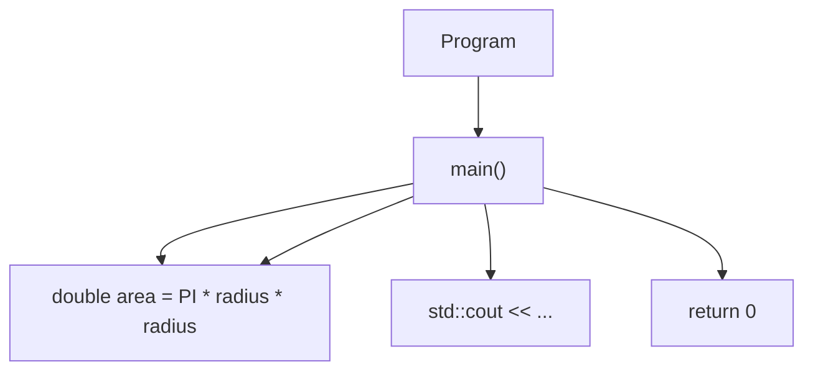
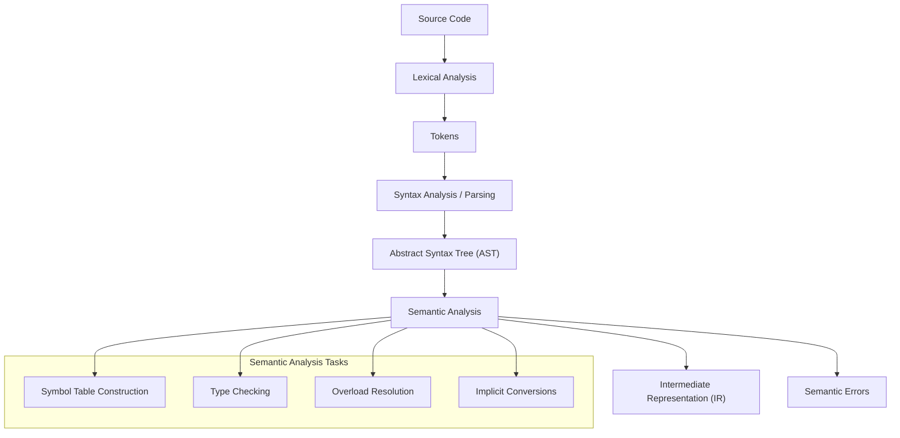
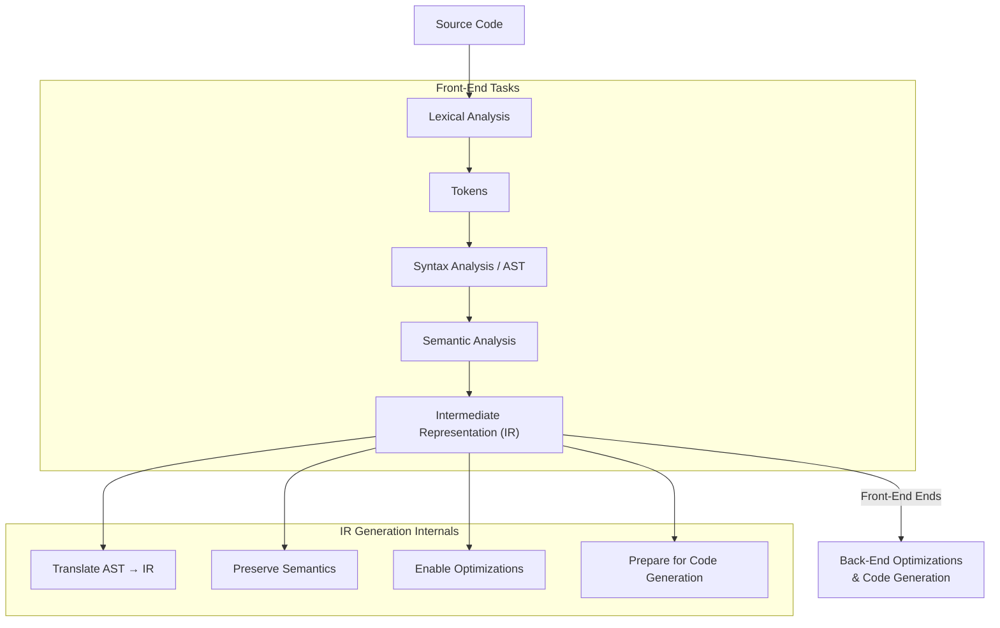
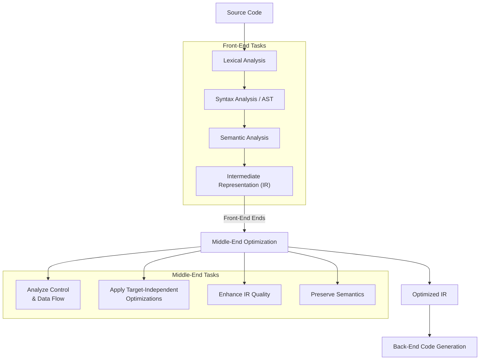
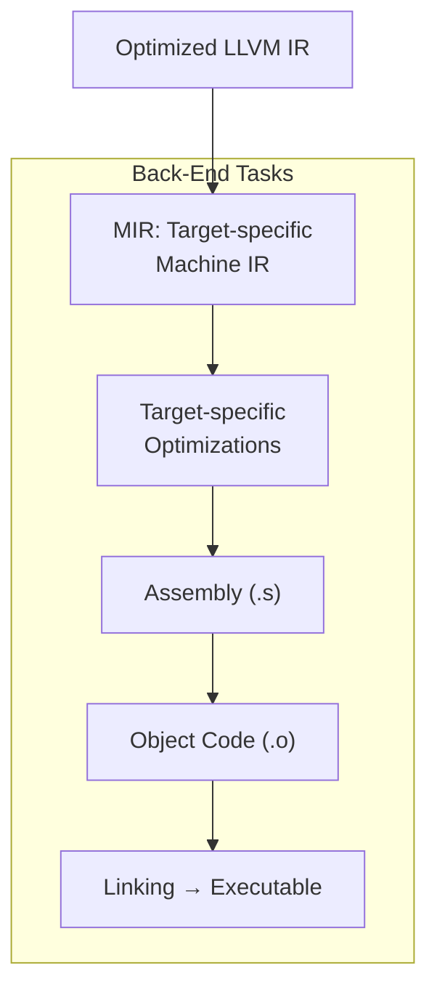
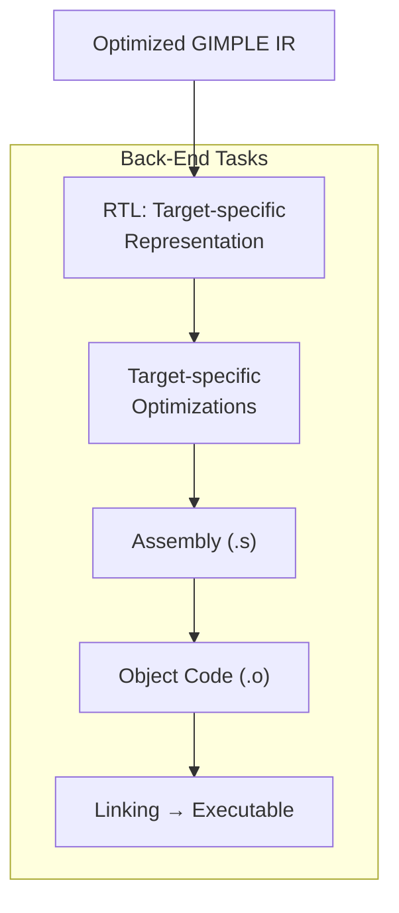
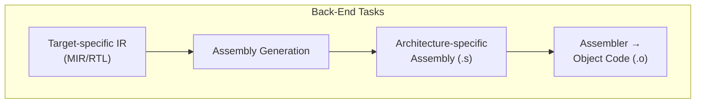
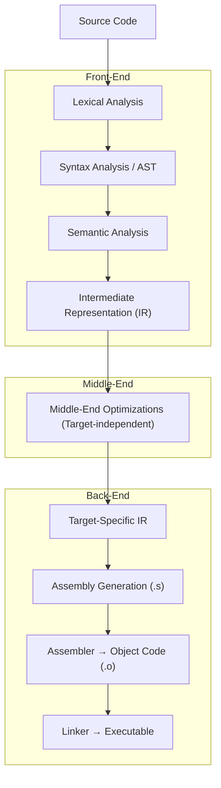

import AdBanner from '@site/src/components/AdBanner';
import Tabs from '@theme/Tabs';
import TabItem from '@theme/TabItem';
import { ComicQA } from '../mcq/interview_question/Question_comics' ;


📩 Interested in deep dives like pipelines, cache, and compiler optimizations?

<div
  style={{
    width: '100%',
    maxWidth: '900px',
    margin: '1rem auto',
  }}
>
  <iframe
    src="https://docs.google.com/forms/d/e/1FAIpQLSebP1JfLFDp0ckTxOhODKPNVeI1e21rUqMJ0fbBwJoaa-i4Yw/viewform?embedded=true"
    style={{
      width: '100%',
      minHeight: '620px',
      border: '0',
      borderRadius: '12px',
      background: '#fff',
    }}
    loading="lazy"
  >
    Loading…
  </iframe>
</div>

<div>
  <AdBanner />
</div>


# Inside a Compiler  

***Source Code to Assembly Using Clang & GCC***
<br/>
In our [previous article](https://www.compilersutra.com/docs/compilers/sourcecode_to_executable/), we established the high-level flow of compilation: 
<br />
source code is first processed by the **preprocessor**, and the resulting expanded source is then passed to the **compiler**, which ultimately produces assembly code. That explanation provided a conceptual overview of the journey from `.cpp` (or `.c`) to `.s`.

This article takes the next step.

:::tip Our goal
 here is not just to describe the pipeline, but to examine it stage by stage observing what actually happens inside the compiler when we invoke tools such as **Clang** (LLVM-based) and **GCC**. We will inspect each transformation layer, understand its internal responsibility, and use real compiler flags to expose intermediate outputs.
  :::


The main objective of this guide is:

* To break down the complete compiler pipeline from source code to assembly.
* To clearly separate frontend, middle-end, and backend responsibilities.
* To demonstrate how Clang lowers code into LLVM IR and how GCC transitions through GIMPLE and RTL.
* To show practical command-line flags that allow you to observe each stage.
* To stop precisely at assembly generation (`-S`) without proceeding into object files or linking.

By the end of this article, you should not only understand *what* happens when you press “compile,” but also *how to verify and inspect each phase yourself* using real tooling.

Let's Begin


<div>
  <AdBanner />
</div>


## Introduction

**From Source Code to Assembly (With Clang & GCC Flags)**

What *really* happens when you compile a C/C++ program? <div/>
How does a simple `printf("Hello")` turn into CPU instructions? <div/>
From our previous article we came to know that compiler take input as preprocessed file and give output as 
a assembly. <br/>

:::important Do you ever thought? <br/>
Where does your high-level logic disappear and how does the compiler rebuild it into assembly?
:::

  
This document takes you inside the compiler pipeline step by step using both **Clang (LLVM-based)** and **GCC**. 

Instead of treating compilation as a magical black box,  <div/>
we pause at every major transformation stage: <div/>
preprocessing, 
tokenization, parsing, semantic checks, IR generation, optimization, <div/>
 and finally code generation.
<div/>
We don’t just explain concepts we inspect them using real compiler flags and observe the actual 
outputs produced at each stage.

:::note
This blog will stop deliberately at assembly generation (`-S`).
No object files. No linking. Just the raw transformation from source code to assembly <div/>
where abstraction meets hardware.
:::

By the end, you won’t just “use” a compiler.
You’ll understand what it is doing for you.


## Table of Contents

- [Lexical Analysis](#lexical-analysis)
- [Syntax Analysis (Parsing & AST)](#2-syntax-analysis-parsing--ast)
- [Semantic Analysis](#semantic-analysis)
- [Intermediate Representation (LLVM IR / GIMPLE / RTL)](#4-intermediate-representation-ir-generation)
- [Optimization Phase](#optimization-phase-middle-end)
- [Code Generation](#clang--llvm-flow-llvm-ir--mir--machine-code)
- [Clang vs GCC Internal Pipeline Comparison](#summary-clang-vs-gcc-back-end)
- [9. FAQ](#faq)


<Tabs>
  <TabItem value="social" label="📣 Social Media">

            - [🐦 Twitter - CompilerSutra](https://twitter.com/CompilerSutra)
            - [💼 LinkedIn - Abhinav](https://www.linkedin.com/in/abhinavcompilerllvm/)
            - [📺 YouTube - CompilerSutra](https://www.youtube.com/@compilersutra)
            - [💬 Join the CompilerSutra Discord for discussions](https://discord.gg/DXJFhvzz3K)
</TabItem>
</Tabs>

## Overview: Frontend vs Middle-End vs Backend

| Stage      | Responsibility                  | Clang / LLVM   | GCC                  |
| ---------- | ------------------------------- | -------------- | -------------------- |
| Frontend   | Parse & validate language rules | Clang          | GCC Frontend         |
| Middle-End | IR-based optimizations          | LLVM IR Passes | GIMPLE Optimizer     |
| Backend    | Target-specific code generation | LLVM CodeGen   | RTL + Final Emission |


The **Frontend–Middle-End–Backend** model is a classical architectural division used in modern compiler design to separate concerns and improve modularity, portability, and scalability. <div/>

The **frontend** is language-specific and is responsible for parsing source code, performing syntax and semantic analysis, type checking, and translating the program into an intermediate representation (IR). <div/>

In the **Clang/LLVM** ecosystem, Clang produces LLVM IR, while in **GCC**, the frontend lowers code into [GIMPLE](https://gcc.gnu.org/wiki/GIMPLE).<div/>

The **middle-end** is largely language-independent and focuses on optimization at the IR level, applying transformations such as constant propagation, dead code elimination, inlining, and loop optimizations. LLVM performs these through IR passes, whereas GCC applies similar optimizations on GIMPLE. <div/>


The **backend** is target-specific and converts the optimized IR into machine-dependent instructions; LLVM uses its Code Generation (CodeGen) infrastructure, while GCC lowers its representation further into [RTL (Register Transfer Language)](https://gcc.gnu.org/onlinedocs/gcc-4.3.1/gccint/RTL-passes.html) before emitting final assembly. This structured separation enables compilers to support multiple programming languages and hardware architectures while maintaining a clean and reusable optimization pipeline.<div/>


Let's dive into it 

<div>
  <AdBanner />
</div>

>

## Lexical Analysis

Once [preprocessing](https://www.compilersutra.com/docs/compilers/sourcecode_to_executable/#stage-1-preprocessing) generates the `.i` file, the real compiler work begins.

The first internal stage is **Lexical Analysis**. Imagine your program is just a long sentence written without explanation
the compiler must first learn how to *read* it. At this point, the input is simply a stream of characters like:

```python
int main() { return 0; }
```

The lexer scans this character stream from left to right and groups characters into meaningful chunks. These chunks are called **lexemes**.

A **lexeme** is the exact sequence of characters taken directly from the source code.
A **token** is the category assigned to that lexeme.

For example:

* `int` → lexeme → classified as **Keyword**
* `main` → lexeme → classified as **Identifier**
* `(` → lexeme → classified as **Left Parenthesis**
* `0` → lexeme → classified as **Integer Literal**
* `;` → lexeme → classified as **Semicolon**

So think of it like this:

> Lexeme = the actual word
> Token = the label given to that word

:::caution As simple As That:
If your program is a sentence in English, lexemes are the words, and tokens are their grammatical roles (noun, verb, adjective).
:::
At this stage, the compiler does **not** check whether the program makes sense or whether it follows grammar rules. It does not understand structure yet. It only identifies patterns and assigns token types based on predefined rules.

By the end of lexical analysis, your raw text is transformed into a structured **stream of tokens** a clean sequence of labeled building blocks that the next stage (parsing) can work with.

This is the moment when your program stops being just text and starts becoming something the compiler can systematically understand.

:::tip
Curious to see what the output of lexical analysis actually looks like? Let’s find out.
:::

###### 🔍 Viewing Lexical Tokens

Here’s a sample source code to try out token dumping:

```cpp 
#define PI 3.14

int main() {
    int radius = 5;
    double area = PI * radius * radius;
    std::cout << "Area of circle: " << area << std::endl;
    return 0;
}
```

<Tabs>
  <TabItem value="clang" label="Clang">

###### Dump Tokens Using Clang

Clang provides a direct way to view tokens generated during lexical analysis.

```python
clang -Xclang -dump-tokens -fsyntax-only main.cpp
```

###### What This Does

* `-Xclang -dump-tokens` → Instructs Clang to print tokens
* `-fsyntax-only` → Stops compilation after syntax checking (no code generation)

**output**
```python
int 'int'	 [StartOfLine]	Loc=<sample.cpp:3:1>
identifier 'main'	 [LeadingSpace]	Loc=<sample.cpp:3:5>
l_paren '('		Loc=<sample.cpp:3:9>
r_paren ')'		Loc=<sample.cpp:3:10>
l_brace '{'	 [LeadingSpace]	Loc=<sample.cpp:3:12>
int 'int'	 [StartOfLine] [LeadingSpace]	Loc=<sample.cpp:4:5>
identifier 'radius'	 [LeadingSpace]	Loc=<sample.cpp:4:9>
equal '='	 [LeadingSpace]	Loc=<sample.cpp:4:16>
numeric_constant '5'	 [LeadingSpace]	Loc=<sample.cpp:4:18>
semi ';'		Loc=<sample.cpp:4:19>
double 'double'	 [StartOfLine] [LeadingSpace]	Loc=<sample.cpp:5:5>
identifier 'area'	 [LeadingSpace]	Loc=<sample.cpp:5:12>
equal '='	 [LeadingSpace]	Loc=<sample.cpp:5:17>
numeric_constant '3.14'	 [LeadingSpace]	Loc=<sample.cpp:5:19 <Spelling=sample.cpp:1:12>>
star '*'	 [LeadingSpace]	Loc=<sample.cpp:5:22>
identifier 'radius'	 [LeadingSpace]	Loc=<sample.cpp:5:24>
star '*'	 [LeadingSpace]	Loc=<sample.cpp:5:31>
identifier 'radius'	 [LeadingSpace]	Loc=<sample.cpp:5:33>
semi ';'		Loc=<sample.cpp:5:39>
identifier 'std'	 [StartOfLine] [LeadingSpace]	Loc=<sample.cpp:6:5>
coloncolon '::'		Loc=<sample.cpp:6:8>
identifier 'cout'		Loc=<sample.cpp:6:10>
lessless '<<'	 [LeadingSpace]	Loc=<sample.cpp:6:15>
string_literal '"Area of circle: "'	 [LeadingSpace]	Loc=<sample.cpp:6:18>
lessless '<<'	 [LeadingSpace]	Loc=<sample.cpp:6:37>
identifier 'area'	 [LeadingSpace]	Loc=<sample.cpp:6:40>
lessless '<<'	 [LeadingSpace]	Loc=<sample.cpp:6:45>
identifier 'std'	 [LeadingSpace]	Loc=<sample.cpp:6:48>
coloncolon '::'		Loc=<sample.cpp:6:51>
identifier 'endl'		Loc=<sample.cpp:6:53>
semi ';'		Loc=<sample.cpp:6:57>
return 'return'	 [StartOfLine] [LeadingSpace]	Loc=<sample.cpp:7:5>
numeric_constant '0'	 [LeadingSpace]	Loc=<sample.cpp:7:12>
semi ';'		Loc=<sample.cpp:7:13>
r_brace '}'	 [StartOfLine]	Loc=<sample.cpp:8:1>
eof ''		Loc=<sample.cpp:8:2>
```

You can clearly see:

* The **lexeme** (actual code snippet)
* Its **token type**

</TabItem>

<TabItem value="gcc" label="GCC">

### Viewing Tokens in GCC

Unlike Clang, GCC does not provide a direct token dump like `-dump-tokens`.
Your best options are using the preprocessor output, modifying the source, or using tools 
designed for learning compiler construction. 

> ⚠️ GCC performs lexical analysis internally, but it doesn’t expose a simple token dump like Clang.
> To see exact tokens, you’d need GCC debugging builds or plugins.

</TabItem>

</Tabs>


<div>
  <AdBanner />
</div>

## 2. Syntax Analysis (Parsing & AST)

Once lexical analysis produces a **stream of tokens**, the compiler moves to **Syntax Analysis**, also called **Parsing**.

At this stage, the compiler tries to **understand the structure of your program**. Tokens are grouped according to the grammar rules of the language to form a **parse tree**. The parse tree represents the **hierarchical structure** of the program — what statements belong inside which blocks, which expressions are part of which operations, etc.

From the parse tree, the compiler usually builds an **Abstract Syntax Tree (AST)** — a simplified, more abstract representation that discards unnecessary syntactic details (like extra parentheses) but keeps the essential program structure.

Think of it like this:

* **Lexical Analysis** = reading the words of a sentence
* **Syntax Analysis** = understanding the sentence’s grammar and how words relate to each other


### Sample Code

```cpp
#define PI 3.14

int main() {
    int radius = 5;
    double area = PI * radius * radius;
    std::cout << "Area of circle: " << area << std::endl;
    return 0;
}
```


<Tabs>
  <TabItem value="clang" label="Clang">

### Parsing and AST Using Clang

Clang allows you to inspect the **AST** directly with the following command:

```python
clang -Xclang -ast-dump -fsyntax-only main.cpp
```

### What This Does

* `-Xclang -ast-dump` → Dumps the AST of your program
* `-fsyntax-only` → Stops compilation after parsing (no code generation)

### Example Output (Simplified)

```python
TranslationUnitDecl 0x70b0e6008 <<invalid sloc>> <invalid sloc>
|-TypedefDecl 0x70b1720e0 <<invalid sloc>> <invalid sloc> implicit __int128_t '__int128'
| `-BuiltinType 0x70b0e65d0 '__int128'
|-TypedefDecl 0x70b172150 <<invalid sloc>> <invalid sloc> implicit __uint128_t 'unsigned __int128'
| `-BuiltinType 0x70b0e65f0 'unsigned __int128'
|-TypedefDecl 0x70b1724e0 <<invalid sloc>> <invalid sloc> implicit __NSConstantString '__NSConstantString_tag'
| `-RecordType 0x70b172240 '__NSConstantString_tag'
|   `-CXXRecord 0x70b1721a8 '__NSConstantString_tag'
|-TypedefDecl 0x70b172588 <<invalid sloc>> <invalid sloc> implicit __Int8x8_t '__attribute__((neon_vector_type(8))) signed char'
| `-VectorType 0x70b172540 '__attribute__((neon_vector_type(8))) signed char' neon 8
|   `-BuiltinType 0x70b0e60d0 'signed char'
|-TypedefDecl 0x70b172628 <<invalid sloc>> <invalid sloc> implicit __Int16x4_t '__attribute__((neon_vector_type(4))) short'
| `-VectorType 0x70b1725e0 '__attribute__((neon_vector_type(4))) short' neon 4
|   `-BuiltinType 0x70b0e60f0 'short'
|-TypedefDecl 0x70b1726c8 <<invalid sloc>> <invalid sloc> implicit __Int32x2_t '__attribute__((neon_vector_type(2))) int'
| `-VectorType 0x70b172680 '__attribute__((neon_vector_type(2))) int' neon 2
|   `-BuiltinType 0x70b0e6110 'int'
|-TypedefDecl 0x70b172768 <<invalid sloc>> <invalid sloc> implicit __Uint8x8_t '__attribute__((neon_vector_type(8))) unsigned char'
| `-VectorType 0x70b172720 '__attribute__((neon_vector_type(8))) unsigned char' neon 8
|   `-BuiltinType 0x70b0e6170 'unsigned char'
|-TypedefDecl 0x70b172808 <<invalid sloc>> <invalid sloc> implicit __Uint16x4_t '__attribute__((neon_vector_type(4))) unsigned short'
| `-VectorType 0x70b1727c0 '__attribute__((neon_vector_type(4))) unsigned short' neon 4
|   `-BuiltinType 0x70b0e6190 'unsigned short'
|-TypedefDecl 0x70b1728a8 <<invalid sloc>> <invalid sloc> implicit __Uint32x2_t '__attribute__((neon_vector_type(2))) unsigned int'
| `-VectorType 0x70b172860 '__attribute__((neon_vector_type(2))) unsigned int' neon 2
|   `-BuiltinType 0x70b0e61b0 'unsigned int'
|-TypedefDecl 0x70b172948 <<invalid sloc>> <invalid sloc> implicit __Float16x4_t '__attribute__((neon_vector_type(4))) __fp16'
| `-VectorType 0x70b172900 '__attribute__((neon_vector_type(4))) __fp16' neon 4
|   `-BuiltinType 0x70b0e6f60 '__fp16'
|-TypedefDecl 0x70b1729e8 <<invalid sloc>> <invalid sloc> implicit __Float32x2_t '__attribute__((neon_vector_type(2))) float'
| `-VectorType 0x70b1729a0 '__attribute__((neon_vector_type(2))) float' neon 2
|   `-BuiltinType 0x70b0e6210 'float'
|-TypedefDecl 0x70b172a88 <<invalid sloc>> <invalid sloc> implicit __Poly8x8_t '__attribute__((neon_polyvector_type(8))) unsigned char'
| `-VectorType 0x70b172a40 '__attribute__((neon_polyvector_type(8))) unsigned char' neon poly 8
|   `-BuiltinType 0x70b0e6170 'unsigned char'
|-TypedefDecl 0x70b172b28 <<invalid sloc>> <invalid sloc> implicit __Poly16x4_t '__attribute__((neon_polyvector_type(4))) unsigned short'
| `-VectorType 0x70b172ae0 '__attribute__((neon_polyvector_type(4))) unsigned short' neon poly 4
|   `-BuiltinType 0x70b0e6190 'unsigned short'
|-TypedefDecl 0x70b172bc8 <<invalid sloc>> <invalid sloc> implicit __Bfloat16x4_t '__attribute__((neon_vector_type(4))) __bf16'
| `-VectorType 0x70b172b80 '__attribute__((neon_vector_type(4))) __bf16' neon 4
|   `-BuiltinType 0x70b0e6f80 '__bf16'
|-TypedefDecl 0x70b172c68 <<invalid sloc>> <invalid sloc> implicit __Int8x16_t '__attribute__((neon_vector_type(16))) signed char'
| `-VectorType 0x70b172c20 '__attribute__((neon_vector_type(16))) signed char' neon 16
|   `-BuiltinType 0x70b0e60d0 'signed char'
|-TypedefDecl 0x70b172d08 <<invalid sloc>> <invalid sloc> implicit __Int16x8_t '__attribute__((neon_vector_type(8))) short'
| `-VectorType 0x70b172cc0 '__attribute__((neon_vector_type(8))) short' neon 8
|   `-BuiltinType 0x70b0e60f0 'short'
|-TypedefDecl 0x70b172da8 <<invalid sloc>> <invalid sloc> implicit __Int32x4_t '__attribute__((neon_vector_type(4))) int'
| `-VectorType 0x70b172d60 '__attribute__((neon_vector_type(4))) int' neon 4
|   `-BuiltinType 0x70b0e6110 'int'
|-TypedefDecl 0x70b172e48 <<invalid sloc>> <invalid sloc> implicit __Int64x2_t '__attribute__((neon_vector_type(2))) long'
| `-VectorType 0x70b172e00 '__attribute__((neon_vector_type(2))) long' neon 2
|   `-BuiltinType 0x70b0e6130 'long'
|-TypedefDecl 0x70b172ee8 <<invalid sloc>> <invalid sloc> implicit __Uint8x16_t '__attribute__((neon_vector_type(16))) unsigned char'
| `-VectorType 0x70b172ea0 '__attribute__((neon_vector_type(16))) unsigned char' neon 16
|   `-BuiltinType 0x70b0e6170 'unsigned char'
|-TypedefDecl 0x70b172f88 <<invalid sloc>> <invalid sloc> implicit __Uint16x8_t '__attribute__((neon_vector_type(8))) unsigned short'
| `-VectorType 0x70b172f40 '__attribute__((neon_vector_type(8))) unsigned short' neon 8
|   `-BuiltinType 0x70b0e6190 'unsigned short'
|-TypedefDecl 0x70b173048 <<invalid sloc>> <invalid sloc> implicit __Uint32x4_t '__attribute__((neon_vector_type(4))) unsigned int'
| `-VectorType 0x70b173000 '__attribute__((neon_vector_type(4))) unsigned int' neon 4
|   `-BuiltinType 0x70b0e61b0 'unsigned int'
|-TypedefDecl 0x70b1730e8 <<invalid sloc>> <invalid sloc> implicit __Uint64x2_t '__attribute__((neon_vector_type(2))) unsigned long'
| `-VectorType 0x70b1730a0 '__attribute__((neon_vector_type(2))) unsigned long' neon 2
|   `-BuiltinType 0x70b0e61d0 'unsigned long'
|-TypedefDecl 0x70b173188 <<invalid sloc>> <invalid sloc> implicit __Float16x8_t '__attribute__((neon_vector_type(8))) __fp16'
| `-VectorType 0x70b173140 '__attribute__((neon_vector_type(8))) __fp16' neon 8
|   `-BuiltinType 0x70b0e6f60 '__fp16'
|-TypedefDecl 0x70b173228 <<invalid sloc>> <invalid sloc> implicit __Float32x4_t '__attribute__((neon_vector_type(4))) float'
| `-VectorType 0x70b1731e0 '__attribute__((neon_vector_type(4))) float' neon 4
|   `-BuiltinType 0x70b0e6210 'float'
|-TypedefDecl 0x70b1732c8 <<invalid sloc>> <invalid sloc> implicit __Float64x2_t '__attribute__((neon_vector_type(2))) double'
| `-VectorType 0x70b173280 '__attribute__((neon_vector_type(2))) double' neon 2
|   `-BuiltinType 0x70b0e6230 'double'
|-TypedefDecl 0x70b173368 <<invalid sloc>> <invalid sloc> implicit __Poly8x16_t '__attribute__((neon_polyvector_type(16))) unsigned char'
| `-VectorType 0x70b173320 '__attribute__((neon_polyvector_type(16))) unsigned char' neon poly 16
|   `-BuiltinType 0x70b0e6170 'unsigned char'
|-TypedefDecl 0x70b173408 <<invalid sloc>> <invalid sloc> implicit __Poly16x8_t '__attribute__((neon_polyvector_type(8))) unsigned short'
| `-VectorType 0x70b1733c0 '__attribute__((neon_polyvector_type(8))) unsigned short' neon poly 8
|   `-BuiltinType 0x70b0e6190 'unsigned short'
|-TypedefDecl 0x70b1734a8 <<invalid sloc>> <invalid sloc> implicit __Poly64x2_t '__attribute__((neon_polyvector_type(2))) unsigned long'
| `-VectorType 0x70b173460 '__attribute__((neon_polyvector_type(2))) unsigned long' neon poly 2
|   `-BuiltinType 0x70b0e61d0 'unsigned long'
|-TypedefDecl 0x70b173548 <<invalid sloc>> <invalid sloc> implicit __Bfloat16x8_t '__attribute__((neon_vector_type(8))) __bf16'
| `-VectorType 0x70b173500 '__attribute__((neon_vector_type(8))) __bf16' neon 8
|   `-BuiltinType 0x70b0e6f80 '__bf16'
|-TypedefDecl 0x70b1735e8 <<invalid sloc>> <invalid sloc> implicit __Mfloat8x8_t '__attribute__((neon_vector_type(8))) __mfp8'
| `-VectorType 0x70b1735a0 '__attribute__((neon_vector_type(8))) __mfp8' neon 8
|   `-BuiltinType 0x70b0e6ef0 '__mfp8'
|-TypedefDecl 0x70b173688 <<invalid sloc>> <invalid sloc> implicit __Mfloat8x16_t '__attribute__((neon_vector_type(16))) __mfp8'
| `-VectorType 0x70b173640 '__attribute__((neon_vector_type(16))) __mfp8' neon 16
|   `-BuiltinType 0x70b0e6ef0 '__mfp8'
|-TypedefDecl 0x70b1736f0 <<invalid sloc>> <invalid sloc> implicit __SVInt8_t '__SVInt8_t'
| `-BuiltinType 0x70b0e67f0 '__SVInt8_t'
|-TypedefDecl 0x70b173758 <<invalid sloc>> <invalid sloc> implicit __SVInt16_t '__SVInt16_t'
| `-BuiltinType 0x70b0e6810 '__SVInt16_t'
|-TypedefDecl 0x70b1737c0 <<invalid sloc>> <invalid sloc> implicit __SVInt32_t '__SVInt32_t'
| `-BuiltinType 0x70b0e6830 '__SVInt32_t'
|-TypedefDecl 0x70b173828 <<invalid sloc>> <invalid sloc> implicit __SVInt64_t '__SVInt64_t'
| `-BuiltinType 0x70b0e6850 '__SVInt64_t'
|-TypedefDecl 0x70b173890 <<invalid sloc>> <invalid sloc> implicit __SVUint8_t '__SVUint8_t'
| `-BuiltinType 0x70b0e6870 '__SVUint8_t'
|-TypedefDecl 0x70b1738f8 <<invalid sloc>> <invalid sloc> implicit __SVUint16_t '__SVUint16_t'
| `-BuiltinType 0x70b0e6890 '__SVUint16_t'
|-TypedefDecl 0x70b173960 <<invalid sloc>> <invalid sloc> implicit __SVUint32_t '__SVUint32_t'
| `-BuiltinType 0x70b0e68b0 '__SVUint32_t'
|-TypedefDecl 0x70b1739c8 <<invalid sloc>> <invalid sloc> implicit __SVUint64_t '__SVUint64_t'
| `-BuiltinType 0x70b0e68d0 '__SVUint64_t'
|-TypedefDecl 0x70b173a30 <<invalid sloc>> <invalid sloc> implicit __SVFloat16_t '__SVFloat16_t'
| `-BuiltinType 0x70b0e68f0 '__SVFloat16_t'
|-TypedefDecl 0x70b173a98 <<invalid sloc>> <invalid sloc> implicit __SVFloat32_t '__SVFloat32_t'
| `-BuiltinType 0x70b0e6910 '__SVFloat32_t'
|-TypedefDecl 0x70b173b00 <<invalid sloc>> <invalid sloc> implicit __SVFloat64_t '__SVFloat64_t'
| `-BuiltinType 0x70b0e6930 '__SVFloat64_t'
|-TypedefDecl 0x70b173b68 <<invalid sloc>> <invalid sloc> implicit __SVBfloat16_t '__SVBfloat16_t'
| `-BuiltinType 0x70b0e6950 '__SVBfloat16_t'
|-TypedefDecl 0x70b173bd0 <<invalid sloc>> <invalid sloc> implicit __SVMfloat8_t '__SVMfloat8_t'
| `-BuiltinType 0x70b0e6970 '__SVMfloat8_t'
|-TypedefDecl 0x70b173c38 <<invalid sloc>> <invalid sloc> implicit __clang_svint8x2_t '__clang_svint8x2_t'
| `-BuiltinType 0x70b0e6990 '__clang_svint8x2_t'
|-TypedefDecl 0x70b173ca0 <<invalid sloc>> <invalid sloc> implicit __clang_svint16x2_t '__clang_svint16x2_t'
| `-BuiltinType 0x70b0e69b0 '__clang_svint16x2_t'
|-TypedefDecl 0x70b173d08 <<invalid sloc>> <invalid sloc> implicit __clang_svint32x2_t '__clang_svint32x2_t'
| `-BuiltinType 0x70b0e69d0 '__clang_svint32x2_t'
|-TypedefDecl 0x70b173d70 <<invalid sloc>> <invalid sloc> implicit __clang_svint64x2_t '__clang_svint64x2_t'
| `-BuiltinType 0x70b0e69f0 '__clang_svint64x2_t'
|-TypedefDecl 0x70b173dd8 <<invalid sloc>> <invalid sloc> implicit __clang_svuint8x2_t '__clang_svuint8x2_t'
| `-BuiltinType 0x70b0e6a10 '__clang_svuint8x2_t'
|-TypedefDecl 0x70b173e40 <<invalid sloc>> <invalid sloc> implicit __clang_svuint16x2_t '__clang_svuint16x2_t'
| `-BuiltinType 0x70b0e6a30 '__clang_svuint16x2_t'
|-TypedefDecl 0x70b173ea8 <<invalid sloc>> <invalid sloc> implicit __clang_svuint32x2_t '__clang_svuint32x2_t'
| `-BuiltinType 0x70b0e6a50 '__clang_svuint32x2_t'
|-TypedefDecl 0x70b173f10 <<invalid sloc>> <invalid sloc> implicit __clang_svuint64x2_t '__clang_svuint64x2_t'
| `-BuiltinType 0x70b0e6a70 '__clang_svuint64x2_t'
|-TypedefDecl 0x70b173f78 <<invalid sloc>> <invalid sloc> implicit __clang_svfloat16x2_t '__clang_svfloat16x2_t'
| `-BuiltinType 0x70b0e6a90 '__clang_svfloat16x2_t'
|-TypedefDecl 0x70b198000 <<invalid sloc>> <invalid sloc> implicit __clang_svfloat32x2_t '__clang_svfloat32x2_t'
| `-BuiltinType 0x70b0e6ab0 '__clang_svfloat32x2_t'
|-TypedefDecl 0x70b198068 <<invalid sloc>> <invalid sloc> implicit __clang_svfloat64x2_t '__clang_svfloat64x2_t'
| `-BuiltinType 0x70b0e6ad0 '__clang_svfloat64x2_t'
|-TypedefDecl 0x70b1980d0 <<invalid sloc>> <invalid sloc> implicit __clang_svbfloat16x2_t '__clang_svbfloat16x2_t'
| `-BuiltinType 0x70b0e6af0 '__clang_svbfloat16x2_t'
|-TypedefDecl 0x70b198138 <<invalid sloc>> <invalid sloc> implicit __clang_svmfloat8x2_t '__clang_svmfloat8x2_t'
| `-BuiltinType 0x70b0e6b10 '__clang_svmfloat8x2_t'
|-TypedefDecl 0x70b1981a0 <<invalid sloc>> <invalid sloc> implicit __clang_svint8x3_t '__clang_svint8x3_t'
| `-BuiltinType 0x70b0e6b30 '__clang_svint8x3_t'
|-TypedefDecl 0x70b198208 <<invalid sloc>> <invalid sloc> implicit __clang_svint16x3_t '__clang_svint16x3_t'
| `-BuiltinType 0x70b0e6b50 '__clang_svint16x3_t'
|-TypedefDecl 0x70b198270 <<invalid sloc>> <invalid sloc> implicit __clang_svint32x3_t '__clang_svint32x3_t'
| `-BuiltinType 0x70b0e6b70 '__clang_svint32x3_t'
|-TypedefDecl 0x70b1982d8 <<invalid sloc>> <invalid sloc> implicit __clang_svint64x3_t '__clang_svint64x3_t'
| `-BuiltinType 0x70b0e6b90 '__clang_svint64x3_t'
|-TypedefDecl 0x70b198340 <<invalid sloc>> <invalid sloc> implicit __clang_svuint8x3_t '__clang_svuint8x3_t'
| `-BuiltinType 0x70b0e6bb0 '__clang_svuint8x3_t'
|-TypedefDecl 0x70b1983a8 <<invalid sloc>> <invalid sloc> implicit __clang_svuint16x3_t '__clang_svuint16x3_t'
| `-BuiltinType 0x70b0e6bd0 '__clang_svuint16x3_t'
|-TypedefDecl 0x70b198410 <<invalid sloc>> <invalid sloc> implicit __clang_svuint32x3_t '__clang_svuint32x3_t'
| `-BuiltinType 0x70b0e6bf0 '__clang_svuint32x3_t'
|-TypedefDecl 0x70b198478 <<invalid sloc>> <invalid sloc> implicit __clang_svuint64x3_t '__clang_svuint64x3_t'
| `-BuiltinType 0x70b0e6c10 '__clang_svuint64x3_t'
|-TypedefDecl 0x70b1984e0 <<invalid sloc>> <invalid sloc> implicit __clang_svfloat16x3_t '__clang_svfloat16x3_t'
| `-BuiltinType 0x70b0e6c30 '__clang_svfloat16x3_t'
|-TypedefDecl 0x70b198548 <<invalid sloc>> <invalid sloc> implicit __clang_svfloat32x3_t '__clang_svfloat32x3_t'
| `-BuiltinType 0x70b0e6c50 '__clang_svfloat32x3_t'
|-TypedefDecl 0x70b1985b0 <<invalid sloc>> <invalid sloc> implicit __clang_svfloat64x3_t '__clang_svfloat64x3_t'
| `-BuiltinType 0x70b0e6c70 '__clang_svfloat64x3_t'
|-TypedefDecl 0x70b198618 <<invalid sloc>> <invalid sloc> implicit __clang_svbfloat16x3_t '__clang_svbfloat16x3_t'
| `-BuiltinType 0x70b0e6c90 '__clang_svbfloat16x3_t'
|-TypedefDecl 0x70b198680 <<invalid sloc>> <invalid sloc> implicit __clang_svmfloat8x3_t '__clang_svmfloat8x3_t'
| `-BuiltinType 0x70b0e6cb0 '__clang_svmfloat8x3_t'
|-TypedefDecl 0x70b1986e8 <<invalid sloc>> <invalid sloc> implicit __clang_svint8x4_t '__clang_svint8x4_t'
| `-BuiltinType 0x70b0e6cd0 '__clang_svint8x4_t'
|-TypedefDecl 0x70b198750 <<invalid sloc>> <invalid sloc> implicit __clang_svint16x4_t '__clang_svint16x4_t'
| `-BuiltinType 0x70b0e6cf0 '__clang_svint16x4_t'
|-TypedefDecl 0x70b1987b8 <<invalid sloc>> <invalid sloc> implicit __clang_svint32x4_t '__clang_svint32x4_t'
| `-BuiltinType 0x70b0e6d10 '__clang_svint32x4_t'
|-TypedefDecl 0x70b198820 <<invalid sloc>> <invalid sloc> implicit __clang_svint64x4_t '__clang_svint64x4_t'
| `-BuiltinType 0x70b0e6d30 '__clang_svint64x4_t'
|-TypedefDecl 0x70b198888 <<invalid sloc>> <invalid sloc> implicit __clang_svuint8x4_t '__clang_svuint8x4_t'
| `-BuiltinType 0x70b0e6d50 '__clang_svuint8x4_t'
|-TypedefDecl 0x70b1988f0 <<invalid sloc>> <invalid sloc> implicit __clang_svuint16x4_t '__clang_svuint16x4_t'
| `-BuiltinType 0x70b0e6d70 '__clang_svuint16x4_t'
|-TypedefDecl 0x70b198958 <<invalid sloc>> <invalid sloc> implicit __clang_svuint32x4_t '__clang_svuint32x4_t'
| `-BuiltinType 0x70b0e6d90 '__clang_svuint32x4_t'
|-TypedefDecl 0x70b1989c0 <<invalid sloc>> <invalid sloc> implicit __clang_svuint64x4_t '__clang_svuint64x4_t'
| `-BuiltinType 0x70b0e6db0 '__clang_svuint64x4_t'
|-TypedefDecl 0x70b198a28 <<invalid sloc>> <invalid sloc> implicit __clang_svfloat16x4_t '__clang_svfloat16x4_t'
| `-BuiltinType 0x70b0e6dd0 '__clang_svfloat16x4_t'
|-TypedefDecl 0x70b198a90 <<invalid sloc>> <invalid sloc> implicit __clang_svfloat32x4_t '__clang_svfloat32x4_t'
| `-BuiltinType 0x70b0e6df0 '__clang_svfloat32x4_t'
|-TypedefDecl 0x70b198af8 <<invalid sloc>> <invalid sloc> implicit __clang_svfloat64x4_t '__clang_svfloat64x4_t'
| `-BuiltinType 0x70b0e6e10 '__clang_svfloat64x4_t'
|-TypedefDecl 0x70b198b60 <<invalid sloc>> <invalid sloc> implicit __clang_svbfloat16x4_t '__clang_svbfloat16x4_t'
| `-BuiltinType 0x70b0e6e30 '__clang_svbfloat16x4_t'
|-TypedefDecl 0x70b198bc8 <<invalid sloc>> <invalid sloc> implicit __clang_svmfloat8x4_t '__clang_svmfloat8x4_t'
| `-BuiltinType 0x70b0e6e50 '__clang_svmfloat8x4_t'
|-TypedefDecl 0x70b198c30 <<invalid sloc>> <invalid sloc> implicit __SVBool_t '__SVBool_t'
| `-BuiltinType 0x70b0e6e70 '__SVBool_t'
|-TypedefDecl 0x70b198c98 <<invalid sloc>> <invalid sloc> implicit __clang_svboolx2_t '__clang_svboolx2_t'
| `-BuiltinType 0x70b0e6e90 '__clang_svboolx2_t'
|-TypedefDecl 0x70b198d00 <<invalid sloc>> <invalid sloc> implicit __clang_svboolx4_t '__clang_svboolx4_t'
| `-BuiltinType 0x70b0e6eb0 '__clang_svboolx4_t'
|-TypedefDecl 0x70b198d68 <<invalid sloc>> <invalid sloc> implicit __SVCount_t '__SVCount_t'
| `-BuiltinType 0x70b0e6ed0 '__SVCount_t'
|-TypedefDecl 0x70b198dd0 <<invalid sloc>> <invalid sloc> implicit __mfp8 '__mfp8'
| `-BuiltinType 0x70b0e6ef0 '__mfp8'
|-TypedefDecl 0x70b172000 <<invalid sloc>> <invalid sloc> implicit __builtin_ms_va_list 'char *'
| `-PointerType 0x70b0e6fa0 'char *'
|   `-BuiltinType 0x70b0e60b0 'char'
|-TypedefDecl 0x70b172070 <<invalid sloc>> <invalid sloc> implicit __builtin_va_list 'char *'
| `-PointerType 0x70b0e6fa0 'char *'
|   `-BuiltinType 0x70b0e60b0 'char'
`-FunctionDecl 0x70b198e88 <sample.cpp:2:1, line:6:1> line:2:5 main 'int ()'
  `-CompoundStmt 0x70b1c6268 <col:12, line:6:1>
    |-DeclStmt 0x70b1c6088 <line:3:5, col:19>
    | `-VarDecl 0x70b1c6000 <col:5, col:18> col:9 used radius 'int' cinit
    |   `-IntegerLiteral 0x70b1c6068 <col:18> 'int' 5
    |-DeclStmt 0x70b1c6220 <line:4:5, col:39>
    | `-VarDecl 0x70b1c60b8 <col:5, col:33> col:12 area 'double' cinit
    |   `-BinaryOperator 0x70b1c6200 <line:1:12, line:4:33> 'double' '*'
    |     |-BinaryOperator 0x70b1c6190 <line:1:12, line:4:24> 'double' '*'
    |     | |-FloatingLiteral 0x70b1c6120 <line:1:12> 'double' 3.140000e+00
    |     | `-ImplicitCastExpr 0x70b1c6178 <line:4:24> 'double' <IntegralToFloating>
    |     |   `-ImplicitCastExpr 0x70b1c6160 <col:24> 'int' <LValueToRValue>
    |     |     `-DeclRefExpr 0x70b1c6140 <col:24> 'int' lvalue Var 0x70b1c6000 'radius' 'int'
    |     `-ImplicitCastExpr 0x70b1c61e8 <col:33> 'double' <IntegralToFloating>
    |       `-ImplicitCastExpr 0x70b1c61d0 <col:33> 'int' <LValueToRValue>
    |         `-DeclRefExpr 0x70b1c61b0 <col:33> 'int' lvalue Var 0x70b1c6000 'radius' 'int'
    `-ReturnStmt 0x70b1c6258 <line:5:5, col:12>
      `-IntegerLiteral 0x70b1c6238 <col:12> 'int' 
```

You can see:

* The **structure of the program**
* How declarations, expressions, and statements are organized in the AST


The AST, or Abstract Syntax Tree, is like a tree diagram that shows how your program is structured. At the top is the **TranslationUnit**, which represents the whole file. The compiler first adds a bunch of **built-in types** (like `int`, `float`, and special vector types) that it knows about automatically. Then comes your **main() function**, shown as a **FunctionDecl** node. Inside it, the function body is a **CompoundStmt** (a block of code), which contains variable declarations like `radius` and `area`. Each variable has its value represented by nodes like **IntegerLiteral** or **FloatingLiteral**, and operations like `*` are shown as **BinaryOperator** nodes. At the end, the **ReturnStmt** node represents `return 0;`. Basically, the AST breaks your code into a **tree of pieces**, showing what each part is and how everything is connected, so the compiler can understand and work with it.


  </TabItem>

  <TabItem value="gcc" label="GCC">

### Parsing and AST Using GCC

GCC allows you to inspect its internal parse tree (GIMPLE) or use frontend dumps:

```python
gcc -fdump-tree-original main.cpp
```

Or, to see the GIMPLE form after parsing:

```python
gcc -fdump-tree-gimple main.cpp
```

> ⚠️ Like before, GCC does not provide a direct “AST” view like Clang.
> The output is its internal representation (GIMPLE), which reflects the program structure after parsing.


  </TabItem>
</Tabs>


<div>
  <AdBanner />
</div>


## Semantic Analysis


**Semantic Analysis** is the compiler phase where it checks whether your program **actually makes sense**, not just whether it follows grammar. During this phase, the compiler performs several important tasks internally: 
<br/> 
 it **builds a symbol table** to keep track of all declared variables, functions, and types; <br/>
 it does **type checking** to ensure that operations are valid (for example, you can’t add an `int` to a `string` without conversion); <br/>
 it resolves **function overloads** when multiple functions have the same name but different parameters; <br/>
 and it applies **implicit conversions** automatically when required (like converting an `int` to a `float`). <br/>
 If all these checks pass and the code is **semantically correct**, the compiler moves forward to generate <br/>
 **Intermediate Representation (IR)** in LLVM this is LLVM IR, and in GCC it is GIMPLE or RTL.<br/> 
 
 If there are semantic errors, the compiler stops and prints errors (e.g., undeclared variables, type mismatches, wrong number of function arguments). So basically, semantic analysis ensures your program **not only follows syntax but also obeys the rules of the language**.

**How to “see” semantic analysis?**

1. **Clang/LLVM:**

   * You can inspect the **annotated AST**, which shows types and resolved symbols:

   ```python
   clang -Xclang -ast-dump -fsyntax-only main.cpp
   ```

   * Semantic errors (like using undeclared variables) are printed here.
   * Once passed, generate LLVM IR:

   ```python
   clang -S -emit-llvm main.cpp -o main.ll
   ```

2. **GCC:**

   * Compile normally to see semantic errors:

   ```python
   g++ -c main.cpp
   ```

   * If no errors, dump GIMPLE IR to see the intermediate representation:

   ```python
   g++ -fdump-tree-gimple main.cpp
   ```

***Clang***

```python
clang -fsyntax-only main.cpp
```

***GCC***

```python
gcc -fsyntax-only main.cpp
```

Errors will appear here if semantic rules are violated.



<div>
  <AdBanner />
</div>


## 4. Intermediate Representation (IR Generation)

**Intermediate Representation (IR)** is the **platform-independent, low-level representation of your program**. It acts as a **bridge between high-level source code and machine code**.

After **Semantic Analysis** validates your program:

* The compiler translates the **AST into IR**
* **All syntax and semantic checks are complete**
* The **front-end’s work ends here**
* The IR is now ready for **optimizations** and **back-end code generation**

> ✅ **Key Point:** IR is **independent of CPU or OS**, which allows the compiler to optimize code and later generate machine code for multiple targets from the same IR.


### Characteristics of IR

1. **Platform-independent** – Can be transformed to multiple target architectures.
2. **Closer to machine code than source code** – Low-level representation but still abstract.
3. **Preserves program semantics** – Exactly represents the meaning of your source program.
4. **Optimizable** – Supports compiler passes such as constant folding, dead code elimination, and function inlining.


### Internally, During IR Generation

* **Translate AST → IR nodes** – AST structure is converted into IR instructions.
* **Preserve types and operations** – All semantic information (types, variable info, function calls) is kept intact.
* **Enable optimizations** – Prepares IR for optimization passes like **dead code elimination, loop unrolling, constant propagation**.
* **Prepare for back-end code generation** – IR serves as input for target-specific machine code generation.

**Internal Steps Overview:**

* Symbol table info from semantic analysis is reused.
* Each AST node is mapped to one or more IR instructions.
* Control flow (loops, branches) is represented explicitly in IR.
* Function calls, types, and memory accesses are encoded.

---

###### Clang / LLVM

```bash
clang -S -emit-llvm main.cpp -o main.ll
```

* Produces **LLVM IR** (`main.ll`)
* Shows **functions, variables, operations** in a human-readable intermediate form
* Confirms **semantic correctness** since IR is generated only if semantic checks pass

###### GCC

```bash
g++ -fdump-tree-gimple main.cpp
```

* Produces **GIMPLE IR**
* Later stages convert GIMPLE → RTL → Machine Code
* Ensures the program is semantically valid before moving to the back-end

---

### IR Flow Diagram (Front-End Ends Here)



**Explanation:**

1. **AST → IR**: Semantic-correct AST is translated into IR instructions.
2. **Preserve Semantics**: IR represents all operations, types, and control flows faithfully.
3. **Front-End Ends**: After IR generation, the compiler front-end is complete.
4. **Back-End Begins**: IR serves as input for **optimizations** and **target-specific code generation**.


<div>
  <AdBanner />
</div>


## Optimization Phase (Middle-End)

### Transition: Front-End → Middle-End

> **Once the Intermediate Representation (IR) is generated, the compiler front-end’s job is complete.**
> The **middle-end now begins** by taking this IR and performing **target-independent optimizations** to improve performance, reduce size, and enhance the program before the back-end generates machine-specific code.

**Key Points:**

* **Input to Middle-End:** IR (LLVM IR for Clang, GIMPLE for GCC)
* **Middle-End Goal:** Optimize the IR **without changing its semantics**
* **Result:** Optimized IR ready for back-end code generation


### What Happens in the Middle-End?

* **Analyze Control Flow and Data Flow** – Understand program execution paths
* **Perform Target-Independent Optimizations**:

  * Constant folding
  * Dead code elimination
  * Loop unrolling
  * Function inlining
  * Common subexpression elimination
  * Strength reduction
* **Enhance IR Quality** – Make IR more suitable for back-end optimizations
* **Preserve Program Semantics** – Ensure optimized IR behaves exactly like original code


### Clang / LLVM

```bash
# IR generated after semantic analysis (main.ll)
clang -O2 -S -emit-llvm main.cpp -o main_opt.ll
```

* **Input:** LLVM IR (`main.ll`)
* **Output:** Optimized LLVM IR (`main_opt.ll`)
* Target-independent optimizations applied automatically

### GCC

```bash
# GIMPLE IR generated by front-end
g++ -O2 -fdump-tree-optimized main.cpp
```

* **Input:** GIMPLE IR
* **Output:** Optimized GIMPLE IR
* Ready for further back-end transformations (RTL → Machine Code)


###### Optimization Flow Diagram (Front-End Ends → Middle-End Starts)



**Explanation:**

1. **IR Generated → Front-End Done:** All syntax and semantic checks are complete.
2. **Middle-End Starts:** Optimizations are applied **before any target-specific code generation**.
3. **Optimized IR:** IR is enhanced, smaller, and faster while maintaining correctness.
4. **Back-End Ready:** Optimized IR is passed to the back-end for **machine-specific code generation**.


### Clang (LLVM Optimizations)

```python
clang -O2 -S -emit-llvm main.cpp -o optimized.ll
```

### GCC

```python
gcc -O2 -fdump-tree-optimized main.cpp
```

---

### Optimization Levels

| Level | Purpose                 |
| ----- | ----------------------- |
| -O0   | No optimization         |
| -O1   | Basic optimization      |
| -O2   | Balanced optimization   |
| -O3   | Aggressive optimization |

<table border="1" cellPadding="10" cellSpacing="0">
  <thead>
    <tr>
      <th>Aspect</th>
      <th>Clang / LLVM</th>
      <th>GCC</th>
    </tr>
  </thead>
  <tbody>
    <tr>
      <td><strong>IR Produced by Front-End</strong></td>
      <td>LLVM IR (<code>.ll</code>)</td>
      <td>GIMPLE IR</td>
    </tr>
    <tr>
      <td><strong>Front-End Ends</strong></td>
      <td>After semantic analysis → AST → LLVM IR</td>
      <td>After semantic analysis → AST → GIMPLE IR</td>
    </tr>
    <tr>
      <td><strong>Middle-End Role</strong></td>
      <td>Takes LLVM IR → applies target-independent optimizations</td>
      <td>Takes GIMPLE IR → applies target-independent optimizations</td>
    </tr>
    <tr>
      <td><strong>Optimization Passes</strong></td>
      <td>Constant folding, dead code elimination, loop unrolling, inlining, strength reduction, etc.</td>
      <td>Constant propagation, dead code elimination, inlining, loop transformations, etc.</td>
    </tr>
    <tr>
      <td><strong>Output</strong></td>
      <td>Optimized LLVM IR (<code>main_opt.ll</code>) → passed to back-end</td>
      <td>Optimized GIMPLE IR → passed to RTL → back-end code generation</td>
    </tr>
    <tr>
      <td><strong>Target Independence</strong></td>
      <td>Fully target-independent</td>
      <td>Fully target-independent</td>
    </tr>
    <tr>
      <td><strong>Back-End Input</strong></td>
      <td>Optimized IR ready for LLVM codegen → machine code</td>
      <td>Optimized IR converted to RTL → machine code</td>
    </tr>
  </tbody>
</table>

Once **middle-end optimizations** are done, the **optimized IR** is passed to the **back-end**, which handles **target-specific transformations** and finally **generates machine code**.


<div>
  <AdBanner />
</div>


 ### Clang / LLVM Flow (LLVM IR → MIR → Machine Code)

 **Optimized LLVM IR** (`main_opt.ll`) is the input to the **LLVM back-end**.
**MIR (Machine IR) Generation:**
   * LLVM lowers the **target-independent IR** to **target-specific MIR**.
   * MIR is **closer to assembly**, includes **register allocation hints**, calling conventions, and target-specific instructions.
 **Target-specific Optimizations:**
   * Instruction scheduling
   * Register allocation
   * Peephole optimizations
4. **Assembly Generation:**
   * MIR → target assembly code (`.s`)
5. **Object Code / Linking:**
   * Assembly → object file (`.o`)
   * Linker combines `.o` files and libraries → final executable

**Diagram (Clang/LLVM Back-End)**



### GCC Flow (GIMPLE → RTL → Machine Code)

1. **Optimized GIMPLE IR** is passed to GCC **back-end**.
2. **RTL (Register Transfer Language) Generation:**

   * GIMPLE → RTL
   * RTL represents low-level operations like moves, arithmetic, and memory access, closer to assembly.
   * Includes **target-specific information**, like register classes and instruction patterns.
3. **Target-specific Optimizations:**

   * Instruction scheduling
   * Register allocation
   * Peephole optimizations
4. **Assembly Generation:**

   * RTL → assembly (`.s`)
5. **Object Code / Linking:**

   * Assembly → object file (`.o`)
   * Linker → final executable

**Diagram (GCC Back-End)**




### Summary: Clang vs GCC Back-End


> **Key Point:**
> Both compilers take **optimized IR** from the middle-end and produce **target-specific IR** (MIR for LLVM, RTL for GCC) before generating machine code. This ensures **efficient, platform-specific binaries** without changing program semantics.


<table border="1" cellPadding="10" cellSpacing="0">
  <thead>
    <tr>
      <th>Stage</th>
      <th>Clang / LLVM</th>
      <th>GCC</th>
    </tr>
  </thead>
  <tbody>
    <tr>
      <td><strong>Target-specific IR</strong></td>
      <td>MIR</td>
      <td>RTL</td>
    </tr>
    <tr>
      <td><strong>Optimizations</strong></td>
      <td>Instruction scheduling, register allocation, peephole</td>
      <td>Instruction scheduling, register allocation, peephole</td>
    </tr>
    <tr>
      <td><strong>Assembly Generation</strong></td>
      <td>From MIR</td>
      <td>From RTL</td>
    </tr>
    <tr>
      <td><strong>Final Output</strong></td>
      <td>Executable via object file + linker</td>
      <td>Executable via object file + linker</td>
    </tr>
  </tbody>
</table>

<div>
  <AdBanner />
</div>

## Assembly Generation

Translates **target-specific IR** (MIR in LLVM, RTL in GCC) into **architecture-specific assembly code**.


### What Happens Here

* **Input:** Target-specific IR from the back-end

  * Clang → MIR
  * GCC → RTL
* **Tasks:**

  * Convert low-level IR instructions into **assembly instructions** for the target CPU
  * Assign registers and memory addresses (if not fully done in MIR/RTL)
  * Apply **peephole optimizations** and instruction scheduling if not done earlier
* **Output:** Assembly file (`.s`) ready for the assembler


### Example Output

**File:** `main.s`

**x86 Assembly Snippet:**

```asm
movl    $3, %eax   ; move constant 3 into eax
ret                ; return
```

**ARM Assembly Snippet:**

```asm
MOV     r0, #3     ; move constant 3 into r0
BX      lr         ; return
```

### Clang / LLVM

```bash
clang -S main.cpp -o main.s
```

* Uses MIR to generate **assembly file** (`.s`)
* This is **architecture-specific** (x86, ARM, RISC-V, etc.)

### GCC

```bash
g++ -S main.cpp -o main.s
```

* Uses **RTL** to generate **assembly file** (`.s`)
* Assembly is ready for the assembler to produce object code


### Assembly Generation in the Pipeline




### Key Points

* Assembly generation **finalizes the back-end translation** from IR → machine-level instructions.
* It is **architecture-dependent**, so the same IR can produce different assembly for x86, ARM, RISC-V, etc.
* After this, the **assembler and linker** complete the compilation process to produce the final **executable**.


#### Clang vs GCC Internal Flow Summary

| Phase        | Clang           | GCC             |
| ------------ | --------------- | --------------- |
| Preprocess   | Built-in        | Built-in        |
| IR           | LLVM IR         | GIMPLE          |
| Low-level IR | LLVM Machine IR | RTL             |
| Backend      | LLVM CodeGen    | GCC RTL Backend |

---

Perfect! Let’s add a **conclusion** that ties the **entire compilation pipeline** together, highlighting the front-end, middle-end, and back-end clearly in a wiki-style summary.


## Conclusion

The compilation process can be broken down into **three main stages**: **Front-End**, **Middle-End**, and **Back-End**, each with its own role in transforming source code into a runnable program.


### 1. Front-End

* **Lexical Analysis → Syntax Analysis → Semantic Analysis**
* Produces **AST** and performs **semantic checks**
* **Key output:** **Intermediate Representation (IR)**
* Once IR is generated, the **front-end job is complete**


### 2. Middle-End (Optimization Phase)

* Takes **IR** from the front-end
* Performs **target-independent optimizations** such as:

  * Constant folding
  * Dead code elimination
  * Loop unrolling
  * Inlining
* Improves **performance and efficiency** of the program
* **Output:** Optimized IR (still platform-independent)


### 3. Back-End

* Translates **optimized IR → target-specific IR (MIR/RTL) → Assembly → Object Code → Executable**
* Performs **architecture-specific optimizations** and register allocation
* Outputs **final executable file** ready to run on the target platform


### Key Takeaways

1. **IR is the bridge** between high-level source code and machine code.
2. **Semantic analysis ensures correctness** before generating IR.
3. **Middle-end optimizations** improve performance without changing program behavior.
4. **Back-end generates architecture-specific code**, completing the compilation process.
5. Both **Clang/LLVM and GCC follow this flow**, with minor differences in IR forms and internal representations:

   * LLVM → AST → LLVM IR → MIR → Assembly → Object → Executable
   * GCC → AST → GIMPLE → RTL → Assembly → Object → Executable


### Full Compiler Flow Diagram



> ✅ **Summary:** From **source code → AST → semantic checks → IR → optimized IR → target-specific code → assembly → object code → executable**, the compiler ensures correctness, efficiency, and platform compatibility.


## FAQ
<ComicQA
question="How can I generate LLVM IR using Clang?"
answer="Use the -emit-llvm flag with -S to stop at LLVM IR generation."
code={`clang -S -emit-llvm main.cpp -o main.ll`}
example="Inspect the generated .ll file."
whenToUse="When studying intermediate representation or writing LLVM passes."
/>

<ComicQA
question="How can I inspect GIMPLE in GCC?"
answer="Use -fdump-tree-all to generate intermediate tree dumps."
code={`gcc -fdump-tree-all main.cpp`}
example="Look for files ending in .gimple."
whenToUse="When analyzing GCC's middle-end transformations."
/>

<ComicQA
question="What does the -S flag do in Clang and GCC?"
answer="It stops compilation at assembly generation."
code={`clang -S main.cpp -o main.s`}
example="Generates architecture-specific assembly."
whenToUse="When you want to inspect generated assembly."
/>

<ComicQA
question="How can I dump the AST using Clang?"
answer="Use -Xclang -ast-dump with -fsyntax-only to print the Abstract Syntax Tree."
code={`clang -Xclang -ast-dump -fsyntax-only main.cpp`}
example="Displays the hierarchical AST structure in the terminal."
whenToUse="When studying parsing, AST structure, or writing Clang tooling."
/>

<ComicQA
question="How can I see tokens produced during lexical analysis in Clang?"
answer="Use -Xclang -dump-tokens with -fsyntax-only to display lexical tokens."
code={`clang -Xclang -dump-tokens -fsyntax-only main.cpp`}
example="Shows token types like identifiers, keywords, literals, and punctuation."
whenToUse="When learning about lexical analysis or debugging macro expansion."
/>

<ComicQA
question="How do I stop compilation after preprocessing?"
answer="Use the -E flag to run only the preprocessor stage."
code={`clang -E main.cpp -o main.i`}
example="Generates a .i file with macros expanded and headers included."
whenToUse="When debugging macro expansion or include-related issues."
/>

<ComicQA
question="How can I enable optimization in Clang or GCC?"
answer="Use optimization flags like -O1, -O2, -O3, or -Ofast."
code={`clang -O2 main.cpp -o main`}
example="Applies a balanced set of performance optimizations."
whenToUse="When building production binaries or benchmarking performance."
/>

<ComicQA
question="How can I generate dependency files for Make?"
answer="Use -M or -MD to generate header dependency information."
code={`gcc -M main.cpp`}
example="Outputs header dependency tree suitable for Make."
whenToUse="When automating builds and tracking header dependencies."
/>

<ComicQA
question="How do I dump RTL in GCC?"
answer="Use -fdump-rtl-all to see GCC's low-level Register Transfer Language representation."
code={`gcc -fdump-rtl-all main.cpp`}
example="Check the .rtl files to study target-specific code generation."
whenToUse="When analyzing backend transformations or instruction selection."
/>

<ComicQA
question="How do I inspect Clang’s optimization passes?"
answer="Use -mllvm -debug-pass=Arguments to print the list of LLVM passes."
code={`clang -O2 -mllvm -debug-pass=Arguments main.cpp`}
example="Displays all optimization passes applied to LLVM IR."
whenToUse="When learning how LLVM middle-end optimizations work."
/>

<ComicQA
question="How do I view Clang’s intermediate LLVM IR after each pass?"
answer="Use opt with -S and -O flags on the .ll file."
code={`opt -O2 -S main.ll -o main_opt.ll`}
example="Shows optimized LLVM IR after applying middle-end passes."
whenToUse="When debugging or studying LLVM IR transformations."
/>

<ComicQA
question="How can I prevent code generation but still check syntax?"
answer="Use -fsyntax-only in Clang or GCC."
code={`clang -fsyntax-only main.cpp`}
example="Checks for syntax errors without generating any output files."
whenToUse="During development to quickly verify code correctness."
/>

<ComicQA
question="How do I inspect macro expansion in Clang?"
answer="Use -E and -dD flags together."
code={`clang -E -dD main.cpp -o main_macros.i`}
example="Outputs preprocessed code along with all macro definitions."
whenToUse="When debugging macro-related issues in your code."
/>

<ComicQA
question="How can I compare assembly output at different optimization levels?"
answer="Use -S with different -O flags."
code={`clang -S -O0 main.cpp -o main_O0.s
clang -S -O2 main.cpp -o main_O2.s`}
example="Generates assembly files to see how optimizations affect instruction selection."
whenToUse="When studying compiler optimizations and performance effects."
/>

---

# What’s Next

In the next deep dive:

* Object file generation
* Linking process
* Static vs dynamic linking
* Symbol resolution
* Relocation

Mastering these topics completes the mental model of compilation beyond assembly.

This knowledge is foundational for systems programming, compiler development, and performance engineering.


### More Article

- [how LLVM solve MXN Problem](https://www.compilersutra.com/docs/llvm/llvm_basic/Why_What_Is_LLVM)
- [How to  Understand LLVM IR](https://www.compilersutra.com/docs/llvm/llvm_basic/markdown-features)
- [LLVM Tools](https://www.compilersutra.com/docs/llvm/llvm_extras/manage_llvm_version)
- [learn LLVM Step By Step](https://www.compilersutra.com/docs/llvm/llvm_extras/translate-your-site)
- [Power of the LLVM](https://www.compilersutra.com/docs/llvm/llvm_extras/llvm-guide)
- [How to disable LLVM Pass](https://www.compilersutra.com/docs/llvm/llvm_extras/disable_pass)
- [see time of each pass LLVM](https://www.compilersutra.com/docs/llvm/llvm_extras/llvm_pass_timing)
- [Learn LLVM step by Step](https://www.compilersutra.com/docs/llvm/intro-to-llvm)
- [Create LLVM Pass](https://www.compilersutra.com/docs/llvm/llvm_basic/pass/Function_Count_Pass)

<Tabs>
  <TabItem value="docs" label="📚 Documentation">
             - [CompilerSutra Home](https://compilersutra.com)
                - [CompilerSutra Homepage (Alt)](https://compilersutra.com/)
                - [Getting Started Guide](https://compilersutra.com/get-started)
                - [Skip to Content (Accessibility)](https://compilersutra.com#__docusaurus_skipToContent_fallback)


  </TabItem>

  <TabItem value="tutorials" label="📖 Tutorials & Guides">

        - [AI Documentation](https://compilersutra.com/docs/Ai)
        - [DSA Overview](https://compilersutra.com/docs/DSA/)
        - [DSA Detailed Guide](https://compilersutra.com/docs/DSA/DSA)
        - [MLIR Introduction](https://compilersutra.com/docs/MLIR/intro)
        - [TVM for Beginners](https://compilersutra.com/docs/tvm-for-beginners)
        - [Python Tutorial](https://compilersutra.com/docs/python/python_tutorial)
        - [C++ Tutorial](https://compilersutra.com/docs/c++/CppTutorial)
        - [C++ Main File Explained](https://compilersutra.com/docs/c++/c++_main_file)
        - [Compiler Design Basics](https://compilersutra.com/docs/compilers/compiler)
        - [OpenCL for GPU Programming](https://compilersutra.com/docs/gpu/opencl)
        - [LLVM Introduction](https://compilersutra.com/docs/llvm/intro-to-llvm)
        - [Introduction to Linux](https://compilersutra.com/docs/linux/intro_to_linux)

  </TabItem>

  <TabItem value="assessments" label="📝 Assessments">

        - [C++ MCQs](https://compilersutra.com/docs/mcq/cpp_mcqs)
        - [C++ Interview MCQs](https://compilersutra.com/docs/mcq/interview_question/cpp_interview_mcqs)

  </TabItem>

  <TabItem value="projects" label="🛠️ Projects">

            - [Project Documentation](https://compilersutra.com/docs/Project)
            - [Project Index](https://compilersutra.com/docs/project/)
            - [Graphics Pipeline Overview](https://compilersutra.com/docs/The_Graphic_Rendering_Pipeline)
            - [Graphic Rendering Pipeline (Alt)](https://compilersutra.com/docs/the_graphic_rendering_pipeline/)

  </TabItem>

  <TabItem value="resources" label="🌍 External Resources">

            - [LLVM Official Docs](https://llvm.org/docs/)
            - [Ask Any Question On Quora](https://compilersutra.quora.com)
            - [GitHub: FixIt Project](https://github.com/aabhinavg1/FixIt)
            - [GitHub Sponsors Page](https://github.com/sponsors/aabhinavg1)

  </TabItem>

  <TabItem value="social" label="📣 Social Media">

            - [🐦 Twitter - CompilerSutra](https://twitter.com/CompilerSutra)
            - [💼 LinkedIn - Abhinav](https://www.linkedin.com/in/abhinavcompilerllvm/)
            - [📺 YouTube - CompilerSutra](https://www.youtube.com/@compilersutra)
            - [💬 Join the CompilerSutra Discord for discussions](https://discord.gg/DXJFhvzz3K)

  </TabItem>
</Tabs>
