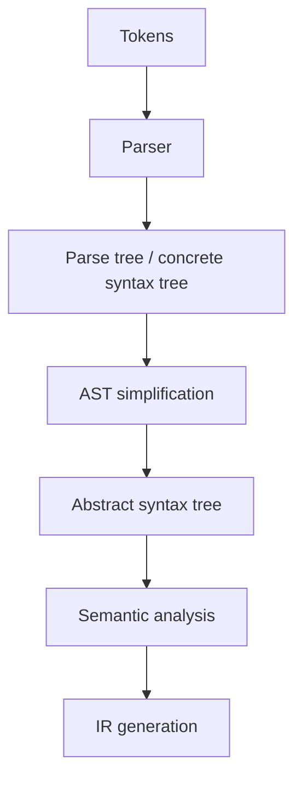

import AdBanner from '@site/src/components/AdBanner';

Abstract syntax tree vs parse tree is one of the most important distinctions in compiler design because beginners often treat them as the same object. They are not. A **parse tree** preserves grammar structure in detail, while an **abstract syntax tree (AST)** keeps the semantic shape that later compiler stages actually want.

If you understand AST vs parse tree, you understand why parser output is usually transformed before semantic analysis, IR generation, and optimization.

<AdBanner />

## Abstract Syntax Tree vs Parse Tree: Quick Difference

The quick distinction is:

- **parse tree** keeps grammar-level detail
- **AST** removes unnecessary syntax noise and keeps meaning-oriented structure

For compiler engineering, the AST is usually the more useful structure.

## Parse Tree in Compiler Design

A parse tree is also called a **concrete syntax tree**. It records how the grammar derived the input.

That means it often includes:

- non-terminals such as `Expr`, `Term`, and `Factor`
- punctuation and grouping symbols
- intermediate grammar layers that exist only because of grammar design

This is useful when you want to inspect grammar correctness, but it is often too verbose for later compilation stages.

## Abstract Syntax Tree in Compiler Design

An AST keeps only the structure that matters semantically.

For expression parsing, the AST typically keeps:

- operators
- literals
- variable references
- statements
- declarations

It usually drops:

- redundant grammar nodes
- extra parentheses once precedence is known
- punctuation that does not affect meaning

## Real-World Example

Take the expression:

```text
x = 10 + 5 * 2
```

A parse tree may preserve every grammar step used to derive `Expr`, `Term`, and `Factor`. An AST will usually preserve the semantic structure:

- assignment
- variable `x`
- addition
- multiplication as the right child of addition

That AST is what semantic analysis, type checking, constant folding, and IR lowering actually want.

## Diagram: Parse Tree vs AST



## Text Example

Parse tree style:

```text
Expr
 ├── Identifier(x)
 ├── '='
 └── Expr
     ├── Number(10)
     ├── '+'
     └── Expr
         ├── Number(5)
         ├── '*'
         └── Number(2)
```

AST style:

```text
Assign
 ├── Var(x)
 └── Add
     ├── Number(10)
     └── Mul
         ├── Number(5)
         └── Number(2)
```

The AST is smaller and closer to what later compiler passes need.

## Code Example: AST Node Representation in C++

```cpp
struct Expr {
  virtual ~Expr() = default;
};

struct NumberExpr : Expr {
  explicit NumberExpr(int value) : value(value) {}
  int value;
};

struct BinaryExpr : Expr {
  BinaryExpr(char op, std::unique_ptr<Expr> lhs, std::unique_ptr<Expr> rhs)
      : op(op), lhs(std::move(lhs)), rhs(std::move(rhs)) {}
  char op;
  std::unique_ptr<Expr> lhs;
  std::unique_ptr<Expr> rhs;
};
```

This model is much closer to semantic intent than a full parse tree with every grammar symbol preserved.

## Why Compilers Prefer ASTs

Compilers prefer ASTs because they are:

- easier to traverse
- smaller than parse trees
- better aligned with semantic checks
- easier to lower into IR

An optimizer does not care that your grammar used five helper non-terminals to encode precedence. It cares about operations, operands, control flow, and types.

## Why Parse Trees Still Matter

Parse trees still matter for:

- grammar debugging
- parser education
- tooling that wants concrete syntax fidelity
- source-to-source transformation workflows

In other words, parse trees are not useless. They just serve a different purpose from ASTs.

## Example from Real Frontends

Modern compiler frontends such as Clang are valuable partly because they produce structured ASTs that are useful for diagnostics, refactoring, static analysis, and IDE tooling. That is one reason frontend architecture matters so much in the compiler ecosystem.

## Related Reading

- [Role of parser in compiler design](/docs/compilers/front_end/role_of_parser)
- [Recursive descent parser example](/docs/compilers/parsers/recursive-descent-parser-example)
- [LL vs LR parser explained](/docs/compilers/parsers/ll-vs-lr-parser)
- [Types of parser in compiler design](/docs/compilers/parsers/types-of-parser)
- [Inside a compiler: source code to assembly](/docs/compilers/intro)
- [LLVM and IR roadmap](/docs/llvm/intro-to-llvm)

## FAQ

- **What is the difference between AST and parse tree?**
  A parse tree preserves grammar detail, while an AST keeps the higher-level semantic structure.
- **Why is AST more useful than parse tree?**
  Because semantic analysis and IR generation need operations and structure, not every grammar helper node.
- **What is an example of AST?**
  An addition expression represented as `Add(lhs, rhs)` instead of a full grammar expansion tree.
- **Why do compilers build AST after parsing?**
  ASTs are more compact and easier for later compiler phases to analyze and transform.

<script
  type="application/ld+json"
  dangerouslySetInnerHTML={{
    __html: JSON.stringify({
      '@context': 'https://schema.org',
      '@type': 'FAQPage',
      mainEntity: [
        {
          '@type': 'Question',
          name: 'What is the difference between AST and parse tree?',
          acceptedAnswer: {
            '@type': 'Answer',
            text: 'A parse tree preserves concrete grammar structure, while an abstract syntax tree removes unnecessary grammar detail and keeps the semantic structure of the program.',
          },
        },
        {
          '@type': 'Question',
          name: 'Why is AST more useful than parse tree?',
          acceptedAnswer: {
            '@type': 'Answer',
            text: 'ASTs are smaller, easier to traverse, and better aligned with semantic analysis, IR generation, and optimization than full parse trees.',
          },
        },
        {
          '@type': 'Question',
          name: 'What is an example of AST?',
          acceptedAnswer: {
            '@type': 'Answer',
            text: 'An expression such as 10 + 5 * 2 might be represented as Add(Number(10), Mul(Number(5), Number(2))) in an AST.',
          },
        },
        {
          '@type': 'Question',
          name: 'Why do compilers build AST after parsing?',
          acceptedAnswer: {
            '@type': 'Answer',
            text: 'Compilers build ASTs because later phases care about meaning-oriented structure rather than every grammar symbol preserved in a concrete parse tree.',
          },
        },
      ],
    }),
  }}
/>
