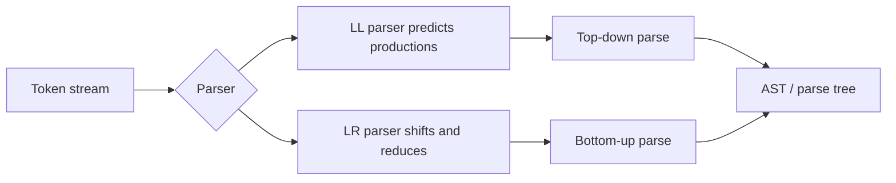

import AdBanner from '@site/src/components/AdBanner';

LL vs LR parser is one of the most common comparison topics in compiler design because it captures the difference between **predictive top-down parsing** and **reductive bottom-up parsing**. If you understand this comparison, you understand why some grammars are easy to hand-parse while others almost force you toward parser generators or stronger parsing machinery.

This article explains LL vs LR parser behavior in plain engineering terms, not just exam language.

<AdBanner />

## LL vs LR Parser: Core Difference

The short version:

- **LL parser** reads input left to right and produces a **leftmost derivation**
- **LR parser** reads input left to right and reconstructs a **rightmost derivation in reverse**

That sounds abstract, but the practical effect is clearer:

- LL parsers try to **predict** what production should come next
- LR parsers try to **shift and reduce** tokens into grammar structure

## LL Parser in Compiler Design

LL parsers are top-down parsers. They work well when the grammar is simple, non-left-recursive, and easy to disambiguate with lookahead.

Advantages:

- easy to hand-write
- readable control flow
- good for teaching and small languages

Limitations:

- cannot directly handle left recursion
- often requires left factoring
- supports a narrower grammar family

## LR Parser in Compiler Design

LR parsers are bottom-up parsers. They are more powerful and are commonly used in parser generators.

Advantages:

- handles a wider class of grammars
- works well for complex language syntax
- strong fit for generated parsers

Limitations:

- harder to hand-write and debug
- parse tables and parser states are less intuitive
- diagnostics can be less direct if not carefully engineered

## Diagram: LL vs LR Parsing Flow



## Grammar Example: Why LL and LR Feel Different

Take a simple expression grammar:

```text
Expr -> Expr + Term | Term
Term -> number
```

This grammar is **left-recursive**, so a direct LL parser struggles with it. A recursive descent implementation would recurse forever unless you rewrite the grammar. An LR parser can handle this style much more naturally.

Rewritten LL-friendly version:

```text
Expr  -> Term ExprTail
ExprTail -> + Term ExprTail | epsilon
Term -> number
```

That rewrite shows a core truth: LL parsers often demand grammar cleanup before implementation.

## Real-World Example

Suppose you are building:

- a small DSL for configuration rules
- a toy compiler for a course
- a command language for a static analysis tool

LL or recursive descent is usually the better first choice because you want clarity and direct AST construction.

Now suppose you are dealing with a grammar that has:

- more precedence levels
- ambiguity pressure
- legacy grammar constraints
- parser-generator workflow requirements

Then LR-style parsing becomes much more attractive.

## Code Example: LL-Style Predictive Parsing

This C++ sketch shows the feel of an LL-style parser for `number + number + number`.

```cpp
int parseExpr() {
  int value = parseTerm();
  while (peek().kind == Token::Plus) {
    consume(Token::Plus);
    value += parseTerm();
  }
  return value;
}
```

The parser predicts structure using the next token and explicit grammar functions.

## Code Example: LR-Style Stack Thinking

An LR parser usually thinks in terms of parser states and reductions:

```cpp
while (true) {
  Action action = table[state.top()][lookahead.kind];
  if (action.type == Shift) {
    symbolStack.push(lookahead);
    state.push(action.nextState);
    lookahead = nextToken();
  } else if (action.type == Reduce) {
    reduceByRule(action.rule);
  } else if (action.type == Accept) {
    break;
  } else {
    throw std::runtime_error("syntax error");
  }
}
```

That code is less friendly to read, but it scales to stronger grammars.

## LL vs LR Parser Comparison Table

| Property | LL parser | LR parser |
| --- | --- | --- |
| Parsing direction | Left to right | Left to right |
| Derivation style | Leftmost derivation | Rightmost derivation in reverse |
| Parser family | Top-down | Bottom-up |
| Grammar power | Narrower | Broader |
| Ease of hand-writing | Easier | Harder |
| Typical use | Small languages, teaching, hand-written compilers | Generator-based compilers, more complex grammars |

## Which One Should You Learn First?

Learn LL first because it makes control flow and grammar structure intuitive. Learn LR next because it explains how industrial parser generators scale beyond simple grammar forms.

That sequence is the pragmatic one:

1. understand recursive descent and LL thinking
2. understand why left recursion is a problem
3. understand how LR resolves broader grammars

## Related Reading

- [Types of parser in compiler design](/docs/compilers/parsers/types-of-parser)
- [Recursive descent parser example](/docs/compilers/parsers/recursive-descent-parser-example)
- [AST vs parse tree explained](/docs/compilers/parsers/abstract-syntax-tree-vs-parse-tree)
- [Role of parser in compiler design](/docs/compilers/front_end/role_of_parser)
- [Inside a compiler: source code to assembly](/docs/compilers/intro)
- [LLVM basics and roadmap](/docs/llvm/intro-to-llvm)

## FAQ

- **What is the main difference between LL and LR parser?**
  LL predicts grammar rules top-down, while LR reduces input bottom-up.
- **Why is LR parser more powerful than LL parser?**
  LR parsers accept a wider range of grammars, including many left-recursive forms.
- **Why do LL parsers need grammar rewriting?**
  LL parsers typically need the grammar to avoid left recursion and often require left factoring.
- **What is an example of LL parser?**
  Predictive parsing and recursive descent are standard LL-style examples.

<script
  type="application/ld+json"
  dangerouslySetInnerHTML={{
    __html: JSON.stringify({
      '@context': 'https://schema.org',
      '@type': 'FAQPage',
      mainEntity: [
        {
          '@type': 'Question',
          name: 'What is the main difference between LL and LR parser?',
          acceptedAnswer: {
            '@type': 'Answer',
            text: 'LL parsers predict productions from the top down, while LR parsers shift and reduce tokens from the bottom up.',
          },
        },
        {
          '@type': 'Question',
          name: 'Why is LR parser more powerful than LL parser?',
          acceptedAnswer: {
            '@type': 'Answer',
            text: 'LR parsers can handle a broader set of grammars, including many forms that are inconvenient or impossible for LL(1) parsing without rewriting.',
          },
        },
        {
          '@type': 'Question',
          name: 'Why do LL parsers need grammar rewriting?',
          acceptedAnswer: {
            '@type': 'Answer',
            text: 'LL parsers usually require grammars without left recursion and often need left factoring so parsing decisions can be made with limited lookahead.',
          },
        },
        {
          '@type': 'Question',
          name: 'What is an example of an LL parser?',
          acceptedAnswer: {
            '@type': 'Answer',
            text: 'Recursive descent is the most familiar LL-style parser and is widely used in teaching compilers and hand-written frontend implementations.',
          },
        },
      ],
    }),
  }}
/>
