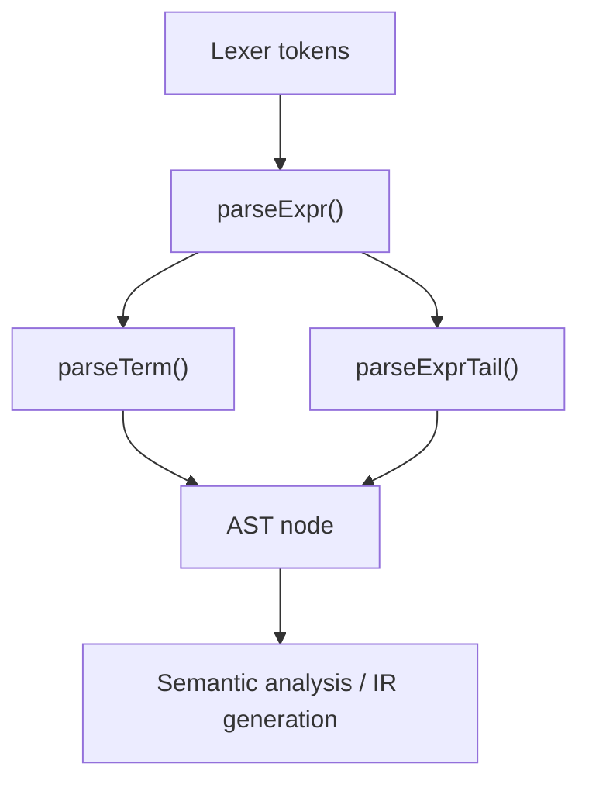

import AdBanner from '@site/src/components/AdBanner';

Recursive descent parser example pages rank well because they solve a concrete beginner problem: how do I actually write a parser instead of only reading parser theory? A recursive descent parser is one of the most direct ways to implement syntax analysis because each grammar rule maps to a function, and the call graph mirrors the structure of the language.

This guide builds a small arithmetic parser in C++ and shows how recursive descent parsing connects grammar, tokens, and AST construction.

<AdBanner />

## Recursive Descent Parser Example: The Idea

A recursive descent parser is a **top-down hand-written parser**. Each non-terminal in the grammar becomes a function. The parser reads tokens from left to right and decides which production to apply by inspecting the current token.

For a tiny expression grammar:

```text
Expr   -> Term ExprTail
ExprTail -> + Term ExprTail | epsilon
Term   -> number
```

we can write:

- `parseExpr()`
- `parseExprTail()`
- `parseTerm()`

## Real-World Example

If you are building a mini language for:

- config rules
- a toy interpreter
- a query filter
- a teaching compiler

recursive descent is often the fastest route from grammar to working parser. You keep full control over diagnostics, AST shape, and grammar evolution.

## Diagram: Recursive Descent Parser Flow



## Token Setup

We start with a small token model:

```cpp
#include <memory>
#include <stdexcept>
#include <string>
#include <vector>

struct Token {
  enum Kind { Number, Plus, End } kind;
  int value = 0;
};
```

## AST Node Setup

The parser should not only validate syntax. It should produce structure for later phases.

```cpp
struct Expr {
  virtual ~Expr() = default;
};

struct NumberExpr : Expr {
  explicit NumberExpr(int value) : value(value) {}
  int value;
};

struct AddExpr : Expr {
  AddExpr(std::unique_ptr<Expr> lhs, std::unique_ptr<Expr> rhs)
      : lhs(std::move(lhs)), rhs(std::move(rhs)) {}
  std::unique_ptr<Expr> lhs;
  std::unique_ptr<Expr> rhs;
};
```

## Recursive Descent Parser in C++

```cpp
class Parser {
 public:
  explicit Parser(const std::vector<Token>& tokens) : tokens_(tokens) {}

  std::unique_ptr<Expr> parseExpr() {
    auto lhs = parseTerm();
    while (peek().kind == Token::Plus) {
      consume(Token::Plus);
      auto rhs = parseTerm();
      lhs = std::make_unique<AddExpr>(std::move(lhs), std::move(rhs));
    }
    return lhs;
  }

 private:
  std::unique_ptr<Expr> parseTerm() {
    Token t = consume(Token::Number);
    return std::make_unique<NumberExpr>(t.value);
  }

  const Token& peek() const {
    return tokens_[index_];
  }

  Token consume(Token::Kind expected) {
    Token t = tokens_[index_++];
    if (t.kind != expected) {
      throw std::runtime_error("syntax error");
    }
    return t;
  }

  std::vector<Token> tokens_;
  std::size_t index_ = 0;
};
```

This example parses inputs such as `1 + 2 + 3` into nested `AddExpr` nodes.

## Why This Works Well

The value of recursive descent is not only simplicity. It gives you:

- direct mapping from grammar to code
- easy insertion of diagnostics
- immediate AST construction
- low conceptual overhead for small languages

That is why many compilers and interpreters begin here, even if they later move to a more advanced parser architecture.

## Where Recursive Descent Runs Into Trouble

Recursive descent becomes awkward when:

- the grammar is left-recursive
- too much backtracking is needed
- precedence and associativity are not modeled carefully
- the language grammar becomes large and ambiguous

For example, the grammar:

```text
Expr -> Expr + Term | Term
```

is left-recursive and must be rewritten for direct recursive descent.

## Example Walkthrough

For token sequence:

```text
Number(1), Plus, Number(2), Plus, Number(3), End
```

the parser does this:

1. `parseExpr()` parses `1`
2. sees `+` and parses `2`
3. builds `Add(1, 2)`
4. sees another `+` and parses `3`
5. builds `Add(Add(1, 2), 3)`

The AST is much easier for later compiler stages than raw tokens.

## Why Recursive Descent Is Useful Before LLVM

Even if your long-term goal is LLVM, you still need a frontend that turns source into structure. Recursive descent is often the best first parser to write before you lower anything into:

- AST-based semantic analysis
- custom IR
- LLVM IR

That is why parser knowledge is not separate from compiler engineering. It is the entry point to everything that follows.

## Related Reading

- [Role of parser in compiler design](/docs/compilers/front_end/role_of_parser)
- [Types of parser in compiler design](/docs/compilers/parsers/types-of-parser)
- [LL vs LR parser explained](/docs/compilers/parsers/ll-vs-lr-parser)
- [AST vs parse tree explained](/docs/compilers/parsers/abstract-syntax-tree-vs-parse-tree)
- [Intermediate representation in compilers](/docs/compilers/ir_in_compiler)
- [LLVM roadmap](/docs/llvm/intro-to-llvm)

## FAQ

- **What is a recursive descent parser?**
  It is a hand-written top-down parser where grammar rules are implemented as functions.
- **Why is recursive descent parser easy to learn?**
  Because the code structure directly mirrors the grammar structure.
- **Why does recursive descent parser fail on left recursion?**
  Direct left recursion causes infinite recursion unless the grammar is rewritten.
- **What is an example use case for recursive descent parser?**
  Small DSLs, teaching compilers, interpreters, and configuration languages.

<script
  type="application/ld+json"
  dangerouslySetInnerHTML={{
    __html: JSON.stringify({
      '@context': 'https://schema.org',
      '@type': 'FAQPage',
      mainEntity: [
        {
          '@type': 'Question',
          name: 'What is a recursive descent parser?',
          acceptedAnswer: {
            '@type': 'Answer',
            text: 'A recursive descent parser is a hand-written top-down parser where each grammar rule is implemented as a function that consumes tokens and builds structure.',
          },
        },
        {
          '@type': 'Question',
          name: 'Why is recursive descent parser easy to learn?',
          acceptedAnswer: {
            '@type': 'Answer',
            text: 'Its function structure closely matches the grammar, which makes control flow and debugging easier to understand than table-driven parsers.',
          },
        },
        {
          '@type': 'Question',
          name: 'Why does recursive descent parser fail on left recursion?',
          acceptedAnswer: {
            '@type': 'Answer',
            text: 'Direct left recursion causes infinite recursion in a straightforward top-down implementation, so the grammar usually needs to be rewritten.',
          },
        },
        {
          '@type': 'Question',
          name: 'What is an example use case for recursive descent parser?',
          acceptedAnswer: {
            '@type': 'Answer',
            text: 'It is a strong fit for small DSLs, teaching compilers, interpreters, and configuration languages where clarity matters more than generator-driven grammar power.',
          },
        },
      ],
    }),
  }}
/>
