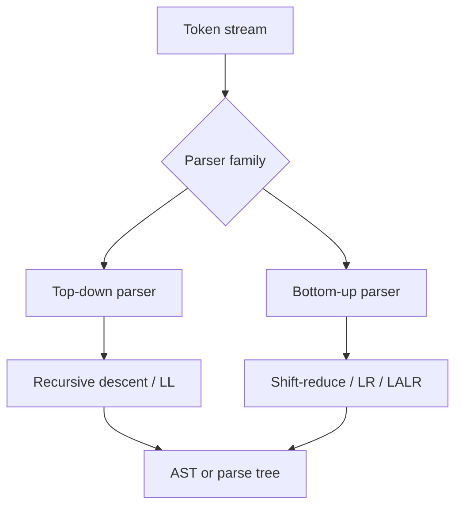

import AdBanner from '@site/src/components/AdBanner';

Types of parser in compiler design is a foundational topic because the parser decides how tokens turn into structure. After lexing, a compiler needs a component that checks whether the token stream matches the grammar of the language and then builds a parse tree or AST that later phases can reason about. That component is the parser, and the main split is between **top-down parsers** and **bottom-up parsers**.

This guide explains the major parser families, when each one is used, and why real compilers often choose different strategies for different languages.

<AdBanner />

## Types of Parser in Compiler Design: Main Classification

The simplest classification is:

- **Top-down parsers**
- **Bottom-up parsers**

Top-down parsers start from the grammar's start symbol and try to predict the input. Bottom-up parsers start from the input tokens and reduce them back into grammar productions.

## Top-Down Parsers in Compiler Design

Top-down parsing is usually easier to teach and easier to hand-write. The parser tries to expand grammar rules as it reads input left to right.

Common top-down parser types:

- **Recursive descent parser**
- **Predictive parser**
- **LL(1) parser**

### Real-world example

A small configuration language or teaching compiler often starts with recursive descent because the grammar is small and the implementation stays readable. Many hand-written compilers use this style early because debugging parser control flow is straightforward.

## Bottom-Up Parsers in Compiler Design

Bottom-up parsing works in the opposite direction. Instead of predicting from the start symbol, it builds structure by reducing token sequences into grammar rules.

Common bottom-up parser types:

- **Shift-reduce parser**
- **LR parser**
- **SLR parser**
- **LALR parser**
- **Canonical LR(1) parser**

Bottom-up parsers handle a larger class of grammars than LL parsers and are a common choice for parser generators such as Yacc and Bison.

## Diagram: How Parser Families Differ



## Why Compiler Engineers Care About Parser Type

The parser type affects:

- grammar restrictions
- error reporting quality
- implementation complexity
- parser generator compatibility
- AST construction style

A parser is not chosen in isolation. It is chosen based on the language grammar, tooling goals, and development cost.

## Code Example: A Tiny Recursive Descent Style Parser

This is not a full production parser, but it shows the shape of a top-down parser in C++.

```cpp
struct Token {
  enum Kind { Number, Plus, End } kind;
  int value;
};

class Parser {
 public:
  explicit Parser(const std::vector<Token>& tokens) : tokens_(tokens) {}

  int parseExpr() {
    int lhs = parsePrimary();
    while (peek().kind == Token::Plus) {
      consume(Token::Plus);
      int rhs = parsePrimary();
      lhs += rhs;
    }
    return lhs;
  }

 private:
  int parsePrimary() {
    Token t = consume(Token::Number);
    return t.value;
  }

  const Token& peek() const { return tokens_[index_]; }

  Token consume(Token::Kind expected) {
    Token t = tokens_[index_++];
    if (t.kind != expected) throw std::runtime_error("syntax error");
    return t;
  }

  std::vector<Token> tokens_;
  std::size_t index_ = 0;
};
```

This style is readable and works well for simple grammars. Once grammars become more ambiguous or left-recursive, bottom-up parsing often becomes more attractive.

## Parser Types and Their Typical Use Cases

| Parser type | Good fit | Limitation |
| --- | --- | --- |
| Recursive descent | Small compilers, readable hand-written parsers | Struggles with left recursion |
| LL(1) | Predictable teaching grammars | Restricted grammar form |
| Shift-reduce | Generator-driven parsing | Harder to read manually |
| LALR(1) | Practical parser generators | Less intuitive diagnostics |
| LR(1) | Powerful grammar support | Larger tables, more complexity |

## Difference Between Parse Tree and AST

When people learn parser types, they also need to distinguish **parse tree** from **abstract syntax tree**:

- the **parse tree** closely mirrors grammar productions
- the **AST** removes grammar noise and keeps semantic structure

That is why parser design connects directly to later compiler stages like semantic analysis, IR generation, and optimization.

## Example from Real Compilers

Clang uses a hand-written parser design that works well with direct AST construction and good diagnostics. Traditional compiler-generator workflows often rely on bottom-up parser generation for languages where grammar coverage matters more than handwritten control flow readability.

The key takeaway is practical:

- use simpler top-down approaches when you want clarity and control
- use stronger bottom-up machinery when the grammar demands it

## Related Reading

- [Role of parser in compiler design](/docs/compilers/front_end/role_of_parser)
- [LL vs LR parser explained](/docs/compilers/parsers/ll-vs-lr-parser)
- [Recursive descent parser example](/docs/compilers/parsers/recursive-descent-parser-example)
- [AST vs parse tree explained](/docs/compilers/parsers/abstract-syntax-tree-vs-parse-tree)
- [Compiler frontend explained](/docs/compilers/front_end/)
- [LLVM roadmap](/docs/llvm/intro-to-llvm)

## FAQ

- **What is a parser in compiler design?**
  A parser reads tokens from the lexer, validates syntax against grammar rules, and builds a parse tree or AST.
- **What are the two main types of parser in compiler design?**
  The two main families are top-down parsers and bottom-up parsers.
- **Why are LR parsers more powerful than LL parsers?**
  LR parsers handle a broader class of grammars, including many grammars that are awkward or impossible to express directly as LL(1).
- **What is an example of a top-down parser?**
  Recursive descent is the most common top-down example.

<script
  type="application/ld+json"
  dangerouslySetInnerHTML={{
    __html: JSON.stringify({
      '@context': 'https://schema.org',
      '@type': 'FAQPage',
      mainEntity: [
        {
          '@type': 'Question',
          name: 'What is a parser in compiler design?',
          acceptedAnswer: {
            '@type': 'Answer',
            text: 'A parser reads tokens from the lexer, checks whether they follow the language grammar, and builds a parse tree or abstract syntax tree for later compiler phases.',
          },
        },
        {
          '@type': 'Question',
          name: 'What are the two main types of parser in compiler design?',
          acceptedAnswer: {
            '@type': 'Answer',
            text: 'The two main parser families are top-down parsers and bottom-up parsers.',
          },
        },
        {
          '@type': 'Question',
          name: 'Why are LR parsers more powerful than LL parsers?',
          acceptedAnswer: {
            '@type': 'Answer',
            text: 'LR parsers can handle a broader class of grammars and are often preferred for generator-based parsing when grammar complexity increases.',
          },
        },
        {
          '@type': 'Question',
          name: 'What is an example of a top-down parser?',
          acceptedAnswer: {
            '@type': 'Answer',
            text: 'Recursive descent is a classic top-down parser and is common in hand-written compilers and teaching implementations.',
          },
        },
      ],
    }),
  }}
/>
