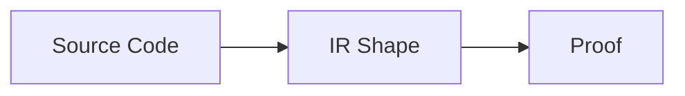
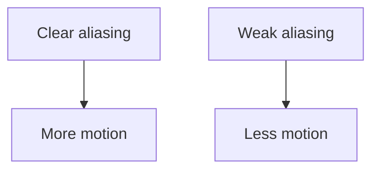
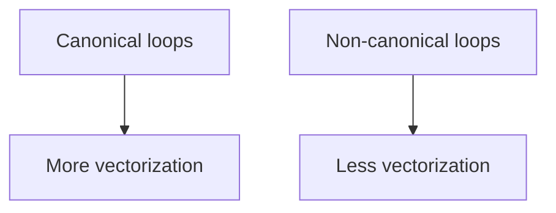
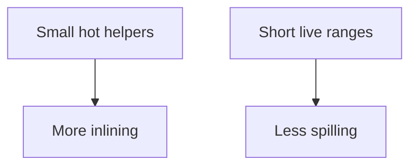

import AdBanner from '@site/src/components/AdBanner';
import Link from '@docusaurus/Link';
import Tabs from '@theme/Tabs';
import TabItem from '@theme/TabItem';

# Part 2: How Developers Influence Compiler Decisions

Part 1 explained why compiler decisions matter to hardware.
This part is the less glamorous bit: how those decisions actually get made, and where the compiler starts saying "maybe" instead of "yes."

Compilers are not magical. They use algorithms, heuristics, and cost models on a specific IR shape. That means source structure, aliasing information, and loop form can all push the compiler toward different choices. Sometimes the compiler is being smart. Sometimes it is just being cautious. You have to know which one you are looking at.

If you want one sentence first, it is this:

> The compiler can only optimize what the program structure makes visible.

<div>
  <AdBanner />
</div>

## TL;DR

- The compiler is a proof engine with a budget.
- Alias information, loop regularity, and IR shape decide how much proof LLVM can build.
- Inlining, vectorization, loop transforms, and register allocation all react to the same source-level signals.
- If you want different optimization behavior, make the code easier to prove, not just "more optimized."

## Series Map

- [Part 1: Why](/docs/compilers/techblog/how-compiler-decisions-affect-hardware-performance/)
- [Part 2: How](/docs/compilers/techblog/how-compiler-decisions-affect-hardware-performance/how-developers-influence-compiler-decisions/)
- [Part 3: Practical](/docs/compilers/techblog/how-compiler-decisions-affect-hardware-performance/practical-compiler-control/)

## Jump To Any Part

- [Read Part 1: Why](/docs/compilers/techblog/how-compiler-decisions-affect-hardware-performance/)
- [Read Part 2: How](/docs/compilers/techblog/how-compiler-decisions-affect-hardware-performance/how-developers-influence-compiler-decisions/)
- [Read Part 3: Practical](/docs/compilers/techblog/how-compiler-decisions-affect-hardware-performance/practical-compiler-control/)

## Visual Summary

<Tabs>
  <TabItem value="a" label="A: Source to IR" default>



  </TabItem>
  <TabItem value="b" label="B: Heuristics">


  </TabItem>
  <TabItem value="c" label="C: Aliasing">



  </TabItem>
  <TabItem value="d" label="D: Loops">



  </TabItem>
  <TabItem value="e" label="E: Registers">



  </TabItem>
</Tabs>

:::important What You Should Leave With
- LLVM makes decisions from proofs, heuristics, and cost models
- Aliasing, loop structure, and IR shape control how much proof the compiler has
- Small source changes can change inlining, vectorization, and register allocation
- Good source structure gives the compiler fewer reasons to stay conservative
:::

## Table of Contents

1. [Heuristics, Not Perfect Knowledge](#heuristics-not-perfect-knowledge)
2. [Inlining Heuristics](#inlining-heuristics)
3. [Vectorization Conditions](#vectorization-conditions)
4. [Loop Transformations](#loop-transformations)
5. [Register Allocation Strategies](#register-allocation-strategies)
6. [What Changes Compiler Choices](#what-changes-compiler-choices)
7. [Writing Code Differently Changes Optimization](#writing-code-differently-changes-optimization)

## Heuristics, Not Perfect Knowledge

LLVM rarely knows the full runtime story.

It usually has:

- static code size
- IR structure
- inferred aliasing facts
- profile data if available
- target-specific cost models

It does not know cache state, future branches, or the exact run-time mix in production. So the compiler uses heuristics: rules that are good enough on average and tuned to the target.

That is why small changes in code style can shift optimization outcomes.

## Inlining Heuristics

Inlining decisions usually balance:

- expected call frequency
- function body size
- recursion and call depth
- constant propagation opportunities
- code growth budget
- target-specific cost

The compiler wants to inline hot tiny functions because that often removes call overhead and opens up more optimization. But once a function becomes too large, or too many call sites get expanded, the benefit can flip into instruction-cache pressure and register pressure.

What changes the decision:

- a function marked as hot by profile data is easier to inline
- a function with many arguments that become constants after inlining looks more profitable
- a call inside a deep loop is more attractive than a cold path
- a recursive or huge callee is more likely to stay out of line

How to help the compiler:

- keep hot helpers small and focused
- prefer simple wrappers around core logic
- avoid hiding obvious constants behind unnecessary layers
- keep the call graph readable when performance matters

## Vectorization Conditions

Vectorization is not just "turn on SIMD."

LLVM has to prove the loop is safe and profitable.

The usual conditions include:

- a canonical loop shape
- predictable trip counts or a usable runtime check
- aligned or at least regular memory access
- no unclear dependencies between loads and stores
- an arithmetic pattern that maps cleanly to SIMD lanes

What blocks vectorization:

- aliasing that may change the meaning of reordered memory accesses
- irregular indexing like pointer chasing or gather-like behavior
- nested branches that make the loop body non-uniform
- unknown dependence distances
- tiny loops where vector setup cost outweighs the win

What helps it:

- `restrict`-style non-aliasing facts in C-family code
- flat arrays instead of linked structures
- loop bodies that are free of hidden side effects
- a clear reduction pattern or a clear map pattern

The main point is that the compiler is looking for proof. If the IR makes the proof easy, vectorization becomes much more likely.

## Loop Transformations

LLVM uses a family of loop transforms to reshape control flow:

- unrolling
- peeling
- unswitching
- interchange
- fusion and fission
- LICM, or loop-invariant code motion

These are not cosmetic changes. They change the amount of branch overhead, the number of live values, the locality of memory accesses, and the opportunities for instruction-level parallelism.

Some examples:

- unrolling reduces branch frequency and can expose more independent operations
- peeling can isolate a special first or last iteration so the main loop becomes cleaner
- unswitching can move loop-invariant conditions out of the inner body
- LICM can hoist repeated work out of the loop entirely

What changes the decision:

- loop nesting structure
- side effects inside the loop body
- whether the loop body has obvious invariant expressions
- whether memory accesses can be reordered safely
- whether the loop is already close to the target's register and cache limits

If you write the loop in a way that makes invariants explicit, LLVM usually has an easier time.

## Register Allocation Strategies

Register allocation turns virtual registers into physical registers.

Two broad strategies show up often in compiler discussions:

- graph coloring
- linear scan

### Graph Coloring

Graph coloring models live ranges as interference. If two values are live at the same time, they cannot share a register. The allocator tries to color the interference graph with limited colors, where each color represents a hardware register.

Why it is attractive:

- usually better quality allocations
- better spill decisions on complex code
- strong results for large functions with many interacting values

Why it is expensive:

- more compile-time cost
- more implementation complexity
- global decisions can be heavier than a simpler local model

How it works in practice:

1. Build the set of live ranges.
2. Connect values that overlap in time.
3. Try to assign each live range a physical register.
4. Spill values when the graph cannot fit.
5. Coalesce copies when that does not create new conflicts.

Tiny example:

- `v1` lives from instruction 3 to 9
- `v2` lives from instruction 5 to 8
- `v3` lives from instruction 10 to 14

`v1` and `v2` interfere, so they cannot share a register. `v3` does not overlap with either one, so it can reuse the same register later. That is the basic shape of graph coloring: use interference, then spill only when the graph is too crowded.

### Linear Scan

Linear scan walks live ranges in program order and assigns registers greedily.

Why it is attractive:

- fast
- simple
- good for JITs and low-latency compilation pipelines

Why it is weaker:

- can spill more often
- may miss global opportunities that a graph-coloring allocator would catch

How it works in practice:

1. Sort live intervals by start point.
2. Keep the currently active intervals in register order.
3. Assign the next free register when one exists.
4. Spill the interval with the worst remaining cost when registers run out.

Linear scan is attractive because it is easy to implement and fast to run, but the tradeoff is that it sees less of the whole interference picture.

The allocator choice matters because the same IR can produce very different memory traffic depending on how long values stay in registers.

## What Changes Compiler Choices

The compiler does not optimize in a vacuum. A few structural signals matter a lot:

- aliasing: can two pointers refer to the same memory?
- IR shape: does the code expose straight-line regions or tangled control flow?
- loops: are they canonical, nested, side-effect free, and regular?
- data layout: arrays, structs, and pointers do not all behave the same way
- side effects: calls, volatile accesses, and opaque operations reduce freedom

Two functions with the same algorithm can get different optimization outcomes if one is written in a compiler-friendly shape and the other hides intent behind abstraction.

## Writing Code Differently Changes Optimization

That is the practical lesson.

Compare these two source shapes:

```c
void add_flat(float *restrict a, float *restrict b, float *restrict c, int n) {
  for (int i = 0; i < n; ++i)
    a[i] = b[i] + c[i];
}
```

```c
void add_indirect(float *a, float *b, float *c, int *idx, int n) {
  for (int i = 0; i < n; ++i)
    a[idx[i]] = b[idx[i]] + c[idx[i]];
}
```

The first version gives the compiler a regular loop, flat data, and a clear alias story. The second version hides the data flow behind extra indirection.

That difference changes the optimizer's decisions about:

- whether a loop gets vectorized
- whether loads can move
- whether register pressure stays manageable
- whether the backend can keep the hot path compact

<Tabs>
  <TabItem value="flat" label="Flat Array Shape" default>
    <p>The compiler can usually see a canonical loop, regular memory, and a clear reduction or map pattern.</p>
  </TabItem>
  <TabItem value="indirect" label="Indirect Shape">
    <p>The compiler has to preserve more possibilities because aliasing and memory dependence are harder to prove.</p>
  </TabItem>
</Tabs>

## Why This Part Matters

The compiler's output is shaped by the information you reveal.

If you want faster code, you do not just ask for more optimization. You give LLVM a simpler problem to solve.

Part 3 shows the practical side: which flags and passes actually change the result, and how to inspect the before/after code.

## How The Compiler Uses The Evidence You Give It

This is the part people often miss.

The compiler does not "understand your code" in the human sense.
It builds a proof from the facts it can derive:

- this pointer may or may not alias that pointer
- this loop walks in a regular pattern
- this call may or may not be hot
- this value can or cannot stay live in a register
- this computation can or cannot be moved

If you make those facts obvious, the optimizer can act with confidence.
If you hide them, the optimizer slows down.

<Tabs>
  <TabItem value="visible" label="Visible Intent" default>
    <p>Readable loops, flat data structures, and simple function boundaries are easy to reason about. LLVM can often derive enough facts to optimize aggressively.</p>
  </TabItem>
  <TabItem value="hidden" label="Hidden Intent">
    <p>Nested indirection, aliasing, and opaque helper layers force the compiler to keep more possibilities alive. That makes it conservative.</p>
  </TabItem>
  <TabItem value="mixed" label="Mixed Intent">
    <p>Real systems usually sit between those extremes. The practical goal is not purity. It is removing the worst ambiguity from the hot path.</p>
  </TabItem>
</Tabs>

## The Practical Language Of Compiler-Friendly Code

Compiler-friendly code is usually not "more clever."
It is usually more explicit.

That means:

- express data layout plainly
- keep hot loops regular
- separate cold error paths from hot work
- avoid unnecessary pointer aliasing
- avoid unnecessary abstraction in hot code
- keep hot helper functions small and visible

This does not mean writing ugly code.
It means writing code the compiler can verify.

## How Heuristics Become Decisions

LLVM's heuristics usually combine several signals.

Examples:

- a tiny function called in a hot loop gets strong inline pressure
- a loop with a clear reduction pattern gets vectorization pressure
- a function with lots of live values may get spill pressure
- a loop with too much control flow may get unroll resistance

The compiler is constantly balancing profitability against risk.

That balance is why the same transformation can be great in one function and useless in another.

## What To Change First When Performance Matters

If you are trying to help the compiler, do not start by changing ten things.
Start with the highest-leverage structure:

1. Make hot loops regular.
2. Make data layout obvious.
3. Remove aliasing ambiguity.
4. Reduce call boundary cost in hot paths.
5. Keep live ranges short.
6. Separate hot and cold control flow.

If you do those well, the compiler usually has much more room to work.

## What Not To Do

Avoid these patterns in hot code:

- hiding an array behind several layers of wrappers
- using shared mutable pointers without a reason
- mixing hot code and exceptional handling in the same block
- turning obvious loops into opaque callback chains
- forcing the compiler to prove too much at once

These are not style violations in general.
They are performance hazards in the hot path.

## Why This Still Matters In Large Systems

In small examples it is easy to see what the compiler should do.
In large systems, the same rules still apply but the evidence is noisier.

The compiler may still optimize well if:

- the hot path is isolated
- the data layout is stable
- the call graph is readable
- the important loop shape survives in the IR

The more a large system behaves like a collection of regular kernels, the more the compiler can help.

## A Compiler Engineer's Mental Model

Compiler decisions are easiest to understand if you think in terms of evidence.

The compiler repeatedly asks:

- What can I prove?
- What do I not know?
- What is the cost if I am wrong?
- What is the payoff if I am right?

That is why compiler work feels like a series of small legal arguments.
Every pass tries to prove something that a later pass can use.

<Tabs>
  <TabItem value="prove" label="Proof" default>
    <p>Proof is the compiler's permission to be aggressive. It comes from facts like non-aliasing, canonical loops, and known function properties.</p>
  </TabItem>
  <TabItem value="risk" label="Risk">
    <p>Risk is what happens when the compiler lacks enough proof. It stays conservative and preserves correctness over speculation.</p>
  </TabItem>
  <TabItem value="budget" label="Budget">
    <p>Budget is the practical limit. A transformation can be legal and still be skipped if the cost model says the win is not worth it.</p>
  </TabItem>
</Tabs>

## Alias Analysis In Practice

Alias analysis is one of the most influential facts in the whole pipeline.

If the compiler cannot prove that two pointers refer to different memory, it has to assume they might overlap.
That assumption changes a lot:

- loads may not move freely
- stores may not move freely
- vectorization may need runtime checks
- load forwarding may be blocked
- loop-invariant motion may be limited

In practice, aliasing is why two nearly identical loops can optimize differently.
One version gives the compiler clean separation.
The other version forces it to preserve order.

### Helpful Shapes

The compiler likes:

- separate arrays
- local scalars
- explicit read-only inputs
- loops with obvious induction variables
- simple loads from non-overlapping regions

### Hard Shapes

The compiler dislikes:

- many pointer aliases to the same object
- stores through one pointer and loads through another ambiguous pointer
- mutable shared state in the hot loop
- opaque helper layers that hide memory effects

The more the compiler has to guess, the less it can move memory operations around.

## Loop Canonicalization Matters More Than People Think

Many loop optimizations depend on the loop already looking like a loop.

That sounds obvious, but it is the basis for a lot of real compiler work.

The compiler often wants:

- one header
- one latch
- a recognizable induction variable
- a clear exit condition
- a body that can be reasoned about independently

If the loop is written in a less regular way, the optimizer may spend extra effort normalizing it before any useful transformation can happen.

This is why source-level regularity matters.
You are not writing the loop for a human alone.
You are also writing it for the passes that need to recognize it.

## Inlining Decision Tree

Inlining is one of the easiest optimizations to talk about and one of the hardest to tune well.

The compiler usually asks:

1. Is the callee small?
2. Is the call site hot?
3. Does inlining expose constants?
4. Will inlining create too much code growth?
5. Will it raise register pressure?
6. Will it unlock other optimizations?

If the answer leans strongly toward benefit, the compiler inlines.
If not, it leaves the call in place.

That decision tree is why inlining often feels "obvious" only after the fact.

### Inlining Helps When

- the callee is simple
- the call site is inside a hot loop
- the arguments become constants after inlining
- the body becomes simpler once the call boundary disappears

### Inlining Hurts When

- the callee is large
- the callee is called in many places
- the code is already large enough to pressure I-cache
- the expanded live ranges cause spills

Inlining is therefore not a moral choice.
It is a budget choice.

## Vectorization Decision Tree

Vectorization is another place where source shape drives compiler behavior.

The optimizer typically asks:

1. Is the loop regular enough?
2. Are the memory accesses predictable?
3. Can the compiler prove there is no harmful dependence?
4. Does the target have a vector width worth using?
5. Will the setup cost be repaid by the widened body?
6. Will the epilogue be acceptable?

If those checks pass, the loop becomes a vector candidate.
If not, the compiler stays scalar or uses a limited transform.

### Vectorization Helps When

- iterations are independent or reducible
- memory is contiguous or regular
- the loop body is arithmetic-heavy
- the target's SIMD width is meaningful

### Vectorization Hurts When

- the loop body is branchy
- memory access is irregular
- the loop is too short
- the live value count becomes too high

The user-visible lesson is simple:
write loops that look like loops, not puzzles.

## Loop Transformation Menu

The compiler has many ways to reshape loops.

### Unrolling

Unrolling duplicates the body so the branch happens less often.
It can help when the loop is hot and simple.
It can hurt when the body grows too much.

### Peeling

Peeling removes special iterations at the edges.
That can make the main loop cleaner.
It is especially useful when the first or last iteration has different behavior.

### Unswitching

Unswitching moves invariant conditions outside the loop.
That can make the loop body more uniform.
It is useful when a branch result does not change across iterations.

### Interchange

Loop interchange changes nesting order.
That can dramatically change locality and vectorization opportunity.

### Fusion And Fission

Fusion merges loops to reduce overhead and improve locality.
Fission splits loops when doing so improves cache use or reduces interference.

### LICM

Loop-invariant code motion hoists work out of the loop.
It is one of the clearest examples of the compiler removing repeated cost.

Each of these transformations affects the same basic resources:
branches, locality, live ranges, and instruction count.

## Register Allocation Deep Dive

The allocator is the point where abstract values become physical hardware constraints.

This is where the compiler has to answer:

- Which values deserve registers?
- Which values can be spilled cheaply?
- Which live ranges interfere?
- Which values can be coalesced?
- Which copies should disappear?

### Why Graph Coloring Is Attractive

Graph coloring sees the whole problem at once.
It can make global spill decisions and preserve quality on complicated code.

This is attractive for large functions because the allocator sees the interference graph rather than just local order.

### Why Linear Scan Is Attractive

Linear scan is simpler and faster.
It works well when compile time matters a lot.
That is why it shows up in JITs and in environments where the compiler itself must stay cheap.

### Why Both Are Still Heuristic

Neither allocator is perfect.
Both make tradeoffs.
Both care about spill cost.
Both react to live-range shape.

That is why the source still matters.
If you hand the allocator a cleaner problem, either strategy gets better results.

## Source Patterns That Help

The compiler usually likes source that does the following:

- makes data layout plain
- uses simple loop bounds
- separates hot and cold paths
- minimizes aliasing ambiguity
- keeps hot helper functions small
- avoids unnecessary side effects in the hot path

These are not commandments.
They are leverage points.

## Source Patterns That Hurt

The compiler usually struggles with source that:

- bounces through many pointers
- hides hot logic behind opaque calls
- mixes exceptional behavior into the inner loop
- creates many temporaries at once
- makes dependencies difficult to prove

These patterns are often fine in cold code.
They are expensive in hot code.

## Case Study: Two Equivalent Ideas, Two Different Outcomes

Consider these two design choices.

### Design 1

You write a data-parallel loop over a flat array.
The optimizer sees a regular structure and can often act aggressively.

### Design 2

You write a flexible abstraction with callbacks, indirection, and shared state.
The optimizer has to preserve more behavior and often becomes conservative.

Both designs may compute the same answer.
Only one of them makes the compiler's job easy.

That is why compiler engineers spend so much time on structure.
Structure is policy expressed in code.

## Case Study: Why Smaller Can Be Better

People often assume more abstraction means cleaner code and cleaner code means faster optimization.

That is not reliably true.

Sometimes the best optimization is to reduce the amount of work the compiler has to reason about:

- fewer branches
- fewer temporaries
- fewer aliases
- fewer live values
- fewer code paths inside the hot loop

The compiler responds better to a smaller proof problem.

## Case Study: Why Hot And Cold Separation Matters

Hot and cold code should not be mixed if you care about performance.

Why?

- cold error handling can bloat the hot path
- hot loops should stay compact
- branch predictors work better when behavior is stable
- caches behave better when the hot path is packed together

This is one of the simplest practical changes a developer can make.

## What To Measure After A Source Change

After changing source shape, compare:

- IR attributes
- vectorization remarks
- inlining decisions
- spill counts
- branch shape
- assembly length in the hot path

Then compare runtime counters if you have them.

The source change is only a success if the machine shape improved.

## Extended Checklist For Developers

When you are preparing code for optimization, ask:

1. Is the loop form canonical?
2. Is the data layout obvious?
3. Are hot and cold paths separated?
4. Are aliases obvious or ambiguous?
5. Are hot helpers small enough to inline profitably?
6. Is there too much register pressure in the hot path?
7. Does the code rely on the compiler guessing a lot?
8. Is the critical path easy to see in IR?

If the answer to several of those is no, the compiler will usually stay conservative.

## Advanced Appendix

This appendix turns the main argument into a compact working reference.

### A. Code Shape Is The Proof You Give The Compiler

When you write performance-sensitive code, you are not just expressing an algorithm.
You are also telling the compiler what it can safely prove.

The useful signals are simple:

- this path is hot
- this loop is regular
- this data probably does not alias
- this helper is worth seeing through
- this region can stay cold

When those signals are clear, the compiler has more room to move memory, widen loops, inline helpers, and simplify control flow.
When they are not, the compiler stays conservative.

### B. The Four Main Bottlenecks In Part 2

The same few obstacles show up repeatedly:

- aliasing blocks memory motion and vectorization
- irregular loops block canonical optimization
- large helpers block profitable inlining
- register pressure blocks transformations from surviving to the end

That is why source structure matters so much.
The compiler is not guessing blindly.
It is reacting to the proof problem your code creates.

### C. How Passes Chain Together

One pass creates the conditions for the next:

- canonicalization makes a loop easier to analyze
- stronger alias facts make widening safer
- inlining can expose a better inner loop
- vectorization changes register pressure
- register pressure changes spills and layout

This is why a small source change can have a larger effect than it first appears.
You are not changing one isolated step.
You are changing the whole chain.

### D. Practical Patterns To Watch

When the compiler misses an optimization, check for the same handful of root causes:

- hidden alias chains
- giant hot helpers
- irregular loop bodies
- too many live values

The fixes are usually the same too:

- separate hot and cold code
- make ownership clearer
- flatten loops where possible
- reduce unnecessary temporaries

### E. Good And Bad Optimization Stories

A good optimization story usually looks like this:

1. The loop becomes clearer.
2. Alias information becomes stronger.
3. The right helper gets inlined.
4. The loop vectorizes or simplifies.
5. The allocator keeps key values in registers.

A bad story looks like the reverse:

1. The source hides structure.
2. The compiler stays cautious.
3. The loop remains scalar or branchy.
4. The call boundary remains.
5. The allocator spills useful values.

### F. Research And Final Note

The research story behind this topic is consistent:

- inlining works when size growth stays controlled
- alias analysis gates memory motion and vectorization
- loop canonicalization makes later passes more effective
- register allocation is a resource problem, not a bookkeeping detail
- branch behavior depends on how stable the emitted path is

If you remember one sentence from Part 2, make it this:

> the compiler does better when the code gives it a cleaner proof problem.

## References

- [LLVM Alias Analysis Infrastructure](https://llvm.org/docs/AliasAnalysis.html)
- [LLVM Auto-Vectorization in LLVM](https://llvm.org/docs/Vectorizers.html)
- [LLVM Transform Passes](https://llvm.org/docs/Passes.html)
- [A comparative study of static and profile-based heuristics for inlining](https://research.ibm.com/publications/a-comparative-study-of-static-and-profile-based-heuristics-for-inlining)
- [An empirical study of method inlining for a Java just-in-time compiler](https://research.ibm.com/publications/an-empirical-study-of-method-inlining-for-a-java-just-in-time-compiler)
- [Register allocation via coloring](https://research.ibm.com/publications/register-allocation-via-coloring)

<div style={{display: 'flex', gap: '1rem', flexWrap: 'wrap', marginTop: '2rem'}}>
  <Link to="/docs/compilers/techblog/how-compiler-decisions-affect-hardware-performance/">Back to Part 1</Link>
  <Link to="/docs/compilers/techblog/how-compiler-decisions-affect-hardware-performance/practical-compiler-control/">Continue to Part 3: Practical</Link>
</div>
