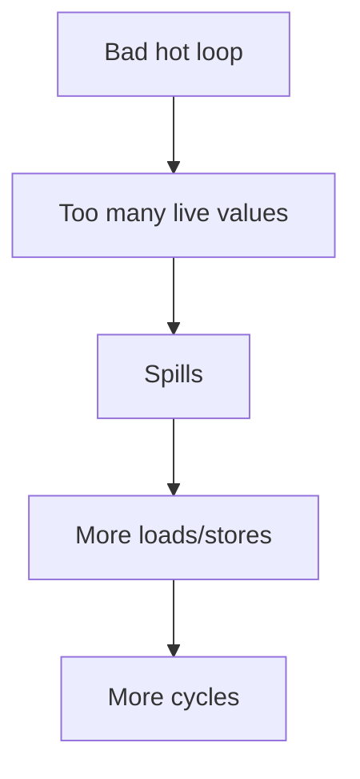
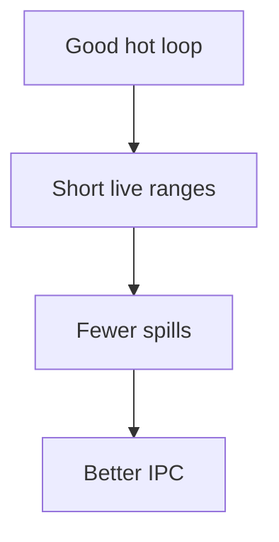

import AdBanner from '@site/src/components/AdBanner';
import Link from '@docusaurus/Link';
import Tabs from '@theme/Tabs';
import TabItem from '@theme/TabItem';

# Part 3: Practical Compiler Control

Part 1 explained why compiler decisions affect hardware.
Part 2 explained how the compiler makes those decisions.

This part shows how to actually change the behavior and inspect the result.

If Parts 1 and 2 are the theory, this is the part where the story either survives contact with the machine or falls apart in the first counter readout.

<div>
  <AdBanner />
</div>

## TL;DR

- `clang` flags change the optimization pipeline, but the source still has to make the transform legal and profitable.
- `opt` helps isolate one pass at a time so you can see cause and effect.
- `perf stat` gives a hardware-level answer when `uProf` is not available.
- The most useful practical workflow is source shape -> IR -> pass -> assembly -> counters.

## Jump To Any Part

- [Read Part 1: Why](/docs/compilers/techblog/how-compiler-decisions-affect-hardware-performance/)
- [Read Part 2: How](/docs/compilers/techblog/how-compiler-decisions-affect-hardware-performance/how-developers-influence-compiler-decisions/)
- [Read Part 3: Practical](/docs/compilers/techblog/how-compiler-decisions-affect-hardware-performance/practical-compiler-control/)

## Visual Summary

<Tabs>
  <TabItem value="a" label="A: Source to Flags" default>


  </TabItem>
  <TabItem value="b" label="B: Passes">


  </TabItem>
  <TabItem value="c" label="C: Counters">


  </TabItem>
  <TabItem value="d" label="D: Bad Shape">



  </TabItem>
  <TabItem value="e" label="E: Good Shape">



  </TabItem>
</Tabs>

:::important What You Should Leave With
- `clang` flags change the optimization pipeline, but only when the compiler can prove the transform is legal
- `opt` lets you isolate specific passes and inspect their effect
- IR and assembly are the only trustworthy way to see what really changed
- The same source can produce very different code at `-O0`, `-O2`, and `-O3`
:::

## Table of Contents

1. [The Example](#the-example)
2. [See The Baseline](#1-see-the-baseline)
3. [Turn On Real Optimization](#2-turn-on-real-optimization)
4. [Use Opt Passes Directly](#3-use-opt-passes-directly)
5. [Compare Before And After](#4-compare-before-and-after)
6. [Use Flags Intentionally](#5-use-flags-intentionally)
7. [A Real Workflow](#6-a-real-workflow)
8. [What This Example Proved](#7-what-this-example-proved)

## The Example

Use a simple reduction loop so the effect is easy to see:

```c
int sum(int *a, int n) {
  int s = 0;
  for (int i = 0; i < n; ++i) s += a[i];
  return s;
}
```

This is not a toy in the bad sense. Reduction loops like this are common in real code, and they expose the same compiler choices that matter in larger systems: loop shape, vectorization, register use, and code generation quality.

## Concrete Assembly Walkthrough

The same `sum` function tells two different stories at `-O0` and `-O3`.

### `-O0`: Source-Like Shape

At `-O0`, the compiler keeps locals on the stack:

```asm
pushq	%rbp
movq	%rsp, %rbp
movq	%rdi, -8(%rbp)
movl	%esi, -12(%rbp)
movl	$0, -16(%rbp)
movl	$0, -20(%rbp)
```

What this means:

- the function has a frame pointer
- locals live in memory, not registers
- every iteration has extra load/store traffic
- the loop body stays close to the original source shape

This is useful for debugging.
It is not usually what you want for performance.

### `-O3`: Hardware-Friendly Shape

At `-O3 -march=native`, the compiler moves to vector registers and wider operations:

```asm
vpxor	%xmm0, %xmm0, %xmm0
vpxor	%xmm1, %xmm1, %xmm1
vpaddd	(%rdi,%rsi), %zmm0, %zmm0
vpaddd	64(%rdi,%rsi), %zmm1, %zmm1
addq	$256, %rsi
jne	.LBB0_7
```

What this means:

- the compiler removed the stack-based local variables from the hot loop
- the CPU sees wider work per instruction
- the loop count advances in larger chunks
- the machine can retire more useful work per cycle if the data stays hot

The important point is not just that the assembly changed.
The important point is that the machine shape changed in a way the hardware can exploit.

### Side-By-Side Interpretation

<Tabs>
  <TabItem value="o0" label="What the CPU Sees at -O0" default>
    <ul>
      <li>A stack frame.</li>
      <li>Memory-resident locals.</li>
      <li>More load/store traffic.</li>
      <li>A loop that looks like the source.</li>
    </ul>
  </TabItem>
  <TabItem value="o3" label="What the CPU Sees at -O3">
    <ul>
      <li>Vector registers and wide adds.</li>
      <li>Less local memory traffic.</li>
      <li>A hotter, denser loop body.</li>
      <li>A shape designed for throughput.</li>
    </ul>
  </TabItem>
</Tabs>

## 1. See The Baseline

First, generate unoptimized IR and assembly.

```bash
cat > sum.c <<'EOF'
int sum(int *a, int n) {
  int s = 0;
  for (int i = 0; i < n; ++i) s += a[i];
  return s;
}
EOF

clang -O0 -S -emit-llvm sum.c -o sum.O0.ll
clang -O0 -S sum.c -o sum.O0.s
```

At `-O0`, LLVM stays close to source structure. The IR is full of stack slots and loads:

```llvm
define dso_local i32 @sum(ptr noundef %0, i32 noundef %1) #0 {
  %3 = alloca ptr, align 8
  %4 = alloca i32, align 4
  %5 = alloca i32, align 4
  %6 = alloca i32, align 4
  store ptr %0, ptr %3, align 8
  store i32 %1, ptr %4, align 4
  store i32 0, ptr %5, align 4
  store i32 0, ptr %6, align 4
  br label %7
}
```

The assembly matches that shape: explicit frame setup, stack slots for locals, and a branch back to the loop header.

```asm
pushq	%rbp
movq	%rsp, %rbp
movq	%rdi, -8(%rbp)
movl	%esi, -12(%rbp)
movl	$0, -16(%rbp)
movl	$0, -20(%rbp)
```

## 2. Turn On Real Optimization

Now compile with a high optimization level and target-aware code generation.

```bash
clang -O3 -march=native -S -emit-llvm sum.c -o sum.O3.ll
clang -O3 -march=native -S sum.c -o sum.O3.s
```

The optimized IR is very different. The compiler has removed the stack traffic, reasoned about the loop, and introduced vector operations:

```llvm
define dso_local i32 @sum(ptr nocapture noundef readonly %0, i32 noundef %1) local_unnamed_addr #0 {
  %3 = icmp sgt i32 %1, 0
  br i1 %3, label %4, label %59

11:                                               ; preds = %11, %9
  %13 = phi <16 x i32> [ zeroinitializer, %9 ], [ %25, %11 ]
  %14 = phi <16 x i32> [ zeroinitializer, %9 ], [ %26, %11 ]
  %21 = load <16 x i32>, ptr %17, align 4, !tbaa !5
  %22 = load <16 x i32>, ptr %18, align 4, !tbaa !5
  %25 = add <16 x i32> %21, %13
  %26 = add <16 x i32> %22, %14
}
```

The assembly also changes from scalar iteration to wide SIMD work on this host:

```asm
vpxor	%xmm0, %xmm0, %xmm0
vpxor	%xmm1, %xmm1, %xmm1
vpaddd	(%rdi,%rsi), %zmm0, %zmm0
vpaddd	64(%rdi,%rsi), %zmm1, %zmm1
addq	$256, %rsi
jne	.LBB0_7
```

That is the hardware story in practice: the compiler changed the instruction mix, the vector width, and the loop structure.

<Tabs>
  <TabItem value="o0" label="What -O0 Means" default>
    <p>`-O0` keeps the source structure visible. That makes debugging easier, but it also means the CPU sees more stack traffic, more branches, and fewer simplifications.</p>
  </TabItem>
  <TabItem value="o2" label="What -O2 Means">
    <p>`-O2` is the balanced optimization level. It usually enables the important middle-ground passes without pushing every transformation as hard as `-O3`.</p>
  </TabItem>
  <TabItem value="o3" label="What -O3 Means">
    <p>`-O3` is more aggressive. It is where you often see stronger vectorization, unrolling, and code reshaping when the target and IR make it worthwhile.</p>
  </TabItem>
</Tabs>

## 3. Use Opt Passes Directly

Sometimes you want to see the effect of a specific LLVM transformation rather than the whole `clang` pipeline.

Generate IR first, then run a pass pipeline with `opt`:

```bash
clang -O1 -S -emit-llvm sum.c -o sum.O1.ll
opt -passes='loop-simplify,lcssa,loop-vectorize' -S sum.O1.ll -o sum.vec.ll
```

This is useful when you want to answer a narrow question:

- did vectorization actually kick in?
- did loop canonicalization make the IR simpler?
- did a pass refuse to run because of aliasing or control flow?

## 4. Compare Before And After

The important habit is not just "run the compiler."

It is to compare the shape of the result.

What to look for:

- `alloca` and stack traffic disappearing
- `phi` nodes showing loop-carried values
- vector types like `<8 x i32>` or `<16 x i32>`
- fewer branches in the hot path
- fewer loads and stores in the inner loop
- `readonly`, `nocapture`, and similar attributes showing better analysis

If the optimized result is still scalar, you have learned something:

- the loop may be too irregular
- aliasing may be blocking vectorization
- the body may be too small or too expensive to widen
- a target setting may be constraining the backend

## 5. Use Flags Intentionally

The commonly useful switches are:

- `-O0` to inspect baseline lowering
- `-O2` for balanced optimization
- `-O3` for more aggressive transformation
- `-march=` to tell LLVM which instruction set it can use
- `-funroll-loops` when you want to study loop expansion effects

Flags do not replace code shape. They amplify what the compiler can already prove.

## 6. A Real Workflow

For a performance investigation, the practical loop is usually:

1. Compile the same source with different optimization settings.
2. Save IR and assembly for each build.
3. Compare the hot function in both forms.
4. Check whether vectorization, unrolling, or inlining changed.
5. Only then decide whether the source needs to be rewritten.

That workflow is more reliable than guessing from flags alone.

## 7. What This Example Proved

The reduction loop showed three things:

- `-O0` preserves source structure and keeps work on the stack.
- `-O3 -march=native` gives LLVM enough room to vectorize and reshape the loop.
- `opt` lets you inspect a specific transformation pipeline without guessing what `clang` did.

That is the practical bridge between compiler theory and actual machine code.

## Reference Points

If you want to go deeper after this example, the most useful references are:

- [LLVM `opt` command guide](https://llvm.org/docs/CommandGuide/opt.html)
- [LLVM Remarks](https://llvm.org/docs/Remarks.html)
- [LLVM Auto-Vectorization in LLVM](https://llvm.org/docs/Vectorizers.html)
- [LLVM Transform Passes](https://llvm.org/docs/Passes.html)

The practical pattern is always the same:

1. Change one compiler input.
2. Rebuild.
3. Inspect IR and assembly.
4. Compare the result against the hardware story from Part 1.

## A Second Example: A Hot Helper Function

Inlining is easier to see on a tiny helper than on a full loop.

```c
static inline int bump(int x) {
  return x + 1;
}

int sum_bump(int *a, int n) {
  int s = 0;
  for (int i = 0; i < n; ++i) {
    s += bump(a[i]);
  }
  return s;
}
```

If `bump` stays out of line, the compiler pays a call boundary in the hot loop.
If it inlines, it can usually fold the helper away and focus on the real work.

That is the difference between:

- paying for a function call each iteration
- or letting the loop become a more compact machine-code shape

## What To Look For In Assembly

When a helper inlines well, you often see:

- the call disappear
- a smaller hot loop body
- constants folded into the loop
- fewer live registers around the call site

When it does not inline well, you often see:

- the call remain in the hot path
- more register pressure around the call
- less freedom for loop optimizations

<Tabs>
  <TabItem value="inline-win" label="When Inlining Wins" default>
    <p>The helper is tiny, hot, and local to the hot path. The compiler gets a cleaner instruction stream and more room for further simplification.</p>
  </TabItem>
  <TabItem value="inline-loss" label="When Inlining Loses">
    <p>The helper is large, cold, or repeated too many times. Then code growth and instruction-cache pressure can outweigh the benefit.</p>
  </TabItem>
</Tabs>

## Reading Compiler Evidence Without Guessing

The safest workflow is still:

1. Start with the source shape.
2. Check the IR for proof.
3. Check the assembly for final machine shape.
4. Check remarks if a pass surprised you.
5. Use runtime counters if you care about actual speed.

That sequence keeps you from overfitting to one layer of the stack.

## Why `opt` Is Useful Beyond Debugging

`opt` is not just a developer toy.
It is a way to isolate cause and effect.

If a loop stays scalar in the final binary, `opt` helps answer whether the issue is:

- a missing proof
- a blocked pass
- a canonicalization problem
- or a target-specific limitation

That matters because not every performance issue should be fixed in source code.
Sometimes you need a different pass order or a different compiler setting.

## What The Practical Example Really Shows

The example is not about `sum` itself.
It is about the chain:

- source shape
- IR proof
- compiler decision
- assembly shape
- hardware behavior

That chain is the whole subject of compiler performance work.

If you understand how to move one link in the chain, you can usually predict what happens to the rest.

## Closing Thought

The practical part of compiler engineering is not memorizing flag names.
It is learning how to ask the right question:

> What proof does the compiler have, and what machine shape does that proof create?

Once you can answer that, the rest of the tuning process becomes much more systematic.

## Practical Deep Dive

The sum example shows the basic pattern.
The sections below turn that pattern into a reusable workflow for real projects.

### A. Comparing Optimization Levels On Purpose

The first mistake people make is comparing `-O0` to `-O3` and stopping there.

That comparison is useful, but incomplete.
It tells you what the compiler can do at the extremes.
It does not tell you which optimization level gives the best tradeoff for your code.

The more useful comparison is often:

- `-O0` to understand the baseline
- `-O2` to see the balanced pipeline
- `-O3` to see the aggressive pipeline
- `-Os` or `-Oz` when code size matters

That set of comparisons helps you understand not just what changed, but why it changed.

### B. Disabling One Optimization To Study It

Sometimes the easiest way to understand an optimization is to turn it off.

Examples:

```bash
clang -O3 -fno-vectorize -S sum.c -o sum.no-vector.s
clang -O3 -fno-slp-vectorize -S sum.c -o sum.no-slp.s
clang -O3 -fno-inline -S sum.c -o sum.no-inline.s
```

Those commands are useful because they isolate the effect of one family of transformations.

When the binary changes, you can inspect what disappeared:

- vector instructions
- inlined helper code
- widened loops
- block reshaping from the vectorizer or inliner

That is much more informative than staring at the original source.

### C. Forcing A Vector Width

The LLVM vectorizer supports forcing a width for study purposes.

That is useful when you want to know whether a loop could benefit from a wider SIMD shape.

```bash
clang -O3 -march=native -mllvm -force-vector-width=8 -S sum.c -o sum.v8.s
clang -O3 -march=native -mllvm -force-vector-width=4 -S sum.c -o sum.v4.s
```

The point of this experiment is not that forcing a width is always a good production choice.
The point is that it helps you see the relationship between loop shape and widening.

If the loop still does not vectorize, the problem is usually proof, not width.

### D. Inspecting Vectorization Remarks

Remarks are one of the most useful tools in a compiler workflow.

They answer questions like:

- did the loop vectorize?
- if not, why not?
- what pass changed the code?
- where did the compiler refuse to be aggressive?

Typical commands:

```bash
clang -O3 -Rpass=loop-vectorize sum.c -c -o /dev/null
clang -O3 -Rpass-missed=loop-vectorize sum.c -c -o /dev/null
clang -O3 -Rpass-analysis=loop-vectorize sum.c -c -o /dev/null
```

The exact remark output varies by version and target, but the workflow stays the same:

1. ask for remarks
2. compile
3. read the compiler's own explanation
4. compare that explanation to the IR and assembly

### E. Using `opt` To Study One Pass At A Time

`opt` is useful when you do not want to reason about the whole `clang` pipeline.

Example:

```bash
clang -O1 -S -emit-llvm sum.c -o sum.O1.ll
opt -passes='instcombine,simplifycfg' -S sum.O1.ll -o sum.simplified.ll
opt -passes='loop-simplify,lcssa,loop-vectorize' -S sum.O1.ll -o sum.vectorized.ll
```

That workflow lets you see the effect of canonicalization and vectorization separately.

It is especially useful when you are trying to answer:

- did the loop become easier to optimize after canonicalization?
- did a later pass need a cleaner CFG?
- did a transform depend on an earlier simplification?

### F. Comparing IR Diffs

When you diff LLVM IR, focus on the following signals:

- fewer `alloca` instructions
- more `phi` nodes in loop headers
- better pointer attributes
- more `readonly` or `nocapture` annotations
- presence of vector types
- fewer opaque calls in hot regions

The purpose of the IR diff is not to memorize syntax.
It is to understand what facts the compiler learned.

### G. Comparing Assembly Diffs

When you diff assembly, focus on a different set of signals:

- call instructions that disappeared
- vector instructions that appeared
- smaller or larger hot loops
- fewer branches in the common path
- fewer loads and stores
- shorter critical chains

Assembly is where you see whether the compiler's proof turned into a better machine shape.

### H. A Second Example: `restrict` And Alias Freedom

Here is a second simple example:

```c
void add(float *a, float *b, float *c, int n) {
  for (int i = 0; i < n; ++i)
    a[i] = b[i] + c[i];
}
```

Now compare it with:

```c
void add(float *restrict a, float *restrict b, float *restrict c, int n) {
  for (int i = 0; i < n; ++i)
    a[i] = b[i] + c[i];
}
```

The second version gives the compiler a stronger alias story.
That can change vectorization and reordering decisions because the compiler has less reason to assume overlap.

This is the kind of source rewrite that often pays off more than tweaking a flag.

### I. A Third Example: Branchy Code

Branch-heavy code often benefits from a different kind of analysis.

```c
int score(int x) {
  if (x < 0) return -1;
  if (x == 0) return 0;
  if (x < 10) return 1;
  return 2;
}
```

The compiler may simplify this in several ways:

- merge comparisons
- reshape branches
- keep the hot path fallthrough-friendly
- turn part of it into conditional moves if profitable

The exact outcome depends on the target and optimization level.

The point is that branchy code is not just about "too many ifs."
It is about whether the branch structure helps or hurts the predictor and frontend.

### K. A Workflow For Real Codebases

For a real project, the practical loop is:

1. Identify the hot function with profiling.
2. Capture baseline IR and assembly.
3. Rebuild at `-O2` and `-O3`.
4. Check vectorization and inlining remarks.
5. Study the hot function again after each change.
6. Make one source change at a time.
7. Re-measure runtime and counters.

That workflow is more reliable than trying to "optimize" everything at once.

### L. What To Change In Source Before Touching Flags

Before touching compiler flags, look at source shape:

- can the hot loop become more regular?
- can aliasing become more explicit?
- can a helper be simplified?
- can the cold path be separated?
- can the data layout be made flatter?

If the answer is yes, the source change often gives the best result.

### M. What To Change In Flags Before Touching Source

Sometimes the first step is just to understand the compiler.

Useful flag experiments include:

- `-O0`, `-O2`, `-O3`
- `-fno-vectorize`
- `-fno-slp-vectorize`
- `-fno-inline`
- `-funroll-loops`
- `-march=native`

Those settings help you discover whether the code is sensitive to vectorization, inlining, or loop expansion.

### N. Troubleshooting Table

| Symptom | Likely Cause | What To Try |
| --- | --- | --- |
| Still scalar after `-O3` | Proof is missing | Check aliasing, loop shape, and remarks |
| Too much code growth | Inlining or unrolling too aggressive | Reduce hot-path expansion or inspect size-sensitive options |
| Unexpected spills | Register pressure too high | Simplify the loop or reduce live values |
| Branchy hot path | Control flow is too mixed | Separate cold code or simplify conditions |
| No speedup from vectorization | Memory or setup cost dominates | Check locality and the true bottleneck |

### O. What Good Evidence Looks Like

Good compiler evidence usually means:

- the loop got structurally simpler
- the hot path got shorter
- the optimizer explained its decision clearly
- the assembly matches the expected change
- the runtime counters moved in the right direction

If all five are true, the change is usually real.

### P. What Misleading Evidence Looks Like

Misleading evidence usually means:

- the source looked cleaner but the IR did not change
- the assembly changed but runtime did not improve
- the optimization remark was about a different part of the code
- a benchmark was too small or too noisy

This is why compiler engineers cross-check multiple layers.

### Q. Why The Same Flag Means Different Things In Different Code

Flags are not magic.

The same `-O3` or `-funroll-loops` can do very different things depending on:

- the target CPU
- the loop shape
- the aliasing facts
- the function size
- the profile information

That is not inconsistency.
That is the compiler reacting to the actual optimization problem.

### R. The Bigger Lesson Of The Practical Chapter

The bigger lesson is that compiler control is not about memorizing a huge list of options.

It is about learning a repeatable method:

- change one thing
- inspect the evidence
- connect the evidence back to the hardware bottleneck
- decide whether the code or the compiler needs to change

That is the skill the rest of the article is meant to support.

### S. A Few More Practical Shapes

Alias ambiguity, branchiness, and inlining often interact in the same function, so it helps to read them together.

For alias-heavy code, compare the plain version with a `restrict`-style version and look for:

- fewer runtime checks
- cleaner memory dependence reasoning
- better vectorization chances

For branchy code, compare `-O0`, `-O2`, `-O3`, and `-march=native`, then check whether the compiler flattened or reshaped the control flow.

For helper-heavy code, inline only when it exposes a simpler loop body or a clearer reduction.
If the helper stays opaque, the optimizer often does less downstream work.

### T. What `opt`, Remarks, And Diffs Are Really For

These tools are not separate hobbies.
They are three views of the same change:

- `opt` shows the effect of one pass at a time
- remarks explain why a pass did or did not fire
- IR and assembly diffs show whether the proof survived into machine code

When you use them together, you can usually tell whether the issue is aliasing, loop shape, code growth, or register pressure.

### W. Final References To Keep Open

When you are actively tuning a build, the most useful references are:

- `clang` and `opt` command guides
- LLVM vectorizer documentation
- LLVM remarks documentation
- LLVM pass reference
- the IR and assembly from your own build

Those are enough to keep the investigation grounded.

### X. Changing The Register Allocation Algorithm

This is the section that ties the optimization algorithm to runtime behavior.

The allocator choice changes the final machine code even when the source and the IR stay the same.

On this machine, `uProf` is not installed, so I used `perf stat` to capture the same class of hardware counters. On an AMD system with uProf installed, you would collect the same kinds of numbers there.

The four allocator modes available here are:

- `basic`
- `fast`
- `greedy`
- `pbqp`

<Tabs>
  <TabItem value="basic" label="Basic" default>
    <p>Compile with the basic allocator when you want the simplest allocator behavior for comparison.</p>
    <pre><code>llc -O2 -regalloc=basic /tmp/regalloc_bench.ll -o /tmp/regalloc_bench.basic.s
clang -no-pie /tmp/regalloc_bench.basic.s -o /tmp/regalloc_bench.basic</code></pre>
  </TabItem>
  <TabItem value="fast" label="Fast">
    <p>Compile with the fast allocator when you want the lower-overhead allocator path.</p>
    <pre><code>llc -O2 -regalloc=fast /tmp/regalloc_bench.ll -o /tmp/regalloc_bench.fast.s
clang -no-pie /tmp/regalloc_bench.fast.s -o /tmp/regalloc_bench.fast</code></pre>
  </TabItem>
  <TabItem value="greedy" label="Greedy">
    <p>Compile with the greedy allocator when you want the quality-focused default register allocator.</p>
    <pre><code>llc -O2 -regalloc=greedy /tmp/regalloc_bench.ll -o /tmp/regalloc_bench.greedy.s
clang -no-pie /tmp/regalloc_bench.greedy.s -o /tmp/regalloc_bench.greedy</code></pre>
  </TabItem>
  <TabItem value="pbqp" label="PBQP">
    <p>Compile with PBQP when you want the alternative allocator strategy exposed by LLVM.</p>
    <pre><code>llc -O2 -regalloc=pbqp /tmp/regalloc_bench.ll -o /tmp/regalloc_bench.pbqp.s
clang -no-pie /tmp/regalloc_bench.pbqp.s -o /tmp/regalloc_bench.pbqp</code></pre>
  </TabItem>
</Tabs>

The benchmark used for this comparison was deliberately register-heavy so allocator differences would show up clearly.
The source was held constant, and only the allocator mode changed.

### Runtime Results On This Machine

The table below shows one run per binary with `perf stat` after lowering `kernel.perf_event_paranoid` to `-1`.

| Allocator | Cycles | Instructions | IPC | Branches | Branch Misses | Cache Misses |
| --- | ---: | ---: | ---: | ---: | ---: | ---: |
| basic | 111742955 | 1943230752 | 4.03 | 35909075 | 53099 | 860169 |
| fast | 98699910 | 2656392735 | 4.88 | 35859327 | 66361 | 829417 |
| greedy | 88488653 | 2209119489 | 4.49 | 35401193 | 53127 | 1137195 |
| pbqp | 99886963 | 2262959750 | 4.09 | 35937645 | 60891 | 837594 |

Quick read:

- `greedy` won on cycles in this run.
- `fast` won on IPC in this run.
- `basic` had the fewest instructions in this run.
- `greedy` had the lowest branch count and tied for the best branch-miss rate.
- `fast` and `pbqp` stayed close on cache misses.

What these numbers say on this host:

- `greedy` had the lowest cycle count in this run.
- `fast` had the highest instructions-per-cycle in this run.
- `basic` produced the fewest instructions but did not win on cycles.
- `branch-misses` were low across the board, so branch behavior was not the main differentiator here.
- `cache-misses` moved, but they were not the dominant bottleneck for this benchmark.

The important lesson is not that one allocator is always best.
The important lesson is that the allocator changes the final machine shape enough to move real counters.

If you want one sentence:

> register allocation changed both throughput and instruction shape on this machine, and `greedy` was the best cycle winner while `fast` was the best IPC winner.

### How To Read The Result

The counter set people usually care about is:

- cycles
- instructions
- IPC
- branches
- branch misses
- cache misses

Those are the first numbers to compare because they tell you whether the optimizer changed the machine's work distribution.

If cycles go down and IPC goes up, that usually means the generated code became easier for the core to retire.
If instructions go up but cycles go down, that means the compiler may have traded instruction count for a better schedule or a better register fit.
If branch misses barely move, the branch predictor may not be your bottleneck.
If cache misses stay flat, the change was probably more about instruction selection or register pressure than data locality.

### Why This Matters For Compiler Engineers

Register allocation is often dismissed as a backend detail.
It is not.

It is one of the last places where the compiler can decide whether the hardware sees:

- clean live ranges
- compact hot loops
- extra spills
- extra reloads
- larger or smaller code shape

That is why changing the allocator can move runtime performance even when the source code is unchanged.

### Y. Last Practical Reminder

When you compare allocator modes, keep the benchmark fixed and read the counters as a group:

- cycles
- instructions
- IPC
- branches
- branch misses
- cache misses

That is enough to tell whether one allocator changed the machine shape in a useful way.

<div style={{display: 'flex', gap: '1rem', flexWrap: 'wrap', marginTop: '2rem'}}>
  <Link to="/docs/compilers/techblog/how-compiler-decisions-affect-hardware-performance/how-developers-influence-compiler-decisions/">Back to Part 2</Link>
  <Link to="/docs/compilers/techblog/">Back to Compiler Tech Blog</Link>
</div>
