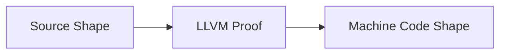
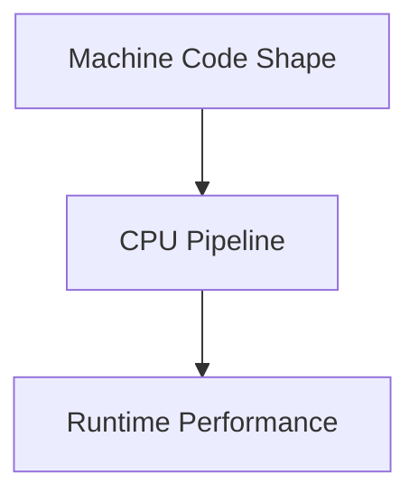
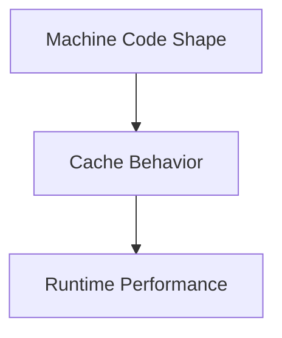
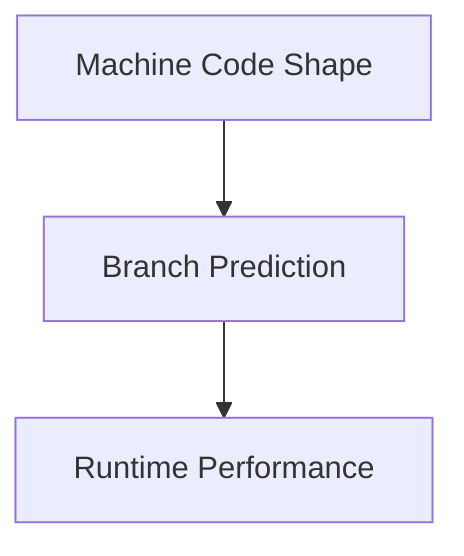
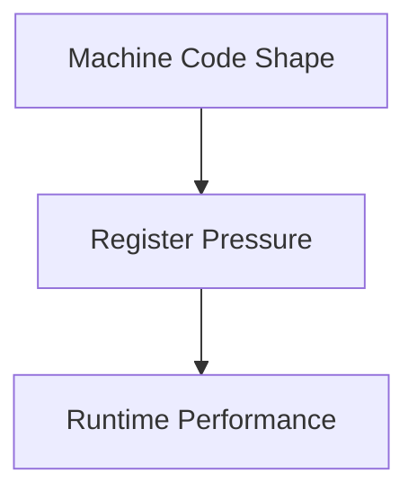

import AdBanner from '@site/src/components/AdBanner';
import Link from '@docusaurus/Link';
import Tabs from '@theme/Tabs';
import TabItem from '@theme/TabItem';

# Part 1: Why Compiler Decisions Affect Hardware Performance

A lot of compiler talk stops at "the compiler optimized the code."

That is usually where the conversation gets too tidy for its own good.

LLVM is not a dumb translator. It chooses a machine shape, and that shape decides how the CPU will fetch, decode, execute, and retire work. That is the part that actually matters when the benchmark stops being polite.

:::tip So the question I care about is not whether the compiler changed the code.
The question is whether it changed the code in a way the hardware can actually use without tripping over itself.
:::

When LLVM inlines a function, vectorizes a loop, or spills a value from a register to the stack, it changes the exact work the CPU must do. Sometimes that makes the program faster. Sometimes it just makes a different mess. Either way, compiler decisions are not neutral.

<div>
    <AdBanner />
</div>

## TL;DR

- Compiler output changes the CPU's pipeline, cache, branch, and register behavior.
- Good code shape gives LLVM proof; bad code shape forces LLVM to stay conservative.
- Inlining, vectorization, and register allocation are hardware decisions disguised as compiler decisions.
- The real performance question is not "did the compiler optimize?" but "did the hardware get a shape it can execute well?"

## Series Map

- [Part 1: Why](/docs/compilers/techblog/how-compiler-decisions-affect-hardware-performance/)
- [Part 2: How](/docs/compilers/techblog/how-compiler-decisions-affect-hardware-performance/how-developers-influence-compiler-decisions/)
- [Part 3: Practical](/docs/compilers/techblog/how-compiler-decisions-affect-hardware-performance/practical-compiler-control/)

## Visual Summary

<Tabs>
  <TabItem value="a" label="A: Source to Proof" default>



  </TabItem>
  <TabItem value="b" label="B: Pipeline Path">



  </TabItem>
  <TabItem value="c" label="C: Cache Path">



  </TabItem>
  <TabItem value="d" label="D: Branch Path">



  </TabItem>
  <TabItem value="e" label="E: Register Path">



  </TabItem>
</Tabs>

:::caution What This Article Is Really About
This is not an LLVM feature tour.
It is a hardware explanation of why a compiler decision changes runtime behavior.
:::

:::important What You Should Leave With
- The CPU executes instruction streams, not source-level abstractions
- Pipeline behavior, cache behavior, branch prediction, and register pressure all react to code shape
- Inlining, vectorization, and register allocation are not isolated compiler tricks
- The compiler is constantly trading one hardware bottleneck against another
:::

:::tip Read This In Order
If you want the full series, start here, then move to Part 2 and Part 3. Part 2 gets into the machinery; Part 3 is where we stop being philosophical and start running commands.
:::

## Table of Contents

1. [The Hardware Model](#the-hardware-model)
2. [Why Pipelines Care About Code Shape](#why-pipelines-care-about-code-shape)
3. [Why Cache Behavior Changes With Compiler Decisions](#why-cache-behavior-changes-with-compiler-decisions)
4. [Why Branch Prediction Matters](#why-branch-prediction-matters)
5. [Why Registers Matter](#why-registers-matter)
6. [Inlining](#inlining)
7. [Vectorization](#vectorization)
8. [Register Allocation](#register-allocation)
9. [The Practical Bottom Line](#the-practical-bottom-line)

## The Hardware Model

The CPU does not run source code.
It does not understand C++, Rust, or LLVM IR as languages.

What it actually runs is a stream of machine instructions, plus the data and control flow that surround those instructions.
That means the CPU is always reacting to a few concrete things:

- the order of instructions
- the pattern of branches
- the way memory is accessed
- the values that have to stay live in registers
- the width of the operations it can execute in parallel

LLVM sits between source code and hardware.
Its job is to turn a high-level program into a shape the machine can move through efficiently.

That shape matters because the hardware is limited in very specific ways:

- the pipeline can only keep so many instructions in flight
- the cache can only hold so much hot code and data
- the branch predictor can only guess based on the history it sees
- the register file can only hold so many live values
- the vector units only help when the code is regular enough to use them well

So the real question is not, "Did LLVM optimize the code?"

The real question is, "Did LLVM produce code the hardware can execute with less waiting and less wasted work?"

## Why Pipelines Care About Code Shape

Modern CPUs try to keep several stages busy at once. Fetch, decode, execute, and retire are all overlapping. The machine is fast when the next useful instruction is ready before the current one finishes.

That pipeline is fragile. A hard-to-predict branch, a long dependency chain, or a cache miss can drain it.

This is why compiler decisions matter. The compiler is deciding whether the CPU sees:

- a tight straight-line block
- a branchy control-flow graph
- a loop with predictable dependencies
- or a loop that constantly stalls on memory

The front end wants simplicity. The back end wants enough independent work to overlap. Good compiler decisions create both.

## Why Cache Behavior Changes With Compiler Decisions

The CPU does not pay for instructions in the abstract. It pays for instructions that must be fetched from memory hierarchy levels.

If the working set fits in L1, the machine feels very different than when it keeps missing in L3 or DRAM. That is why code size, locality, and access regularity matter so much.

Compiler decisions change cache behavior in two directions:

- larger inlined functions can push hot instructions out of the instruction cache
- vectorized loops can reduce dynamic instruction count and touch memory more efficiently
- spilled values can add extra loads and stores that compete for cache bandwidth

The CPU does not care that a transformation is elegant. It cares whether the transformed code stays hot.

## Why Branch Prediction Matters

Branch predictors try to guess where execution will go next. If they guess well, the pipeline keeps moving. If they guess badly, the CPU flushes work and starts over.

That makes control flow a performance feature, not just a correctness feature.

Compiler decisions affect the branch predictor by changing:

- how many branches exist
- how correlated they are
- how often the same path repeats
- whether the code can be turned into predication or straight-line code

A small, predictable branch may be cheaper than a giant branch-free expansion. A branchy shape with unstable history may be much worse than a compact comparison. The compiler has to balance both the predictor and the instruction cache.

## Why Registers Matter

Registers are the closest storage the core can use. They are faster than cache and much faster than DRAM.

When the compiler keeps a value in a register, the CPU can reuse it without extra memory traffic. When the compiler cannot keep it there, the value spills to the stack.

That changes performance immediately:

- register-resident values avoid loads and stores
- spills add memory traffic and may extend critical paths
- too many live values can reduce instruction throughput
- aggressive transformations can create more register pressure than the target can tolerate

This is why two functions with the same logic can perform very differently after compilation.

## Inlining

Inlining replaces a call with the body of the function.

The hardware effect is not just "fewer calls." It is:

- fewer control-flow boundaries
- more constant propagation
- more loop and branch simplification
- more opportunity to eliminate dead work across the call site

Inlining is often valuable for hot small functions because it removes the cost of jumping away and coming back. It also gives LLVM more room to optimize the surrounding code.

The tradeoff is equally real:

- code size grows
- the instruction cache sees more pressure
- more registers may be needed at once
- the function body may become less predictable for the front end

Inlining improves performance when the extra locality and simplification outweigh the size cost.

## Vectorization

Vectorization is one of the strongest transformations on modern CPUs because wide execution units can process multiple elements per instruction.

Instead of one add per iteration, the compiler may generate a SIMD loop that handles 4, 8, or 16 elements at once depending on the ISA.

This helps when the loop is regular:

- contiguous memory
- simple loop bounds
- little or no aliasing
- no complicated control flow

When those conditions are missing, vectorization becomes risky or impossible. The compiler may fall back to scalar code because correctness and profitability both matter.

## Register Allocation

Register allocation is the last major place where the compiler can make the CPU's life easier or harder.

If the allocator keeps hot values in registers, the machine sees less memory traffic. If it runs out of registers, it spills values and reloads them later.

That matters because spills are not just extra instructions. They can:

- create more cache traffic
- lengthen critical paths
- increase pressure on the load/store units
- break up otherwise efficient instruction sequences

Even when the source code is unchanged, the final machine code can behave very differently depending on how the allocator handles live ranges.

<Tabs>
  <TabItem value="coloring" label="Graph Coloring" default>
    <p>Graph coloring treats live ranges like nodes in an interference graph. If two values are live at the same time, they cannot use the same register.</p>
    <p>This is the classic global register allocation model described by Chaitin and later refined with spilling and coalescing. It is powerful because it makes the register file a hard resource, not a vague suggestion.</p>
  </TabItem>
  <TabItem value="scan" label="Linear Scan">
    <p>Linear scan walks live ranges in program order and assigns registers greedily.</p>
    <p>It is easier to implement and faster to run, which is why it is common in JIT compilers and other latency-sensitive pipelines. The tradeoff is that it can spill more often than a global allocator with a richer model.</p>
  </TabItem>
  <TabItem value="spill" label="Why Spills Matter">
    <p>A spill is not just an extra load or store. It can extend live ranges, create extra cache traffic, and force the hardware to spend time on movement instead of useful work.</p>
    <p>That is why register allocation is often the difference between "looks optimized" and "actually runs optimized."</p>
  </TabItem>
</Tabs>

## What The Compiler Is Really Searching For

LLVM is not looking for a perfect answer. It is looking for enough proof to cross a profitability threshold.

The proof can come from several places:

- type and pointer information
- loop canonicalization
- alias analysis
- target cost models
- profile-guided execution data
- prior simplifications from earlier passes

This is the reason a small source rewrite can change the optimization result more than a command-line flag. The flag changes the compiler's budget. The code changes the compiler's proof.

<Tabs>
  <TabItem value="proof" label="When The Compiler Has Proof" default>
    <ul>
      <li>Two pointers are proven not to alias.</li>
      <li>A loop has a regular iteration structure.</li>
      <li>A call target is known or strongly likely.</li>
      <li>Live ranges are small enough to fit in registers.</li>
    </ul>
  </TabItem>
  <TabItem value="doubt" label="When The Compiler Has Doubt">
    <ul>
      <li>Pointer relationships are unclear.</li>
      <li>Control flow is irregular.</li>
      <li>Hot and cold paths are mixed together.</li>
      <li>Too many values are live at once.</li>
    </ul>
  </TabItem>
</Tabs>

## Research Notes

The literature points to the same basic conclusion from different angles: compiler wins come from helping the hardware avoid wasted work.

Profile-guided inlining can be very effective, but only when the extra code it creates does not overwhelm the benefit.
Register allocation research shows that spilling is not a minor cleanup task; it is a real resource-allocation problem.
LLVM's vectorizer documentation shows that aliasing and runtime checks still decide whether a loop can safely widen.
Branch prediction work makes the same point from the control-flow side: if the hardware keeps guessing wrong, it wastes work that was already in flight.

The common theme is simple:
the compiler only buys performance when it helps the hardware bottleneck that actually matters.

## How To Read The Evidence

When you want to know whether the compiler helped, do not stop at the source code.

Look at the evidence in layers:

- optimized IR tells you what the compiler proved
- assembly tells you what the hardware will actually execute
- optimization remarks tell you why a pass did or did not fire
- performance counters tell you whether the change mattered at runtime

| Layer | What It Answers | What You Look For |
| --- | --- | --- |
| IR | What proof did LLVM gain? | Fewer `alloca`s, cleaner loops, stronger pointer attributes, visible vector types |
| Assembly | What shape will the CPU really execute? | Fewer branches, fewer loads/stores, vector instructions, shorter dependency chains |
| Remarks | Why did a pass fire or miss? | Vectorizer notes, inlining decisions, missed-opportunity explanations |
| Counters | Did the machine actually improve? | Cycles, IPC, branch misses, cache misses, stall behavior |

## Three Small Case Studies

The same compiler logic shows up repeatedly in real code.

<Tabs>
  <TabItem value="case1" label="Case 1: Reduction" default>
    <p>A reduction loop like `sum` is usually a good vectorization candidate because the compiler can see one accumulator, one regular loop, and one predictable memory stream.</p>
    <p>That is why the optimizer can widen the loop, keep a vector accumulator in registers, and do the final horizontal reduction at the end.</p>
  </TabItem>
  <TabItem value="case2" label="Case 2: Pointer Chasing">
    <p>A linked structure or pointer-rich traversal is much harder. The compiler sees uncertain aliasing, irregular access, and little room to reorder work safely.</p>
    <p>That usually leaves the hardware waiting on memory instead of keeping the pipeline busy.</p>
  </TabItem>
  <TabItem value="case3" label="Case 3: Hot Helper">
    <p>A small helper in a hot loop is only useful to the compiler if the body can actually be seen.</p>
    <p>Think of a helper like `bump(x) = x + 1` inside a reduction loop. If the compiler inlines it, the hot loop becomes a plain add inside the reduction and the helper disappears from the machine code.</p>
    <p>If it stays out of line, every iteration carries a call boundary. That keeps the loop larger, gives the optimizer less room to simplify, and makes the backend preserve extra structure in the hot path.</p>
    <p>That is a small example, but it is the same decision compilers make around any helper that sits on a hot path.</p>
  </TabItem>
</Tabs>

These three cases are simple, but they reflect the real decisions production compilers make every day.

## The Practical Bottom Line

Compiler decisions matter because hardware is not abstract.

It has:

- finite pipeline width
- finite cache capacity
- finite branch prediction accuracy
- finite register file size
- finite vector width

Every optimization choice moves work between those resources. That is the real reason compiler decisions affect performance.

Part 2 explains how compiler algorithms make those choices.

## More Compiler Decisions That Matter

Inlining, vectorization, and register allocation are the obvious examples.
They are not the only ones.

The same hardware story also depends on:

- instruction scheduling
- block placement
- loop unrolling
- tail duplication
- dead code elimination
- scalar replacement of aggregates
- devirtualization
- common subexpression elimination
- strength reduction
- loop-invariant code motion

Each one is a different way of reducing wasted work.

<Tabs>
  <TabItem value="sched" label="Instruction Scheduling" default>
    <p>Scheduling tries to order instructions so that the CPU does not sit idle waiting for a dependency to clear.</p>
    <p>That matters because a dependency chain can turn a wide machine into a much narrower machine if the work arrives in the wrong order.</p>
  </TabItem>
  <TabItem value="layout" label="Block Placement">
    <p>Block placement tries to make the most common paths fall through naturally.</p>
    <p>That helps the branch predictor, the instruction cache, and the fetch unit all at once.</p>
  </TabItem>
  <TabItem value="sroa" label="Scalar Replacement">
    <p>When the compiler breaks aggregates into independent scalars, more values can live in registers and more dead traffic can disappear.</p>
    <p>This is one of the quiet optimizations that often matters more than the headline pass names suggest.</p>
  </TabItem>
</Tabs>

## Why The Front End Cares About Shape

The front end is the part of the CPU that fetches and decodes instructions.
It is also the part that suffers first when code becomes too large or too branchy.

If the front end is unhappy, the rest of the machine waits.

That is why the compiler has to think about:

- instruction density
- code size after inlining
- predictable fallthrough paths
- whether a loop body remains compact
- whether hot code stays together in memory

The front end is not just a decode problem.
It is a locality problem.

## Why The Back End Cares About Live Ranges

The back end sees the same code from a different angle.

It has to answer questions like:

- how many values are alive at once?
- which values need to stay in registers?
- which values can be recomputed cheaply?
- which loads can move?
- which stores must stay ordered?

That is why the backend can turn one source-level idea into several very different machine-code shapes.

Two loops that look the same in C++ can be very different in the backend if one exposes more independent values and the other hides everything behind aliases.

## A Short Checklist For Reading Compiler Output

If you open IR or assembly and want to know whether the compiler helped, check these first:

- Is the loop canonical?
- Are there fewer loads and stores than before?
- Did branch count go down?
- Did a call disappear?
- Did a vector type appear?
- Did the function gain or lose attributes like `readonly` or `nocapture`?
- Did the instruction stream become shorter but denser?
- Did spill traffic show up near hot loops?

If several answers are "yes," the compiler probably found a better shape.

## Common Misreadings

People often misread the results of optimization.

Some common mistakes:

- assuming more instructions means slower code
- assuming fewer instructions always means faster code
- assuming vectorization always wins
- assuming inlining always helps
- assuming register spills are only a codegen detail
- assuming branch count alone predicts runtime

The real answer is always a tradeoff between multiple hardware resources, which is why one isolated metric rarely tells the whole story.

## A Bigger Mental Model

The shortest summary of this article is this:

The compiler is a machine for turning high-level structure into low-level opportunity.

If the structure is clear, the compiler gets to exploit more opportunities.
If the structure is unclear, the compiler has to stay conservative.

That is why performance work is partly a compiler problem and partly a communication problem.
You are communicating intent to a static optimizer.
If the intent is visible, the optimizer can work.
If the intent is hidden, the optimizer guesses.

## Deep Dive Appendix

The sections above give the main line of the argument.
The appendix goes deeper into the same idea from several directions so you can use the article as a reference later.

<Tabs>
  <TabItem value="a" label="A: Frontend Pressure" default>

The CPU frontend is easy to ignore because it is invisible at the source level.
It matters anyway because the frontend decides whether the machine can even deliver instructions to the backend fast enough.

Frontend pressure usually shows up as:

- extra fetch work because the code footprint is too large
- extra decode work because the instruction stream is too dense or too irregular
- extra branch work because the control-flow graph has too many breaks
- extra misprediction work because the hot path is unstable

In practice, the frontend is often the first place where an overly aggressive transformation backfires.
Inlining can expose opportunities and also grow code too much.
Unrolling can remove loop branches and also create an instruction stream that is harder to keep hot.
Block duplication can reduce branch cost and also increase instruction-cache pressure.

The key idea is not that frontend work is always bad.
The key idea is that the frontend has a finite budget, and the compiler can spend it too quickly.

  </TabItem>
  <TabItem value="b" label="B: Backend Pressure">

The backend is where the compiler decides how much work the core can actually keep in flight.

Backend pressure usually shows up as:

- too many live values
- too many dependent operations
- too many memory operations
- too many spills
- too little instruction-level parallelism

This is why backend tuning often feels like a game of removing friction.
You are not trying to invent more hardware.
You are trying to stop the generated code from wasting the hardware that already exists.

The backend is also where source-level intuition often fails.
A small source change can create a large backend change if it shortens a live range or clarifies a dependency.
That is why compiler engineers inspect IR and assembly instead of guessing from source code alone.

  </TabItem>
  <TabItem value="c" label="C: Memory Bound">

Not every slowdown is caused by arithmetic.
Many programs are memory-bound:

- the arithmetic is cheap
- the data movement is expensive
- the CPU spends more time waiting than computing

Compiler decisions still matter here.
They cannot invent locality, but they can reduce some of the damage:

- by keeping hot values in registers
- by reducing unnecessary loads and stores
- by hoisting invariant work out of loops
- by making access patterns more predictable

But there is a limit.
If the data structure itself is a poor fit for the access pattern, the compiler can only help so much.
That is why system-level performance work often involves both code structure and algorithm structure.

  </TabItem>
  <TabItem value="d" label="D: Branch Bound">

A branch-heavy hot path can be just as limiting as a memory-bound one.

If the branch predictor keeps getting surprised, the hardware spends more time recovering from wrong guesses than doing useful work.
That is why compilers care about:

- fallthrough structure
- branch probability
- hot/cold code separation
- block placement
- if-conversion where appropriate

Sometimes a branch is the right answer.
Sometimes a branch-free transformation is better.
The compiler has to decide which choice keeps the machine busier.

  </TabItem>
  <TabItem value="e" label="E: Register Bound">

Register pressure is one of the least visible bottlenecks.
It appears when too many values have to stay live at the same time.

Register pressure rises when you:

- inline too aggressively
- unroll too aggressively
- expose too many temporaries
- widen too many values at once

The compiler often trades one kind of win for another.
Vectorization may reduce instruction count while increasing register pressure.
Inlining may remove calls while increasing live range overlap.
Unrolling may lower branch cost while forcing spills.

That is why code generation is a balancing act, not a one-direction optimization.

  </TabItem>
</Tabs>

### F. Same Code, Different CPUs

The source does not change, but the target machine does.

That means the compiler has to fit the same logical work into different hardware budgets:

- vector width
- cache size
- branch predictor quality
- reorder-buffer depth
- load/store throughput
- register count

The result is not one universal assembly shape.
One CPU may get a compact scalar loop.
Another may get a wider vector loop.
Another may prefer fewer transformations because the code would otherwise grow past the machine's comfort zone.

### G. IR And Assembly Are Two Different Kinds Of Evidence

IR tells you what the compiler can prove.
Assembly tells you what survived into machine code.

If the IR is clean, the compiler can often see aliasing boundaries, loop structure, invariants, and dead values.
If the assembly is clean, you can see whether that proof actually turned into fewer branches, fewer loads, better vector use, or shorter dependency chains.

Use both views.
IR explains the decision.
Assembly confirms the result.

### H. Optimizations Work In Chains

Compiler passes rarely help in isolation.

One pass exposes facts for the next:

- inlining can expose constants
- constant propagation can remove branches
- branch removal can make vectorization easier
- vectorization can make unrolling worthwhile
- unrolling can expose instruction-level parallelism
- register allocation decides whether that extra freedom survives

That is why the compiler has a pipeline.
It is building proof step by step, not pressing one magic optimization button.

The process still has a budget.
If code growth, proof cost, or register pressure get too high, later passes stop getting a good return.

### I. How To Read A Hot Loop

When you inspect a hot loop, follow the hardware, not the source syntax.

1. Check the loop shape.
2. Check the memory pattern.
3. Check the branch pattern.
4. Check the dependency chain.
5. Check live ranges and register pressure.
6. Check for spills and reloads.
7. Check whether vector operations appeared.

This order keeps you from chasing the wrong symptom.
A spill may be caused by earlier unrolling.
A branch miss may be caused by a layout choice.
A slow loop may be memory-bound even when the arithmetic looks expensive.

### J. Four Common Source Shapes

The same bottlenecks keep showing up in a few recurring code shapes.

| Shape | What Dominates | What The Compiler Tries To Do |
| --- | --- | --- |
| Compute-heavy | Arithmetic and data parallelism | Vectorize, schedule, and keep work in flight |
| Memory-heavy | Loads, stores, and locality | Reduce extra memory traffic and keep hot values in registers |
| Branch-heavy | Control flow | Make the likely path easy to predict and keep the rare path isolated |
| Call-heavy | Call overhead and abstraction layers | Inline or devirtualize when it is profitable, but avoid code bloat |

The important point is not the label.
The important point is which hardware resource is being stressed.

### K. One Loop, Three Shapes

Take a reduction over an array.

```c
for (int i = 0; i < n; ++i)
  sum += a[i];
```

This is the easiest form for the compiler to reason about.
The loop is regular, the access pattern is obvious, and the accumulator can often stay in a register.

```c
for (int i = 0; i < n; ++i)
  sum += a[idx[i]];
```

Now the memory pattern is indirect.
The compiler has less confidence about locality and more uncertainty about what is being touched.

```c
for (int i = 0; i < n; ++i)
  sum += fetch_value(a, i);
```

Now the call boundary hides part of the loop body.
The compiler has to decide whether inlining helps more than it hurts.

The algorithm is still a reduction.
The code shape is what changes the optimizer's options.

### L. The Practical Decision Table

| Compiler Decision | Good Outcome | Main Cost |
| --- | --- | --- |
| Inlining | Removes call overhead and reveals more optimization opportunities | Code growth and register pressure |
| Vectorization | Uses wide execution units and lowers per-element instruction count | Alias checks, epilogues, and extra live values |
| Unrolling | Reduces branch overhead and exposes more parallel work | Bigger code and more spills |
| Block placement | Improves fallthrough and branch prediction | Layout complexity |
| Register allocation | Keeps hot values in registers | Spills and reloads |
| LICM | Hoists repeated work out of loops | Longer live ranges |
| Scalar replacement | Breaks aggregates into registers | More SSA values to manage |

Every useful transformation spends a different budget.
The optimizer is choosing which budget the hardware can afford to spend.

### M. Closing Rule

If you need one rule to carry into practice, use this:

> start with the hottest loop, check whether it is regular, then look at aliasing and register pressure before touching flags.

That is the practical end of Part 1.
The best compiler decisions are the ones that make the next bottleneck easier to see and cheaper to fix.

## Hardware Bottleneck Matrix

The fastest way to reason about a compiler decision is to ask which hardware resource it stresses.

<Tabs>
  <TabItem value="pipeline" label="Pipeline" default>
    <p>Pipeline problems show up when dependency chains, branch mispredicts, or long-latency operations stop the CPU from keeping work in flight.</p>
    <p>Common compiler responses include scheduling, unrolling, speculation-friendly block layout, and reducing control-flow noise.</p>
  </TabItem>
  <TabItem value="cache" label="Cache">
    <p>Cache problems show up when code or data no longer fits comfortably in the cache hierarchy.</p>
    <p>Common compiler responses include smaller hot loops, less unnecessary inlining, more locality-friendly access patterns, and fewer spills.</p>
  </TabItem>
  <TabItem value="branch" label="Branch">
    <p>Branch problems show up when the predictor sees unstable control flow.</p>
    <p>Common compiler responses include if-conversion, block placement, branch simplification, and reducing the number of unpredictable exits.</p>
  </TabItem>
  <TabItem value="register" label="Registers">
    <p>Register problems show up when too many values are live at once.</p>
    <p>Common compiler responses include better allocation, scalar replacement, less aggressive unrolling, and less inlining in the hottest path.</p>
  </TabItem>
</Tabs>

## Four Real-World Shapes

The same hardware bottlenecks show up in four recurring source-code shapes.

### 1. Compute-Heavy Kernels

These are loops where arithmetic is the dominant work.

- matrix operations
- reductions
- stencil-like loops
- simple transforms over arrays

The compiler often helps a lot here because the code has enough regularity for vectorization and scheduling to matter.
If the loop is clean, the hardware can often run close to its strengths.

### 2. Memory-Heavy Kernels

These are loops where data movement dominates.

- linked structures
- pointer-chasing traversals
- sparse access patterns
- map-like lookups over large data sets

The compiler cannot invent locality, but it can still avoid making things worse.
If the code shape hides aliasing or forces extra loads, it can push an already memory-bound kernel further into the red.

### 3. Branch-Heavy Kernels

These are loops where the decision tree dominates.

- classification code
- parsers
- dispatch loops
- error handling mixed into hot paths

In these cases, control-flow shape often matters more than arithmetic.
The best compiler win may be to make the likely path obvious and isolate the rare path.

### 4. Call-Heavy Kernels

These are loops that bounce through helper layers.

- virtual or indirect calls
- abstraction-heavy code
- callbacks inside hot loops
- repeated wrappers around small operations

Inlining and devirtualization matter a lot here.
But the compiler still has to balance code growth and register pressure.

## A Decision Table

This table is the practical version of the article's thesis.

| Compiler Decision | Good Outcome | Risk |
| --- | --- | --- |
| Inlining | Removes call overhead and exposes optimization opportunities | Code growth, instruction-cache pressure, register pressure |
| Vectorization | Uses wide execution units and reduces per-element instruction count | Alias uncertainty, register pressure, larger epilogues |
| Unrolling | Reduces branch overhead and exposes ILP | Code bloat, spill risk |
| Block placement | Improves fallthrough and branch prediction | Can increase layout complexity |
| Register allocation | Keeps hot values in registers | Spills, reloads, pressure on load/store units |
| LICM | Hoists repeated work out of loops | May lengthen live ranges |
| Scalar replacement | Breaks aggregates into registers | More SSA values, more allocation pressure |

The point of the table is not to memorize every row.
The point is to see the repeated pattern: every useful transformation shifts pressure somewhere else, so the real question is which pressure the machine can tolerate best.

## A Worked Mini Example

Imagine the same loop in three different forms.

### Form A: Clean Array Loop

```c
for (int i = 0; i < n; ++i)
  sum += a[i];
```

The compiler sees a regular loop, a clear accumulator, and a predictable memory access pattern.
That is why this shape is often a vectorization favorite.

### Form B: Indirect Access Loop

```c
for (int i = 0; i < n; ++i)
  sum += a[idx[i]];
```

The compiler now has to reason about another level of indirection.
It may still optimize, but the proof is weaker and the memory pattern is less regular.

### Form C: Hidden Through Calls

```c
for (int i = 0; i < n; ++i)
  sum += fetch_value(a, i);
```

Now the compiler has to inspect the callee, understand aliasing through parameters, and decide whether inlining is worth the risk.
This can still be a good design, but it is much less obviously optimization-friendly.

## A More Detailed View Of Cache Effects

People often say "cache locality matters" without explaining why.

The practical reason is simple:

- small hot code stays close to the instruction fetch path
- repeated data stays close to the load/store path
- repeated execution of the same loop benefits from both

The compiler influences all three by changing:

- what gets duplicated
- what gets hoisted
- what gets spilled
- what gets merged
- what gets kept in registers

This is why the article keeps connecting source shape to hardware state.

## A More Detailed View Of Branch Effects

Branch prediction is not just about whether a branch is "taken" or "not taken."

It is also about:

- how much historical context the predictor has
- how stable the path is
- whether the same branch appears in many different contexts
- whether the hot path is easy to isolate

The compiler helps when it can make the hot path obvious.
The compiler hurts when it mixes hot and cold behavior in the same region.

## A More Detailed View Of Register Effects

Registers are the most precious fast resource in the core.

Every extra live value is a little bit of pressure.
Some pressure is fine.
Too much pressure causes spills.

That is why the compiler often prefers:

- fewer live temporaries
- simpler loop bodies
- shorter live ranges
- fewer unnecessary inlines in already wide code

The same logic explains why "more optimization" can sometimes be worse.
The optimizer can increase the local quality of computation while increasing global pressure.

## A Closing Practical Rule

If you do not know where to start, ask three questions:

1. Is the hot path regular?
2. Is the data layout obvious?
3. Is the compiler getting enough proof to be aggressive?

If the answer to any of those is no, that is usually where the performance work begins.

Quick take:

- regular hot paths are easier for the compiler to optimize
- clear data layout gives the optimizer more proof
- fewer live values and simpler control flow reduce hardware pressure

If you want one sentence:

> good compiler decisions make the hardware's job easier by making the code easier to reason about.

## References

- [LLVM Auto-Vectorization in LLVM](https://llvm.org/docs/Vectorizers.html)
- [LLVM Alias Analysis Infrastructure](https://llvm.org/docs/AliasAnalysis.html)
- [LLVM `opt` command guide](https://llvm.org/docs/CommandGuide/opt.html)
- [LLVM Remarks](https://llvm.org/docs/Remarks.html)
- [LLVM Transform Passes](https://llvm.org/docs/Passes.html)
- [A comparative study of static and profile-based heuristics for inlining](https://research.ibm.com/publications/a-comparative-study-of-static-and-profile-based-heuristics-for-inlining)
- [Register allocation via coloring](https://research.ibm.com/publications/register-allocation-via-coloring)
- [Register allocation and spilling via graph coloring](https://research.ibm.com/publications/register-allocation-andamp-spilling-via-graph-coloring)
- [Dynamic path-based branch correlation](https://research.ibm.com/publications/dynamic-path-based-branch-correlation)

<div style={{display: 'flex', gap: '1rem', flexWrap: 'wrap', marginTop: '2rem'}}>
  <Link to="/docs/compilers/techblog/how-compiler-decisions-affect-hardware-performance/how-developers-influence-compiler-decisions/">Continue to Part 2: How</Link>
  <Link to="/docs/compilers/techblog/how-compiler-decisions-affect-hardware-performance/practical-compiler-control/">Jump to Part 3: Practical</Link>
</div>

## Related Reading

- [Compiler Tech Blog](/docs/compilers/techblog/)
- [Compiler home](/docs/compilers/)
