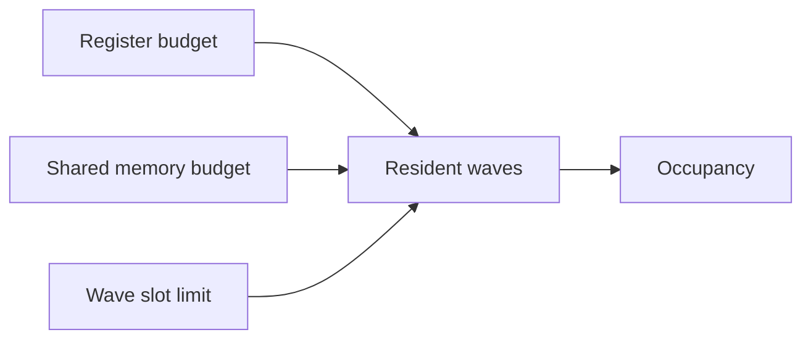
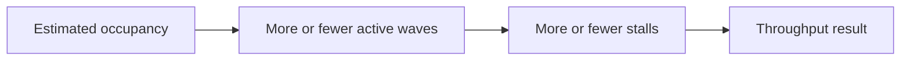

import AdBanner from '@site/src/components/AdBanner';
import Link from '@docusaurus/Link';
import Tabs from '@theme/Tabs';
import TabItem from '@theme/TabItem';

# Part 2: How to Calculate It

Part 1 explained why register pressure hurts.
This part shows how to estimate it from three angles:

- VGPR / SGPR counts
- LLVM / backend view
- occupancy calculation

The key point is simple: register pressure is not one magic number.
It is a resource balance problem. The backend is trying to fit live values into a finite register file while still leaving room for enough active waves or warps.

So the natural question is:

:::important What should you measure?
We measure how many registers the compiler assigns, how much occupancy the launch shape allows, and whether spilling starts to show up.
:::

<div>
  <AdBanner />
</div>

## TL;DR

- Measure register use from the compiler report.
- Estimate how many waves or warps can stay resident.
- Check shared memory and slot limits.
- Use the result to decide whether to change the kernel shape.
- Treat the number as a guide, not a promise.

## Series Map

- <Link to="/docs/compilers/techblog/register-pressure-on-gpu/">Part 1: Why</Link>
- <Link to="/docs/compilers/techblog/register-pressure-on-gpu/how-to-calculate-it/">Part 2: How to Calculate It</Link>
- <Link to="/docs/compilers/techblog/register-pressure-on-gpu/how-to-reduce-it/">Part 3: How to Reduce It</Link>

## Visual Summary

<Tabs>
  <TabItem value="a" label="A: Budget Model" default>



  </TabItem>
  <TabItem value="b" label="B: Compiler View">


  </TabItem>
  <TabItem value="c" label="C: Runtime View">



  </TabItem>
</Tabs>

:::caution What This Article Is Really About
This is not an occupancy cheat sheet.
It is a way to turn compiler output into a resource model you can reason about.
:::

:::important What You Should Leave With
- Occupancy is the output of a resource calculation
- Register use is only one gate, but it is often the first gate that closes
- The compiler report and the launch shape both matter
- The estimate is useful even when it is not exact
:::

## Table of Contents

1. [The Resource Model](#the-resource-model)
2. [What The Compiler Reports](#what-the-compiler-reports)
3. [A Practical Calculation](#a-practical-calculation)
4. [What Occupancy Is Measuring](#what-occupancy-is-measuring)
5. [Where The Formula Breaks Down](#where-the-formula-breaks-down)
6. [How To Inspect It In Practice](#how-to-inspect-it-in-practice)
7. [How To Read The Result](#how-to-read-the-result)
8. [What This Means For Kernels](#what-this-means-for-kernels)

## Start With The Right Model

For GPU work, the simplest useful model is:

```text
resident_waves = min(register_limit, shared_memory_limit, wave_slot_limit)
occupancy = resident_waves / max_waves_per_cu
```

That is the high-level answer.
The more practical version is:

```text
waves_by_vgpr = floor(vgpr_budget / vgpr_cost_per_wave)
waves_by_sgpr = floor(sgpr_budget / sgpr_cost_per_wave)
waves_by_lds  = floor(lds_budget  / lds_cost_per_workgroup)

resident_waves = min(waves_by_vgpr, waves_by_sgpr, waves_by_lds, wave_slot_limit)
occupancy = resident_waves / max_waves_per_cu
```

The exact budgets are architecture specific, and the register allocation granularity is not always one-to-one with the source code. That is why the compiler and occupancy tools matter.

## The Resource Model

The important part of the model is not the formula shape.
It is the idea that every resource gate can reduce residency.

In practice, the resource gates are:

- registers
- shared memory
- wave or warp slots
- block or work-group size constraints

The kernel only gets the residency that survives all of them.

## VGPR / SGPR Counts

When you inspect a GPU kernel, you usually want three things:

1. Registers per thread or per wave.
2. Shared memory per work-group.
3. The launch shape, especially block size or work-group size.

On AMD HIP, the compiler and tooling can report register usage and occupancy estimates directly.
The ROCm performance guidelines recommend checking resource usage and using occupancy tools as part of the optimization workflow.

That is the bridge from theory to practice:

- the compiler tells you what the kernel costs
- the occupancy model tells you what that cost means
- the runtime tells you whether the cost was worth paying

## LLVM / Backend View

The compiler report is only the first layer.
The backend view tells you why the count changed.

Look for:

- live ranges that overlap for too long
- values that stay alive across multiple instructions
- inlining or unrolling that increases register demand
- spill code that shows the allocator ran out of room

This is the point where LLVM and the GPU backend become useful.
They explain how source shape turns into register demand.

## Occupancy Calculation

Once you know the register cost, turn it into an occupancy estimate.

Use the same model from above:

```text
resident_waves = min(register_limit, shared_memory_limit, wave_slot_limit)
occupancy = resident_waves / max_waves_per_cu
```

If VGPR or SGPR usage goes up, the resident-wave count usually goes down.
That is why a small code change can move a kernel across a threshold.

### Full Numeric Example

On this machine, `rocminfo` reports:

- `GPU = AMD Radeon RX 9060 XT (gfx1200)`
- `wavefront size = 32`
- `max waves per CU = 32`
- `compute units = 32`

AMD's hardware spec for the RX 9060 XT lists a [VGPR File of `768 KiB`](https://rocm.docs.amd.com/en/latest/reference/gpu-arch-specs.html).
That is the register file size we will use for the example below.

How to get these values:

```bash
rocminfo | rg "Marketing Name|Wavefront Size|Max Waves Per CU|Compute Units"
```

Sample output:

```text
Marketing Name:          AMD Radeon RX 9060 XT
Compute Unit:            32
Wavefront Size:          32
Max Waves Per CU:        32
```

The `VGPR File` value comes from AMD's hardware-spec table, not from `rocminfo`.
For this GPU, that table is the [ROCm GPU architecture specs page](https://rocm.docs.amd.com/en/latest/reference/gpu-arch-specs.html).

Convert that file size to 32-bit registers:

```text
768 KiB = 768 * 1024 bytes = 786432 bytes
786432 / 4 = 196608 registers
```

Now use these values:

- `VGPR per thread = 256`
- `wave size = 32`
- `max waves per CU = 32`

First compute the VGPR cost per wave:

```text
VGPR per wave = 256 * 32 = 8192
```

Now compute how many waves fit by VGPR:

```text
waves_by_vgpr = 196608 / 8192 = 24 waves
```

Occupancy from VGPR alone is:

```text
occupancy = 24 / 32 = 0.75 = 75%
```

Now increase register use:

- `VGPR per thread = 512`

Then:

```text
VGPR per wave = 512 * 32 = 16384
waves_by_vgpr = 196608 / 16384 = 12 waves
occupancy = 12 / 32 = 0.375 = 37.5%
```

That is the cleanest way to see register pressure in numbers:
more registers per thread means fewer waves fit, and occupancy drops.

## A Practical Calculation

Suppose you have a kernel with these properties:

- 256 threads per work-group
- 64 threads per wave
- high VGPR usage per thread
- moderate shared memory use

You can reason about it like this:

1. A 256-thread work-group becomes 4 waves on a 64-thread machine.
2. Each wave carries the register demand of the per-thread live set.
3. The CU can only keep a finite number of such waves resident.
4. If register demand is high enough, the CU runs fewer waves than the hardware maximum.
5. Lower resident-wave count means lower occupancy.

That is the core loop.

The important detail is that the drop is often step-like, not smooth.
That is why one more temporary, one more unroll step, or one more inlined helper can move the kernel over a threshold.

## Manual Calculation With More Data

Here is a slightly richer way to reason about the same kernel family.

Assume the target GPU has:

- 64 lanes per wave
- a finite VGPR budget per wave slot
- a finite SGPR budget per wave slot
- a shared-memory limit per work-group

Now compare three versions of the same kernel shape:

| Version | VGPR trend | SGPR trend | Estimated residency | Likely result |
| --- | --- | --- | --- | --- |
| Baseline | Moderate | Moderate | Good | Healthy occupancy |
| After inlining | Higher | Slightly higher | Lower | Fewer resident waves |
| After extra unrolling | Much higher | Similar | Lower still | Spills or visible slowdown |

The exact numbers depend on target and compiler version, but the direction is what matters.

What you are watching for is the point where one more code-shape change moves the kernel from "fits comfortably" to "barely fits" to "does not fit well at all."

### Example interpretation

If the compiler report shows that VGPR usage jumped after inlining, but the instruction count only fell a little, the change may have traded a small call overhead reduction for a much larger residency loss.

That is the kind of tradeoff you want to notice early.

## Manual Calculation From The Kernel

Use the same kernel from Part 1:

```c
float x0 = x[i];
float y0 = y[i];
float t0 = a * x0;
float t1 = b * y0;
float t2 = t0 + t1;
float t3 = t2 + c;
out[i] = t3 * (x0 + y0);
```

Now count the values that must stay live at each step:

| Point | Live values | Count |
| --- | --- | --- |
| After loading `x0`, `y0` | `i`, `x0`, `y0` | 3 |
| After `t0 = a * x0` | `i`, `x0`, `y0`, `t0` | 4 |
| After `t1 = b * y0` | `i`, `x0`, `y0`, `t0`, `t1` | 5 |
| After `t2 = t0 + t1` | `i`, `x0`, `y0`, `t2` | 4 |
| After `t3 = t2 + c` | `i`, `x0`, `y0`, `t3` | 4 |
| At the final store | `x0`, `y0`, `t3` | 3 |

The peak here is the important part.
This kernel reaches a live-value peak of about 5 at the point where `x0`, `y0`, `t0`, and `t1` overlap.

That is not the exact register count, but it is the shape the allocator has to handle.

## By Code

You can also approximate the same idea with a small script that tracks live values per statement.

```python
stmts = [
    {"defs": ["x0"], "uses": ["x"]},
    {"defs": ["y0"], "uses": ["y"]},
    {"defs": ["t0"], "uses": ["a", "x0"]},
    {"defs": ["t1"], "uses": ["b", "y0"]},
    {"defs": ["t2"], "uses": ["t0", "t1"]},
    {"defs": ["t3"], "uses": ["t2", "c"]},
    {"defs": ["out"], "uses": ["t3", "x0", "y0"]},
]

live = set()
peak = 0

for stmt in stmts:
    live.update(stmt["uses"])
    live.update(stmt["defs"])
    peak = max(peak, len(live))

print("approx live values:", peak)
```

This is only a heuristic.
The real compiler has to solve live ranges, reuse, and architecture-specific register rules.
Still, the script shows the same direction: when more values stay live together, register demand rises.

If you want the real backend number, use the compiler and tooling:

- `hipcc --resource-usage`
- `rocprofv3 --occupancy`
- `llvm-objdump -d`

That gives you the actual register count, spill evidence, and occupancy estimate.

### Manual estimate by eye

When you inspect the IR or kernel source, ask:

- how many values are live across the hottest path
- how many of them are reused late
- whether the kernel keeps temporaries alive just because the source structure is wide
- whether shared memory or recomputation would be cheaper than keeping everything live

Those answers are often enough to explain why the register count moved.

### Example shape

If a kernel needs a lot of registers per thread, then a wave consumes more of the register file.
Once the allocator crosses a threshold, one more wave no longer fits.
That is the point where occupancy drops abruptly rather than gradually.

### Why the threshold feels surprising

Developers often expect performance to degrade smoothly.
It does not.
Register allocation and occupancy usually change in steps.
That is why a tiny source change can trigger a big performance jump or drop.

## The Practical Bottom Line

The number is not the goal.
The goal is to use the number to decide whether you should:

- change the kernel shape
- change the launch shape
- reduce live values
- or stop chasing registers because the bottleneck is elsewhere

That is what makes the calculation worth doing.

## What Occupancy Is Measuring

Occupancy is not the same as performance.

It is a measure of how much of the machine is busy with resident work.
AMD documentation describes occupancy as active warps relative to the maximum possible warps per CU. See the [HIP programming model](https://rocm.docs.amd.com/projects/HIP/en/develop/understand/programming_model.html) and the [hardware implementation guide](https://rocm.docs.amd.com/projects/HIP/en/docs-6.2.0/understand/hardware_implementation.html).

That means:

- high occupancy helps hide latency
- low occupancy can expose latency
- but extremely high occupancy is not automatically better if it forces register reduction or heavier spilling

So the number is useful, but it is only one part of the story.

## Where The Formula Breaks Down

The simple formula is useful, but it leaves out the messy parts:

- register allocation granularity
- instruction scheduling effects
- spilling cost
- divergence
- control-flow shape
- dependencies between values

That is why two kernels with the same register count can still behave differently.
The live ranges matter, not just the total count.

## How To Inspect It In Practice

<Tabs>
  <TabItem value="amd" label="AMD / HIP" default>

```bash
hipcc --resource-usage your_kernel.hip
rocprofv3 --occupancy ./your_app
```

The first command tells you how much register and shared-memory pressure the kernel creates.
The second helps you see how much of the machine can stay resident for the chosen launch shape.

  </TabItem>
  <TabItem value="llvm" label="LLVM / ISA">

```bash
llvm-objdump -d your_kernel.o
```

Look for the final ISA shape, register counts, and spill-related memory traffic.

  </TabItem>
</Tabs>

## How To Read The Result

If the compiler says the kernel uses a lot of registers and the occupancy tool says only a few waves fit, you usually have a register-pressure problem.

If occupancy is fine but performance is still poor, the bottleneck may be memory bandwidth, divergence, or instruction mix instead.

That distinction matters because register pressure is only one part of GPU performance.

## What This Means For Kernels

The practical implication is simple:

- lower register pressure can improve residency
- better residency can improve throughput

But there is a tradeoff.

Reducing registers too aggressively can force recomputation, increase instruction count, or introduce more memory traffic. The right answer is not "minimize registers at all costs." The right answer is "find the register level that gives enough occupancy without creating worse work elsewhere."

## References

- [AMD HIP performance optimization guide](https://rocm.docs.amd.com/projects/HIP/en/develop/understand/performance_optimization.html)
- [AMD HIP performance guidelines](https://rocm.docs.amd.com/projects/HIP/en/develop/how-to/performance_guidelines.html)
- [AMD HIP programming model](https://rocm.docs.amd.com/projects/HIP/en/develop/understand/programming_model.html)
- [AMD hardware implementation guide](https://rocm.docs.amd.com/projects/HIP/en/docs-6.2.0/understand/hardware_implementation.html)
- [ROCm GPU architecture specs](https://rocm.docs.amd.com/en/latest/reference/gpu-arch-specs.html)
- [NVIDIA CUDA C Programming Guide](https://docs.nvidia.com/cuda/cuda-c-programming-guide/)
- [Software-Directed Techniques for Improved GPU Register File Utilization](https://research.nvidia.com/publication/2018-09_software-directed-techniques-improved-gpu-register-file-utilization)

## Next Step

- <Link to="/docs/compilers/techblog/register-pressure-on-gpu/">Read Part 1: Why</Link>
- <Link to="/docs/compilers/techblog/register-pressure-on-gpu/how-to-reduce-it/">Read Part 3: How to Reduce It</Link>
