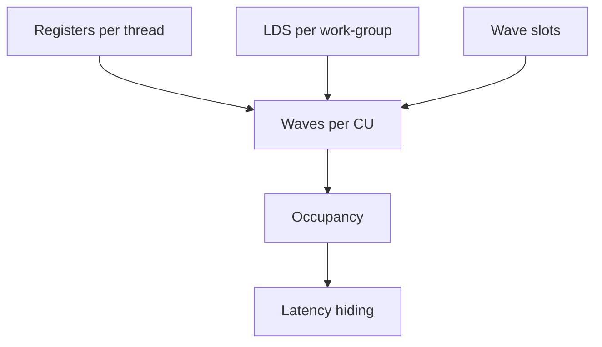
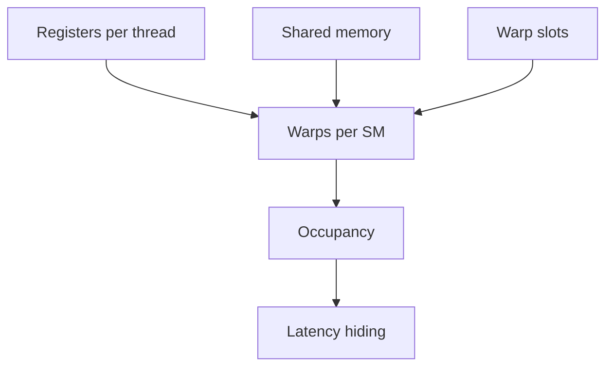

import AdBanner from '@site/src/components/AdBanner';
import Link from '@docusaurus/Link';
import Tabs from '@theme/Tabs';
import TabItem from '@theme/TabItem';

# Part 1: Why Kernels Fail Under Register Pressure

This article starts with the GPU memory hierarchy, then shows why registers are the first resource to run out, and ends with a small kernel that makes the pressure visible.

:::caution GPU hierarchy in one minute
If you already know GPU architecture, this will sound familiar. If not, think of a GPU as a factory built to process thousands of small tasks at the same time. The program running on the GPU is usually called a [kernel](https://docs.nvidia.com/cuda/cuda-programming-guide/01-introduction/programming-model.html) in compute programming or a [shader](https://forums.developer.nvidia.com/t/definition-of-term-shader/203263) in graphics programming, and the GPU does not execute it as one large block of work. Instead, it breaks the workload into a [grid](https://docs.nvidia.com/cuda/cuda-programming-guide/01-introduction/programming-model.html), divides that grid into [blocks](https://docs.nvidia.com/cuda/cuda-programming-guide/01-introduction/programming-model.html), and schedules those blocks onto [streaming multiprocessors](https://docs.nvidia.com/cuda/cuda-programming-guide/03-advanced/advanced-kernel-programming.html?hl=en-US) (SMs) on NVIDIA GPUs and [compute units](https://rocm.docs.amd.com/projects/HIP/en/docs-6.3.0/understand/programming_model.html) (CUs) on AMD GPUs. Each block contains many [threads](https://docs.nvidia.com/cuda/cuda-programming-guide/02-basics/writing-cuda-kernels.html), and inside an SM or CU those threads are grouped into [warps](https://docs.nvidia.com/cuda/cuda-programming-guide/03-advanced/advanced-kernel-programming.html?hl=en-US) on NVIDIA or [wavefronts](https://rocm.docs.amd.com/projects/HIP/en/docs-6.3.0/understand/programming_model.html) on AMD so they can execute together.

This layered model is why GPUs stay efficient on highly parallel workloads like graphics, AI, and scientific computing. If one [warp](https://docs.nvidia.com/cuda/cuda-programming-guide/03-advanced/advanced-kernel-programming.html?hl=en-US) or [wavefront](https://rocm.docs.amd.com/projects/HIP/en/docs-6.3.0/understand/programming_model.html) is waiting on memory, another one can run immediately, which helps the hardware stay busy and hide latency. A simple way to picture it is:

```text
Grid -> Blocks -> Threads -> Warp/Wavefront
                 |
                SM / CU
```

The memory system inside a GPU is also organized in layers, and each layer has a different speed and purpose. Closest to the threads are [registers](https://rocm.docs.amd.com/projects/HIP/en/develop/understand/performance_optimization.html#memory-hierarchy-impact-on-performance). These are the fastest type of memory on the GPU and are private to each thread, so a thread uses them for temporary values while it is doing calculations.

Next comes [shared memory](https://rocm.docs.amd.com/projects/HIP/en/develop/understand/performance_optimization.html#memory-hierarchy-impact-on-performance). This memory is shared by threads inside the same block, which lets them exchange data quickly without going all the way out to slower memory.

Beyond that, the GPU has [caches](https://docs.nvidia.com/cuda/cuda-c-programming-guide/) and [global memory](https://rocm.docs.amd.com/projects/HIP/en/develop/understand/performance_optimization.html#memory-hierarchy-impact-on-performance). Caches automatically keep recently used data closer to the compute hardware, so repeated accesses become faster. Global memory is the largest memory on the GPU and stores big datasets, but it is much slower than registers or shared memory.

A good GPU program tries to keep frequently used data in the faster memory levels as much as possible. Accessing slow global memory too often can leave threads waiting and reduce performance.

You can think of the memory hierarchy like this:

```text
Registers   -> Fastest, private to one thread
Shared Mem  -> Fast, shared inside a block
Cache       -> Automatically reused nearby data
Global Mem  -> Largest but slowest memory
```

Efficient GPU programming is often about reducing expensive global memory accesses and making better use of the faster memory layers. For a deeper official overview, see [AMD's performance optimization guide](https://rocm.docs.amd.com/projects/HIP/en/develop/understand/performance_optimization.html#memory-hierarchy-impact-on-performance).
:::

So the natural question is:

:::important Why not keep everything in registers?
Registers are the fastest storage, so why not keep everything there?
:::


That question sounds reasonable until you look at the hardware architecture.

Because registers are:

- extremely limited
- allocated per thread
- shared across all active threads through the SM or Compute Unit's register budget

So there is a fight for the register file: every thread wants fast execution, but the hardware has only so many registers to share across all active work. More registers per thread means fewer threads can run in parallel.

That is the pressure the backend has to manage on a GPU. When the compiler keeps too many values live at the same time, it needs more registers per thread. Once register demand gets too high, the GPU keeps fewer threads resident.

That leads to a better question:

:::tip What is Register Pressure?

Every GPU thread gets a small, fixed set of registers 
think of them as the thread's "scratch space" for holding 
values it's actively working with.

Register pressure happens when a thread tries to handle 
more live values at once than its registers can hold.
A value is "live" as long as the thread still needs it 
from the moment it's created until the last time it's used.

When too many values are live at the same time, two things go wrong:

- **Occupancy drops** — the GPU has to give each thread more 
  resources, so it can run fewer threads at the same time, 
  meaning less parallel work gets done

- **Spilling starts** — values that don't fit in registers 
  get pushed out to slower memory (like spilling water out 
  of a full glass), and fetching them back takes much longer

Both the [AMD HIP performance guide](https://rocm.docs.amd.com/projects/HIP/en/develop/understand/performance_optimization.html#memory-hierarchy-impact-on-performance) 
and the [CUDA Programming Guide](https://docs.nvidia.com/cuda/cuda-c-programming-guide/) 
treat registers as a critical limited resource — 
the fewer registers your thread needs at peak, 
the faster and more parallel your kernel can run.ps.
:::

> Register pressure = too many live variables at the same time

<div>
  <AdBanner />
</div>

## TL;DR

- Registers are the fastest storage on the GPU, but they are finite.
- High register use per thread reduces how many waves or warps can stay active.
- Lower occupancy makes latency harder to hide.
- If the compiler cannot keep values in registers, it spills them to slower memory.
- A kernel can be correct and still fail in practice because it cannot keep enough parallel work resident.

## Why Not Keep Everything In Registers?

Here is the tradeoff:

| More Registers per Thread | Fewer Registers per Thread |
| --- | --- |
| More local computation | Higher parallelism |
| Less memory access | Better latency hiding |
| Lower occupancy | Higher occupancy |

Example:

- Total registers per SM: `64K`
- If each thread uses `32` registers, many threads can stay active, so occupancy is high
- If each thread uses `128` registers, fewer threads fit, so occupancy drops

This is the hardware reality behind the abstraction.

:::note One-line intuition
Register pressure = too much per-thread state, not enough parallelism.
:::

The practical rule is simple:

- keep values in registers when they are hot, short-lived, and per-thread
- move them out when they are too numerous or too long-lived for healthy occupancy
- use the rest of the hierarchy for the values that do not belong at the top

## A Simple Kernel

Here is a small kernel shape that makes the problem easy to see:

```c
__global__ void saxpy_like(const float* x, const float* y, float* out, int n, float a, float b, float c) {
  int i = blockIdx.x * blockDim.x + threadIdx.x;
  if (i >= n) return;

  float x0 = x[i];
  float y0 = y[i];
  float t0 = a * x0;
  float t1 = b * y0;
  float t2 = t0 + t1;
  float t3 = t2 + c;
  out[i] = t3 * (x0 + y0);
}
```

At first glance this does not look dangerous.
It is only a few arithmetic operations.

What this kernel is doing is simple:

- each thread computes one output element `out[i]`
- it loads `x[i]` and `y[i]`
- it applies a small arithmetic chain using `a`, `b`, and `c`
- it combines the transformed values with the original inputs
- it writes the final result back to global memory

So the kernel is not trying to be clever.
It is trying to be small, readable, and still realistic enough to show what happens when several values stay live at once.

The problem is not the number of lines.
The problem is how many values stay alive at the same time.

## Manual Walkthrough

If you read the kernel from top to bottom, the live set grows like this:

- `i` is needed for indexing
- `x0` and `y0` stay live because they are reused later
- `t0`, `t1`, `t2`, and `t3` are all live across multiple statements
- the final multiply still needs `x0` and `y0`

By eye, that means the kernel is carrying several live values at once even though the arithmetic is simple.
That is the first sign of register pressure.

:::note Compiler view
The compiler does not see "simple math". It sees live ranges, and it counts how many values are live at each program point.

Live range overlap for this kernel:

```text
value   load   t0   t1   t2   t3   store
x0      ████████████████████████████
y0      ████████████████████████████
t0             ███████████
t1                  ███████████
t2                       ███████
t3                            ██████████
```

At the point where several rows overlap, the compiler must keep more values in registers at the same time. That is the pressure.
:::

The backend may be able to reuse some registers, but it cannot escape the overlap in live ranges.
If the target GPU has a tighter register budget, this shape starts to cost occupancy or spills much earlier than the source code suggests.

In other words, the kernel is aiming for a normal fused per-element transform, but the register allocator still has to hold on to the inputs and intermediate results long enough to finish the final expression.

## The Real Decision

The compiler is deciding whether a value should stay in registers long enough to justify the cost.

Short-lived values belong in registers.
Too many long-lived values turn the register file into the bottleneck.

That is the tradeoff:

- register use improves local speed
- register overuse hurts global throughput
- the best choice is the one that preserves throughput, not just the one that makes a single instruction cheaper

## Series Map

- <Link to="/docs/compilers/techblog/register-pressure-on-gpu/">Part 1: Why</Link>
- <Link to="/docs/compilers/techblog/register-pressure-on-gpu/how-to-calculate-it/">Part 2: How to Calculate It</Link>
- <Link to="/docs/compilers/techblog/register-pressure-on-gpu/how-to-reduce-it/">Part 3: How to Reduce It</Link>

## Visual Summary

<Tabs>
  <TabItem value="a" label="A: Source to Pressure" default>


  </TabItem>
  <TabItem value="b" label="B: Pressure to Occupancy">


  </TabItem>
  <TabItem value="c" label="C: Occupancy to Failure">


  </TabItem>
</Tabs>

:::caution What This Article Is Really About
This is not a generic GPU tuning note.
It is a backend explanation of why register demand turns into lost throughput.
:::

:::important What You Should Leave With
- Register pressure is a resource problem, not a style problem
- Occupancy drops when the register file cannot keep enough waves resident
- Spills are the compiler's way of escaping register scarcity
- A kernel can be functionally correct and still be operationally bad
:::

## Table of Contents

1. [The GPU Resource Model](#the-gpu-resource-model)
2. [Why Occupancy Falls](#why-occupancy-falls)
3. [Why Spills Happen](#why-spills-happen)
4. [Why This Is A Compiler Problem](#why-this-is-a-compiler-problem)
5. [What To Watch For](#what-to-watch-for)
6. [The Practical Bottom Line](#the-practical-bottom-line)

## The GPU Resource Model

GPU performance is not just about arithmetic throughput.
It is about keeping enough work resident to cover memory latency, instruction latency, and divergence.

Register pressure breaks that balance in three common ways:

1. It reduces occupancy.
2. It increases spill traffic.
3. It makes the backend more conservative about scheduling and inlining.

If you are debugging a kernel that looks "mysteriously slow," register pressure is one of the first things to check.

## How To Know When Registers Are Optimal

Registers are optimal when the live set is small enough that:

- occupancy stays high enough to hide latency
- the compiler does not need to spill
- the hot path keeps its reused values close to the execution units
- moving the values elsewhere would cost more than it saves

That means "optimal" is not "maximum possible registers."
It is "enough registers to avoid extra memory traffic, but not so many that the kernel stops leaving room for resident waves."

For the kernel above, you can estimate the pressure manually before you even look at compiler output.

Count the values that need to stay live:

- 1 index value: `i`
- 3 kernel arguments reused in the hot path: `a`, `b`, `c`
- 2 loaded inputs: `x0`, `y0`
- 4 intermediates: `t0`, `t1`, `t2`, `t3`

That is already 10 live values, before you count address calculation, predicate handling, or backend-specific temporaries.

This does not mean the compiler will use exactly 10 registers.
It means the kernel shape is clearly asking the backend to keep a lot of state alive at once.

## Why Occupancy Falls

Occupancy falls when each thread asks for too much state.
That statement sounds simple, but the effect is sharp because GPU residency is not continuous. The hardware can only keep a finite number of waves in flight, and the register file is one of the gates that controls that residency.

On AMD hardware, that means VGPR and SGPR use can decide how many waves fit on a compute unit.
On NVIDIA hardware, the same pressure shows up as warp residency limits at the SM level.

The names differ.
The result is the same: too much register demand means fewer active waves.

## Visual Summary

<Tabs>
  <TabItem value="a" label="A: Good Case" default>


  </TabItem>
  <TabItem value="b" label="B: Bad Case">


  </TabItem>
</Tabs>

## Why Spills Happen

The compiler can work with virtual registers.
The hardware cannot.

At lowering time, the backend has to map those virtual values onto a finite physical register file. That mapping is where pressure starts to matter.

For GPU kernels, the important idea is not just "how many registers exist in total."
The important idea is:

- how many registers each thread needs
- how many threads a wave or warp contains
- how many waves the CU or SM can keep resident
- whether the live ranges are short enough to avoid spills

On AMD hardware, ROCm documentation describes register pressure as a case where the register file becomes a performance bottleneck because active threads demand too many registers. That bottleneck shows up as lower occupancy and, in the worst case, register spilling.

## The Hardware Model

Think about the GPU as a machine that wants many active waves.
Those waves are the currency the hardware uses to hide latency.

<Tabs>
  <TabItem value="amd" label="AMD View" default>



  </TabItem>
  <TabItem value="nvidia" label="NVIDIA View">



  </TabItem>
</Tabs>

The exact names change by vendor, but the idea is the same.
More registers per thread usually means fewer resident waves or warps.

## Why This Is A Compiler Problem

This is not just a runtime tuning problem.
It is a compiler problem because the backend is the thing deciding:

- how many values stay live together
- whether to inline or leave a call boundary in place
- how to schedule instructions
- when to spill
- how aggressively to unroll

That is why register pressure sits right at the boundary between compiler design and GPU performance.

## What To Watch For

If you suspect register pressure, look for these signals:

- occupancy is much lower than expected
- the compiler reports high VGPR or SGPR usage
- local or scratch memory traffic appears in the kernel
- adding one more temporary suddenly changes performance a lot
- a small inlining or unrolling change makes the kernel slower

## Practical Rule

If a kernel is compute-bound but still underperforming, and the code shape is not obviously memory-bound, register pressure should be on the shortlist.

That does not mean "use fewer variables" as a slogan.
It means understand which live ranges are forcing the backend to hold too much state at once.

## The Practical Bottom Line

If the kernel is slow and occupancy is low, the compiler and the hardware are telling you the same story from two angles:

- the backend could not keep everything in registers
- the hardware could not keep enough waves resident

That is the core register-pressure failure mode.

## References

- [Understanding GPU performance - Register pressure theory](https://rocm.docs.amd.com/projects/HIP/en/develop/understand/performance_optimization.html)
- [Performance guidelines - Managing register pressure](https://rocm.docs.amd.com/projects/HIP/en/develop/how-to/performance_guidelines.html)
- [Software-Directed Techniques for Improved GPU Register File Utilization](https://research.nvidia.com/publication/2018-09_software-directed-techniques-improved-gpu-register-file-utilization)

## Next Step

- <Link to="/docs/compilers/techblog/register-pressure-on-gpu/how-to-calculate-it/">Read Part 2: How to Calculate It</Link>
- <Link to="/docs/compilers/techblog/register-pressure-on-gpu/how-to-reduce-it/">Read Part 3: How to Reduce It</Link>
