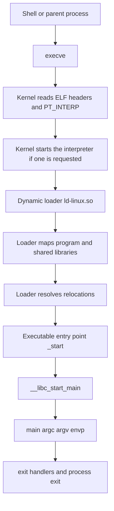

import Tabs from '@theme/Tabs';
import TabItem from '@theme/TabItem';
import AdBanner from '@site/src/components/AdBanner';

# What Happens When You Run `a.out`

When you type:
```bash
./a.out
```
it can feel like the machine does something very simple:


```text
run program
-> show output
```

But that is not what really happens.

The output does **not** appear magically.

A number of steps happen before your program prints even a single line.

The shell reads your command.
The kernel finds the executable file.
The kernel reads the ELF information.
The dynamic loader is started.
The program and its libraries are mapped into memory.
Startup code runs.
Then your own logic begins.

This article explains that full path in simple words.

It is written for readers who are **new to Linux process startup**, but who are willing to look at real ELF output, a little assembly, and real addresses.

:::tip
So if words like these are new to you:

- ELF
- `_start`
- `__libc_start_main`
- text segment
- data segment
- BSS
- heap
- stack
:::

that is fine.

But this is not a "zero technical detail" article.

We will use real tools like `readelf`, `nm`, `objdump`, and `size`, and we will explain what each one does before we use it.

Many beginners learn this sentence first:

> a C program starts at `main()`

That sentence is useful when you first learn C syntax.

But Linux process startup is a little bigger than that.

Your program logic begins at `main()`.

But before `main()` runs, Linux and the C runtime have setup work to do.

One very important part of that setup is the **loader**.

Without the loader, the story is incomplete.

Your program does not get control first.

For a normal dynamically linked program, the loader runs before your code gets control.

That is the missing part many learners want to understand.
This article connects everything into one flow, from:

```bash
./a.out
```


```c
main()
```

## Why This Topic Matters

If you are learning:

- Linux
- C or C++
- operating systems
- compilers
- reverse engineering
- low-level programming

then this topic matters a lot.

Many beginner questions come from one missing gap:

```text
I typed ./a.out
```

and then later:

```text
my program started running
```

What happened in between?

That "in between" part is exactly what this article explains.

Once you understand the normal startup path, many other topics become easier:

- why `main()` is not truly the first thing that runs
- what ELF is
- where the loader fits
- what `readelf -l` is showing
- why global variables and local variables live in different places
- why stack and heap are not the same thing

:::tip Beginner Mental Model
`main()` is where **your program logic** begins.

But Linux and the loader have to prepare the process before your logic can begin.
:::

The real flow looks more like this:

```text
shell
  -> execve()
  -> kernel reads the ELF file and program headers
  -> if PT_INTERP exists, kernel starts the interpreter named there
  -> dynamic loader maps the executable and shared libraries
  -> loader performs relocations and runtime setup
  -> loader jumps to the executable entry point (_start)
  -> _start passes startup state into libc
  -> __libc_start_main(...)
  -> main(argc, argv, envp)
```

There are really two important levels here:

1. The kernel:
   It receives the `execve` request, checks the ELF file, and notices whether the file requests a program interpreter with `PT_INTERP`.
2. The loader:
   It is usually `ld-linux`. It maps shared libraries like `libc.so`, resolves relocations, prepares runtime state, and finally transfers control to the program startup code.

One line worth remembering is this:

> For a normal dynamically linked ELF file, your program does not start first. The loader runs before your code gets control.

<AdBanner />

## Table of Contents

1. [The Big Picture](#the-big-picture)
2. [Step 1: The Shell Receives Your Command](#step-1-the-shell-receives-your-command)
3. [Step 2: The Shell Asks Linux to Start the Program](#step-2-the-shell-asks-linux-to-start-the-program)
4. [Step 3: Linux Reads the ELF File](#step-3-linux-reads-the-elf-file)
5. [Step 4: Linux Builds a Running Process From the File](#step-4-linux-builds-a-running-process-from-the-file)
6. [Step 5: Why `_start` Runs Before `main`](#step-5-why-_start-runs-before-main)
7. [Step 6: What `__libc_start_main` Does](#step-6-what-__libc_start_main-does)
8. [Step 7: Then `main()` Finally Runs](#step-7-then-main-finally-runs)
9. [What `LOAD` Means in Easy Words](#what-load-means-in-easy-words)
10. [Sections vs Segments in Easy Words](#sections-vs-segments-in-easy-words)
11. [Memory Layout in Easy Words](#memory-layout-in-easy-words)
12. [Real Example on This Machine](#real-example-on-this-machine)
13. [Final Mental Model](#final-mental-model)
14. [FAQ](#faq)

## The Demo Program We Will Follow

Before we go deeper, let us fix one concrete example in mind.

Suppose our `a.out` came from a small C program like this:

```c
#include <stdio.h>
#include <stdlib.h>

int global_init = 7;
int global_uninit;
static int static_uninit;
const char *message = "hello from elf demo";

int main(void) {
    int local_value = 42;
    int *heap_value = malloc(sizeof(int));
    *heap_value = global_init + local_value;

    printf("message=%s\n", message);
    printf("&global_init=%p\n", (void *)&global_init);
    printf("&global_uninit=%p\n", (void *)&global_uninit);
    printf("&static_uninit=%p\n", (void *)&static_uninit);
    printf("&message=%p\n", (void *)&message);
    printf("&local_value=%p\n", (void *)&local_value);
    printf("heap_value=%p\n", (void *)heap_value);
    printf("global_uninit=%d static_uninit=%d computed=%d\n",
           global_uninit, static_uninit, *heap_value);

    free(heap_value);
    return 0;
}
```

In this article, the question is:

> for code like this, what really happens between typing `./a.out` and reaching `main()`?

That gives us something concrete to follow:

- the executable file on disk
- the dynamic loader, what it is, and how `PT_INTERP` points to it
- the entry point `_start`
- the call into `__libc_start_main`
- the memory regions used by globals, locals, string literals, and heap allocation

## The Big Picture



<details>
<summary>Diagram explanation</summary>

Think of startup as a sequence of steps, not one magic jump.

When you type `./a.out`, Linux does not instantly jump into your code.

Instead, something like this happens:

1. the shell sees your command
2. the shell asks the kernel to start the executable
3. the kernel checks the ELF file
4. the kernel decides whether an interpreter is needed
5. the dynamic loader may run first
6. startup code begins at `_start`
7. `main()` finally runs

That is why this topic feels bigger than "run file -> get output".

</details>

## Step 1: The Shell Receives Your Command

When you type:

```bash
./a.out
```

the shell first reads the text you typed.

Its job is to understand what action you want.

So when it sees `./a.out`, it understands:

> run the file named `a.out` from the current directory

The shell itself does not manually execute every machine instruction inside that file.

Instead, it asks Linux to start the program.

That leads to the next step.

## Step 2: The Shell Asks Linux to Start the Program

The shell usually asks Linux to start the program using a system call named:

[execve](https://man7.org/linux/man-pages/man2/execve.2.html)

If the name feels new, do not worry.

The beginner meaning is simple:

> `execve` tells the kernel to start a program from a given executable file

You can think of the request like this:

- here is the file to run
- here are the command-line arguments
- here are the environment values
- please prepare the new program

If you want to **see this happen on a real machine**, `strace` is the easiest tool.

`strace` shows the system calls a program makes.

Here we use it with `-e trace=execve` so it shows only the `execve` call:

```bash
strace -e trace=execve ./tmp/elf_start_demo
```

On this machine, that produced:

```bash
execve("./tmp/elf_start_demo", ["./tmp/elf_start_demo"], 0x7ffcbbe4ea00 /* 50 vars */) = 0
message=hello from elf demo
&global_init=0x404030
&global_uninit=0x404044
&static_uninit=0x404048
&message=0x404038
&local_value=0x7fffea480e0c
heap_value=0x226ac2a0
global_uninit=0 static_uninit=0 computed=49
+++ exited with 0 +++
```

The important first line means:

- `execve("./tmp/elf_start_demo", ...)`
  the kernel is being asked to start this executable file
- `["./tmp/elf_start_demo"]`
  this is the argument list, starting with `argv[0]`
- `/* 50 vars */`
  this process also received environment variables
- `= 0`
  the call succeeded

After that, you see the program's own output, and finally:

```bash
+++ exited with 0 +++
```

which means the process finished successfully.

At this point, the **kernel** takes over the startup work.

For a dynamically linked ELF binary, that does **not** mean the kernel jumps straight to your program's code.

The kernel first reads the ELF metadata, checks whether the file requests a program interpreter with `PT_INTERP`, and if it does, starts the dynamic loader named there.

So even this early in the story, the real flow is already closer to:

```text
shell
  -> execve()
  -> kernel
  -> dynamic loader
  -> program entry point
```

## Step 3: Linux Reads the ELF File

Most compiled C and C++ programs on Linux use the **ELF** format.

ELF means:

- Executable and Linkable Format

The beginner-friendly meaning is:

> ELF is the format Linux uses to store executable programs in an organized way

The file contains information such as:

- where execution begins
- what parts of the file should be loaded
- what permissions those parts need
- whether a dynamic loader is needed
- which interpreter path should be used for a dynamically linked program

One important ELF entry here is `PT_INTERP`.

`PT_INTERP` is the program-header entry that tells the kernel which interpreter program to start for a dynamically linked executable.

On a normal x86-64 Linux system, that is often something like:

```text
/lib64/ld-linux-x86-64.so.2
```

So in plain words:

> `PT_INTERP` is the ELF field that says "before running this program normally, start this loader first"

The first tool to know is `readelf`.

`readelf` reads ELF metadata from a binary without trying to run it.

It is useful when you want to answer questions like:

- what file type is this?
- where is the entry point?
- what segments get loaded?

You can inspect some of that metadata using:

```bash
readelf -h ./a.out
readelf -l ./a.out
```

If you want to **see this on a real binary**, `readelf` is the right tool.

<Tabs>
<TabItem value="readelf-h" label="-h">

Here is the ELF header from the demo binary on this machine:

```bash
readelf -h ./tmp/elf_start_demo
```

```text
ELF Header:
  Magic:   7f 45 4c 46 02 01 01 00 00 00 00 00 00 00 00 00
  Class:                             ELF64
  Data:                              2's complement, little endian
  Version:                           1 (current)
  OS/ABI:                            UNIX - System V
  ABI Version:                       0
  Type:                              EXEC (Executable file)
  Machine:                           Advanced Micro Devices X86-64
  Version:                           0x1
  Entry point address:               0x4010b0
  Start of program headers:          64 (bytes into file)
  Start of section headers:          15520 (bytes into file)
  Flags:                             0x0
  Size of this header:               64 (bytes)
  Size of program headers:           56 (bytes)
  Number of program headers:         13
  Size of section headers:           64 (bytes)
  Number of section headers:         37
  Section header string table index: 36
```

The important beginner points here are:

- `ELF64`
  this is a 64-bit ELF file
- `EXEC`
  this file is an executable
- `Entry point address: 0x4010b0`
  execution will begin at this address, not automatically at `main()`

</TabItem>
<TabItem value="readelf-l" label="-l">

If you want to see the program headers and the requested interpreter path, use:

```bash
readelf -l ./tmp/elf_start_demo
```

From this machine, the most important lines are:

```text
Elf file type is EXEC (Executable file)
Entry point 0x4010b0
There are 13 program headers, starting at offset 64

INTERP         0x0000000000000318 0x0000000000400318 0x0000000000400318
               0x000000000000001c 0x000000000000001c  R      0x1
    [Requesting program interpreter: /lib64/ld-linux-x86-64.so.2]

LOAD           0x0000000000000000 0x0000000000400000 0x0000000000400000
               0x00000000000005c8 0x00000000000005c8  R      0x1000
LOAD           0x0000000000001000 0x0000000000401000 0x0000000000401000
               0x0000000000000301 0x0000000000000301  R E    0x1000
LOAD           0x0000000000002000 0x0000000000402000 0x0000000000402000
               0x000000000000019c 0x000000000000019c  R      0x1000
LOAD           0x0000000000002df8 0x0000000000403df8 0x0000000000403df8
               0x0000000000000248 0x0000000000000258  RW     0x1000
```

That already tells us a lot:

- the file is an executable ELF
- the entry point is `0x4010b0`
- the program requests the loader `/lib64/ld-linux-x86-64.so.2`
- the `LOAD` entries describe which parts of the file get mapped into memory
- the `R E` area is the executable code region
- the `RW` area is writable program data

</TabItem>
</Tabs>

At this stage, Linux is still preparing the program.

Your `main()` function has not started yet.

For a dynamically linked binary, the loader has not finished its work yet either.

:::important What Is the Loader?

The **loader** is the runtime component that helps turn an executable file into a running process.

For a normal dynamically linked Linux program, this is usually the dynamic loader, such as:

```text
/lib64/ld-linux-x86-64.so.2
```

Its job is to get the program ready before your code starts running.

That usually includes:

- placing the program in memory
- loading shared libraries such as `libc.so`
- fixing addresses the program does not know in advance
- setting up some runtime details
- passing control to the program entry point, usually `_start`
:::

So for a dynamically linked ELF, the loader runs before your program startup code gets control.

## Step 4: Linux Builds a Running Process From the File

This is a very important beginner idea.

A file on disk is **not** the same thing as a running process.

When `a.out` sits on disk, it is just a file.

When Linux runs it, Linux has to create a real process with:

- memory
- stack space
- register state
- startup information

So you can remember this:

```text
file on disk != running process
```

Linux takes the file and builds a running process from it.

That is why startup is more than "jump to `main()`".

## Step 5: Why `_start` Runs Before `main`

Many beginners are told:

> the program starts at `main()`

That is a helpful simplification, but it is not the full Linux story.

The ELF file contains an **entry point address**.

That entry point usually points to:

```text
_start
```

So `_start` runs before `main()`.

Why do we need `_start`?

Because `main()` expects some things to already be ready:

- arguments
- environment
- runtime setup
- libc setup

So `_start` acts like a low-level startup point.

You can think of it like this:

- `_start` receives the initial machine state
- `_start` translates that state into C runtime arguments
- `main()` begins your program logic

## Step 6: What `__libc_start_main` Does

`__libc_start_main` is part of glibc startup.

The name looks heavy, but the beginner idea is simple:

> it helps prepare the C runtime and then leads into your `main()`

`_start` usually hands control to `__libc_start_main`.

So a very simple picture is:

```text
_start
-> __libc_start_main
-> main
```

It does much more than just call `main`.

It typically helps with:

- libc internal initialization
- runtime setup
- constructor execution
- calling `main(argc, argv, envp)`
- calling `exit()` after `main` returns

On x86-64 Linux, the first six integer or pointer arguments to a function are passed in these registers:

- `rdi`
- `rsi`
- `rdx`
- `rcx`
- `r8`
- `r9`

That matters because `_start` is not magical. It has to place the correct values into those registers before calling `__libc_start_main`.

A conceptual flow looks like this:

```bash
_start
  -> __libc_start_main(...)
      -> runtime init
      -> constructors
      -> main(...)
      -> exit(...) for normal user-space cleanup
      -> final process termination
```

This is an important mental shift.

To you, `main()` feels like the center of the program.

To the runtime, `main()` is one important step inside a larger startup and shutdown path.

## Step 7: Then `main()` Finally Runs

Only after the setup work is done does your own program logic begin.

That is the part you usually write yourself:

```c
int main() {
    printf("hello\n");
    return 0;
}
```

So `main()` is still very important.

But now the beginner picture is more accurate:

- Linux does not jump straight to `main()`
- startup work happens first
- then your logic begins in `main()`

One scope note before we continue:

> The concrete startup path in this article is a normal dynamically linked glibc program on x86-64 Linux. Static binaries, musl-based systems, `-nostdlib`, and other architectures can differ.

## What `LOAD` Means in Easy Words

Here we use `readelf -l` because `-l` prints the **program headers**, which are the loader-facing view of the binary.

That is useful when you want to understand what Linux maps into memory at startup.

When you run:

```bash
readelf -l a.out
```

you often see lines like:

```text
LOAD           0x0000000000001000 0x0000000000401000 ...
```

The word `LOAD` means:

> this part of the executable should be loaded into memory when the program starts

That is the first thing to understand.

The common fields mean this:

- `Offset`: where this part starts inside the file
- `VirtAddr`: where Linux places it in virtual memory
- `FileSiz`: how many bytes come from the file
- `MemSiz`: how much memory the process gets
- `Flags`: what that memory is allowed to do
- `Align`: the alignment requirement for that mapping

Examples:

- `R E` usually means readable and executable, which often matches code
- `RW` usually means readable and writable, which often matches program data

One detail that confuses people is this pair:

```text
LOAD  Offset 0x1000  VirtAddr 0x401000 ... Align 0x1000
```

The important idea is:

- file offset `0x1000` means "start reading from byte 4096 in the file"
- virtual address `0x401000` means "map that data at address `0x401000` in the process"
- alignment `0x1000` means the mapping is page-aligned

For this non-PIE example, the executable is based around `0x400000`, so file page `0x1000` maps to virtual page `0x401000`.

One very useful beginner observation is:

```text
MemSiz > FileSiz
```

When that happens, Linux is giving the process more memory than the file directly stores.

That is a common hint that some zero-filled runtime space is involved, often BSS-like storage.

In the real binary later in this article, the four `LOAD` segments correspond roughly to:

- read-only ELF metadata and dynamic-linking tables near `0x400000`
- executable code near `0x401000`
- read-only constants near `0x402000`
- writable state such as `.data`, `.bss`, `.got`, and `.got.plt` near `0x403df8`

## Sections vs Segments in Easy Words

This topic confuses many beginners, so keep one easy rule in mind:

- sections help organize the binary file
- segments help Linux load the binary

Common sections include:

- `.text`
- `.data`
- `.bss`
- `.rodata`

But when Linux is loading the program, the program headers and loadable segments are the important part.

So if you forget the advanced details, remember only this:

```text
sections = organization
segments = loading
```

## Memory Layout in Easy Words

For the real non-PIE sample binary used later in this article, a simplified layout looks like this:

```text
Low addresses
0x400000  read-only ELF headers, interpreter path, dynamic metadata
0x401000  executable code (.init, .plt, .text, .fini)
0x402000  read-only data (.rodata, .eh_frame)
0x403df8  writable runtime data (.got, .got.plt, .data, .bss)
          heap grows upward when malloc needs more space
          mmap/shared libraries appear much higher
0x7fff... initial stack, argv, envp, local variables
High addresses
```

This is still simplified, but it is derived from the actual `readelf -l` output shown later, not from a generic textbook picture.

Real addresses vary because of things like:

- ASLR
- PIE vs non-PIE binaries
- shared library placement
- loader decisions

But the conceptual roles of these regions are still worth learning.

Also note that a sketch like this omits padding, alignment gaps, guard pages, and many higher mappings. On a real process you will also see shared libraries, the loader itself, and a small kernel-provided mapping such as the vDSO at higher addresses.

## Text Segment

The text segment usually contains the machine instructions of your program.

Properties:

- readable
- executable
- normally not writable

Beginner view:

- your compiled code lives here
- the CPU fetches instructions from here
- execute permission is needed here

## Read-Only Data

This often contains:

- string literals
- constant tables
- fixed read-only objects

Properties:

- readable
- not writable
- not executable

## Data Segment

This holds **initialized global and static variables**.

Example:

```c
int counter = 7;
```

That variable usually belongs in `.data`.

Properties:

- readable
- writable

Very important beginner point:

Local function variables do **not** usually live here.
They usually live on the stack unless the compiler keeps them in registers.

## BSS Segment

This holds **zero-initialized or uninitialized globals/statics**.

Example:

```c
int total;
static char buffer[1024];
```

These usually go to `.bss`.

Important point:

- BSS occupies memory
- BSS does not need to occupy the same number of bytes in the file

That is why `MemSiz` can be larger than `FileSiz`.

A small C example:

```c
int x = 10;      // likely .data
int y;           // likely .bss
static int z;    // likely .bss
```

Same language.
Different storage behavior.

## Heap Segment

The heap is used for dynamic memory allocation.

Examples:

```c
malloc(...)
calloc(...)
new
```

It grows during execution when the allocator asks the kernel for more memory, often using `brk` or `mmap`.

This is another place where beginners often mix things up:

- heap is not the same as the data segment
- heap is used for dynamic allocations
- not every variable goes on the heap

Example:

```c
int *p = malloc(100 * sizeof(int));
```

Here:

- the pointer variable `p` may live on the stack
- the allocated array lives on the heap

## Stack Segment

The stack is used for:

- function call frames
- return addresses
- saved registers
- many local variables
- startup values like `argc` and `argv`

On many systems, the stack grows downward toward lower addresses.

Beginner-safe summary:

- local variables often live here
- function call bookkeeping lives here
- startup argument layout begins here

## What in Your Code Goes Where?

One very common beginner question is:

> which part of my C code goes into `.text`, `.rodata`, `.data`, `.bss`, stack, or heap?

This short cheat-sheet is the practical answer.

```c
int global_init = 7;
int global_uninit;
static int static_uninit;
const char *message = "hello from elf demo";

int main(void) {
    int local_value = 42;
    int *heap_value = malloc(sizeof(int));
    *heap_value = global_init + local_value;
    return 0;
}
```

| Code or object | Usually lives in | Why |
| --- | --- | --- |
| function code such as `main` | `.text` | this is executable machine code |
| string literals such as `"hello from elf demo"` | `.rodata` | this is read-only constant data |
| initialized global or static variables such as `global_init = 7` | `.data` | the file stores an initial value |
| uninitialized or zero-initialized global or static variables such as `global_uninit` and `static_uninit` | `.bss` | memory exists at runtime, but the file does not need to store those zero bytes |
| local variables such as `local_value` | stack | they usually belong to the current function call frame unless optimized into registers |
| memory returned by `malloc` | heap | this is dynamic runtime allocation |

One subtle point is:

| Line of code | Split across |
| --- | --- |
| `const char *message = "hello from elf demo";` | the pointer variable `message` usually lives in `.data`, while the string literal usually lives in `.rodata` |

So the same line of C code can correspond to more than one memory region.

If you want to **prove this with commands**, here are two useful views.

First, the section table shows where `.text`, `.rodata`, `.data`, and `.bss` are in this binary:

```bash
readelf -S --wide tmp/elf_start_demo | grep -E "\.text|\.rodata|\.data|\.bss"
```

```text
  [15] .text             PROGBITS        00000000004010b0 0010b0 000242 00  AX  0   0 16
  [17] .rodata           PROGBITS        0000000000402000 002000 0000bf 00   A  0   0  8
  [25] .data             PROGBITS        0000000000404020 003020 000020 00  WA  0   0  8
  [26] .bss              NOBITS          0000000000404040 003040 000010 00  WA  0   0  4
```

Then the program's own output shows where some real objects ended up at runtime:

```bash
./tmp/elf_start_demo
```

```text
message=hello from elf demo
&global_init=0x404030
&global_uninit=0x404044
&static_uninit=0x404048
&message=0x404038
&local_value=0x7ffc113ac3cc
heap_value=0x10f702a0
global_uninit=0 static_uninit=0 computed=49
```

That lets us connect the code to the actual regions:

| Runtime value | What it shows |
| --- | --- |
| `&global_init=0x404030` | inside `.data`, because `.data` starts at `0x404020` |
| `&global_uninit=0x404044` | inside `.bss`, because `.bss` starts at `0x404040` |
| `&static_uninit=0x404048` | also inside `.bss` |
| `&message=0x404038` | the pointer variable itself lives in `.data` |
| `&local_value=0x7ffc113ac3cc` | this looks like stack memory |
| `heap_value=0x10f702a0` | this is heap memory returned by `malloc` |

## Where `argc` and `argv` Come From

Before `_start` runs, the kernel prepares the initial stack.

A simplified conceptual view is:

```text
At process entry, rsp points here:
  argc
  argv[0] pointer
  argv[1] pointer
  ...
  NULL
  envp[0] pointer
  envp[1] pointer
  ...
  NULL
  auxiliary vector entries
  ...
  argv/envp string data at higher virtual addresses
```

Then `_start` can inspect that initial layout and pass useful information into libc startup.

Eventually, your program sees something like:

```c
int main(int argc, char **argv, char **envp);
```

So `argc` and `argv` are not magic.

They are prepared by the kernel and passed through runtime startup.

## Dynamic Linking Adds One More Important Layer

Many normal Linux binaries are **dynamically linked**.

That means the ELF may declare an interpreter such as:

```text
[Requesting program interpreter: /lib64/ld-linux-x86-64.so.2]
```

That line comes from the ELF `PT_INTERP` program header.

It tells the kernel:

> do not jump straight into this executable; start this interpreter first

For this binary, that interpreter is the dynamic loader:

```text
/lib64/ld-linux-x86-64.so.2
```

So the real path is closer to:

```text
kernel
  -> ld-linux
  -> executable entry point (_start)
```

That loader is responsible for tasks such as:

- loading shared libraries
- resolving relocations
- fixing imported symbol addresses
- preparing the program for execution

So for dynamically linked programs, the loader is a major part of startup.

To inspect those runtime fixups directly, `objdump -R` is useful.

It prints the dynamic relocation records that the loader will use to connect imported symbols to their real shared-library addresses.

<Tabs>
<TabItem value="command" label="Command">

```bash
objdump -R tmp/elf_start_demo
```

</TabItem>
<TabItem value="output" label="Output">

```text
tmp/elf_start_demo:     file format elf64-x86-64

DYNAMIC RELOCATION RECORDS
OFFSET           TYPE              VALUE
0000000000403fd8 R_X86_64_GLOB_DAT  __libc_start_main@GLIBC_2.34
0000000000403fe0 R_X86_64_GLOB_DAT  __gmon_start__@Base
0000000000404000 R_X86_64_JUMP_SLOT  free@GLIBC_2.2.5
0000000000404008 R_X86_64_JUMP_SLOT  __stack_chk_fail@GLIBC_2.4
0000000000404010 R_X86_64_JUMP_SLOT  printf@GLIBC_2.2.5
0000000000404018 R_X86_64_JUMP_SLOT  malloc@GLIBC_2.2.5
```

</TabItem>
</Tabs>

That means this executable contains slots that must be connected to real addresses in shared libraries.

For example:

- the program calls `printf`
- the executable itself does not know the final runtime address of `printf`
- the loader fills a GOT or relocation slot so indirect calls can reach the `printf` implementation in libc

Without that relocation step, the call could not reach the right shared-library code.

## Real Example on This Machine

Instead of stopping at theory, let us inspect a real binary built in this repo.

I created a tiny program with:

- one initialized global
- one uninitialized global
- one static uninitialized variable
- one string pointer
- one local variable
- one heap allocation

and built it with:

```bash
gcc -no-pie -O0 -g tmp/elf_start_demo.c -o tmp/elf_start_demo
```

We use `-no-pie` here so the addresses stay fixed and easy to compare with the disassembly and `readelf` output. A PIE build still follows the same general startup path, but ASLR makes the exact addresses less friendly for a first walkthrough.

From the earlier `readelf -h` output, we already know the ELF entry point is `0x4010b0`.

Now the real question becomes:

> what symbol lives at `0x4010b0`?

## Real Symbol Output

The next tool is `nm`.

`nm` lists symbols from a binary.

It is useful when you know an address or symbol name and want to connect it to a real function like `_start` or `main`.

Here `-n` sorts by address, and `grep -E` filters the output down to just the startup symbols we care about.

<Tabs>
<TabItem value="command" label="Command">

```bash
nm -n tmp/elf_start_demo | grep -E "_start| main$| __libc_start_main"
```

</TabItem>
<TabItem value="output" label="Output">

```text
                 w __gmon_start__
                 U __libc_start_main@GLIBC_2.34
00000000004010b0 T _start
0000000000401196 T main
```

</TabItem>
</Tabs>

This is the important proof.

The ELF entry point is:

```text
0x4010b0
```

and the symbol at that address is:

```text
_start
```

Not `main`.

So the real startup path is already visible in the symbol table.

## Real `_start` Disassembly

The next tool is `objdump`.

`objdump -d` disassembles machine code into assembly.

It is useful when symbols alone are not enough and you want to see the actual instructions executed at `_start`.

Here we limit the address range so the output stays focused on startup instead of dumping the whole binary.

<Tabs>
<TabItem value="command" label="Command">

```bash
objdump -d tmp/elf_start_demo --start-address=0x4010b0 --stop-address=0x4010f0
```

</TabItem>
<TabItem value="output" label="Output">

```text
00000000004010b0 <_start>:
  4010b0: f3 0f 1e fa           endbr64
  4010b4: 31 ed                 xor    %ebp,%ebp
  4010b6: 49 89 d1              mov    %rdx,%r9
  4010b9: 5e                    pop    %rsi
  4010ba: 48 89 e2              mov    %rsp,%rdx
  4010bd: 48 83 e4 f0           and    $0xfffffffffffffff0,%rsp
  4010c1: 50                    push   %rax
  4010c2: 54                    push   %rsp
  4010c3: 45 31 c0              xor    %r8d,%r8d
  4010c6: 31 c9                 xor    %ecx,%ecx
  4010c8: 48 c7 c7 96 11 40 00  mov    $0x401196,%rdi
  4010cf: ff 15 03 2f 00 00     call   *0x2f03(%rip)  # 403fd8 <__libc_start_main@GLIBC_2.34>
```

</TabItem>
</Tabs>

This is exactly the kind of real startup evidence that helps beginners.

Look at these lines carefully:

```text
4010c8: mov    $0x401196,%rdi
4010cf: call   ... <__libc_start_main@GLIBC_2.34>
```

From the symbol table, we already know:

```text
0000000000401196 T main
```

Here is the same setup in plain x86-64 calling-convention terms:

- `pop %rsi`
  At process entry, the top of the initial stack contains `argc`. Popping it into `rsi` prepares the second argument register.
- `mov %rsp,%rdx`
  After popping `argc`, `rsp` points at `argv[0]`, so `_start` passes the `argv` pointer in `rdx`.
- `mov $0x401196,%rdi`
  `0x401196` is the address of `main`, so `_start` passes `main` as the first argument to `__libc_start_main`.
- `xor %ecx,%ecx` and `xor %r8d,%r8d`
  These clear two argument registers. In this startup file they mean there are no custom `init` and `fini` function pointers being passed here.
- `endbr64`
  This is not part of C startup logic. It is an Intel CET control-flow instruction emitted for security hardening on newer toolchains.

The other instructions in this small block are mostly startup housekeeping:

- `xor %ebp,%ebp` clears the frame pointer register
- `and $0xfffffffffffffff0,%rsp` aligns the stack to a 16-byte boundary before the function call
- `push %rax` and `push %rsp` help build the stack state expected by this glibc startup sequence

For this article, you do not need those details to follow the main idea. The important path is still:

```text
_start
  -> __libc_start_main
  -> main
```

So `_start` is not "doing program logic." It is unpacking the initial process state and turning it into a proper function call into libc startup.

## Real Program Headers

We come back to `readelf` here, but this time `-l` is the important part.

`readelf -l` prints program headers, which are the mappings the kernel and loader care about at runtime.

The `grep -E -A1` filter keeps just the interpreter line and the `LOAD` entries so the output stays readable.

<Tabs>
<TabItem value="command" label="Command">

```bash
readelf -l tmp/elf_start_demo | grep -E -A1 "LOAD|Requesting program interpreter"
```

</TabItem>
<TabItem value="output" label="Output">

```text
[Requesting program interpreter: /lib64/ld-linux-x86-64.so.2]
LOAD           0x0000000000000000 0x0000000000400000 0x0000000000400000
               0x00000000000005c8 0x00000000000005c8  R      0x1000
LOAD           0x0000000000001000 0x0000000000401000 0x0000000000401000
               0x0000000000000301 0x0000000000000301  R E    0x1000
LOAD           0x0000000000002000 0x0000000000402000 0x0000000000402000
               0x000000000000019c 0x000000000000019c  R      0x1000
LOAD           0x0000000000002df8 0x0000000000403df8 0x0000000000403df8
               0x0000000000000248 0x0000000000000258  RW     0x1000
```

</TabItem>
</Tabs>

This gives us several real observations:

- the binary is dynamically linked because an interpreter is requested
- the executable code lives in the `R E` loadable area around `0x401000`
- read-only constants live in the `R` loadable area around `0x402000`
- writable state lives in the `RW` loadable area around `0x403df8`
- the writable area has `MemSiz > FileSiz`

That last part matters:

```text
FileSiz = 0x248
MemSiz  = 0x258
```

So the process gets more writable memory than the file actually stores.

That is where zero-filled runtime memory naturally fits.

The address sketch also has visible gaps between major regions. Those are normal. Some space comes from alignment requirements, and some things present in the ELF file, such as section-header metadata, are not part of the runtime mappings used to execute the program.

## Real Section Headers on This Machine

Instead of showing only four hand-picked sections, here is the actual full section table from this binary on this machine.

Here we use `readelf -S --wide` because `-S` prints the section table, and `--wide` avoids truncating long columns.

This is useful when you want the file-organization view of the binary rather than the loader-facing segment view.

<Tabs>
<TabItem value="command" label="Command">

```bash
readelf -S --wide tmp/elf_start_demo
```

</TabItem>
<TabItem value="output" label="Output">

```text
There are 37 section headers, starting at offset 0x3ca0:

Section Headers:
  [Nr] Name              Type            Address          Off    Size   ES Flg Lk Inf Al
  [ 0]                   NULL            0000000000000000 000000 000000 00      0   0  0
  [ 1] .interp           PROGBITS        0000000000400318 000318 00001c 00   A  0   0  1
  [ 2] .note.gnu.property NOTE            0000000000400338 000338 000030 00   A  0   0  8
  [ 3] .note.gnu.build-id NOTE            0000000000400368 000368 000024 00   A  0   0  4
  [ 4] .note.ABI-tag     NOTE            000000000040038c 00038c 000020 00   A  0   0  4
  [ 5] .gnu.hash         GNU_HASH        00000000004003b0 0003b0 00001c 00   A  6   0  8
  [ 6] .dynsym           DYNSYM          00000000004003d0 0003d0 0000a8 18   A  7   1  8
  [ 7] .dynstr           STRTAB          0000000000400478 000478 000071 00   A  0   0  1
  [ 8] .gnu.version      VERSYM          00000000004004ea 0004ea 00000e 02   A  6   0  2
  [ 9] .gnu.version_r    VERNEED         00000000004004f8 0004f8 000040 00   A  7   1  8
  [10] .rela.dyn         RELA            0000000000400538 000538 000030 18   A  6   0  8
  [11] .rela.plt         RELA            0000000000400568 000568 000060 18  AI  6  24  8
  [12] .init             PROGBITS        0000000000401000 001000 00001b 00  AX  0   0  4
  [13] .plt              PROGBITS        0000000000401020 001020 000050 10  AX  0   0 16
  [14] .plt.sec          PROGBITS        0000000000401070 001070 000040 10  AX  0   0 16
  [15] .text             PROGBITS        00000000004010b0 0010b0 000242 00  AX  0   0 16
  [16] .fini             PROGBITS        00000000004012f4 0012f4 00000d 00  AX  0   0  4
  [17] .rodata           PROGBITS        0000000000402000 002000 0000bf 00   A  0   0  8
  [18] .eh_frame_hdr     PROGBITS        00000000004020c0 0020c0 000034 00   A  0   0  4
  [19] .eh_frame         PROGBITS        00000000004020f8 0020f8 0000a4 00   A  0   0  8
  [20] .init_array       INIT_ARRAY      0000000000403df8 002df8 000008 08  WA  0   0  8
  [21] .fini_array       FINI_ARRAY      0000000000403e00 002e00 000008 08  WA  0   0  8
  [22] .dynamic          DYNAMIC         0000000000403e08 002e08 0001d0 10  WA  7   0  8
  [23] .got              PROGBITS        0000000000403fd8 002fd8 000010 08  WA  0   0  8
  [24] .got.plt          PROGBITS        0000000000403fe8 002fe8 000038 08  WA  0   0  8
  [25] .data             PROGBITS        0000000000404020 003020 000020 00  WA  0   0  8
  [26] .bss              NOBITS          0000000000404040 003040 000010 00  WA  0   0  4
  [27] .comment          PROGBITS        0000000000000000 003040 00002d 01  MS  0   0  1
  [28] .debug_aranges    PROGBITS        0000000000000000 00306d 000030 00      0   0  1
  [29] .debug_info       PROGBITS        0000000000000000 00309d 00016e 00      0   0  1
  [30] .debug_abbrev     PROGBITS        0000000000000000 00320b 0000cc 00      0   0  1
  [31] .debug_line       PROGBITS        0000000000000000 0032d7 00008b 00      0   0  1
  [32] .debug_str        PROGBITS        0000000000000000 003362 000148 01  MS  0   0  1
  [33] .debug_line_str   PROGBITS        0000000000000000 0034aa 000096 01  MS  0   0  1
  [34] .symtab           SYMTAB          0000000000000000 003540 0003d8 18     35  19  8
  [35] .strtab           STRTAB          0000000000000000 003918 000215 00      0   0  1
  [36] .shstrtab         STRTAB          0000000000000000 003b2d 00016f 00      0   0  1
Key to Flags:
  W (write), A (alloc), X (execute), M (merge), S (strings), I (info),
  L (link order), O (extra OS processing required), G (group), T (TLS),
  C (compressed), x (unknown), o (OS specific), E (exclude),
  D (mbind), l (large), p (processor specific)
```

</TabItem>
</Tabs>

That output is much more honest than a simplified summary, because you can directly see:

- executable code sections such as `.init`, `.plt`, `.plt.sec`, `.text`, and `.fini`
- read-only allocated sections such as `.interp`, `.gnu.hash`, `.dynsym`, `.dynstr`, `.rodata`, `.eh_frame_hdr`, and `.eh_frame`
- writable allocated sections such as `.init_array`, `.fini_array`, `.dynamic`, `.got`, `.got.plt`, `.data`, and `.bss`
- non-runtime sections such as `.debug_*`, `.symtab`, `.strtab`, and `.shstrtab`, which have address `0x0` because they are file metadata, not live process mappings

The last tool here is `size`.

`size -A` prints per-section sizes, and `-x` shows them in hexadecimal so they line up naturally with the ELF addresses.

This is useful when you want to answer questions like "how big is `.text`?" or "how much space does `.bss` take?"

<Tabs>
<TabItem value="command" label="Command">

```bash
size -A -x tmp/elf_start_demo
```

</TabItem>
<TabItem value="output" label="Output">

```text
tmp/elf_start_demo  :
section               size       addr
.interp               0x1c   0x400318
.note.gnu.property    0x30   0x400338
.note.gnu.build-id    0x24   0x400368
.note.ABI-tag         0x20   0x40038c
.gnu.hash             0x1c   0x4003b0
.dynsym               0xa8   0x4003d0
.dynstr               0x71   0x400478
.gnu.version           0xe   0x4004ea
.gnu.version_r        0x40   0x4004f8
.rela.dyn             0x30   0x400538
.rela.plt             0x60   0x400568
.init                 0x1b   0x401000
.plt                  0x50   0x401020
.plt.sec              0x40   0x401070
.text                0x242   0x4010b0
.fini                  0xd   0x4012f4
.rodata               0xbf   0x402000
.eh_frame_hdr         0x34   0x4020c0
.eh_frame             0xa4   0x4020f8
.init_array            0x8   0x403df8
.fini_array            0x8   0x403e00
.dynamic             0x1d0   0x403e08
.got                  0x10   0x403fd8
.got.plt              0x38   0x403fe8
.data                 0x20   0x404020
.bss                  0x10   0x404040
.comment              0x2d        0x0
.debug_aranges        0x30        0x0
.debug_info          0x16e        0x0
.debug_abbrev         0xcc        0x0
.debug_line           0x8b        0x0
.debug_str           0x148        0x0
.debug_line_str       0x96        0x0
Total                0xe8c
```

</TabItem>
</Tabs>

For the specific variables from our demo, the exact section mapping is:

- `0x404030` for `global_init` falls inside `.data`, which starts at `0x404020` and has size `0x20`
- `0x404044` for `global_uninit` falls inside `.bss`, which starts at `0x404040` and has size `0x10`
- `0x404048` for `static_uninit` also falls inside `.bss`

That is the concrete way to map a runtime address back to the exact section entry shown by the tools.

## Real Runtime Addresses

Finally, we run the program itself.

This is useful because static ELF metadata tells us where things should live, but the actual process output lets us compare that metadata with real runtime addresses.

<Tabs>
<TabItem value="command" label="Command">

```bash
./tmp/elf_start_demo
```

</TabItem>
<TabItem value="output" label="Output">

```text
message=hello from elf demo
&global_init=0x404030
&global_uninit=0x404044
&static_uninit=0x404048
&message=0x404038
&local_value=0x7ffe6ce4400c
heap_value=0x277322a0
global_uninit=0 static_uninit=0 computed=49
```

</TabItem>
</Tabs>

This makes the memory regions much easier to feel.

Notice:

- `&global_init`, `&global_uninit`, `&static_uninit`, and `&message` are all near `0x4040xx`
- that matches the data/BSS area
- `&local_value` is near `0x7ffe...`
- that looks like stack memory
- `heap_value` is somewhere else entirely
- that is heap memory returned by `malloc`

So in one real run, we can already see:

- globals and statics in the data/BSS neighborhood
- local variables on the stack
- dynamic allocation on the heap

## Final Mental Model

If you want one compact model, use this:

```text
ELF file on disk
  -> shell calls execve()
  -> kernel reads ELF headers
  -> kernel notices PT_INTERP and starts ld-linux for a dynamic binary
  -> loader maps the executable and shared libraries
  -> loader resolves relocations such as printf and malloc
  -> kernel-provided argc/argv/envp are sitting on the initial stack
  -> loader jumps to the executable entry point (_start)
  -> _start converts that startup state into arguments for __libc_start_main
  -> libc runs constructors, then main(argc, argv, envp)
  -> exit handlers run when the program finishes
```

That is the real startup story behind a normal Linux executable.

## Useful Commands to Explore This Yourself

<Tabs>
<TabItem value="inspect-structure" label="Inspect Structure">

Use these when you want the ELF header, program headers, and section table:

```bash
gcc hello.c -o hello
readelf -h hello
readelf -l hello
readelf -S hello
```

</TabItem>
<TabItem value="inspect-symbols" label="Inspect Symbols">

Use these when you want to find `_start`, `main`, and other named symbols:

```bash
nm hello | less
objdump -d hello | grep -E "<_start>|<main>"
```

</TabItem>
<TabItem value="inspect-runtime" label="Inspect Runtime">

Use this when you want to see which shared libraries the loader will bring in:

```bash
ldd hello
```

</TabItem>
</Tabs>

## FAQ

### Does Linux jump directly to `main()`?

No. For a normal C program, control reaches the ELF entry point first, which is usually `_start`.

### Where do `argc`, `argv`, and `envp` come from?

The kernel places them on the initial process stack during `execve`. `_start` and libc startup then pass that information along until your `main` receives it.

### Why is `MemSiz` sometimes larger than `FileSiz`?

Because some memory, especially BSS-style zero-filled data, must exist at runtime even though it does not need to be stored byte-for-byte in the file.

### What's the difference between returning from `main` and calling `exit()`?

Returning from `main` is mostly a normal way to finish the program. The C runtime takes that return value and passes it into `exit()`.

`exit()` performs normal process cleanup such as:

- flushing stdio buffers
- running `atexit` handlers
- running normal C runtime shutdown work

After that, the process ends through a lower-level kernel-facing termination path.

By contrast, `_exit()` ends the process immediately without doing the normal user-space cleanup that `exit()` performs first.

### Are `.text` and `PT_LOAD` the same thing?

No. `.text` is a section. `PT_LOAD` is a segment in the program header table. Sections organize the file; segments describe what gets mapped for execution.

## PDF References

If you want deeper PDF references after this article, these are the most relevant next reads:

<Tabs>
<TabItem value="book-pdf" label="Book PDF">

**Computer Science from the Bottom Up**  
Ian Wienand

PDF: [Computer Science from the Bottom Up (PDF)](https://www.bottomupcs.com/csbu.pdf)

Why this is useful here:

- it has approachable chapters on ELF, sections vs segments, ABI ideas, and process startup
- it stays much closer to this article's level than a raw ABI specification
- it is a good next read if you want more depth without jumping straight into vendor manuals

</TabItem>
<TabItem value="paper-pdf" label="Paper PDF">

**How To Write Shared Libraries**  
Ulrich Drepper

PDF: [How To Write Shared Libraries (PDF)](https://www.akkadia.org/drepper/dsohowto.pdf)

Why this is useful here:

- it gives a much deeper explanation of ELF, dynamic linking, relocations, and loader behavior
- it is especially useful after this article if `PT_INTERP`, GOT, PLT, and relocation costs made you curious
- it is more advanced than this article, but it is one of the most relevant follow-up PDFs for Linux startup and shared-library behavior

</TabItem>
<TabItem value="abi-pdf" label="ABI PDF">

**System V Application Binary Interface: AMD64 Architecture Processor Supplement**  
Jan Hubicka, Andreas Jaeger, Mark Mitchell, and others

PDF / spec page: [AMD64 ABI Processor Supplement](https://www.ucw.cz/~hubicka/papers/abi/)

Why this is useful here:

- it is the reference for the x86-64 calling convention used in the `_start` and `__libc_start_main` discussion
- it is where stack alignment, argument registers, ELF details, and low-level ABI rules become precise instead of simplified
- it is more like a specification than a tutorial, so it is best used after you already understand the broad startup flow

</TabItem>
<TabItem value="lsb-pdf" label="ELF/Loading Spec">

**Linux Standard Base Core Specification for X86-64**  
Linux Foundation

PDF: [LSB Core AMD64 (PDF)](https://refspecs.linuxbase.org/LSB_5.0.0/LSB-Core-AMD64/LSB-Core-AMD64.pdf)

Why this is useful here:

- it covers ELF object format, program headers, program loading, and dynamic linking in one Linux-facing reference
- it is useful if you want a more structured standards-style description of the same topics covered in this article
- it is less beginner-friendly than the article, but very useful as a reference document when checking exact terms and structures

</TabItem>
</Tabs>

## Summary

If you want the shortest accurate version of the startup path, it is this:

- typing `./a.out` does not jump straight to `main()`
- the shell calls `execve()`
- the kernel reads the ELF file and its program headers
- for a dynamically linked binary, the kernel starts the interpreter from `PT_INTERP`
- the loader maps the executable and shared libraries and resolves relocations
- the loader transfers control to the executable entry point, usually `_start`
- `_start` passes the startup state into libc
- libc startup runs initialization work and then calls `main(argc, argv, envp)`
- when `main` returns, normal user-space cleanup runs before the process finally terminates

The compact mental model is:

```text
shell -> execve() -> kernel -> loader -> _start -> __libc_start_main -> main
```

**How To Answer in an Interview**

If someone asks, **"What happens when you run `./a.out` on Linux?"**, a strong short answer is:

> The shell calls `execve()`. The kernel reads the ELF file and, for a dynamically linked executable, starts the loader from `PT_INTERP`. The loader maps the executable and shared libraries, resolves relocations, and jumps to the program entry point, usually `_start`. Then libc startup calls `main()`.

If someone asks, **"Does Linux jump directly to `main()`?"**, the short answer is:

> No. For a normal dynamically linked binary, control goes through the loader first, then `_start`, then `__libc_start_main`, and only after that reaches `main()`.

## Where to Go Next

If you want to keep digging, a good next step is to compare this same experiment across:

- a PIE build instead of `-no-pie`
- a static binary
- another libc such as musl
- another architecture such as ARM64

That is where you start seeing which parts of startup are general Linux ideas and which parts belong to one specific runtime implementation.
