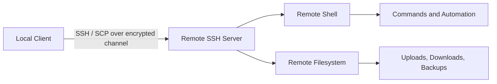

import AdBanner from '@site/src/components/AdBanner';
import Tabs from '@theme/Tabs';
import TabItem from '@theme/TabItem';
import { ComicQA } from '../mcq/interview_question/Question_comics' ;

# What is SSH and SCP and How it Work and Where it Help

[SSH (Secure Shell)](https://www.openssh.com/) and **SCP (Secure Copy)** are **fundamental tools for secure communication and file management** across Linux, UNIX, and cloud environments.

* **SSH** establishes an encrypted channel that allows users to log into remote servers, execute commands, forward ports, and automate system administration safely and reliably.
* **SCP** builds on SSH to enable fast, secure, and authenticated file transfers between local and remote machines.

Together, they form the backbone of modern infrastructure management, empowering **developers, system administrators, DevOps engineers, and security professionals** to:

* Deploy applications seamlessly
* Transfer backups and sensitive data securely
* Troubleshoot and manage remote servers efficiently
* Integrate with CI/CD pipelines for automation and scalability

## What you will learn

* How SSH creates a secure remote shell
* How SCP moves files over the SSH transport
* How to use custom ports, keys, and config aliases
* How to troubleshoot connection and permission issues
* When to use SSH, SCP, rsync, or SFTP

## Best way to read this article

1. Start with why secure remote access matters.
1. Learn SSH before SCP.
1. Practice the commands in a test VM or local host.
1. Return to [Linux Home](/docs/linux/) for the full section map.

:::tip Did You Know
* SSH can be used not just for remote login but also for **tunneling and port forwarding**, meaning you can securely connect to internal services behind firewalls.
* With the right configuration (using `~/.ssh/config`), you can set up **shortcuts and aliases** for frequently accessed servers, saving time and avoiding repetitive typing.
* While SCP is widely used, many modern setups prefer **rsync over SSH** for file transfers, since it supports incremental sync and better performance.

:::

<div>
    <AdBanner />
</div>


## Video Walkthrough

<Tabs>
<TabItem value="video1" label="SSH & SCP Basics">
<div style={{ position: 'relative', paddingBottom: '56.25%', height: 0, overflow: 'hidden' }}>
  <iframe
    src="https://www.youtube.com/embed/3wp_KeTnbi8"
    title="How SSH and SCP Works"
    style={{ position: 'absolute', top: 0, left: 0, width: '100%', height: '100%' }}
    frameBorder="0"
    allow="accelerometer; autoplay; clipboard-write; encrypted-media; gyroscope; picture-in-picture"
    allowFullScreen
  />
</div>
</TabItem>

<TabItem value="playlist" label="How GPU Works">
  <div style={{ position: 'relative', paddingBottom: '56.25%', height: 0, overflow: 'hidden' }}>
  <iframe
    src="https://www.youtube.com/embed/2jtmDTQbYf4"
    title="How GPU Works Playlist"
    style={{ position: 'absolute', top: 0, left: 0, width: '100%', height: '100%' }}
    frameBorder="0"
    allow="accelerometer; autoplay; clipboard-write; encrypted-media; gyroscope; picture-in-picture"
    allowFullScreen
  />
</div>
</TabItem>
</Tabs>

<div>
  <AdBanner />
</div>

---

# Table of Contents – SSH & SCP Guide
1. [Introduction: Why SSH & SCP?](#section-1-why-we-need-ssh-and-scp)
   - [Why secure remote access matters](#why-secure-remote-access-matters)
   - [What is SSH?](#what-is-ssh)
   - [What is SCP?](#what-is-scp)
   - [Real-world use cases](#real-world-use-cases)

2. [Step 1: SSH – Secure Remote Login](#section-2-ssh--secure-remote-login)

3. [Step 2: Pro SSH Usage](#section-3-pro-ssh-usage)
   - [Using a custom port](#using-a-custom-port)
   - [Running a remote command](#running-a-remote-command)
   - [Automating with SSH keys](#automating-with-ssh-keys)

4. [Step 3: SCP – Secure File Transfer](#section-4-scp--secure-file-transfer)
   - [Syntax](#syntax)
   - [Upload a file to remote](#upload-a-file-to-remote)
   - [Download from remote](#download-from-remote)
   - [Copy entire project folder](#copy-entire-project-folder)

5. [Step 4: Best Practices & Troubleshooting](#section-5-best-practices--troubleshooting)

6. [SSH vs SCP vs Alternatives](#section-6-ssh-vs-scp-vs-alternatives)

7. [Architecture Diagram](#section-7-architecture-diagram)

8. [FAQ](#faq)

9. [Expert Insight and What’s Next](#expert-insight-and-whats-next)
---

## Section 1: Why We Need SSH and SCP

In the early days of computing, administrators and developers had to be **physically present** at the machine to interact with it. As organizations grew and computer systems became distributed across offices, data centers, and later, the cloud, this approach became impractical.

###### Why secure remote access matters {#why-secure-remote-access-matters}

**Remote access** was the solution. It allows a user to connect to a computer or server from anywhere in the world
 and:
* Manage systems without being physically present.
* Fix issues and deploy applications in real time.
* Access resources (databases, storage, or applications) that are hosted elsewhere.
* Support distributed teams working across different geographies.

Without remote access, every software update, server restart, or configuration change would require someone to **be on-site at the machine** a serious bottleneck in today’s fast-moving IT and cloud environments.

Before SSH, administrators used [Telnet](https://en.wikipedia.org/wiki/Telnet) and FTP, which transmitted everything including passwords in plain text. Any attacker on the same network could **sniff traffic and steal credentials**. Usernames, passwords, and even session data were exposed, making it easy for attackers to intercept and steal sensitive information.

This security gap created the need for a **safer alternative** and that’s where **SSH (Secure Shell)** came in. By adding **encryption, authentication, and integrity checks**, SSH made remote access secure, reliable, and scalabl


:::tip ssh  solve
SSH solved this by introducing **encryption, authentication, and integrity checks**, making it the de-facto standard for remote access.
:::

###### What is SSH? {#what-is-ssh}

SSH (Secure Shell) is a cryptographic network protocol that establishes a secure, encrypted session between a client and a server. 
It ensures that all communication—including commands, data, and authentication credentials is protected from eavesdropping, tampering, or impersonation.

SSH allows you to:
- Log into remote servers as if you were physically present.
- Execute administrative commands securely on remote machines.
- Forward or tunnel network traffic, providing secure access to internal services behind firewalls.
- Automate DevOps workflows using SSH keys, eliminating repetitive password entry in scripts and CI/CD pipelines.

:::caution just for information

*SSH was developed by ***Tatu Ylönen in 1995*** at the ***Helsinki University of Technology***, Finland, in response to growing security concerns over the use of Telnet and rlogin, which transmitted credentials in plain text.*

> **Today, it is the industry-standard protocol for secure remote administration across Linux, UNIX, and cloud environments.**
- More details: [RFC 4251 – The Secure Shell Protocol Architecture](https://www.rfc-editor.org/rfc/rfc4251).
:::

<div>
  <AdBanner />
</div>


###### What is SCP? {#what-is-scp}

**SCP (Secure Copy Protocol)** is a command-line tool for **secure file transfer** between local and remote systems. Unlike older protocols like FTP, SCP **does not require a separate daemon**—it leverages SSH for both authentication and encryption.

SCP is ideal for:

* Quick, one-off file or directory transfers.
* Uploading deployment packages to servers.
* Downloading logs, backups, or configuration files.

:::tip think to know
**History & Developer:** 
> *SCP was introduced alongside SSH in the mid-1990s and was also **developed by Tatu Ylönen**. It was designed as a secure alternative to the traditional `rcp` command.*

**Open Source:** 
> *SCP is part of the **OpenSSH project**, which is open source and distributed under a BSD-style license. This makes it freely available to view, modify, and distribute, contributing to its widespread adoption across Linux, UNIX, and cloud environments.*

**Pro Tip:** 
> *For larger directories or frequent syncing, `rsync -e ssh` is often preferred over SCP, as it supports incremental transfers, compression, and better performance.*
:::

<div>
  <AdBanner />
</div>


###### Real-World Use Cases {#real-world-use-cases}

* **Developers:** 
> *Seamlessly **deploy code, configuration files, or updates** to remote servers without exposing passwords. SSH and SCP make it safe to work across development, staging, and production environments, ensuring your workflow remains secure and efficient.*

* **System Administrators:** 
> *Perform **emergency maintenance, patch updates, or configuration changes** on servers and cloud VMs from anywhere. Secure remote access reduces downtime and allows admins to troubleshoot issues quickly without physical presence.*

* **DevOps Engineers:** 
> *Efficiently **move build artifacts, logs, and deployment packages** across different stages of CI/CD pipelines. Using SSH and SCP ensures automation scripts can transfer files securely and reliably between servers or containers.*

* **Security Teams:** 
> *Here **Collect log, audit data, and sensitive information** from production systems without risking leaks. 
Encrypted transfers prevent interception, helping teams maintain compliance and safeguard critical infrastructure.*


## Section 2: SSH – Secure Remote Login

Before using SSH, **port 22 (the default SSH port)** must be open and accessible, because this is how clients communicate with the SSH server. Depending on your operating system, the installation and enabling process differs slightly.

<Tabs>
<TabItem value="linux" label="Linux">

```rust
# Ubuntu/Debian
sudo apt-get update
sudo apt-get install openssh-client openssh-server
```

- **Enabling the Firewall**
```rust
sudo systemctl enable ssh
sudo systemctl start ssh
sudo systemctl status ssh
```

- RHEL/CentOS
```rust
sudo yum install openssh-clients openssh-server
```


</TabItem>
<TabItem value="mac" label="macOS">

```rust
# Enable Remote Login
sudo systemsetup -setremotelogin on
```

</TabItem>

<TabItem value="windows" label="Windows">

```powershell
# Install OpenSSH Server
Add-WindowsCapability -Online -Name OpenSSH.Server~~~~0.0.1.0
```

- **Start & enable SSH service**

Start-Service sshd
Set-Service -Name sshd -StartupType 'Automatic'

- **Allow SSH through firewall**
```rust
New-NetFirewallRule `
  -Name "sshd" `
  -DisplayName "OpenSSH SSH Server" `
  -Enabled True `
  -Direction Inbound `
  -Protocol TCP `
  -LocalPort 22 `
  -Action Allow
```

</TabItem>
</Tabs>

###### Basic syntax


```rust
ssh <your-username>@<remote-host-ip>
```

**Steps to find the values:**

1. **Find your local username** (the account you use to log in to the remote machine):

```bash
whoami
```

2. **Find the remote host IP** (the machine you want to connect to):

```rust
ip addr show       # Linux
ifconfig           # Linux/macOS (older systems)
ipconfig           # Windows
```

3. **Combine them in the SSH command:**

```rust
ssh aitr@192.168.0.106
```

> 💡 For more details on finding your machine IP, see: [Know Your Machine IP](https://www.compilersutra.com/docs/linux/know_machine_ip/)


###### Troubleshooting

* **Connection refused** → Ensure `sshd` is running: `systemctl status ssh`.
* **Permission denied (publickey)** → Check SSH keys or use `ssh-copy-id`.
* **Host unreachable** → Verify firewall rules and network routes.


<div>
  <AdBanner />
</div>


## Section 3: Pro SSH Usage

###### 1. Using a Custom Port {#using-a-custom-port}

By default, SSH uses **port 22**, but some servers may run SSH on a different port for security reasons. You can connect using the `-p` option:

```rust
ssh -p 2222 user@remote_host
```

* Replace `2222` with the server’s SSH port.
* Replace `user` with your remote username and `remote_host` with the server’s IP or hostname.


###### 2. Running a Remote Command {#running-a-remote-command}

SSH allows you to **execute a command on a remote machine** without logging in interactively:

```rust
ssh user@remote_host "df -h /"
```

* This example shows disk usage of the root directory (`/`).
* Any command enclosed in quotes will run on the remote server and return the output locally.


###### 3. Automating with SSH Keys {#automating-with-ssh-keys}

SSH keys allow **password-less authentication**, improving security and enabling automation in scripts and CI/CD pipelines.

**Step 1: Generate a key pair**

```rust
ssh-keygen -t ed25519 -C "your_email@example.com"
```

* `-t ed25519` specifies the modern, secure key type.
* `-C` adds a comment (usually your email) for identification.
* Follow prompts to save the key (`~/.ssh/id_ed25519` by default).

**Step 2: Copy the public key to the remote server**

```rust
ssh-copy-id user@remote_host
```

* This installs your public key in the remote server’s `~/.ssh/authorized_keys` file.
* After this, you can log in without entering a password:

```rust
ssh user@remote_host
```

> **Pro Tip:** Protect your private key with a passphrase and use `ssh-agent` to cache it for convenience.

## Section 4: SCP – Secure File Transfer

###### Syntax {#syntax}

The basic `scp` syntax follows this pattern:

```bash
scp [options] source destination
```

Use `user@host:path` for any remote endpoint. If both source and destination are local paths, use `cp` instead of `scp`.

###### Upload a File to Remote {#upload-a-file-to-remote}

```bash
scp ./build/app user@remote_host:/home/user/deploy/
```

This is the most common deployment flow: copy a local artifact to a remote machine over SSH.

###### Download from Remote {#download-from-remote}

```bash
scp user@remote_host:/var/log/syslog ./downloads/syslog
```

This is useful for collecting logs, configuration snapshots, or generated reports from remote systems.

###### Copy Entire Project Folder {#copy-entire-project-folder}

```bash
scp -r ./my_project user@remote_host:/home/user/projects/
```

The `-r` flag copies directories recursively. For large trees or repeated syncs, prefer `rsync -e ssh` because it can skip unchanged files.

## Section 5: Best Practices & Troubleshooting {#section-5-best-practices--troubleshooting}

Use these practices to keep remote access reliable and secure:

* Prefer SSH keys over password-only logins.
* Restrict SSH access with firewalls and least-privilege users.
* Keep `openssh-client` and `openssh-server` updated.
* Use `~/.ssh/config` to avoid repeating usernames, ports, and identity files.
* Switch to `rsync` for repeated transfers or large directories.

Common problems and first checks:

* `Connection refused` usually means the SSH server is not running or the port is blocked.
* `Permission denied` usually means the username, key, or file permissions are wrong.
* Slow transfers often point to network issues, large file counts, or better fit for `rsync`.

## Section 6: SSH vs SCP vs Alternatives {#section-6-ssh-vs-scp-vs-alternatives}

Use each tool for the job it fits:

* `ssh`: interactive login, remote commands, port forwarding, automation.
* `scp`: fast secure copy for one-off file transfers.
* `rsync -e ssh`: incremental synchronization, resume-friendly transfers, large directory copies.
* `sftp`: interactive file browsing and transfer over SSH.

## Section 7: Architecture Diagram {#section-7-architecture-diagram}



## FAQ

<ComicQA
question="1) How do I check my IP address on Linux?"
answer="Use the `ip addr` command."
code={`ip addr`}
example="// Lists all interfaces and IP addresses."
whenToUse="When setting up SSH connections or troubleshooting networking."
/>

<ComicQA
question="2) Can I transfer directories using SCP?"
answer="Yes, with the `-r` flag."
code={`scp -r mydir user@server:/backup/`}
example="// Copies entire folder recursively."
whenToUse="When moving project folders or backups."
/>

<ComicQA
question="3) Is SCP safe?"
answer="Yes, SCP inherits SSH encryption and authentication."
code={`scp file user@server:/secure/`}
example="// Transfers files with confidentiality and integrity."
whenToUse="When transferring files across insecure networks."
/>

<ComicQA
question="4) What are Windows alternatives to SSH & SCP?"
answer="Use [PuTTY](https://www.putty.org/), [WinSCP](https://winscp.net/), or Windows Subsystem for Linux (WSL)."
code={`putty.exe`}
example="// Secure login from Windows to Linux servers."
whenToUse="When working from a Windows machine without native OpenSSH."
/>

---

## Expert Insight and What’s Next

SSH and SCP are **essential building blocks** of secure infrastructure. They are not only used directly but also power tools like:

* **Git over SSH** for source control.
* **Ansible** and **Terraform** for infrastructure automation.
* **Kubernetes kubectl** over SSH tunnels.
* **CI/CD pipelines** that deploy applications remotely.

Next steps:

* Learn advanced [SSH config files](https://man.openbsd.org/ssh_config).
* Explore [SSH port forwarding](https://www.ssh.com/academy/ssh/tunneling) and tunnels.
* Use [rsync](https://linux.die.net/man/1/rsync) for resumable and efficient transfers.

<div>
  <AdBanner />
</div>


<Tabs>
  <TabItem value="docs" label="📚 Documentation">
             - [CompilerSutra Home](https://compilersutra.com)
                - [CompilerSutra Homepage (Alt)](https://compilersutra.com/)
                - [Getting Started Guide](https://compilersutra.com/get-started)
                - [Newsletter Signup](https://compilersutra.com/newsletter)
                - [Skip to Content (Accessibility)](https://compilersutra.com#__docusaurus_skipToContent_fallback)


  </TabItem>

  <TabItem value="tutorials" label="📖 Tutorials & Guides">

        - [AI Documentation](https://compilersutra.com/docs/Ai)
        - [DSA Overview](https://compilersutra.com/docs/DSA/)
        - [DSA Detailed Guide](https://compilersutra.com/docs/DSA/DSA)
        - [MLIR Introduction](https://compilersutra.com/docs/MLIR/intro)
        - [TVM for Beginners](https://compilersutra.com/docs/tvm-for-beginners)
        - [Python Tutorial](https://compilersutra.com/docs/python/python_tutorial)
        - [C++ Tutorial](https://compilersutra.com/docs/c++/CppTutorial)
        - [C++ Main File Explained](https://compilersutra.com/docs/c++/c++_main_file)
        - [Compiler Design Basics](https://compilersutra.com/docs/compilers/compiler)
        - [OpenCL for GPU Programming](https://compilersutra.com/docs/gpu/opencl)
        - [LLVM Introduction](https://compilersutra.com/docs/llvm/intro-to-llvm)
        - [Introduction to Linux](https://compilersutra.com/docs/linux/intro_to_linux)

  </TabItem>

  <TabItem value="assessments" label="📝 Assessments">

        - [C++ MCQs](https://compilersutra.com/docs/mcq/cpp_mcqs)
        - [C++ Interview MCQs](https://compilersutra.com/docs/mcq/interview_question/cpp_interview_mcqs)

  </TabItem>

  <TabItem value="projects" label="🛠️ Projects">

            - [Project Documentation](https://compilersutra.com/docs/Project)
            - [Project Index](https://compilersutra.com/docs/project/)
            - [Graphics Pipeline Overview](https://compilersutra.com/docs/The_Graphic_Rendering_Pipeline)
            - [Graphic Rendering Pipeline (Alt)](https://compilersutra.com/docs/the_graphic_rendering_pipeline/)

  </TabItem>

  <TabItem value="resources" label="🌍 External Resources">

            - [LLVM Official Docs](https://llvm.org/docs/)
            - [Ask Any Question On Quora](https://compilersutra.quora.com)
            - [GitHub: FixIt Project](https://github.com/aabhinavg1/FixIt)
            - [GitHub Sponsors Page](https://github.com/sponsors/aabhinavg1)

  </TabItem>

  <TabItem value="social" label="📣 Social Media">

            - [🐦 Twitter - CompilerSutra](https://twitter.com/CompilerSutra)
            - [💼 LinkedIn - Abhinav](https://www.linkedin.com/in/abhinavcompilerllvm/)
            - [📺 YouTube - CompilerSutra](https://www.youtube.com/@compilersutra)

  </TabItem>
</Tabs>

## Linux Home

Return to [Linux Home](/docs/linux/) for the section map and command starter pack.
