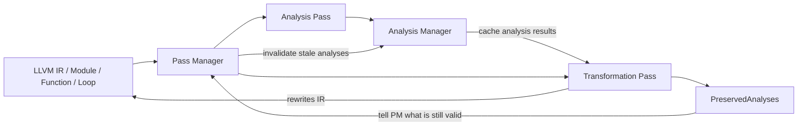
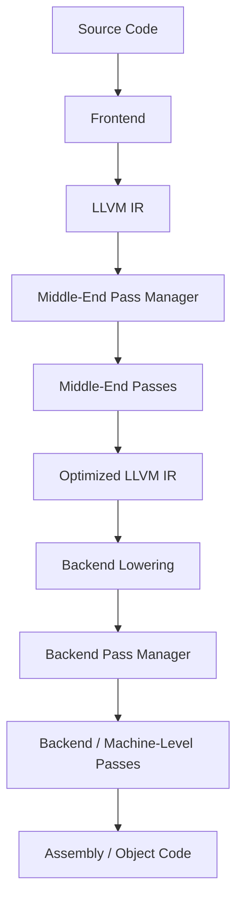

import AdBanner from '@site/src/components/AdBanner';
import Tabs from '@theme/Tabs';
import TabItem from '@theme/TabItem';

# Understanding LLVM Passes and Their Types

📩 Interested in deep dives like pipelines, cache, and compiler optimizations?

<div
  style={{
    width: '100%',
    maxWidth: '900px',
    margin: '1rem auto',
  }}
>
  <iframe
    src="https://docs.google.com/forms/d/e/1FAIpQLSebP1JfLFDp0ckTxOhODKPNVeI1e21rUqMJ0fbBwJoaa-i4Yw/viewform?embedded=true"
    style={{
      width: '100%',
      minHeight: '620px',
      border: '0',
      borderRadius: '12px',
      background: '#fff',
    }}
    loading="lazy"
  >
    Loading…
  </iframe>
</div>

As in our previous LLVM articles, we have already seen that a compiler is broadly divided into three major phases:

- **frontend**
- **middle-end**
- **backend**

The **frontend** reads source code and lowers it into **LLVM IR**.
That **IR** is then handed to the **middle-end**, where target-independent analysis and optimization happen.
After that, LLVM lowers the program toward **MIR** and backend-level machine representations, where the **backend** performs target-specific work and emits semantically correct, optimized assembly or object-level output.

So the big picture is:

```rust
Source Code -> Frontend -> LLVM IR -> Middle-End -> MIR / Machine-Level Forms -> Backend -> Optimized Assembly / Object Code
```

This matters because these three phases do not communicate as vague ideas.
They communicate through structured representations.

- the frontend hands off **IR**
- the middle end optimizer transforms **IR**
- the backend lowers toward **MIR** and final machine code

>>If you spend enough time around LLVM, one word starts appearing everywhere:

      > `pass`

`opt` runs passes.<br/>
`llc` also runs backend passes.<br/>
Many LLVM tools expose pass-related behavior in one form or another.<br/>
The optimizer is a pipeline of passes.<br/>
Analysis results are produced by passes.<br/>
Even backend code generation is organized as passes over progressively lower-level representations.<br/>

So if you do not understand what a pass is, then a lot of LLVM documentation still feels like a blur of names:

- `mem2reg`
- `instcombine`
- `gvn`
- `licm`
- `simplifycfg`
- `register allocation`
- `instruction scheduling`

You can memorize the names.
But you still will not understand the real thing:

:::caution The deeper compiler question
What exactly is a pass doing, why is LLVM organized this way, and why does almost every serious optimization appear as a pass in a larger pipeline?
:::

This article answers that properly.

We will not treat passes as random plugins.
We will treat them as LLVM’s core method for structuring reasoning and transformation.

:::tip If you want the full pipeline explanation first, read these before continuing:

- [High-Level LLVM Architecture](https://www.compilersutra.com/docs/llvm/llvm_basic/LLVM_Architecture/)
- [LLVM IR Intro](https://www.compilersutra.com/docs/llvm/llvm_ir/intro_to_llvm_ir/)
- [LLVM IR Hierarchy](https://www.compilersutra.com/docs/llvm/llvm_ir/hierarchy_of_llvm_ir/)
- [SSA](https://www.compilersutra.com/docs/llvm/llvm_Curriculum/level0/Static_Single_Assignment/)
- [Dominator Trees and PHI Nodes](https://www.compilersutra.com/docs/llvm/llvm_Curriculum/level0/Dominator_Tree_And_Dominance_Frontier/)
:::

This article adds the next layer:

:::important What this article will give you
- What an LLVM pass really is
- Why LLVM is built around passes
- The difference between analysis and transformation passes
- The difference between module, function, loop, and backend-level scope
- How passes fit into frontend, middle-end, and backend thinking
- How to mentally read a pass pipeline without getting lost
:::

If you want the broader pass catalog, pass-family breakdown, and pass-infrastructure evolution, read:

- [The Complete Evolution of LLVM Pass Infrastructure](https://www.compilersutra.com/docs/llvm/llvm_pass_tracker/llvm_pass/)

<Tabs>
  <TabItem value="social" label="📣 Social Media">
    - [🐦 Twitter - CompilerSutra](https://twitter.com/CompilerSutra)
    - [💼 LinkedIn - Abhinav](https://www.linkedin.com/in/abhinavcompilerllvm/)
    - [📺 YouTube - CompilerSutra](https://www.youtube.com/@compilersutra)
    - [💬 Join the CompilerSutra Discord for discussions](https://discord.gg/DXJFhvzz3K)
  </TabItem>

  <TabItem value="contact" label="✉️ Contact Us">
    - Email: [osc@compilersutra.com](mailto:osc@compilersutra.com)
    - Feedback / Queries: Use our mail us for suggestions or issues.
  </TabItem>
</Tabs>

<div>
    <AdBanner />
</div>

## Table of Contents

1. [Why Passes Exist](#why-passes-exist)
2. [What an LLVM Pass Actually Is](#what-an-llvm-pass-actually-is)
3. [How to Inspect LLVM Passes](#how-to-inspect-llvm-passes)
4. [Types of LLVM Passes](#types-of-llvm-passes)
5. [How Analysis and Transformation Passes Communicate](#how-analysis-and-transformation-passes-communicate)
6. [What Scope a Pass Operates On](#what-scope-a-pass-operates-on)
7. [Where Passes Fit in Frontend Middle-End and Backend Thinking](#where-passes-fit-in-frontend-middle-end-and-backend-thinking)
8. [Examples of Important LLVM Passes](#examples-of-important-llvm-passes)
9. [Reading a Pass Pipeline with the Right Mental Model](#reading-a-pass-pipeline-with-the-right-mental-model)
10. [How Custom Passes Fit In](#how-custom-passes-fit-in)
11. [Common Misconceptions](#common-misconceptions)
12. [FAQ](#faq)
13. [Summary](#summary)
14. [What Next](#what-next)

## Why Passes Exist

A compiler does not optimize your source code directly after parsing it.

As we have already seen, the compiler is divided into three major parts:

- frontend
- middle-end
- backend

The frontend reads the source program and generates **LLVM IR**.
After that, the compiler mostly stops reasoning in terms of your original source text.
Now the middle-end works on **IR**, analyzes **IR**, transforms **IR**, and prepares that IR for later lowering.

So when we talk about most LLVM optimizations, we are not talking about:

- editing your source code
- rethinking your syntax directly
- optimizing raw C or C++ statements line by line

We are talking about transformations over structured compiler representations, especially **LLVM IR**.

:::important Here, **transformation** simply means:

- modifying the IR
- rewriting the IR into a better or simpler form
- removing, inserting, replacing, or reorganizing IR instructions and structure
:::

So when LLVM says a pass performs a transformation, it usually means the pass has changed the program’s IR while preserving program correctness.

That is exactly where passes become important.

It performs many smaller reasoning steps:

- inspect the control-flow graph
- infer which values are constant
- simplify branches
- remove dead instructions
- move loop-invariant code
- inline calls
- choose machine instructions
- allocate registers

Each of those jobs is conceptually separate.

LLVM makes that separation explicit.

:::tip
A pass is one focused compiler step with a clearly defined responsibility. It usually does one of two things:

- learns something about the program, or
- changes the program in a controlled way
:::

This design is not accidental.

If all optimization and analysis logic were mixed into one large compiler routine, several problems would appear immediately:

- analyses would be harder to reuse across different optimizations
- transformations would be harder to test in isolation
- ordering effects between optimizations would become harder to reason about
- target-independent logic and target-specific logic would become more entangled
- maintaining or extending the optimizer across versions would become far more fragile

So LLVM organizes compiler work into passes.

That gives LLVM a cleaner engineering structure:

- one pass can compute facts another pass depends on
- one transformation can simplify the IR before a later optimization runs
- passes can be reordered, grouped, enabled, disabled, measured, and debugged more systematically
- the optimizer becomes a pipeline of explicit stages instead of one opaque block of logic

So the pass design is not just about elegance.
It is what makes LLVM’s optimizer scalable, maintainable, and composable as a real compiler infrastructure.

## What an LLVM Pass Actually Is

An **LLVM pass** is a small, focused step inside the compiler that works on the program after it has been converted into an internal compiler form such as **LLVM IR**.

In simple words:

- some passes **inspect** the program and collect information
- some passes **modify** the program by rewriting the IR
- each pass usually does one small, specific job
- many such passes are combined into a larger optimization pipeline

So when you hear the word `pass`, think:

> one well-defined compiler step working on an internal program representation

That internal representation might be:

- LLVM IR
- an entire module
- a single function
- a loop inside a function
- or backend machine-level forms such as MIR

LLVM’s official documentation for passes and pass infrastructure is here:

- [LLVM Passes documentation](https://llvm.org/docs/Passes.html)

So the cleaner technical definition is:

:::important Definition
An LLVM pass takes LLVM IR as input and either analyzes it by gathering information about the program, or transforms it by rewriting the IR into a more optimized yet semantically equivalent form.
:::

Here is a very small real example of how a transformation pass changes IR while keeping the program meaning the same.

Take this C code:

```c
int is_odd(unsigned n) {
    return n % 2;
}
```

If we generate LLVM IR at `O0`:

```python
clang -O0 -Xclang -disable-O0-optnone -S -emit-llvm input.c -o input.ll
```

we get IR like this:

```llvm
define dso_local i32 @is_odd(i32 noundef %0) {
  %2 = alloca i32, align 4
  store i32 %0, ptr %2, align 4
  %3 = load i32, ptr %2, align 4
  %4 = urem i32 %3, 2
  ret i32 %4
}
```

Now instead of guessing which pass changed it, we can inspect the real optimization pipeline:

```python
opt -O2 -print-after-all input.ll -disable-output 2>&1 | grep -n "IR Dump After\|urem i32\|and i32"
```

In the real output, we can see this sequence:

```rust
; *** IR Dump After PromotePass on is_odd ***
  %2 = urem i32 %0, 2

; *** IR Dump After InstCombinePass on is_odd ***
  %2 = and i32 %0, 1
```

So here the actual IR-changing optimization is introduced by `InstCombinePass`.

If we now run just that simplified IR through `instcombine`, the transformed IR looks like:

```llvm
define dso_local i32 @is_odd(i32 noundef %0) {
  %2 = and i32 %0, 1
  ret i32 %2
}
```

Why does this still preserve meaning?

Because for an unsigned integer, `n % 2` and `n & 1` produce the same result:

- if `n` is even, both give `0`
- if `n` is odd, both give `1`

So the pass has **changed the IR**, but it has **not changed the meaning of the program**.

This is exactly the kind of transformation LLVM tries to perform: preserve correctness, but rewrite the IR into a form that is simpler and often easier for later passes or the backend to handle efficiently.

This also helps remove a few beginner misunderstandings:

- not every pass is an optimization
- not every pass changes IR
- not every pass runs in the same stage of the compiler

## How to Inspect LLVM Passes

Once you know that LLVM works through passes, the next practical question is:

> how do I actually inspect them?

There are two different things people usually mean by "inspect LLVM passes":

- see which passes LLVM provides
- see what a specific pass does to your IR

Both are important.

**1. List available passes**

LLVM provides command-line tools such as `opt` and `llc` to inspect and run passes.

- `opt` is LLVM’s main tool for running and experimenting with passes on **LLVM IR**
- `llc` is LLVM’s lower-level code generation tool that takes LLVM IR and lowers it toward **assembly / machine code**

So in simple terms:

- use `opt` when you want to inspect or run IR-level passes
- use `llc` when you want to inspect lower-level code generation behavior and backend-side passes

```python
opt --print-passes
```

This prints the passes known to `opt`, especially in the modern pass-manager style.

If you are exploring LLVM for the first time, this command is useful because it shows that passes are not one mysterious mechanism.
They are a concrete set of named compiler steps.

For backend-side exploration, `llc` is also important because backend code generation is likewise organized as a sequence of passes over lower-level representations.

:::note Important note
The list printed by commands such as `opt --print-passes` tells you the passes your LLVM installation provides.

It does **not** mean that all of those passes will run on your code.

It only means:

- these passes exist in your installed LLVM version
- these are pass names your LLVM tools recognize
- these are the analysis and transformation steps LLVM can expose
:::

So after listing the available passes, the real practical question becomes:

> how do you see which passes are actually running on your code?


**See which passes are actually running on your code**

If you want to see the pass pipeline your code is going through, LLVM provides debug-style options that print pass execution information.

For IR-side pipelines with `opt`, a practical command is:

```python
opt -passes='default<O2>' -disable-output -debug-pass-manager input.ll
```

This helps you see which passes are being scheduled and run for that pipeline.

If you want to dump the LLVM IR after middle-end passes, `opt` also provides:

```python
opt -O2 -print-after-all input.ll -disable-output
```

This is the middle-end-side equivalent of watching how LLVM changes your IR after successive optimization passes.

If you want to inspect backend-side lowering and code generation stages, `llc` is useful:

```python
llc -O2 -print-after-all input.ll -o output.s
```

This lets you dump backend state after successive backend passes while LLVM lowers IR toward target-specific code.

If you want to inspect the backend pass structure rather than full dumps, you can also use:

```python
llc -O2 -debug-pass=Structure input.ll -o output.s
```

You can also use `clang` to watch IR or backend state after many compiler passes:

```python
clang -O2 -mllvm -print-after-all input.c -S -o output.s
```

This is useful when you want to inspect how the IR or lower-level compiler state changes after successive passes while compiling real source code.

:::note Important note
The exact flags and output style can vary across LLVM versions.

So the main idea is:

- use `opt` to inspect IR-side pass pipelines
- use `opt -print-after-all` when you want to dump IR after middle-end passes
- use `llc -print-after-all` to inspect backend dumps after passes
- use `llc -debug-pass=Structure` when you only want backend pass structure
- use `clang -mllvm -print-after-all` when you want to observe pass effects while compiling source code
- expect some command syntax to differ depending on your installed LLVM version
:::

This is the real difference between:

- seeing all passes LLVM provides
- seeing the passes your code is actually going through

The first tells you what exists.
The second tells you what is really happening to your program.

**Example: Inspecting Passes with `opt`, `llc`, and `clang`**

Let us take a very small example:

```c
int add(int a, int b) {
    int x = a + b;
    return x;
}
```

Suppose this is stored in `input.c`.

<Tabs>
  <TabItem value="opt-example" label="Using opt">

First generate LLVM IR:

```python
clang -O0 -Xclang -disable-O0-optnone -S -emit-llvm input.c -o input.ll
```

Now inspect the IR-side pass pipeline:

```python
opt -passes='default<O2>' -disable-output -debug-pass-manager input.ll
```

Actual output snippet:

```rust
Running pass: SimplifyCFGPass on add (11 instructions)
Running pass: SROAPass on add (11 instructions)
Running pass: EarlyCSEPass on add (2 instructions)
Running pass: PromotePass on add (2 instructions)
Running pass: InstCombinePass on add (2 instructions)
Running pass: GVNPass on add (2 instructions)
Running pass: DSEPass on add (2 instructions)
Running pass: VerifierPass on [module]
```

If you want to dump the IR after successive middle-end passes instead of only seeing pass names, you can also run:

```python
opt -O2 -print-after-all input.ll -disable-output
```

Typical output starts like:

```rust
*** IR Dump After VerifierPass on [module] ***
define dso_local i32 @add(i32 noundef %0, i32 noundef %1) {
  %3 = add nsw i32 %1, %0
  ret i32 %3
}
```

Use this when:

- you already have LLVM IR
- you want to inspect IR-level passes directly
- you want to understand what the optimizer is doing before backend lowering

</TabItem>

<TabItem value="llc-example" label="Using llc">

First generate LLVM IR:

```python
clang -O0 -Xclang -disable-O0-optnone -S -emit-llvm input.c -o input.ll
```

Now inspect backend-side pass structure:

```python
llc -O2 -print-after-all input.ll -o output.s
```

Actual output snippet:

```rust
# *** IR Dump After X86 DAG->DAG Instruction Selection (x86-isel) ***:
# Machine code for function add:
bb.0 (%ir-block.2):
  liveins: $edi, $esi
  renamable $eax = LEA64_32r killed renamable $rdi, 1, killed renamable $rsi, 0, $noreg
  RET64 $eax
```

If you only want the backend pass structure and not every dump, you can instead run:

```python
llc -O2 -debug-pass=Structure input.ll -o output.s
```

Use this when:

- you want to inspect backend and code generation stages
- you want to see passes closer to instruction selection and register allocation
- you want to understand what happens after IR optimization

</TabItem>

<TabItem value="clang-example" label="Using clang">

Compile directly from source and print IR / compiler state after many passes:

```python
clang -O1 -mllvm -print-after-all input.c -S -o output.s
```

Because the raw output is usually very large, a practical way to inspect it is to `grep` only the pass dump markers:

```python
clang -O1 -mllvm -print-after-all input.c -S -o output.s 2>&1 | grep "IR Dump After"
```

Actual output snippet:

```rust
; *** IR Dump After Annotation2MetadataPass on [module] ***
; *** IR Dump After ForceFunctionAttrsPass on [module] ***
; *** IR Dump After AssignmentTrackingPass on [module] ***
; *** IR Dump After InferFunctionAttrsPass on [module] ***
# *** IR Dump After X86 DAG->DAG Instruction Selection (x86-isel) ***:
# *** IR Dump After Finalize ISel and expand pseudo-instructions (finalize-isel) ***:
# *** IR Dump After X86 Assembly Printer (x86-asm-printer) ***:
```

We use `grep` here because `-print-after-all` can produce thousands of lines of IR and machine-level dumps.
By grepping only `IR Dump After`, you first see **which passes produced dumps**.
Then, once you find the pass you care about, you can inspect the full surrounding output in detail.

Use this when:

- you want an end-to-end view starting from source code
- you want to inspect how the compiler changes the program after successive passes
- you do not want to split the workflow manually into separate `clang`, `opt`, and `llc` steps

</TabItem>
</Tabs>

### 4. Inspect analysis-oriented behavior

Some passes are mainly about analysis rather than rewriting.
In such cases, the goal is often to inspect information LLVM computes about the IR.

Examples include:

- dominance information
- loop information
- alias analysis behavior

Depending on LLVM version and tooling, this may involve analysis printing options, debug flags, or pass pipeline diagnostics.

### 5. Use small IR examples

The easiest way to understand a pass is not to throw a huge codebase at it.
Use a tiny input first.

For example:

- one function
- one branch
- one loop
- one stack variable

Then run a pass like:

- `mem2reg`
- `simplifycfg`
- `instcombine`

and inspect exactly what changed.

:::tip Practical learning method
If you want to understand a pass deeply, do this:

1. write a very small C/C++ example
2. generate LLVM IR with `clang -S -emit-llvm`
3. run one pass with `opt`
4. compare the IR before and after
:::

That is usually much more effective than only reading pass names in documentation.

## Types of LLVM Passes

LLVM passes can be understood in more than one way, but the most useful beginner-level classification is this:

- **analysis passes**
- **transformation passes**

And separately, passes can operate at different scopes:

- **module-level**: here `module` usually means one whole LLVM IR file or one translation unit. A module contains functions, global variables, declarations, metadata, and target-related information. So a module-level pass can inspect or transform the whole program unit, not just one function.
- **function-level**: here the pass works on one function at a time. It can inspect or modify the IR inside that function, but it is not meant to reason about the whole module at once.
- **loop-level**: here the pass focuses on one loop inside a function. This is useful for optimizations that specifically care about loop structure, loop invariants, induction variables, and iteration behavior.
- **backend / machine-level**: here the pass works on lower-level machine-oriented representations after IR lowering. At this stage, the compiler is closer to real target instructions, register allocation, scheduling, and final code generation.

This is the first major distinction every LLVM learner should understand.

<Tabs>
  <TabItem value="analysis" label="Analysis Passes">

Analysis passes inspect the program and compute information about it.

They usually do **not** directly change the program.

Examples:

- Dominator Tree
- LoopInfo
- ScalarEvolution
- Alias Analysis

These passes answer questions like:

- which blocks dominate which others?
- where are the natural loops?
- can two pointers refer to the same memory?
- how does this loop induction variable evolve?

</TabItem>

<TabItem value="transformation" label="Transformation Passes">

Transformation passes actually rewrite the program.

Examples:

- `mem2reg`
- `instcombine`
- `simplifycfg`
- dead code elimination
- loop unrolling
- inlining

These passes do things like:

- promote stack variables into SSA values
- fold redundant instruction patterns
- simplify branches and merge blocks
- remove useless instructions
- duplicate loop bodies to reduce overhead

</TabItem>
</Tabs>

:::caution Important relationship
Transformation passes often depend on analysis passes.

A pass that changes control flow or data flow safely usually needs structural knowledge first.
:::

That is why LLVM’s pass infrastructure also cares about:

- analysis dependencies
- preserved analyses
- invalidated analyses after transformation

This is not bookkeeping for its own sake.
It is what keeps large optimization pipelines both correct and efficient.

## How Analysis and Transformation Passes Communicate

At first, a beginner might imagine something like this:

- one analysis pass runs
- it discovers useful information
- then it directly hands that information to some transformation pass

But LLVM is not usually organized in that informal way.

Instead, LLVM has a proper system for this.

The coordination happens through:

- the **pass manager**
- the **analysis manager**

In simple words:

- an **analysis pass** computes facts about the program
- LLVM stores and manages those facts
- a **transformation pass** asks for those facts when it needs them
- if the IR changes, LLVM decides whether those old facts are still valid or must be recomputed

An adapted mental model looks like this:



The idea is simple:

- an **analysis pass** computes information about the IR
- that information is stored and made available through LLVM’s pass infrastructure
- a **transformation pass** can request and use that information when it needs it

In practice, the flow looks roughly like this:

```cpp
PreservedAnalyses MyPass::run(Function &F, FunctionAnalysisManager &AM) {
  auto &DT = AM.getResult<DominatorTreeAnalysis>(F);

  // Use DominatorTree information before rewriting IR.
  simplifySomethingUsingDominance(F, DT);

  return PreservedAnalyses::none();
}
```

What this small example shows:

- the transformation pass does **not** build dominance information manually
- it asks the analysis manager for `DominatorTreeAnalysis`
- it uses that result while transforming the function
- after rewriting IR, it returns a `PreservedAnalyses` result to tell LLVM what is still valid

If the transformation changed the IR in a way that may invalidate earlier facts, returning `PreservedAnalyses::none()` tells LLVM to recompute analyses as needed later.

For example:

- `DominatorTree` can tell a transformation pass which blocks dominate others
- `LoopInfo` can tell a transformation pass which loops exist
- `Alias Analysis` can help a transformation pass reason about memory safely

So the communication flow is not:

```rust
analysis pass -> manually edits transform pass
```

It is more like:

```rust
analysis pass -> computes facts -> pass manager / analysis manager stores them -> transformation pass queries them
```

### Why the Pass Manager Matters Here

The pass manager matters because it decides three very practical things:

- when an analysis needs to be computed
- when an existing analysis result can be reused
- when an old analysis result has become invalid after the IR changed

That third point is especially important.

Suppose a transformation pass rewrites the IR.
Now some earlier analysis results may no longer describe the program correctly.

For example:

- if the control-flow graph changes, dominance information may become invalid
- if loop structure changes, `LoopInfo` may no longer be correct
- if memory behavior changes, alias-related analysis may need to be recomputed

LLVM therefore keeps track of things such as:

- **required analyses**: which analysis results a pass needs before it can run
- **preserved analyses**: which analysis results are still valid after a transformation finishes
- **invalidated analyses**: which old results must be discarded because the IR changed

This is what lets a long pass pipeline remain both:

- **correct**: passes do not rely on stale information
- **efficient**: LLVM does not recompute every analysis from scratch after every step

:::tip Practical mental model
Analysis passes produce facts about the program.
Transformation passes use those facts to safely rewrite the IR.
The pass manager decides when those facts are computed, reused, refreshed, or discarded.
:::

:::note Legacy vs New Pass Manager
Older LLVM used the **Legacy Pass Manager**. Modern LLVM emphasizes the **New Pass Manager (NPM)**.

For now, it is enough to know that LLVM’s pass infrastructure evolved over time, and modern LLVM primarily uses the newer model.

We will discuss the difference between the Legacy Pass Manager and the New Pass Manager in a dedicated next article.
:::

**Difference Between Analysis and Transformation Passes**

| Aspect | Analysis Pass | Transformation Pass |
| --- | --- | --- |
| Main goal | Gather information about the program | Modify the IR into a better form |
| Changes IR? | Usually no | Yes |
| Output | Facts, properties, structural information | Rewritten or optimized IR |
| Typical examples | DominatorTree, LoopInfo, ScalarEvolution, Alias Analysis | `mem2reg`, `instcombine`, `simplifycfg`, DCE |
| Typical use | Help other passes reason correctly | Improve performance, simplify IR, prepare later stages |
| Dependency relationship | Often used by transformation passes | Often depends on analysis results |

<div>
    <AdBanner />
</div>

## What Scope a Pass Operates On

The word **scope** simply means:

> how much of the program a pass can see or work on at one time

In LLVM, this is an important distinction.

When we ask about the **scope of a pass**, we are really asking:

> what part of the program is this pass allowed to look at or work on?

For example:

- does it see the whole LLVM IR file?
- does it work on just one function?
- does it focus on one loop inside a function?
- does it run later on lower-level machine-oriented code?

So a pass is not defined only by **what it does**.
It is also defined by **how much of the program it runs on at one time**.

All of the scopes below can contain either:

- **analysis passes**
- **transformation passes**

**Module Pass**

It works on the whole LLVM module. Here, a module usually means the complete LLVM IR file or translation unit.

That means it can see:

- multiple functions
- global variables
- declarations
- interprocedural relationships

Typical examples and use cases:

- inlining decisions across functions
- global dead code elimination
- whole-module reasoning

**Function Pass**

It works on one function at a time.

That means it focuses on the IR inside a single function.

Typical examples and use cases:

- CFG simplification
- SSA-related cleanup
- dead instruction elimination
- local scalar optimizations

**Loop Pass**

It works on one loop inside a function.

That means it focuses only on loop-specific structure and behavior.

Typical examples and use cases:

- loop invariant code motion
- loop unrolling
- loop unswitching
- strength reduction

Loops matter so much for performance that LLVM treats them as a dedicated optimization unit.

**Backend Machine-Level Pass**

This works after LLVM IR lowering.

Instead of operating on high-level LLVM IR, it works on lower-level machine-oriented compiler representations.

Typical examples and use cases:

- instruction selection
- register allocation
- instruction scheduling
- peephole cleanup

So these are still passes, but they run much closer to real target instructions and final code generation.

:::tip Key lesson
When someone says “this is a pass,” always ask two things:

- Is it analysis or transformation?
- What scope does it operate on?
:::

Those two questions immediately make LLVM documentation much easier to read.

## Where Passes Fit in Frontend Middle-End and Backend Thinking

This section is important because beginners often hear:

- frontend passes
- middle-end passes
- backend passes

That wording is useful at a high level, but it can also create confusion.

Why?

Because it mixes together two different ideas:

- **compiler stage**: where we are in the compilation pipeline
- **pass execution**: which passes are running on which representation

A cleaner picture is:



So the most pass-heavy part of the LLVM story begins once LLVM IR exists.

<Tabs>
  <TabItem value="frontend-stage" label="Frontend">

The frontend is responsible for turning source code into a compiler-understandable internal form.

That usually includes:

- parsing source code
- semantic checking
- building AST-level meaning
- lowering language constructs into LLVM IR

In practice, this is not usually the part LLVM learners mean when they casually say “LLVM passes.”

It is more accurate to say:

> the frontend prepares and lowers the program into LLVM IR, and after that the pass-oriented optimization pipeline becomes much more visible

So the frontend is essential, but the pass-heavy optimization story really becomes obvious after IR has been produced.

  </TabItem>

  <TabItem value="middle-end-stage" label="Middle-End">

The middle-end is where many of the classic LLVM passes run.

Here the compiler works on **target-independent LLVM IR**.

This stage performs things like:

- analysis
- canonicalization
- simplification
- scalar optimization
- loop optimization
- interprocedural optimization

This is where familiar pass names appear, such as:

- `mem2reg`
- `instcombine`
- `gvn`
- `licm`
- `simplifycfg`

So when most people say “LLVM optimization passes,” they are often thinking mainly about the middle-end.

  </TabItem>

  <TabItem value="backend-stage" label="Backend">

The backend starts after LLVM has an optimized IR and begins lowering it toward target-specific machine code.

Here backend and machine-level passes handle things such as:

- instruction selection
- machine-specific lowering
- register allocation
- instruction scheduling
- final emission

So yes, it is completely reasonable to talk about backend passes.

The important clarification is this:

the frontend is mostly about parsing, semantic meaning, and IR generation,
the middle-end is heavily pass-driven over LLVM IR,
and the backend is also pass-driven, but now over lower-level machine-oriented representations.

  </TabItem>
</Tabs>

:::tip Practical takeaway
If you want to understand where passes fit in LLVM, think in this order:

1. frontend creates LLVM IR
2. middle-end passes analyze and optimize LLVM IR
3. backend passes lower that program toward real machine code
:::

So the clean beginner mental model is:

:::important Better mental model
LLVM uses passes heavily in the middle-end and backend.
Frontend work is usually better described in terms of parsing, semantic analysis, AST construction, and IR generation.
:::

[Read more about Frontend Passes](./frontend/fronend.md)

[Learn more about Middle-End Passes](./middlend/middleend.md)

[Explore Backend Passes in Detail](./backend/backend.md)

## Examples of Important LLVM Passes

Let us make this more concrete.

| Pass / Family | Kind | Scope | What it does |
| --- | --- | --- | --- |
| `mem2reg` | Transformation | Function | Promotes eligible stack variables into SSA registers |
| `instcombine` | Transformation | Function | Canonicalizes and simplifies instruction patterns |
| `simplifycfg` | Transformation | Function | Simplifies branches, blocks, and CFG structure |
| DCE | Transformation | Function | Removes instructions whose results are unused |
| LICM | Transformation | Loop | Moves loop-invariant work outside loops |
| Inliner | Transformation | Module / CGSCC pipeline | Replaces call sites with callee bodies when profitable |
| DominatorTree | Analysis | Function | Computes dominance relationships in CFG |
| LoopInfo | Analysis | Function | Identifies loops and loop nesting |
| Alias Analysis | Analysis | Multiple layers | Estimates memory aliasing relationships |
| Register Allocation | Transformation | Backend | Assigns virtual values to physical registers |

Notice how the table reflects the two key questions:

- what kind of pass is it?
- what unit does it operate on?

That is not just presentation.
That is how LLVM itself wants you to think.

## Reading a Pass Pipeline with the Right Mental Model

When you see a pipeline of passes, do not read it as a random list.

Read it as a sequence of compiler intentions.

For example:

- canonicalize structure
- compute analyses
- perform profitable transforms
- clean up what became dead
- lower into a more target-constrained form

That mental shift matters.

Because the pipeline is not just “many optimizations.”
It is staged reasoning.

One pass often prepares the ground for the next.

:::tip Better question to ask
Do not ask only:
"What does this pass do?"

Also ask:
"Why is it running here, after that previous pass, and before the next one?"
:::

That is how you start thinking like a compiler engineer instead of a glossary reader.

<div>
    <AdBanner />
</div>

## How Custom Passes Fit In

At this point, a very natural question is:

> can we create our own LLVM pass?

Yes, absolutely.

A custom pass is simply your own analysis or transformation added into LLVM’s pass framework.

Typical reasons to write one:

- collect metrics from IR
- detect patterns in generated code
- prototype a new optimization idea
- implement domain-specific lowering
- instrument code for research or tooling

When writing a custom pass, you still need to think in LLVM’s language:

- What is the scope?
- Is this analysis or transformation?
- Which analyses do I need?
- Which analyses remain valid after I modify IR?

That discipline is the real lesson, not just the API surface.

We will explore how to create a custom LLVM pass in a dedicated follow-up article.

## Common Misconceptions

**Misconception 1: Every pass is an optimization**

False.
Many passes only analyze or prepare information for other passes.

**Misconception 2: Every pass changes LLVM IR**

False.
Some passes preserve IR exactly.
Some backend passes work on machine-level representations instead of LLVM IR.

**Misconception 3: Passes are only a middle-end idea**

False.
The middle-end is the most visible pass-heavy zone, but the backend also relies heavily on passes.

**Misconception 4: A pass is defined only by its name**

False.
To understand a pass, you need:

- its goal
- its scope
- its dependencies
- where it sits in the pipeline

**Misconception 5: Frontend parsing steps and LLVM passes are exactly the same concept**

Not quite.
Frontend work is structured compiler processing, but when LLVM engineers discuss “passes,” they usually mean the pass-manager-driven analysis and transformation world centered on IR and lower representations.

## FAQ

**What is the biggest mistake beginners make about LLVM passes?**

They assume:

> pass = optimization

That is wrong.

In reality:

- some passes only analyze
- some passes prepare IR for later steps
- some passes maintain correctness or canonical form

**Are passes executed sequentially or in parallel?**

Most pass pipelines are best understood as **sequential**.

That means one pass runs, then another, then another.

However:

- analysis results can be reused across passes
- some modern infrastructure may allow internal parallelism in specific contexts

The right beginner mental model is:

> a pipeline, not random execution

**How do I see which passes are running on my code?**

Use tools such as:

- `opt -passes='default<O2>' -disable-output -debug-pass-manager input.ll`
- `opt -O2 -print-after-all input.ll -disable-output`
- `llc -O2 -print-after-all input.ll -o output.s`
- `clang -O1 -mllvm -print-after-all input.c -S -o output.s`

**How do I debug a specific LLVM pass?**

The best method is:

- start with very small IR
- run only one pass
- compare before and after

For example:

```python
opt -passes=instcombine -S input.ll -o output.ll
```

**How can I isolate the effect of one pass?**

Run only that pass on a small input.

For example:

```python
opt -passes=instcombine input.ll -S -o output.ll
```

This is one of the fastest ways to learn LLVM in practice.

**Why does my pass not show any change?**

Possible reasons include:

- the IR is not in the form that pass expects
- prerequisite passes have not run yet
- the optimization is simply not applicable

For example, `mem2reg` will not transform variables that are not promotable.

**What is the difference between pass pipeline and pass manager?**

- **pass pipeline** means the sequence of passes
- **pass manager** means the system that runs and manages that sequence

A simple mental model is:

- pipeline = recipe
- pass manager = system that executes the recipe

**Can I change the pass pipeline?**

Yes.

For example:

```python
opt -passes="mem2reg,instcombine,gvn" input.ll -S -o output.ll
```

This is useful for:

- experimentation
- research
- custom optimization studies

**Which pass should I learn first?**

Start with:

- `mem2reg`
- `instcombine`
- `simplifycfg`

These give you a strong foundation for understanding how LLVM IR becomes easier to optimize step by step.

## Summary

LLVM passes are the modular building blocks of compiler reasoning.

They exist because compilers need many focused steps rather than one giant opaque optimizer.

The key ideas to remember are:

- a pass is a scoped unit of compiler work
- some passes analyze and some transform
- passes operate at different granularities such as module, function, loop, and backend machine level
- middle-end and backend pipelines are deeply pass-oriented
- pass managers exist to schedule, compose, and maintain these pipelines correctly

If you internalize that, LLVM documentation becomes much easier to navigate.

You stop seeing pass names as isolated jargon.
You start seeing them as parts of a structured optimization system.

## What Next

If you want to continue in the right order, the best follow-ups are:

- [LLVM IR Hierarchy](https://www.compilersutra.com/docs/llvm/llvm_ir/hierarchy_of_llvm_ir/)
- [Dominator Trees, Dominance Frontiers, and PHI Nodes](https://www.compilersutra.com/docs/llvm/llvm_Curriculum/level0/Dominator_Tree_And_Dominance_Frontier/)
- [High-Level LLVM Architecture](https://www.compilersutra.com/docs/llvm/llvm_basic/LLVM_Architecture/)
- [LLVM Pass Tracker](https://www.compilersutra.com/docs/llvm/llvm_pass_tracker/llvm_pass/)

And the strongest next article to write after this one is still:

- a focused `mem2reg` article, because that is where pass theory, SSA theory, dominance, and real LLVM behavior all meet in one place


<Tabs>
  <TabItem value="docs" label="📚 Documentation">
             - [CompilerSutra Home](https://compilersutra.com)
                - [CompilerSutra Homepage (Alt)](https://compilersutra.com/)
                - [Getting Started Guide](https://compilersutra.com/get-started)
                - [Newsletter Signup](https://compilersutra.com/newsletter)
                - [Skip to Content (Accessibility)](https://compilersutra.com#__docusaurus_skipToContent_fallback)


  </TabItem>

  <TabItem value="tutorials" label="📖 Tutorials & Guides">

        - [AI Documentation](https://compilersutra.com/docs/Ai)
        - [DSA Overview](https://compilersutra.com/docs/DSA/)
        - [DSA Detailed Guide](https://compilersutra.com/docs/DSA/DSA)
        - [MLIR Introduction](https://compilersutra.com/docs/MLIR/intro)
        - [TVM for Beginners](https://compilersutra.com/docs/tvm-for-beginners)
        - [Python Tutorial](https://compilersutra.com/docs/python/python_tutorial)
        - [C++ Tutorial](https://compilersutra.com/docs/c++/CppTutorial)
        - [C++ Main File Explained](https://compilersutra.com/docs/c++/c++_main_file)
        - [Compiler Design Basics](https://compilersutra.com/docs/compilers/compiler)
        - [OpenCL for GPU Programming](https://compilersutra.com/docs/gpu/opencl)
        - [LLVM Introduction](https://compilersutra.com/docs/llvm/intro-to-llvm)
        - [Introduction to Linux](https://compilersutra.com/docs/linux/intro_to_linux)

  </TabItem>

  <TabItem value="assessments" label="📝 Assessments">

        - [C++ MCQs](https://compilersutra.com/docs/mcq/cpp_mcqs)
        - [C++ Interview MCQs](https://compilersutra.com/docs/mcq/interview_question/cpp_interview_mcqs)

  </TabItem>

  <TabItem value="projects" label="🛠️ Projects">

            - [Project Documentation](https://compilersutra.com/docs/Project)
            - [Project Index](https://compilersutra.com/docs/project/)
            - [Graphics Pipeline Overview](https://compilersutra.com/docs/The_Graphic_Rendering_Pipeline)
            - [Graphic Rendering Pipeline (Alt)](https://compilersutra.com/docs/the_graphic_rendering_pipeline/)

  </TabItem>

  <TabItem value="resources" label="🌍 External Resources">

            - [LLVM Official Docs](https://llvm.org/docs/)
            - [Ask Any Question On Quora](https://compilersutra.quora.com)
            - [GitHub: FixIt Project](https://github.com/aabhinavg1/FixIt)
            - [GitHub Sponsors Page](https://github.com/sponsors/aabhinavg1)

  </TabItem>

  <TabItem value="social" label="📣 Social Media">

            - [🐦 Twitter - CompilerSutra](https://twitter.com/CompilerSutra)
            - [💼 LinkedIn - Abhinav](https://www.linkedin.com/in/abhinavcompilerllvm/)
            - [📺 YouTube - CompilerSutra](https://www.youtube.com/@compilersutra)

  </TabItem>
</Tabs>
