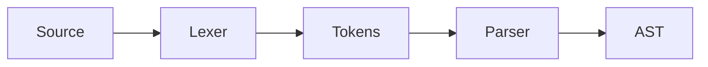
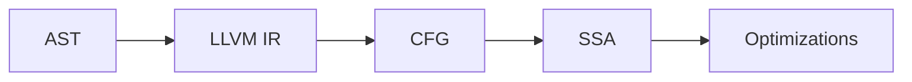
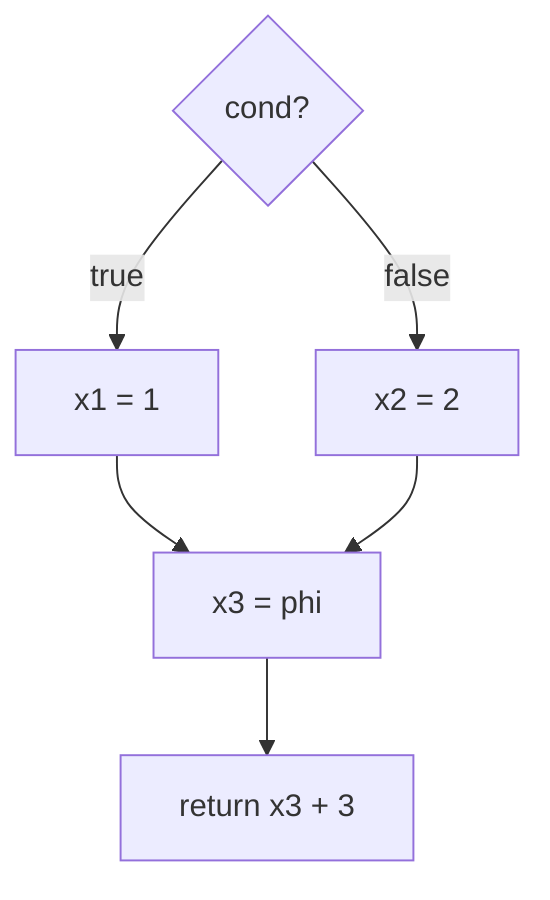
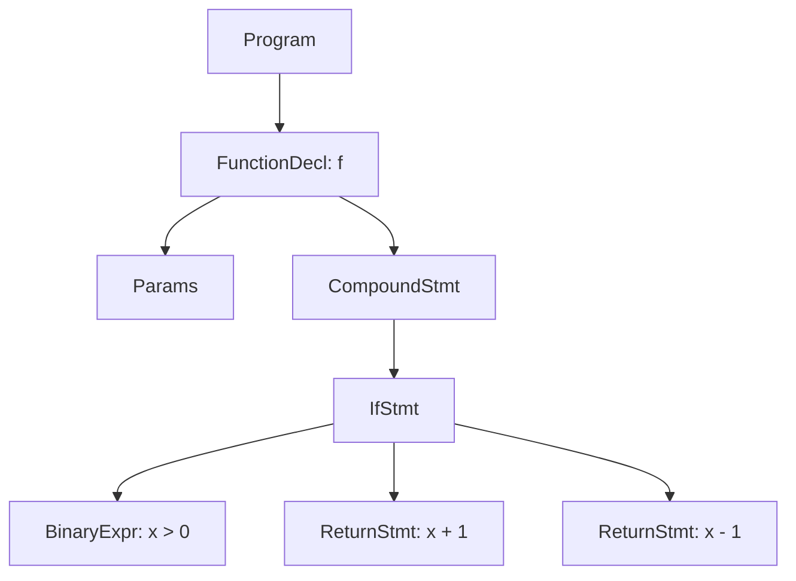
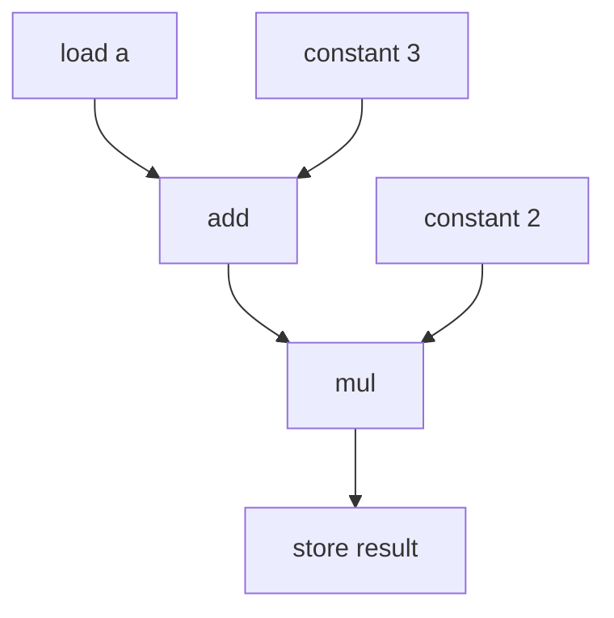

import AdBanner from '@site/src/components/AdBanner';
import LlvmSeoBooster from '@site/src/components/llvm/LlvmSeoBooster';

# Compiler Data Structures by Phase

If you want one article that connects the whole compiler pipeline, this is that map.

The point here is not that every compiler uses the exact same container in every phase.
The point is that each phase tends to need a different kind of structure because each phase solves a different problem.

This page is a synthesis of official LLVM and Clang documentation plus classic compiler papers.
Where the claim is specific to LLVM, the sources are explicit.
Where the claim is a broader compiler-design pattern, it is an inference from those sources rather than a single LLVM document.

:::tip Start Here
If you want the phase-specific articles that this page connects together, read these first:

* [Role of the Lexer in Compiler Design](/docs/compilers/front_end/role_of_lexer)
* [Role of the Parser in Compiler Design](/docs/compilers/front_end/role_of_parser)
* [LLVM IR Explained with Examples](/docs/llvm/llvm_ir/intro_to_llvm_ir)
* [Static Single Assignment (SSA)](/docs/llvm/llvm_Curriculum/level0/Static_Single_Assignment)
* [Dominator Trees, Dominance Frontiers, and PHI Nodes](/docs/llvm/llvm_Curriculum/level0/Dominator_Tree_And_Dominance_Frontier)
:::

## Practice Next

If you want to test the ideas in this article, try the quiz:

* [Compiler Data Structures by Phase Quiz](/docs/mcq/questions/domain/compilers/llvm/compiler-data-structures-quiz)


## Table of Contents

1. [The Short Version](#the-short-version)
2. [Why Different Phases Need Different Structures](#why-different-phases-need-different-structures)
3. [Phase-by-Phase Map](#phase-by-phase-map)
4. [Lexical Analysis](#lexical-analysis)
5. [Syntax Analysis](#syntax-analysis)
6. [Semantic Analysis](#semantic-analysis)
7. [IR Construction and SSA](#ir-construction-and-ssa)
8. [Optimization and Analysis](#optimization-and-analysis)
9. [Backend Code Generation](#backend-code-generation)
10. [Optimization-Specific Data Structures](#optimization-specific-data-structures)
11. [Research Papers and Data Structures](#research-papers-and-data-structures)
12. [What Is Factual vs Inferred](#what-is-factual-vs-inferred)
13. [References](#references)
14. [More Articles](#more-articles)


## The Short Version

Here is the practical mapping:

| Phase | Common data structures | Why they matter | LLVM / Clang touchpoint |
| --- | --- | --- | --- |
| Lexical analysis | DFA, token stream, hash table, identifier table | Recognize tokens and keywords fast | Clang lexer, re2c, IdentifierTable [3][10][11] |
| Syntax analysis | Parse stack, AST, parse tree nodes | Build program structure from tokens | Clang AST [2][3] |
| Semantic analysis | Symbol table, scope stack, declaration table, type table | Resolve names, scopes, and types | Clang AST and precompiled AST data [2][3] |
| IR construction | CFG, basic blocks, SSA names, def-use chains | Represent control and value flow precisely | LLVM LangRef and SSA [1][8] |
| Optimization | Dominator tree, dominance frontier, alias sets, MemorySSA, worklists | Make transformations and analyses efficient | LLVM passes, MemorySSA, alias analysis [4][5][6] |
| Backend code generation | SelectionDAG, MachineFunction, live intervals, register classes | Lower IR into target instructions and registers | LLVM CodeGenerator [7] |

The exact names vary by compiler, but the shape of the problem does not.

## Visual Map

These diagrams compress the article into a few retention-friendly pictures.

### Compiler Pipeline

```mermaid
flowchart LR
  Source[Source Code] --> Lexer[Lexer]
  Lexer --> Tokens[Tokens]
  Tokens --> Parser[Parser]
  Parser --> AST[AST]
  AST --> IR[LLVM IR]
  IR --> CFG[CFG]
  CFG --> SSA[SSA]
  SSA --> Opt[Optimizations]
  Opt --> SDAG[SelectionDAG]
  SDAG --> MIR[Machine IR]
  MIR --> RA[Register Allocation]
  RA --> ASM[Assembly]
```



### Frontend



### Middle-End



### SSA Merge Example



### AST Example Tree



### SelectionDAG Mini Graph



## Why Different Phases Need Different Structures

A compiler does not process the source file as one undifferentiated blob.
It moves through phases, and every phase asks a different question:

* Is this character sequence a token?
* Does this token sequence match the grammar?
* Does this name refer to a valid declaration?
* What value flows into this basic block?
* Which optimization facts are already known?
* Which virtual register should become which physical register?

That is why one data structure does not dominate the whole compiler.

In LLVM terms, this is visible all the way down the stack:

* Clang’s lexer turns a text buffer into tokens [11]
* Clang’s AST and identifier machinery preserve syntax and declarations [2][3]
* LLVM IR is explicitly SSA-based [1]
* LLVM analysis passes compute and reuse structures like dominator trees and alias results [4][6]
* LLVM code generation works with machine-level representations such as SelectionDAG and live intervals [7]

## Phase-by-Phase Map

The table above gives the summary.
The sections below explain why each phase naturally wants the structures it gets.

## Lexical Analysis

Lexical analysis is the tokenization stage.
Its job is to read raw characters and decide whether the current sequence is an identifier, keyword, literal, operator, punctuation mark, or whitespace.

The structures that matter most here are:

* deterministic automata for pattern recognition, often derived from NFA-like regular-expression constructions
* a token buffer or token stream
* an identifier table or keyword table for name lookup

This is where DFA thinking shows up.
The lexer in Clang is described as a component that turns a text buffer into a stream of tokens [11].
re2c says the same phase in a more generator-oriented way: regular expressions get compiled into deterministic automata and emitted as direct-coded lexers [10].

That is the point of the structure:

* patterns become automata
* automata become fast token recognition
* token recognition becomes a stream for the parser

In practice, the lexer also needs fast identifier lookup.
Clang’s `IdentifierTable` explicitly populates keyword information for the active language mode [3].
That makes hash-table-like lookup the right mental model even when the implementation detail is more specialized.

## Syntax Analysis

Syntax analysis takes tokens and builds structure.

The main data structures here are:

* parse trees or parser stacks, depending on the parser strategy
* abstract syntax trees
* grammar-production state in the parser itself

Tradeoff:

* parse trees preserve every grammar rule, which is useful for debugging parser behavior
* ASTs remove syntactic noise, which makes later semantic and optimization passes easier

Clang’s AST docs explain that Clang’s AST is designed to stay close to source structure and to the C++ standard’s meaning, which is why it is useful for tools and refactoring [2].
The AST is not just a decoration.
It is how the compiler records the tree structure that the rest of the frontend can reason about.

Clang’s PCH and modules internals also show that AST data is serialized with supporting structures such as the source manager block, identifier table block, declarations block, and statements/expressions block [3].
That is a strong sign that syntax and declaration data are not a flat list.
They are structured, indexed, and lazily loaded.

## Semantic Analysis

Semantic analysis asks whether the program means something valid.

The relevant structures here are:

* symbol tables
* scope stacks
* declaration tables
* type tables
* identifier tables

The point of the symbol table is not the container itself.
The point is to answer questions like:

* What does this name refer to?
* Is it in the current scope?
* Is this overload or declaration visible here?
* Which type does this expression have?

Why is that non-trivial?

Because real source code is full of shadowing and nested scope.

```cpp
int x = 1;
{
    int x = 2;
    y = x;
}
```

Without scope-aware lookup, the compiler has to guess which `x` you meant.
With a symbol table plus scope stack, the compiler can answer in one step:

* the inner `x` hides the outer `x` inside the block
* `y = x` should use the inner declaration
* once the block ends, the outer `x` becomes visible again

That is why a flat list of declarations is not enough.
A compiler needs a structure that can represent both name identity and lexical scope at the same time.

Clang’s AST and precompiled AST internals show that declarations, types, and identifier lookups are first-class data in the frontend [2][3].
That is why this phase is usually modeled with scoped maps or symbol tables, even when the underlying storage is optimized or distributed across several frontend classes.

## IR Construction and SSA

This is the point where compiler reasoning becomes much more precise.

LLVM’s LangRef states that LLVM IR is SSA-based and that it is the common code representation used through LLVM’s compilation strategy [1].
That one design choice explains why the following structures become central:

* control-flow graphs
* basic blocks
* SSA value names
* def-use chains
* phi nodes at join points

The CFG tells you how control moves.
SSA tells you where values come from.
Def-use chains connect the two.

Tradeoff:

* SSA makes optimization simpler because each definition is explicit
* SSA also adds renaming and phi-node handling, so lowering and destruction later become more complex

Here is the smallest useful SSA example:

```c
if (cond) {
  x = 1;
} else {
  x = 2;
}
return x + 3;
```

In SSA, that becomes:

```text
then:  x1 = 1
else:  x2 = 2
join:  x3 = phi(x1, x2)
       return x3 + 3
```

The reason this matters is not the notation.
It is the fact that the compiler no longer has to ask, "which `x` is this?"
Each value has exactly one definition, so the optimizer can follow the value directly.

That is why SSA is such a strong fit for optimizer design.
The classic Cytron paper on SSA and control dependence established the core construction ideas that made SSA practical [8].
LLVM’s own pass documentation then exposes dominance-frontier and dominator-tree analyses as part of the optimizer toolbox [4].

In other words:

* CFGs model control
* SSA models values
* dominator information tells you where merges matter

That combination is why the `Static Single Assignment` and `Dominator Tree` articles belong next to this one in the curriculum.

## Optimization and Analysis

Optimization passes do not work in a vacuum.
They need analysis results that can be reused across transformations.

The data structures that matter here are:

* dominator trees
* dominance frontiers
* alias sets
* MemorySSA
* worklists and fixed-point bookkeeping

LLVM’s passes documentation explicitly includes `domtree`, `domfrontier`, and related analyses [4].
LLVM’s alias-analysis documentation describes the interface compilers use to decide whether two memory accesses can refer to the same object [6].
LLVM’s MemorySSA documentation describes a memory versioning form built around `MemoryDef`, `MemoryUse`, and `MemoryPhi` nodes [5].

That is the core optimization pattern:

* analysis builds a structure
* transformation reuses that structure
* the next pass benefits from the previous pass’s knowledge

This is why optimizer code often looks like graph traversal plus set maintenance.
The graph is the program.
The sets are the facts the compiler has already discovered.

## Backend Code Generation

The backend moves from target-independent reasoning to target-specific lowering.

LLVM’s code generator docs describe the machine-level stages directly:

* instruction selection
* register allocation
* prolog and epilog insertion
* late machine-code optimization
* code emission [7]

The key structures here are:

* SelectionDAG or another instruction-selection graph
* MachineFunction and machine basic blocks
* live intervals
* register classes
* spill slots and frame layout data

Tradeoff:

* SelectionDAG is good at instruction pattern matching and target legalization
* other backend representations can be better if the compiler wants a more global or higher-level optimization model

LLVM’s `SelectionDAG` docs say the DAG is used for instruction selection and machine-specific optimization [7].
The code generator docs also explain that register allocation maps virtual registers in SSA-like form to the finite physical register file of the target [7].

So the backend’s data structures are about constraints:

* what the target can legally do
* what registers are available
* where values are live
* what instruction patterns exist

That is a very different problem from tokenizing source text, which is why the backend uses different structures from the frontend.

## Other Compiler Architectures

LLVM is the main lens of this article, but it is not the only way compilers are organized.

* GCC uses GIMPLE as a lowered middle-end IR before target-specific expansion.
* MLIR uses multiple IR levels so the compiler can keep domain-specific structure longer.
* HotSpot and Graal use sea-of-nodes style graphs for aggressive optimization.
* Rust’s compiler uses MIR as its mid-level representation before LLVM or another backend.

These are useful comparisons because they show the same pattern in different clothing: the representation changes when the phase changes.


## Optimization-Specific Data Structures

There is one more important detail.

The data structure used by an optimization can change depending on the optimization itself.
That means you should not memorize "the compiler uses X" in the abstract.
You should first ask:

* What optimization is being performed?
* What information does that optimization need?
* What shape of program representation makes that information easy to compute or maintain?

Some examples:

* Constant propagation leans on SSA value flow and worklists.
* Dead code elimination relies on use-def information and reachability.
* Global value numbering often uses congruence classes or hash-based expression tables.
* Loop optimizations depend heavily on CFG shape, dominator trees, and loop nests.
* Register allocation often uses interference graphs, live intervals, and spill bookkeeping.
* Alias-aware memory optimizations use alias sets, points-to summaries, or MemorySSA-style memory versions.

| Optimization | Typical data structure | LLVM example | Reference |
| --- | --- | --- | --- |
| Constant propagation | SSA value flow, worklist | IR simplification and sparse propagation style reasoning | [LLVM passes][4], [LLVM LangRef][1] |
| Dead code elimination | Use-def chains, reachability | Simplify and remove unused IR instructions | [LLVM passes][4], [LLVM LangRef][1] |
| Global value numbering | Congruence classes, expression tables | Common subexpression and redundancy reasoning | [LLVM passes][4] |
| Loop optimizations | CFG, dominator tree, loop nest information | Loop canonicalization and loop transforms | [LLVM passes][4], [Dominance paper][9] |
| Register allocation | Interference graph, live intervals | Machine register assignment and spilling | [LLVM code generator][7] |
| Alias-aware memory optimization | Alias sets, MemorySSA, memory versions | Memory dependence and load/store reasoning | [LLVM alias analysis][6], [MemorySSA][5] |

So the real learning order is:

1. understand the optimization goal
2. understand the program property it needs
3. understand the data structure that represents that property efficiently

That is why different optimization passes in LLVM naturally use different internal structures [4][5][6][7].
The optimizer is not choosing data structures randomly.
It is matching representation to task.

## Research Papers and Data Structures

A lot of the structures discussed here did not appear randomly. They evolved from decades of compiler research.
These papers are some of the foundational references behind that evolution:

| Paper | Data structure focus | What it adds to compiler design |
| --- | --- | --- |
| Ferrante, Ottenstein, and Warren, *The Program Dependence Graph and Its Use in Optimization* (1987) | Program dependence graph | Makes both control and data dependences explicit, so many optimizations become graph traversals instead of ad hoc control-flow logic. |
| Cytron et al., *Efficient Method of Computing Static Single Assignment Form* (1989) and *Efficiently Computing Static Single Assignment Form and the Control Dependence Graph* (1991) | SSA, control dependence graph | Shows that SSA and control dependence are practical to construct and useful for optimization on arbitrary CFGs. |
| Cooper, Harvey, and Kennedy, *A Simple, Fast Dominance Algorithm* (2006) | Dominator tree, dominance frontier | Shows that dominance can be implemented simply and efficiently, which is why these structures remain standard in optimizers. |
| Ramalingam, *On Sparse Evaluation Representations* (2002) | Sparse evaluation graph, equivalent flow graph | Shows how sparse representations make data-flow analysis more compact and efficient. |
| Blazy, Robillard, and Appel, *Formal Verification of Coalescing Graph-Coloring Register Allocation* (2010) | Interference graph, graph coloring | Restates the classic register-allocation model where variables become graph vertices and registers become colors. |

The unifying pattern is the same:

* represent the property you need
* keep the representation sparse enough to compute on
* choose the structure that matches the phase

That is the real compiler lesson hidden behind all the individual names.

## What Is Factual vs Inferred

This article is intentionally careful about evidence.

What is directly supported by the sources:

* LLVM IR is SSA-based [1]
* Clang uses lexer, AST, declaration, and identifier structures [2][3][11]
* LLVM exposes dominator, dominance frontier, alias analysis, MemorySSA, and code-generation infrastructure [4][5][6][7]
* SSA construction and dominance-frontier reasoning are established by classic compiler papers [8][9]

What is a synthesis from those sources:

* the exact phase-by-phase table in this article
* the idea that one phase naturally prefers one family of structures over another
* the curriculum ordering used in this LLVM section

That synthesis is deliberate.
It is the whole point of the article.

<AdBanner />

## References

[1] LLVM Project. *LLVM Language Reference Manual*. https://llvm.org/docs/LangRef.html

[2] Clang Project. *Introduction to the Clang AST*. https://clang.llvm.org/docs/IntroductionToTheClangAST.html

[3] Clang Project. *Precompiled Header and Modules Internals*. https://clang.llvm.org/docs/PCHInternals.html

[4] LLVM Project. *LLVM’s Analysis and Transform Passes*. https://llvm.org/docs/Passes.html

[5] LLVM Project. *MemorySSA*. https://llvm.org/docs/MemorySSA.html

[6] LLVM Project. *LLVM Alias Analysis Infrastructure*. https://llvm.org/docs/AliasAnalysis.html

[7] LLVM Project. *The LLVM Target-Independent Code Generator*. https://llvm.org/docs/CodeGenerator.html

[8] Ron Cytron, Jeanne Ferrante, Barry K. Rosen, Mark N. Wegman, and F. Kenneth Zadeck. *Efficiently Computing Static Single Assignment Form and the Control Dependence Graph*. ACM TOPLAS, 1991. https://research.ibm.com/publications/efficiently-computing-static-single-assignment-form-and-the-control-dependence-graph

[9] Keith D. Cooper, Timothy J. Harvey, and Ken Kennedy. *A Simple, Fast Dominance Algorithm*. Rice University Technical Report TR06-38870. https://repository.rice.edu/items/99a574c3-90fe-4a00-adf9-ce73a21df2ed

[10] re2c authors and contributors. *re2c Documentation*. https://re2c.org/

[11] Clang Project. *Lexer.h File Reference*. https://clang.llvm.org/doxygen/Lexer_8h.html

[12] Jeanne Ferrante, Karl J. Ottenstein, and Joe D. Warren. *The Program Dependence Graph and Its Use in Optimization*. https://research.ibm.com/publications/the-program-dependence-graph-and-its-use-in-optimization

[13] Ron Cytron, Jeanne Ferrante, Barry K. Rosen, Mark N. Wegman, and F. Kenneth Zadeck. *Efficient method of computing static single assignment form*. https://research.ibm.com/publications/efficient-method-of-computing-static-single-assignment-form

[14] G. Ramalingam. *On Sparse Evaluation Representations*. https://research.ibm.com/publications/on-sparse-evaluation-representations

[15] Sandrine Blazy, Benoit Robillard, and Andrew W. Appel. *Formal Verification of Coalescing Graph-Coloring Register Allocation*. https://www.cs.princeton.edu/~appel/papers/regalloc.pdf

[16] Keith D. Cooper, Timothy J. Harvey, and Ken Kennedy. *A Simple, Fast Dominance Algorithm*. https://hdl.handle.net/1911/96345

[1]: https://llvm.org/docs/LangRef.html
[2]: https://clang.llvm.org/docs/IntroductionToTheClangAST.html
[3]: https://clang.llvm.org/docs/PCHInternals.html
[4]: https://llvm.org/docs/Passes.html
[5]: https://llvm.org/docs/MemorySSA.html
[6]: https://llvm.org/docs/AliasAnalysis.html
[7]: https://llvm.org/docs/CodeGenerator.html
[8]: https://research.ibm.com/publications/efficiently-computing-static-single-assignment-form-and-the-control-dependence-graph
[9]: https://www.cs.tufts.edu/~nr/cs257/archive/keith-cooper/dom14.pdf
[10]: https://re2c.org/
[11]: https://clang.llvm.org/doxygen/Lexer_8h.html

## More Articles

* [DFA and NFA in Modern Compiler Design](/docs/llvm/llvm_Curriculum/level0/DFA_and_NFA_in_Modern_Compiler_Design)
* [Static Single Assignment (SSA)](/docs/llvm/llvm_Curriculum/level0/Static_Single_Assignment)
* [Dominator Trees, Dominance Frontiers, and PHI Nodes](/docs/llvm/llvm_Curriculum/level0/Dominator_Tree_And_Dominance_Frontier)
* [LLVM IR Explained with Examples](/docs/llvm/llvm_ir/intro_to_llvm_ir)
* [LLVM Roadmap](/docs/llvm/intro-to-llvm)

<LlvmSeoBooster topic="compiler-dsa-phases" />
