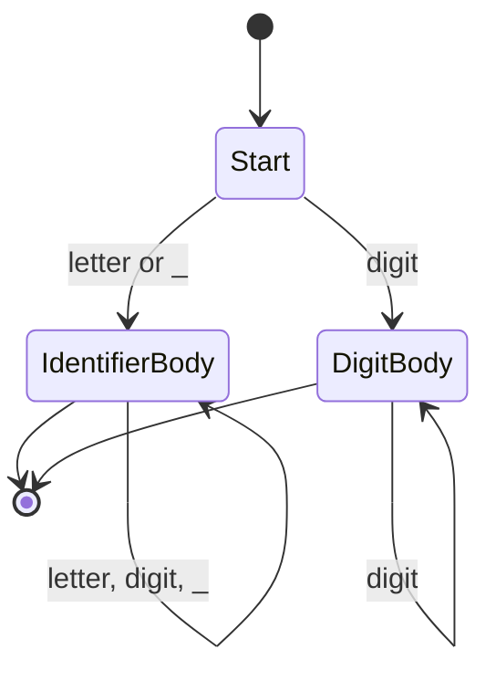
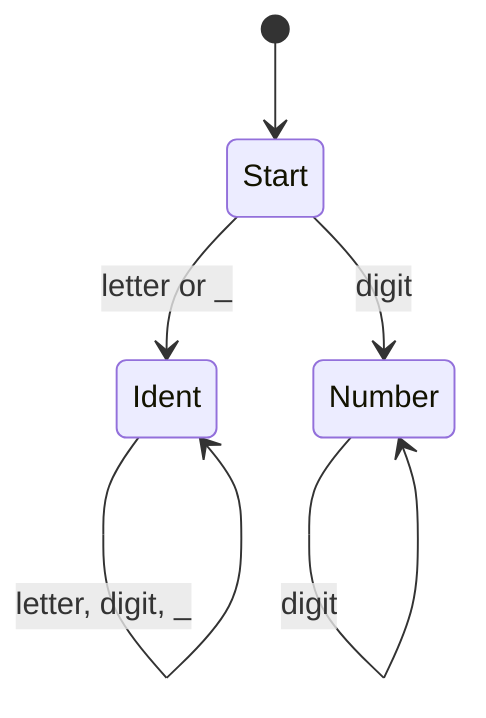
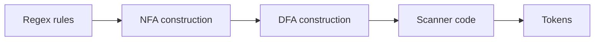
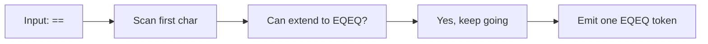

import AdBanner from '@site/src/components/AdBanner';
import Tabs from '@theme/Tabs';
import TabItem from '@theme/TabItem';
import LlvmSeoBooster from '@site/src/components/llvm/LlvmSeoBooster';

# DFA and NFA in Modern Compiler Design

If you want to understand how lexers recognize identifiers, numbers, operators, and keywords, you eventually run into two classic ideas: **NFA** and **DFA**.

These are not abstract decorations on compiler theory. They are the reason lexer generators work, the reason maximal munch is possible, and the reason handwritten scanners still look like small state machines even when they are written as `if` and `switch` statements.

This article connects the automata theory to real compiler engineering.

When you are writing a compiler, the first thing you receive is not a tree or a program object. It is just a text file. The lexer’s job is to look at that text and notice patterns inside it: this sequence is an identifier, that sequence is a number, this two-character run is an operator, and so on.

In the compiler frontend, the lexer is the part that reads raw source text and turns it into tokens. If you have already read [Role of the Lexer in Compiler Design](/docs/compilers/front_end/role_of_lexer), this article explains the machine model behind it. If you have not, that article is the right starting point for the basic lexer flow.

:::tip Start Here
Read the lexer article first:

* [Role of the Lexer in Compiler Design](/docs/compilers/front_end/role_of_lexer)

Then come back here to understand how lexer patterns become finite automata.
:::

## Table of Contents

* [Why Lexers Need Pattern Recognition](#why-lexers-need-pattern-recognition)
* [What Is an NFA?](#what-is-an-nfa)
* [What Is a DFA?](#what-is-a-dfa)
* [Difference Between DFA and NFA](#difference-between-dfa-and-nfa)
* [Regex to NFA to DFA Pipeline](#regex-to-nfa-to-dfa-pipeline)
* [Example: Identifier Recognition](#example-identifier-recognition)
* [Maximal Munch and Longest Match](#maximal-munch-and-longest-match)
* [How Lex and flex Use DFA Generation](#how-lex-and-flex-use-dfa-generation)
* [How re2c Generates Direct-Coded Lexers](#how-re2c-generates-direct-coded-lexers)
* [Why Clang Uses a Handwritten Lexer](#why-clang-uses-a-handwritten-lexer)
* [How Modern Handwritten Lexers Still Behave Like DFAs](#how-modern-handwritten-lexers-still-behave-like-dfas)
* [Unicode and Preprocessor Challenges](#unicode-and-preprocessor-challenges)
* [Performance Tradeoffs](#performance-tradeoffs)
* [Generated Lexer vs Handwritten Lexer](#generated-lexer-vs-handwritten-lexer)
* [Modern Compiler Reality](#modern-compiler-reality)
* [FAQ](#faq)
* [References](#references)

<AdBanner />

## Why Lexers Need Pattern Recognition

A lexer does not parse grammar yet. It only needs to recognize patterns in text.

From the compiler writer’s point of view, the input is just a text file. The lexer scans that file and looks for patterns that match token rules.

Some patterns are simple:

* an identifier starts with a letter or `_`
* a number is a sequence of digits
* `==` is one equality operator
* whitespace should usually be skipped

Those rules are a natural fit for regular expressions and finite automata.

That is the key idea:

* regular expressions describe token patterns
* automata decide whether the current input matches a pattern
* the lexer uses that decision to emit tokens

So when you see a lexer rule like “match identifiers,” you are really seeing a small pattern recognition problem.

## What Is an NFA?

An **NFA** is a **Nondeterministic Finite Automaton**.

The important beginner-friendly idea is this:

* an NFA can conceptually be in multiple states at the same time
* it can explore more than one path for the same input
* it is useful as a model for describing pattern matching

An NFA is not usually how the final lexer runs. It is often an intermediate representation used when converting regular expressions into executable scanner logic.

Think of an NFA as a flexible matching sketch.
It is good for expressing patterns, but not ideal for direct runtime scanning.



The diagram is simplified, but it shows the basic idea:

* one pattern can keep extending itself
* the machine can branch conceptually while matching
* the matching model is flexible enough to express many token rules

## What Is a DFA?

A **DFA** is a **Deterministic Finite Automaton**.

The important property of a DFA is simple:

* at any moment, there is exactly one active state
* for a given input character and current state, the next state is known
* there is no ambiguity at runtime

That makes DFAs fast and predictable.

For scanning source code, that matters a lot.
A lexer spends its life reading character after character, so the runtime wants a machine that knows exactly where it is after every byte or Unicode code point.



In a DFA:

* the same input always follows one path
* each step is deterministic
* scanning is straightforward to implement in a tight loop

## Difference Between DFA and NFA

The difference is not that one is “correct” and the other is “wrong.”
They are different models with different strengths.

| Property | NFA | DFA |
| --- | --- | --- |
| Active states | Can be many conceptually | Exactly one |
| Runtime behavior | Can branch conceptually | Deterministic |
| Ease of expression | Very flexible | More concrete |
| Runtime speed | Usually not used directly | Very fast |
| Compiler use | Good intermediate model | Good final scanner model |

Practical compiler toolchains often do this:

* write patterns as regular expressions
* convert them to NFA-like structures
* compile them into DFA-like scanners
* run the DFA-like scanner on the input

That pipeline combines the convenience of regex with the speed of deterministic scanning.

## Regex to NFA to DFA Pipeline

This is the classic lexer-generator pipeline.

1. You write token rules using regular expressions.
2. The tool converts each rule into an NFA-like form.
3. The tool combines the NFAs and converts them into a DFA.
4. The DFA is optimized and emitted as scanner code.



Why this works:

* regular expressions are compact and readable
* NFAs are easy to build from regex rules
* DFAs are easier to run quickly
* the generated scanner can be efficient enough for production compilers

This is the reason lexer generators exist at all.

## Example: Identifier Recognition

Suppose the language says an identifier is:

* a letter or `_` first
* followed by letters, digits, or `_`

That rule can be expressed as a regex-like pattern:

```text
[A-Za-z_][A-Za-z0-9_]*
```

Now imagine the input:

```text
total_2
```

A lexer should consume it as one identifier token, not split it into pieces.

### Small DFA view

| State | Input | Next state |
| --- | --- | --- |
| Start | letter or `_` | Ident |
| Ident | letter/digit/`_` | Ident |
| Ident | other | stop |

The scanner keeps moving while the input still fits the pattern.

That is why identifier lexing feels simple in code but is actually a small automaton problem.

## Maximal Munch and Longest Match

Lexer scanning is not only about “does this match?”
It is also about “what is the longest valid token here?”

That rule is called **maximal munch** or **longest match**.

Example:

```text
==
```

The lexer should return one equality token, not two assignment tokens.

Why this matters:

* it prevents accidental token splitting
* it keeps tokenization deterministic
* it matches the way most programming languages define operators

This is where DFA-style scanning helps.
A scanner can keep consuming characters until it can no longer extend a valid token, and then it returns the longest valid match.



In practical lexers, maximal munch is one of the most important policies after token pattern matching itself.

## How Lex and flex Use DFA Generation

The classic lexer generators, such as [Lex][1] and [flex](https://westes.github.io/flex/manual/), are associated with DFA-style scanning.

The workflow is:

* describe tokens using rules
* let the generator build the automata
* emit scanner code that follows the deterministic transitions

Why this is useful:

* you write fewer low-level branching details
* the tool handles automaton construction
* the generated scanner is usually fast enough for production and teaching compilers

[Lex][1] made scanner generation a standard compiler technique.
[flex](https://westes.github.io/flex/manual/) carried that model forward in open-source Unix and Linux toolchains.

## How re2c Generates Direct-Coded Lexers

[re2c][3] takes a more direct approach.

Instead of building a generic table-driven scanner, it generates code that looks close to a handwritten lexer.
The rules are still regular-expression-based, but the emitted code is shaped for speed and control [re2c documentation][3].

Why compiler engineers like this:

* fewer abstraction layers at runtime
* predictable control flow
* good performance on hot scanning paths
* easier integration into custom C or C++ frontends

In practice, re2c sits in the middle:

* higher level than handwritten token code
* lower level than a fully generic lexer framework

That makes it a good choice when you want generated scanner logic without losing too much control over the output.

## Why Clang Uses a Handwritten Lexer

Clang is a good example of a modern compiler frontend that uses handwritten lexer logic.

That is not because automata theory became irrelevant.
It is because real compiler frontends need more than simple token matching.

They need:

* exact source locations
* rich diagnostics
* preprocessor interaction
* Unicode-aware handling
* custom language rules
* tight integration with the rest of the frontend

A handwritten lexer lets the compiler engineer make those decisions directly.
The implementation still behaves like a state machine, but the control flow is written explicitly in C or C++.

## How Modern Handwritten Lexers Still Behave Like DFAs

Even when a lexer is handwritten, it often behaves like a DFA in practice.

You can usually see that in code like this:

```cpp
Token nextToken() {
  skipWhitespace();

  char c = peek();

  if (isAlpha(c) || c == '_') {
    return lexIdentifierOrKeyword();
  }

  if (isDigit(c)) {
    return lexNumber();
  }

  if (c == '=' && peekNext() == '=') {
    advance(2);
    return Token::EqualEqual;
  }

  advance();
  return lexPunctuationOrError(c);
}
```

This is still state-machine thinking:

* inspect the current character
* decide which token family you are in
* keep consuming while the token can continue
* emit the best token when the path ends

So handwritten lexers are not “random code.”
They are usually deterministic automata written in explicit branching form.

## Unicode and Preprocessor Challenges

Modern lexers are harder than the classic textbook examples.

Why?

Because source text is not always plain ASCII.

Modern lexer design often needs to handle:

* UTF-8 decoding
* multi-byte code points
* identifier normalization rules
* comments and line tracking
* preprocessor directives
* macro expansion boundaries

These concerns are one reason many real compilers still prefer handwritten lexers.
When Unicode and preprocessing state matter, the scanner is no longer just a regex engine.
It becomes part of the compiler’s input management system.

## Performance Tradeoffs

Lexer performance is not usually the whole compiler bottleneck, but it still matters.

The main tradeoffs are:

* generated lexers can be very fast and regular
* handwritten lexers can be easier to customize and debug
* table-driven scanners may be compact but less transparent
* direct-coded scanners can be friendly to branch prediction and cache locality

For modern compiler work, performance is not only about raw speed.
It is also about:

* diagnostics quality
* maintainability
* Unicode correctness
* integration with preprocessing and error recovery

That is why the “fastest scanner” is not always the best engineering choice.

## Generated Lexer vs Handwritten Lexer

| Aspect | Generated Lexer | Handwritten Lexer |
| --- | --- | --- |
| Source of rules | Regular expressions | Explicit code |
| Runtime model | DFA-like scanner | DFA-like branching logic |
| Control | Less direct | High control |
| Debugging | Depends on tool output | Often easier to step through |
| Unicode handling | Tool-dependent | Custom and explicit |
| Preprocessor integration | Possible, but extra work | Often easier |
| Best use case | Stable token rules | Custom frontend behavior |

The important insight is that both approaches can produce a scanner that behaves deterministically.
The difference is where the complexity lives.

## Modern Compiler Reality

In real compiler projects, the choice is usually not “DFA or handwritten.”
The choice is more like:

* generated scanner with automaton tools
* handwritten scanner with explicit state logic
* hybrid approach with generated fragments and custom runtime handling

LLVM-style frontends often lean toward handwritten scanners because they need fine control.
Teaching compilers and simpler languages often use generator-based scanners because the pattern rules are easy to express.

Both approaches are valid.
The right one depends on:

* language complexity
* diagnostic requirements
* Unicode needs
* preprocessor design
* team preference

That is the real engineering decision.

## FAQ

### Is a DFA always better than an NFA?

Not always. An NFA is often easier to describe, while a DFA is usually better for runtime scanning.

### Why do lexer generators convert regex to DFA?

Because regexes are easy to write, NFAs are easy to construct from them, and DFAs are fast to execute.

### Does Clang still use DFA ideas if it is handwritten?

Yes. Handwritten lexers still behave like deterministic state machines internally, even if the states are written as code.

### Where does maximal munch fit in?

It fits at token selection time. The lexer keeps scanning until it finds the longest valid token.

### Why do Unicode and preprocessors complicate lexing?

Because byte-level scanning is no longer enough. The lexer must understand code points, source locations, macro state, and diagnostics.

### Should I learn NFA before DFA for compiler work?

Yes. NFA gives you the matching intuition. DFA shows how that intuition becomes a fast scanner.

## References

[1] M. E. Lesk and E. Schmidt. *Lex - A Lexical Analyzer Generator*. Bell Laboratories, 1975. https://www.cs.utexas.edu/~novak/lexpaper.htm

[2] Alfred V. Aho, Monica S. Lam, Ravi Sethi, and Jeffrey D. Ullman. *Compilers: Principles, Techniques, and Tools*. Addison-Wesley, 2007. https://books.google.com/books/about/Compilers.html?id=WomBPgAACAAJ

[3] re2c authors and contributors. *re2c Documentation*. re2c.org, 2026. https://re2c.org/

[4] LLVM Project. *Clang Lexer Documentation*. LLVM Doxygen, 2026. https://clang.llvm.org/doxygen/Lexer_8h.html

## Further Reading

If you want the lexer basics first, read:

* [Role of the Lexer in Compiler Design](/docs/compilers/front_end/role_of_lexer)

If you want the compiler path around this topic, continue with:

* [LLVM and IR Track](/docs/tracks/llvm-and-ir)
* [LLVM Roadmap](/docs/llvm/intro-to-llvm)

<LlvmSeoBooster topic="dfa-nfa" />
