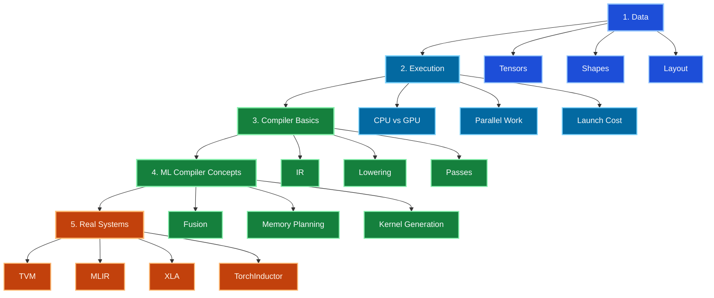

import AdBanner from '@site/src/components/AdBanner';
import Tabs from '@theme/Tabs';
import TabItem from '@theme/TabItem';

📩 Interested in deep dives like pipelines, cache, and compiler optimizations?

<div
  style={{
    width: '100%',
    maxWidth: '900px',
    margin: '1rem auto',
  }}
>
  <iframe
    src="https://docs.google.com/forms/d/e/1FAIpQLSebP1JfLFDp0ckTxOhODKPNVeI1e21rUqMJ0fbBwJoaa-i4Yw/viewform?embedded=true"
    style={{
      width: '100%',
      minHeight: '620px',
      border: '0',
      borderRadius: '12px',
      background: '#fff',
    }}
    loading="lazy"
  >
    Loading…
  </iframe>
</div>


<Tabs>
  <TabItem value="social" label="📣 Social Media">

  - [🐦 Twitter - CompilerSutra](https://twitter.com/CompilerSutra)
  - [💼 LinkedIn - Abhinav](https://www.linkedin.com/in/abhinavcompilerllvm/)
  - [📺 YouTube - CompilerSutra](https://www.youtube.com/@compilersutra)
  - [💬 Join the CompilerSutra Discord](https://discord.gg/d7jpHrhTap)

  </TabItem>
</Tabs>

# Introduction to ML Compilers 

After enough time debugging compiler pipelines, one pattern becomes painfully obvious.

People look at the Python.

The hardware does not.

Python is not what runs on the GPU.

Kernels run.

And something in between decides everything.

That "something" is the ML compiler stack.
Take a simple example.

You write something small like:
matrix multiply → add → relu

Looks simple. Feels simple.

But when you check what actually runs, you see something strange:

it runs as three separate kernels
it creates temporary data in between
and the profiler shows a lot of unnecessary memory movement

The math is still correct.
The output is fine.

But the way it runs is inefficient.

Instead of doing everything together, the system is:

writing intermediate results to memory
reading them back again
and repeating this multiple times

That extra back-and-forth is what slows things down.

This is a very common issue.

At first it looks surprising.
After seeing it a few times, you realize:
>> 👉 good performance is not just about correct math — it’s about how the work is executed

:::tip ReLU
ReLU (Rectified Linear Unit) is a simple activation function used in neural networks.

It operates element-wise on a tensor and applies:

ReLU(x) = max(0, x)

This means:

Positive values are kept as they are
Negative values are converted to 0

In a pipeline like matmul → add → relu, ReLU acts as a filter on the result of Wx + b, removing all negative values.

ReLU is widely used because it is:

computationally cheap
easy to optimize and fuse in kernels
effective at introducing non-linearity

👉 In short: ReLU keeps positive values and zeros out negatives.
:::

That is the mental shift this article is trying to force early. The model is not the whole story. The execution plan is half the story, and sometimes the expensive half.

In the [TVM paper by Chen et al.](https://www.usenix.org/system/files/osdi18-chen.pdf), graph-level optimizations such as fusion and layout transformation are treated as first-class performance decisions, and the paper reports fused operators delivering about 1.2x to 2x speedup on tested workloads.

:::important
Good execution is not just about the math you wrote. It is also about how the system arranges data and work underneath it.
:::

This gets worse once you leave the narrow world of a few server GPUs.

Modern ML workloads need to run on phones, laptops, embedded boards, data-center GPUs, and custom accelerators such as FPGAs or ASICs.

The high-level model may stay the same, but the execution strategy often cannot.

Different hardware has different memory behavior, different parallel structure, and different kernel primitives.

That is one of the main reasons ML compilers exist: they help take the same model and reorganize it for very different machines without forcing engineers to rewrite everything by hand for each target. If that sounds obvious, good. Many production stacks still fail at it in boring, expensive ways.

This is also a recurring theme in the literature:

- [TVM](/docs/tvm/) frames the problem as performance portability across diverse hardware backends, with graph-level optimization and operator-level optimization working together in one compiler pipeline.
- [MLIR](/docs/MLIR/) frames it as an infrastructure problem: one compiler stack must support multiple abstraction levels, staged lowering, and multiple hardware targets without collapsing into one rigid IR.
- TPU-MLIR makes that idea concrete by showing how a compiler pipeline can turn framework models into target-specific deployable artifacts.

:::important
This article builds that missing mental model from the ground up. By the end, you should be able to explain what sits between model code and hardware, why fewer kernels often means better performance, and which hard problems, such as dynamic shapes and low-overhead recompilation, are still not fully solved.
:::

If you want the papers behind this article, use the internal library shelves: [Machine Learning Library](/library/topic?topic=machine-learning) and [MLIR Library](/library/topic?topic=mlir).

## Table of Contents

1. [How To Use This Roadmap](#how-to-use-this-roadmap)
2. [Choose The Right Next Article](#choose-the-right-next-article)
3. [Roadmap](#roadmap)
4. [A Concrete Fusion Example](#a-concrete-fusion-example)
5. [Compiler Perspective](#compiler-perspective)
6. [Common Mistakes](#common-mistakes)
7. [Best Practices](#best-practices)
8. [Unsolved Problems](#unsolved-problems)
9. [FAQ](#faq)

## How To Use This Roadmap

This page is the orientation page for the ML compiler section.

It is not trying to be the full pipeline explainer again.
It is trying to answer a narrower question:

> what should I study first, and in what order, so the rest of the stack stops feeling random?

If you want the dedicated conceptual walkthrough from model code to hardware, read [The End-to-End ML Compiler Pipeline](/docs/ml-compilers/end-to-end-pipeline).

If you want the argument for why LLVM is not the whole story, read [What Problem ML Compilers Solve Beyond LLVM](/docs/ml-compilers/what-problem-ml-compilers-solve-beyond-llvm).

If you want to inspect real compiler artifacts on a machine, read [Seeing the ML Compiler Stack Live on AMD GPU](/docs/ml-compilers/mlcompilerstack).

<div>
  <AdBanner />
</div>

## Choose The Right Next Article

Use the ML compiler docs this way:

| If your question is... | Read this page |
|---|---|
| "What is the full model-to-hardware pipeline?" | [The End-to-End ML Compiler Pipeline](/docs/ml-compilers/end-to-end-pipeline) |
| "Why is LLVM alone not enough?" | [What Problem ML Compilers Solve Beyond LLVM](/docs/ml-compilers/what-problem-ml-compilers-solve-beyond-llvm) |
| "What do the real IR and binary stages look like?" | [Seeing the ML Compiler Stack Live on AMD GPU](/docs/ml-compilers/mlcompilerstack) |
| "What should I learn first?" | this roadmap |

The rest of this page stays focused on study order, not on re-teaching every stage in detail.

## Roadmap

You do not need to start with tools or framework internals. I would argue you should not. The better route is to build the mental model in layers.

The roadmap follows the stack, but in learning order rather than execution order.

You start with data and execution because those are the constraints the compiler must satisfy.

Then you learn compiler concepts.

Only after that do named systems like XLA or TVM become easy to place.

### Phase 1: Understand Data

Start with the things the machine actually moves:

- tensors
- shapes
- memory layout
- where temporary data lives

If this layer is fuzzy, later discussions about fusion and layout will feel like superstition. They are not superstition. They are memory and scheduling decisions.

:::important
If you do not understand shapes and layout, fusion will look like magic. It is not magic. It is a memory and execution decision.
:::

### Phase 2: Understand Execution

Then build a basic execution mental model:

- CPU versus GPU basics
- parallel work
- why too many tiny launches are expensive
- why memory traffic can dominate compute

This phase explains why the stack exists in the first place. A GPU is not waiting for elegant Python. It is waiting for enough well-shaped parallel work.

### Phase 3: Compiler Basics

Now move into the compiler side:

- simple IR as "a useful internal form"
- lowering
- optimization passes
- code generation

| Traditional compiler concept | ML compiler analogue |
| --- | --- |
| AST or source program | model graph or traced program |
| IR | graph IR, tensor IR, dialect-based IR |
| optimization passes | fusion, layout rewrite, shape simplification |
| register allocation | tensor and buffer planning |
| instruction scheduling | kernel scheduling and execution ordering |
| code generation | kernel generation or backend lowering |

This is the point where the stack should start to feel familiar if you know compilers already. The representations are different, but the idea is the same: capture intent, transform it, lower it, and emit something executable.

### Phase 4: ML Compiler Concepts

This is where the ML-specific part becomes concrete:

- operator fusion
- memory planning
- kernel generation
- shape handling
- when recompilation happens

At this stage, you are studying the decisions that sit in the middle of the stack and usually determine whether your profiler looks sensible.

### Phase 5: Real Systems

Once the concepts are stable, study actual stacks:

- [TVM](/docs/tvm-for-beginners): a good first system for seeing the full compiler pipeline, from graph optimization to operator lowering and hardware-aware scheduling
- [MLIR](/docs/MLIR/intro): the clearest entry point for multi-level IR, dialects, and staged lowering
- [TPU-MLIR](/library/topic?topic=mlir): a deployment-oriented MLIR-based toolchain that shows model import, lowering, quantization, and target-specific binaries
- [XLA](https://www.tensorflow.org/xla): a compiler pipeline used in several ML execution stacks
- [TorchInductor](https://pytorch.org/docs/stable/torch.compiler_inductor_overview.html): PyTorch's compiler path for lowering models to efficient execution

These systems are easier to understand once you already know which stack layers to look for. Otherwise the names blur together and people start saying "MLIR", "TVM", and "XLA" as if they were interchangeable. They are not.

Each one helps with a different question:

- TVM: how the end-to-end ML compiler pipeline fits together
- MLIR: why modern compilers use more than one useful IR level
- TPU-MLIR: what a real deployment pipeline looks like
- XLA and TorchInductor: how major production stacks lower and run models in practice

### How to Read

Do not read these systems in a random order.

Read in this order:

1. TVM paper: understand the full compiler pipeline
2. MLIR paper: understand multi-level IR and staged lowering
3. TPU-MLIR: see a real deployment-oriented MLIR compiler
4. Follow-up papers: deepen specific topics later

Use these library shelves:

- [Machine Learning Library Shelf](/library/topic?topic=machine-learning): TVM, CMLCompiler, and related ML systems papers
- [MLIR Library Shelf](/library/topic?topic=mlir): MLIR, TPU-MLIR, and MLIR-focused reading

:::tip
If you are a beginner, do not try to master all of these at once. Read TVM to understand the pipeline. Read MLIR to understand representation. Then read a production-style system like TPU-MLIR to connect the ideas to reality.
:::

### ML Compiler Roadmap Diagram

This roadmap diagram shows the recommended order for learning ML compilers. Start with tensors, shapes, and memory, then move into execution, compiler basics, ML compiler concepts, and finally real systems such as XLA, TVM, TorchInductor, and MLIR.



The diagram is not saying these topics are isolated.

It is saying they build on each other.

Data and execution explain the constraints.

Compiler basics explain the machinery.

ML compiler concepts explain the hard decisions.

Real systems show how those pieces are assembled in practice.

:::caution
Do not start by memorizing tool names. If the stack and roadmap are unclear, system-specific details turn into disconnected facts very quickly.
:::

## A Concrete Fusion Example

Take the same expression that keeps showing up in debugging sessions:

```python
Y = relu(A @ B + C)
```

Assume:

- `A` is `1024 x 1024`
- `B` is `1024 x 1024`
- `C` is a `1024 x 1024` bias tensor
- output `Y` is also `1024 x 1024`
- tensors use `fp32`, so each full tensor is about `4 MB`

Without fusion, the system may run three kernels:

1. `T0 = matmul(A, B)`
2. `T1 = add(T0, C)`
3. `Y = relu(T1)`

Memory traffic without fusion:

- `matmul`: read `A` and `B`, write `T0`
- `add`: read `T0` and `C`, write `T1`
- `relu`: read `T1`, write `Y`

That means:

- reads: `A` + `B` + `T0` + `C` + `T1` = `5` full tensor reads = `20 MB`
- writes: `T0` + `T1` + `Y` = `3` full tensor writes = `12 MB`
- total tensor traffic: `32 MB`

The two intermediates, `T0` and `T1`, create extra roundtrips by themselves:

- write `T0`, then read `T0`
- write `T1`, then read `T1`

That is `4` unnecessary full-tensor memory movements, or `16 MB`, spent only on intermediates.

With fusion, the compiler can keep the partial result on chip as it computes tiles:

1. compute `A @ B`
2. add `C`
3. apply `relu`
4. write final `Y`

Memory traffic with fusion:

- reads: `A` + `B` + `C` = `3` full tensor reads = `12 MB`
- writes: `Y` = `1` full tensor write = `4 MB`
- total tensor traffic: `16 MB`

So in this simple case, fusion cuts tensor traffic from `32 MB` to `16 MB`. Same math. Better plan. This is why compiler people get grumpy when someone says optimization is "just implementation detail."

> Fusion does not always help. If the next operation has an incompatible access pattern, or if a reduction changes the tiling structure, forcing everything into one kernel can reduce locality or parallel efficiency instead of improving it.

## Compiler Perspective

If you come from compiler engineering, ML compilers will look familiar once you map the concepts correctly.

- instruction selection analogy: choose the right kernel form or backend implementation for a high-level operator pattern
- scheduling analogy: order and structure execution so the target machine is used efficiently
- register versus tensor allocation: instead of a handful of machine registers, you often manage large buffers, temporary tensors, and layout-sensitive storage

The difference is scale and representation. Tensor programs force the compiler to reason about shapes, memory surfaces, and bulk parallel work much earlier than a classic scalar compiler pipeline usually does. You do not get to postpone those questions and hope codegen will save you later.

## Common Mistakes

- Treating Python as the thing the GPU executes. It is not. By the time the device sees work, you are already several abstractions lower.
- Reading the model and never checking the generated kernels, buffer plan, or runtime trace. This is how people miss obvious failures for days.
- Calling fusion a "nice optimization" instead of asking whether the unfused version is writing garbage temporaries to memory.
- Assuming one IR dump explains the whole system. It usually explains one stage. The bug is often in the stage before or after it.
- Using framework names as a substitute for understanding. Saying "this is an XLA issue" or "this is a PyTorch issue" is not analysis.

## Best Practices

- When something is slow, count reads, writes, kernels, and temporary buffers before doing anything clever.
- Inspect the graph, the lowered form, and the runtime trace. Looking at only one layer is how bad assumptions survive.
- Ask one blunt question at every stage: what representation am I looking at right now, and what information has already been lost?
- Pick one real system and follow one operator chain end to end. Until you can do that, the theory is mostly decorative.
- Do not guess. Inspect kernels, buffers, shapes, layouts, and recompilation behavior. Guessing is how people write long postmortems.

## Unsolved Problems

Several hard problems remain open in practice. Dynamic shapes make optimization unstable because static optimization plans want fixed sizes, fixed layouts, and predictable memory behavior, while real inputs keep changing underneath them. Recompilation can recover performance, but it adds latency and engineering complexity if shapes or control flow change often. Portability is also still difficult: a schedule or kernel strategy that works well on one GPU, CPU, or accelerator may map poorly to another because the memory hierarchy, vector width, and execution model are not the same. "Compile once, run well everywhere" is a nice slogan. It is not a solved engineering result.

## FAQ

**What is an ML compiler?**

It is the part of the stack that takes model-level tensor computation and turns it into an execution plan the hardware can actually run. If you prefer the less polite version: it is the reason your model becomes a sensible kernel pipeline instead of a pile of wasteful launches.

**How do ML models run on a GPU?**

Not by shipping Python to the GPU and hoping for the best. The framework captures operations, lowers them through one or more internal forms, applies rewrites, picks or generates kernels, and then launches those kernels through the runtime.

**Why are ML compilers needed?**

Because model code tells you what should be computed, not how to run it well on real hardware. Fusion, layout, memory planning, lowering, and scheduling are all missing from the source you wrote, and the hardware cares about those details more than your Python style.

**What is tensor IR?**

It is an intermediate representation that still knows useful things like shapes, tensor operations, and memory structure. Once that information is gone, many good optimization decisions become much harder or impossible.

**What is operator fusion?**

Operator fusion combines compatible operations into fewer kernels so the system stops writing intermediate tensors it did not need to materialize in the first place. In practice, it is often the difference between a clean execution trace and a dumb one.

**What is lowering in an ML compiler?**

Lowering is the process of moving the computation from one representation level to another. A graph becomes tensor IR. Tensor IR becomes loops or kernels. Those kernels then map to a backend. If a system only says "we compile it" and never shows the lowering steps, be suspicious.

**What is the difference between MLIR and LLVM IR?**

LLVM IR is a low-level IR that sits close to code generation. MLIR is infrastructure for building pipelines with multiple useful IR levels. If you collapse everything too early into LLVM IR, you often throw away exactly the structure the ML compiler needed.

**Is MLIR itself an ML compiler?**

No. MLIR is compiler infrastructure. It helps you build the pipeline. It is not the whole pipeline. You still need capture, passes, lowering strategy, backend integration, and runtime behavior.

**How is TVM different from MLIR?**

TVM is an end-to-end ML compiler stack. MLIR is infrastructure for building multi-level compiler pipelines. They matter for the same conversation, but they are not doing the same job. Mixing them up usually means the speaker has not looked closely enough at either.

**Do all ML frameworks use a compiler?**

In practice, most modern ML stacks use compiler-like stages somewhere in the path, even when the user never sees them. The exact shape differs. Some lean heavily on graph capture and prebuilt kernels. Others run deeper pipelines with multiple IR levels and code generation.

**Are ML compilers only for inference?**

No. They matter for both inference and training. Training is usually worse, because now you also get gradient graphs, more memory pressure, and more opportunities for the compiler to make expensive mistakes.

**When does recompilation happen?**

Recompilation happens when the old plan is no longer safe or useful. Dynamic shapes, changed control flow, or a different target can all trigger it. If recompilation keeps happening in a hot path, you do not have a clever dynamic system. You have latency.

**What should I learn first if I am a beginner?**

Start with tensors, shapes, memory layout, and the basic fact that Python is not what the GPU executes. Then learn the execution pipeline, fusion, lowering, and one real system such as TVM or MLIR. Skip the tool-name collecting phase. It wastes time.

If you want a sensible first exercise for Monday morning, open the [TVM Intro](/docs/tvm-for-beginners), take one tiny expression such as `matmul -> add -> relu`, and follow it all the way down. Look at the graph. Look at what gets fused. Look at what kernels come out. Count the reads and writes. That one exercise will teach you more than ten vague summaries of "AI compilers."

## More Articles

- [ML Compilers Topic](/docs/ml-compilers)
- [ML Compilers Track](/docs/tracks/ml-compilers)
- [MLIR Intro](/docs/MLIR/intro)
- [TVM Intro](/docs/tvm-for-beginners)
- [GPU Compilers Track](/docs/tracks/gpu-compilers)


<Tabs>
  <TabItem value="docs" label="📚 Documentation">
             - [CompilerSutra Home](https://compilersutra.com)
                - [CompilerSutra Homepage (Alt)](https://compilersutra.com/)
                - [Getting Started Guide](https://compilersutra.com/get-started)
                - [Skip to Content (Accessibility)](https://compilersutra.com#__docusaurus_skipToContent_fallback)


  </TabItem>

  <TabItem value="tutorials" label="📖 Tutorials & Guides">

        - [AI Documentation](https://compilersutra.com/docs/Ai)
        - [DSA Overview](https://compilersutra.com/docs/DSA/)
        - [DSA Detailed Guide](https://compilersutra.com/docs/DSA/DSA)
        - [MLIR Introduction](https://compilersutra.com/docs/MLIR/intro)
        - [TVM for Beginners](https://compilersutra.com/docs/tvm-for-beginners)
        - [Python Tutorial](https://compilersutra.com/docs/python/python_tutorial)
        - [C++ Tutorial](https://compilersutra.com/docs/c++/CppTutorial)
        - [C++ Main File Explained](https://compilersutra.com/docs/c++/c++_main_file)
        - [Compiler Design Basics](https://compilersutra.com/docs/compilers/compiler)
        - [OpenCL for GPU Programming](https://compilersutra.com/docs/gpu/opencl)
        - [LLVM Introduction](https://compilersutra.com/docs/llvm/intro-to-llvm)
        - [Introduction to Linux](https://compilersutra.com/docs/linux/intro_to_linux)

  </TabItem>

  <TabItem value="assessments" label="📝 Assessments">

        - [C++ MCQs](https://compilersutra.com/docs/mcq/cpp_mcqs)
        - [C++ Interview MCQs](https://compilersutra.com/docs/mcq/interview_question/cpp_interview_mcqs)

  </TabItem>

  <TabItem value="projects" label="🛠️ Projects">

            - [Project Documentation](https://compilersutra.com/docs/Project)
            - [Project Index](https://compilersutra.com/docs/project/)
            - [Graphics Pipeline Overview](https://compilersutra.com/docs/The_Graphic_Rendering_Pipeline)
            - [Graphic Rendering Pipeline (Alt)](https://compilersutra.com/docs/the_graphic_rendering_pipeline/)

  </TabItem>

  <TabItem value="resources" label="🌍 External Resources">

            - [LLVM Official Docs](https://llvm.org/docs/)
            - [Ask Any Question On Quora](https://compilersutra.quora.com)
            - [GitHub: FixIt Project](https://github.com/aabhinavg1/FixIt)
            - [GitHub Sponsors Page](https://github.com/sponsors/aabhinavg1)

  </TabItem>

  <TabItem value="social" label="📣 Social Media">

            - [🐦 Twitter - CompilerSutra](https://twitter.com/CompilerSutra)
            - [💼 LinkedIn - Abhinav](https://www.linkedin.com/in/abhinavcompilerllvm/)
            - [📺 YouTube - CompilerSutra](https://www.youtube.com/@compilersutra)
            - [💬 Join the CompilerSutra Discord for discussions](https://discord.gg/DXJFhvzz3K)

  </TabItem>
</Tabs>


<div>
  <AdBanner />
</div>
