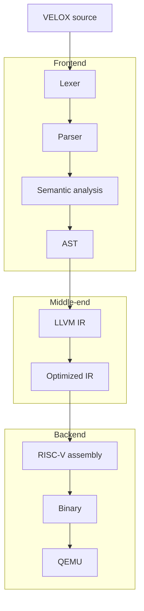

import Tabs from '@theme/Tabs';
import TabItem from '@theme/TabItem';

# VELOX

VELOX, short for Vector Execution Language for Optimization and Experimentation, is a compiler project built around a custom language, a handwritten frontend, LLVM IR, target code generation, and execution in QEMU.

VELOX is not a general-purpose language experiment. It is a compute-oriented compiler project for pulse-driven compute programs where vector-friendly loops, reductions, and memory layout decisions matter.

It is designed to keep the full compiler pipeline visible from source code to machine-level execution, so you can see how source-level compute patterns turn into optimized target code.

## What is a Pulse?

A `pulse` is the fundamental unit of computation in VELOX.

It represents a self-contained computation that:

- takes inputs
- performs operations
- returns a result

VELOX programs are composed of one or more `pulse` definitions.
Each pulse is lowered into LLVM IR and becomes the unit for optimization and code generation.

```c
pulse add(a, b) {
  return a + b;
}

pulse main() {
  return add(10, 20);
}
```

Each `pulse` flows through the VELOX pipeline:

`AST -> LLVM IR -> Optimized IR -> RISC-V -> Execution in QEMU`

## VELOX v1 Plan

VELOX v1 is intentionally small.

It should include:

* `pulse` as the core unit
* `let` for local variables
* `i32` as the first supported type
* arithmetic and comparison expressions
* `for` loops only
* `return`
* a C++ execution engine for host-side work and backend dispatch

It should not include:

* `if/else`
* `while`
* classes
* macros
* imports
* advanced type system features

For the full language shape, see:

* [VELOX v1 Language Spec](./v1-language-spec)

## Note on Preprocessing

VELOX does not include a preprocessing stage. There are no macros or textual substitution steps, and the compiler starts directly with lexical analysis.

This keeps the pipeline simpler, easier to reason about, and free from macro-expansion complexity.

The goal is:

`VELOX -> Lexer -> Parser -> AST -> LLVM IR -> Optimized IR -> RISC-V Assembly -> Binary -> QEMU`




:::important
VELOX is a learning and experimentation platform, not a production language. It is aligned with real compiler design and keeps the first version focused on LLVM IR.
:::

:::note
Later stages can introduce MLIR as a higher-level IR layer for expressing compute kernels and transformation pipelines.
:::

## Table of Contents

- [Note on Preprocessing](#note-on-preprocessing)
- [What is a Pulse?](#what-is-a-pulse)
- [VELOX v1 Plan](#velox-v1-plan)
- [What This Project Covers](#what-this-project-covers)
- [Start Here](#start-here)
- [Why This Project Matters](#why-this-project-matters)
- [VELOX 1.0 Plan](#velox-10-plan)

## What This Project Covers

<Tabs groupId="velox-focus" className="rounded-tabs">

<TabItem value="frontend" label="Frontend">

- Define a compute-focused syntax that is small enough to reason about, but still expressive enough for real kernels.
- Turn source code into tokens, then into an AST, then check names and scope before lowering.
- Keep the frontend simple and explicit so the structure of the program remains visible.

</TabItem>

<TabItem value="middle" label="Middle-End">

- Lower VELOX into LLVM IR so the program can be analyzed with standard compiler machinery.
- Use SSA form, basic blocks, and control-flow structure to prepare the program for later transformation.
- Keep the middle-end focused on correctness first, then on transformations that make optimization possible.

</TabItem>

<TabItem value="backend" label="Backend and Execution">

- Lower optimized IR to RISC-V through LLVM's existing target support.
- Package the result into a binary and run it in QEMU for end-to-end validation.
- Keep the backend realistic: code generation is target-aware, but the project does not reimplement LLVM's backend itself.

</TabItem>

</Tabs>

## Start Here

- [Creating Your First LLVM-Based Compiler](./creating-your-first-llvm-based-compiler)

## Why This Project Matters

Most developers use compilers every day, but very few can explain how source code becomes optimized machine instructions. That gap matters. If you do not understand the pipeline, it is hard to reason about performance, code generation, or why one program behaves differently after optimization.

VELOX closes that gap by keeping the pipeline visible from end to end. You build the frontend, lower it into LLVM IR, watch optimization passes reshape the program, generate target assembly, and run the result in QEMU. The project stays practical, but each stage is explicit.

VELOX also focuses on modern performance-oriented compilation techniques, including CPU vectorization, loop transformations, data layout improvements, reduction patterns, and parallel execution models. That means the project moves beyond traditional scalar-only compilation and toward the kinds of optimizations real systems rely on.

Unlike the Kaleidoscope tutorial, which is mainly about teaching expression parsing and IR generation, VELOX is centered on compute-oriented programs and the full path from frontend design to execution. The point is not just to lower syntax into IR. The point is to study how a compiler shapes performance.

The project flow stays visible at every step:

- frontend design turns VELOX source into a structured AST
- LLVM IR makes the program analyzable and transformation-friendly
- optimization passes reshape the IR before code generation
- RISC-V assembly is produced through LLVM's target support
- QEMU validates the final binary without requiring target hardware

The outcome is not just a working compiler project. You develop a clearer mental model of how compilers think, how optimizations affect execution, and how source-level choices translate into performance.

This project is for developers who want to understand how compilers think, not just how to use them. In later stages, we will extend this pipeline to explore how the same code can run on different architectures, including CPUs and GPUs.

:::tip VELOX: A CompilerSutra Project
:::

## VELOX 1.0 Plan

VELOX 1.0 focuses on a minimal but complete compiler pipeline.

It includes:
- a simple compute-focused language
- a handwritten lexer and parser
- AST construction
- LLVM IR generation
- basic optimization using LLVM tools
- a C++ execution engine boundary for runtime work
- loop-centric compute kernels with minimal branching
- execution in QEMU or a similar runtime environment

It intentionally avoids complex language features to keep the system easy to understand and reason about.

For the detailed language contract, see:

- [VELOX v1 Language Spec](./v1-language-spec)
