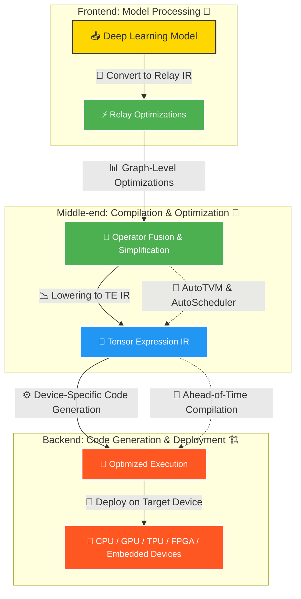

# Introduction to TVM

If you are new to ML compilers, TVM can feel confusing at first because it sits between two worlds:

- the model world: PyTorch, TensorFlow, ONNX
- the hardware world: CPU, GPU, accelerators, edge devices

TVM exists to connect those two worlds.

Instead of running a model through a one-size-fits-all execution path, TVM tries to:

- understand the computation
- optimize it for a specific target
- generate code that fits that target better

It answers three basic questions:

1. What is TVM?
2. Why was it created?
3. What happens inside the TVM pipeline?

<div
  style={{
    width: '100%',
    maxWidth: '900px',
    margin: '1rem auto',
  }}
>
  <iframe
    src="https://docs.google.com/forms/d/e/1FAIpQLSebP1JfLFDp0ckTxOhODKPNVeI1e21rUqMJ0fbBwJoaa-i4Yw/viewform?embedded=true"
    style={{
      width: '100%',
      minHeight: '620px',
      border: '0',
      borderRadius: '12px',
      background: '#fff',
    }}
    loading="lazy"
  >
    Loading…
  </iframe>
</div>

:::tip New Section Home
This article still keeps its old TVM entry URL. If you want the new section landing page first, go to [TVM Home](/docs/tvm/).
:::

If your search is "what is TVM?" or "how does Apache TVM optimize models?", this page is the conceptual starting point before installation, tuning, and deployment.

Apache TVM is an open-source machine learning compiler framework. Its job is to take a model and turn it into an optimized execution path for a target such as:

- CPU
- GPU
- mobile device
- embedded board
- custom accelerator

The important part is not only "run the model."
The real goal is to run it well on the hardware you care about.

## Why Was TVM Created?
As AI spread beyond cloud servers, one problem became hard to ignore:

the same model might need to run on very different hardware.

Examples:

- a server GPU
- a mobile phone
- an embedded board
- a browser runtime
- a vendor-specific accelerator

But those targets do not behave the same way.
They have different:

- memory limits
- execution models
- supported operators
- performance bottlenecks

Before systems like TVM, getting good performance often meant doing too much manual, target-specific work.

:::tip Solution of the Problem
TVM began as a research project in the [SAMPL group](https://sampl.cs.washington.edu/).

Its original goal was straightforward:

> take models from common ML frameworks and compile them into efficient code for many hardware targets.

After that, in 2019, TVM became an Apache Incubator project under the Apache Software Foundation (ASF). It has since evolved into a widely used open-source deep learning compiler stack, enabling efficient model deployment on CPUs, GPUs, and specialized accelerators.
:::

In simpler words, TVM was created because "correct model execution" is not the same as "fast model execution on this device."

TVM focuses on that second problem.

## TVM Optimization Pipeline  

The easiest way to understand TVM is to divide it into three broad stages:

### 1. Frontend (Model Ingestion)
   - TVM imports a model from a framework such as TensorFlow, PyTorch, ONNX, or MXNet.
   - It converts that model into TVM’s internal representation, usually explained first through **Relay IR**.
   - The point of this step is to stop thinking in framework-specific terms and start thinking in compiler-friendly terms.

### 2. Middle-End (Graph Optimizations)
   - Now TVM starts improving the computation graph before final code generation.
   - Common examples include:
     - **Operator fusion**: combine multiple operations into one better unit of work
     - **Constant folding**: compute constant expressions ahead of time
     - **Dead code elimination**: remove work that is not needed
     - **Layout transformations**: rearrange data layout for better memory behavior
   - This stage is where TVM starts turning "a correct model" into "a better execution plan."

### 3. Backend (Target-Specific Code Generation)
   - In the backend stage, TVM lowers the optimized graph into lower-level code for a specific target.
   - TVM supports targets such as CPUs, GPUs, FPGAs, and specialized accelerators.
   - This stage may also involve:
     - **Auto-tuning**: searching for better kernel configurations
     - **Scheduling**: deciding how work should be arranged on the hardware
   - Finally, TVM packages the compiled result for deployment on the target device.

The diagram below illustrates this workflow:

### TVM Optimization Pipeline (Diagram)


## Challenges Before TVM

Before TVM, the hard part was not only training the model.
The hard part was getting the same model to run well across many devices.

That was difficult for three main reasons:

1. **Hardware fragmentation**
Different targets need different optimization strategies.

2. **Framework fragmentation**
PyTorch, TensorFlow, ONNX, and others do not all represent models in the same way.

3. **Too much manual tuning**
Good performance often required target-specific hand work.

That is the gap TVM tries to close.


- **Hardware Fragmentation**: Different hardware architectures require different optimization techniques.
- **Manual Tuning Complexity**: Optimizing deep learning models for performance across different devices is tedious.
- **Lack of Unified Compilation**: No single framework could efficiently compile models for all backends.
- **Performance Bottlenecks**: Existing deep learning frameworks had overheads that made it difficult to achieve peak hardware performance.
##### How TVM Solves These Problems

Deploying deep learning models efficiently across different hardware platforms is difficult because architectures, performance limits, and vendor dependencies vary widely. TVM addresses that by compiling models for multiple hardware backends with much less manual target-specific work.

TVM achieves this by:  

- **Optimizing performance across multiple hardware platforms** – It generates highly efficient code for diverse hardware, ensuring better speed, reduced memory usage, and improved execution times.  
- **Automatically tuning deep learning models for efficiency** – TVM includes an auto-tuning framework that explores different scheduling strategies to find the most efficient execution plan for each model.  
- **Reducing dependence on vendor-specific software** – Unlike many deep learning frameworks that rely on proprietary vendor libraries, TVM is open-source and works independently across different hardware ecosystems.  
- **Providing an extensible system for compiler optimizations** – Developers can customize TVM to fine-tune performance based on specific workloads, making it adaptable to research and production needs.  
- **Supporting multiple deep learning frameworks** – TVM works with frameworks like TensorFlow, PyTorch, MXNet, and ONNX, which makes deployment more flexible.  
- **Improving model portability and deployment** – With TVM, AI models can be deployed efficiently across different devices without significant modifications, making it ideal for cloud, mobile, and embedded AI applications.  
- **Utilizing graph-level and tensor-level optimizations** – TVM optimizes computational graphs, schedules memory layouts efficiently, and applies tensor optimizations to maximize hardware performance.  

##### Comparison: Without TVM vs. With TVM

| Feature                      | Without TVM                                      | With TVM                                           |
|------------------------------|-------------------------------------------------|----------------------------------------------------|
| **Hardware Compatibility**    | Requires manual tuning for different hardware  | Works across CPUs, GPUs, FPGAs, etc.  |
| **Performance Optimization**  | Limited optimization, often vendor-dependent    | Auto-tuning optimizes for efficiency and speed   |
| **Framework Support**         | Tied to specific frameworks                     | Supports TensorFlow, PyTorch, ONNX, and more    |
| **Portability**               | Models require modifications for each device   | Deploys across devices without major changes    |
| **Vendor Dependence**         | Uses proprietary vendor software                | Open-source and vendor-independent              |
| **Automation**                | Manual tuning required                          | Auto-schedules and optimizes models automatically |
| **Code Generation**           | May produce inefficient code                    | Generates optimized machine code for hardware   |
| **Scalability**               | Limited to specific environments                | Scales from edge devices to cloud infrastructure |

By offering a unified, automated, and highly efficient approach to deep learning model optimization, TVM simplifies AI deployment across a wide range of devices and accelerates innovation in machine learning applications.  


### Why Use TVM?


TVM is useful because it does more than just "run a model."
It tries to generate a better execution path for the target you care about.

- **Hardware Agnostic**: Supports multiple hardware backends including x86, ARM, CUDA, Vulkan, Metal, and specialized accelerators like TPUs.
- **Optimization**: Provides efficient code generation, reducing latency and improving throughput.
- **Automation**: Automates the process of optimizing and deploying ML models.
- **Extensibility**: Can be customized for specific hardware and workloads.
- **Open-Source**: Developed as part of the Apache Foundation, ensuring community contributions and continual improvements.


# Installing TVM

    To install TVM, follow these steps:

    ```cpp
    git clone --recursive https://github.com/apache/tvm.git
    cd tvm
    mkdir build
    cp cmake/config.cmake build/
    cd build
    cmake ..
    make -j$(nproc)
    ```

## TVM Architecture Overview

TVM consists of several key component which we will discuss in upcoming article in detial:

- **Relay**: An intermediate representation (IR) for deep learning models.
- **Tensor Expression (TE)**: A domain-specific language for expressing tensor computations.
- **AutoTVM**: A system for automatic performance tuning.
- **VTA (Versatile Tensor Accelerator)**: A hardware abstraction for accelerating ML workloads.
- **BYOC (Bring Your Own Codegen)**: A mechanism to integrate custom hardware backends.
- **TVMC (TVM Command Line Interface)**: A simple way to compile and deploy models without writing Python code.


## References

1. [Tianqi Chen et al., "TVM: An Automated End-to-End Optimizing Compiler for Deep](https://www.usenix.org/system/files/osdi18-chen.pdf)
2. Apache TVM Documentation - [https://tvm.apache.org/](https://tvm.apache.org/)  
3. TVM GitHub Repository - [https://github.com/apache/tvm](https://github.com/apache/tvm)  


For more information, visit the [official TVM documentation](https://tvm.apache.org/).

## More Articles

- [LLVM introduction](../llvm/llvm_basic/What_is_LLVM.md)
- [TVM installation basics](./basics/installation.md)
- [TVM first model](./basics/first-model.md)
- [TVM AutoTVM and tuning](./basics/autotuning.md)
